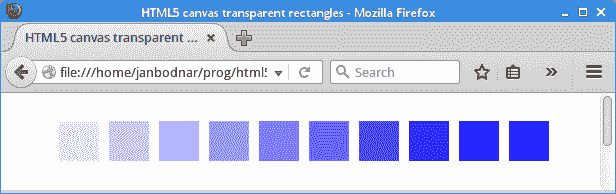

# HTML5 画布中的透明度

> 原文： [https://zetcode.com/gfx/html5canvas/transparency/](https://zetcode.com/gfx/html5canvas/transparency/)

在 HTML5 画布教程的这一部分中，我们讨论透明度。 我们提供一些基本定义和两个示例。

## 透明度说明

透明性是指能够透视材料的质量。 了解透明度的最简单方法是想象一块玻璃或水。 从技术上讲，光线可以穿过玻璃，这样我们就可以看到玻璃后面的物体。

在计算机图形学中，我们可以使用 alpha 合成实现透明效果。 Alpha 合成是将图像与背景组合以创建部分透明外观的过程。 合成过程使用 alpha 通道。 Alpha 通道是图形文件格式的 8 位层，用于表达半透明性（透明度）。 每个像素的额外八位用作掩码，表示 256 级半透明。

## 透明矩形

下一个示例绘制了十个具有不同透明度级别的矩形。

`transparent_rectangles.html`

```
<!DOCTYPE html>
<html>
<head>
<title>HTML5 canvas transparent rectangles</title>
<script>
    function draw() {
        var canvas = document.getElementById('myCanvas');
        var ctx = canvas.getContext('2d');

        ctx.fillStyle = "blue";

        for (var i = 1; i <= 10; i++) {

            var alpha = i * 0.1;
            ctx.globalAlpha = alpha;       

            ctx.fillRect(50*i, 20, 40, 40);
        }          
    }
</script>    
</head>    

<body onload="draw();">
    <canvas id="myCanvas" width="550" height="200">
    </canvas>
</body>
</html> 

```

我们绘制了十个具有不同透明度级别的蓝色矩形。

```
ctx.fillStyle = "blue";

```

矩形将填充蓝色。

```
var alpha = i * 0.1;

```

`alpha`值在 for 循环中动态变化。 在每个循环中，它减少了 10％。

```
ctx.globalAlpha = alpha;

```

`globalAlpha`属性指定在形状和图像绘制到画布上之前应用于其的 alpha 值。 该值的范围是 0.0（完全透明）到 1.0（完全不透明）。

```
ctx.fillRect(50*i, 20, 40, 40);

```

`fillRect()`方法绘制一个填充的矩形。 它的参数是 x 和 y 坐标以及矩形的宽度和高度。



Figure: Transparent rectangles

## 淡出演示

在下一个示例中，我们将淡出图像。 图像将逐渐变得更加透明，直到完全不可见为止。

`fadeout.html`

```
<!DOCTYPE html>
<html>
<head>
<title>HTML5 canvas fade out demo</title>
<script>
    var alpha = 1.0;
    var ctx;
    var canvas;
    var img;

    function init() {
        canvas = document.getElementById('myCanvas');
        ctx = canvas.getContext('2d');

        img = new Image();
        img.src = 'mushrooms.jpg';

        img.onload = function() {
            ctx.drawImage(img, 10, 10);
      };

      fadeOut();
    }

    function fadeOut() {

        if (alpha <= 0) {
            return;
        }         

        requestAnimationFrame(fadeOut);
        ctx.clearRect(0,0, canvas.width, canvas.height);
        ctx.globalAlpha = alpha;

        ctx.drawImage(img, 10, 10);

        alpha += -0.01;
    }        
</script>    
</head>    

<body onload="init();">
    <canvas id="myCanvas" width="350" height="250">
    </canvas>
</body>
</html> 

```

该示例具有动画效果。 在每个动画周期中，alpha 值都会减小，并重新绘制图像。

```
img = new Image();
img.src = 'mushrooms.jpg';

img.onload = function() {
    ctx.drawImage(img, 10, 10);
}

```

这些行将在画布上加载并显示图像。

```
fadeOut();

```

在`init()`函数内部，我们调用`fadeOut()`函数，该函数将启动动画。

```
if (alpha <= 0) {
    return;
}  

```

当`alpha`值达到零时，动画终止。 `requestAnimationFrame()`函数不再调用`fadeOut()`函数。

```
requestAnimationFrame(fadeOut);

```

`requestAnimationFrame()`是创建动画的便捷功能。 它告诉浏览器执行动画。 该参数是在重画之前要调用的函数。 浏览器为动画选择最佳帧速率。

```
ctx.clearRect(0,0, canvas.width, canvas.height);

```

`clearRect()`方法删除画布。

```
ctx.globalAlpha = alpha;

ctx.drawImage(img, 10, 10);

```

考虑到新的 Alpha 值，将设置新的全局 Alpha 值并重新绘制图像。

```
alpha += -0.01;

```

最后，`alpha`降低。 在下一个动画周期中，将以降低的`alpha`值绘制图像。

在 HTML5 画布教程的这一部分中，我们讨论了透明度。