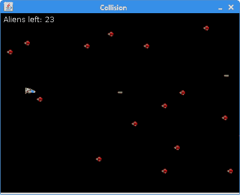

# 碰撞检测

> 原文： [https://zetcode.com/tutorials/javagamestutorial/collision/](https://zetcode.com/tutorials/javagamestutorial/collision/)

在 Java 2D 游戏教程的这一部分中，我们将讨论碰撞检测。

许多游戏都需要处理碰撞，尤其是街机游戏。 简而言之，我们需要检测两个对象何时在屏幕上碰撞。

在下一个代码示例中，我们将扩展上一个示例。 我们添加了一个新的外星人精灵。 我们将检测两种类型的碰撞：当导弹击中外星人的飞船和我们的航天器与外星人相撞时。

## 射击外星人

在示例中，我们有一个航天器和外星人。 我们可以使用光标键在板上移动航天器。 用空格键发射消灭外星人的导弹。

`Sprite.java`

```java
package com.zetcode;

import java.awt.Image;
import java.awt.Rectangle;
import javax.swing.ImageIcon;

public class Sprite {

    protected int x;
    protected int y;
    protected int width;
    protected int height;
    protected boolean visible;
    protected Image image;

    public Sprite(int x, int y) {

        this.x = x;
        this.y = y;
        visible = true;
    }

    protected void getImageDimensions() {

        width = image.getWidth(null);
        height = image.getHeight(null);
    }

    protected void loadImage(String imageName) {

        ImageIcon ii = new ImageIcon(imageName);
        image = ii.getImage();
    }

    public Image getImage() {
        return image;
    }

    public int getX() {
        return x;
    }

    public int getY() {
        return y;
    }

    public boolean isVisible() {
        return visible;
    }

    public void setVisible(Boolean visible) {
        this.visible = visible;
    }

    public Rectangle getBounds() {
        return new Rectangle(x, y, width, height);
    }
}

```

可以由所有子画面（工艺品，外星人和导弹）共享的代码放在`Sprite`类中。

```java
public Rectangle getBounds() {
    return new Rectangle(x, y, width, height);
}

```

`getBounds()`方法返回精灵图像的边界矩形。 在碰撞检测中我们需要边界。

`SpaceShip.java`

```java
package com.zetcode;

import java.awt.event.KeyEvent;
import java.util.ArrayList;
import java.util.List;

public class SpaceShip extends Sprite {

    private int dx;
    private int dy;
    private List<Missile> missiles;

    public SpaceShip(int x, int y) {
        super(x, y);

        initCraft();
    }

    private void initCraft() {

        missiles = new ArrayList<>();
        loadImage("src/resources/spaceship.png");
        getImageDimensions();
    }

    public void move() {

        x += dx;
        y += dy;

        if (x < 1) {
            x = 1;
        }

        if (y < 1) {
            y = 1;
        }
    }

    public List<Missile> getMissiles() {
        return missiles;
    }

    public void keyPressed(KeyEvent e) {

        int key = e.getKeyCode();

        if (key == KeyEvent.VK_SPACE) {
            fire();
        }

        if (key == KeyEvent.VK_LEFT) {
            dx = -1;
        }

        if (key == KeyEvent.VK_RIGHT) {
            dx = 1;
        }

        if (key == KeyEvent.VK_UP) {
            dy = -1;
        }

        if (key == KeyEvent.VK_DOWN) {
            dy = 1;
        }
    }

    public void fire() {
        missiles.add(new Missile(x + width, y + height / 2));
    }

    public void keyReleased(KeyEvent e) {

        int key = e.getKeyCode();

        if (key == KeyEvent.VK_LEFT) {
            dx = 0;
        }

        if (key == KeyEvent.VK_RIGHT) {
            dx = 0;
        }

        if (key == KeyEvent.VK_UP) {
            dy = 0;
        }

        if (key == KeyEvent.VK_DOWN) {
            dy = 0;
        }
    }
}

```

此类代表航天器。

```java
private List<Missile> missiles;

```

航天器发射的所有导弹都存储在`missiles`列表中。

```java
public void fire() {
    missiles.add(new Missile(x + width, y + height / 2));
}

```

当我们发射导弹时，新的`Missile`对象将添加到`missiles`列表中。 它会保留在列表中，直到与外星人碰撞或离开窗口为止。

`Board.java`

```java
package com.zetcode;

import java.awt.Color;
import java.awt.Dimension;
import java.awt.Font;
import java.awt.FontMetrics;
import java.awt.Graphics;
import java.awt.Rectangle;
import java.awt.Toolkit;
import java.awt.event.ActionEvent;
import java.awt.event.ActionListener;
import java.awt.event.KeyAdapter;
import java.awt.event.KeyEvent;
import java.util.ArrayList;
import java.util.List;
import javax.swing.JPanel;
import javax.swing.Timer;

public class Board extends JPanel implements ActionListener {

    private Timer timer;
    private SpaceShip spaceship;
    private List<Alien> aliens;
    private boolean ingame;
    private final int ICRAFT_X = 40;
    private final int ICRAFT_Y = 60;
    private final int B_WIDTH = 400;
    private final int B_HEIGHT = 300;
    private final int DELAY = 15;

    private final int[][] pos = {
        {2380, 29}, {2500, 59}, {1380, 89},
        {780, 109}, {580, 139}, {680, 239},
        {790, 259}, {760, 50}, {790, 150},
        {980, 209}, {560, 45}, {510, 70},
        {930, 159}, {590, 80}, {530, 60},
        {940, 59}, {990, 30}, {920, 200},
        {900, 259}, {660, 50}, {540, 90},
        {810, 220}, {860, 20}, {740, 180},
        {820, 128}, {490, 170}, {700, 30}
    };

    public Board() {

        initBoard();
    }

    private void initBoard() {

        addKeyListener(new TAdapter());
        setFocusable(true);
        setBackground(Color.BLACK);
        ingame = true;

        setPreferredSize(new Dimension(B_WIDTH, B_HEIGHT));

        spaceship = new SpaceShip(ICRAFT_X, ICRAFT_Y);

        initAliens();

        timer = new Timer(DELAY, this);
        timer.start();
    }

    public void initAliens() {

        aliens = new ArrayList<>();

        for (int[] p : pos) {
            aliens.add(new Alien(p[0], p[1]));
        }
    }

    @Override
    public void paintComponent(Graphics g) {
        super.paintComponent(g);

        if (ingame) {

            drawObjects(g);

        } else {

            drawGameOver(g);
        }

        Toolkit.getDefaultToolkit().sync();
    }

    private void drawObjects(Graphics g) {

        if (spaceship.isVisible()) {
            g.drawImage(spaceship.getImage(), spaceship.getX(), spaceship.getY(),
                    this);
        }

        List<Missile> ms = spaceship.getMissiles();

        for (Missile missile : ms) {
            if (missile.isVisible()) {
                g.drawImage(missile.getImage(), missile.getX(), 
                        missile.getY(), this);
            }
        }

        for (Alien alien : aliens) {
            if (alien.isVisible()) {
                g.drawImage(alien.getImage(), alien.getX(), alien.getY(), this);
            }
        }

        g.setColor(Color.WHITE);
        g.drawString("Aliens left: " + aliens.size(), 5, 15);
    }

    private void drawGameOver(Graphics g) {

        String msg = "Game Over";
        Font small = new Font("Helvetica", Font.BOLD, 14);
        FontMetrics fm = getFontMetrics(small);

        g.setColor(Color.white);
        g.setFont(small);
        g.drawString(msg, (B_WIDTH - fm.stringWidth(msg)) / 2,
                B_HEIGHT / 2);
    }

    @Override
    public void actionPerformed(ActionEvent e) {

        inGame();

        updateShip();
        updateMissiles();
        updateAliens();

        checkCollisions();

        repaint();
    }

    private void inGame() {

        if (!ingame) {
            timer.stop();
        }
    }

    private void updateShip() {

        if (spaceship.isVisible()) {

            spaceship.move();
        }
    }

    private void updateMissiles() {

        List<Missile> ms = spaceship.getMissiles();

        for (int i = 0; i < ms.size(); i++) {

            Missile m = ms.get(i);

            if (m.isVisible()) {
                m.move();
            } else {
                ms.remove(i);
            }
        }
    }

    private void updateAliens() {

        if (aliens.isEmpty()) {

            ingame = false;
            return;
        }

        for (int i = 0; i < aliens.size(); i++) {

            Alien a = aliens.get(i);

            if (a.isVisible()) {
                a.move();
            } else {
                aliens.remove(i);
            }
        }
    }

    public void checkCollisions() {

        Rectangle r3 = spaceship.getBounds();

        for (Alien alien : aliens) {

            Rectangle r2 = alien.getBounds();

            if (r3.intersects(r2)) {

                spaceship.setVisible(false);
                alien.setVisible(false);
                ingame = false;
            }
        }

        List<Missile> ms = spaceship.getMissiles();

        for (Missile m : ms) {

            Rectangle r1 = m.getBounds();

            for (Alien alien : aliens) {

                Rectangle r2 = alien.getBounds();

                if (r1.intersects(r2)) {

                    m.setVisible(false);
                    alien.setVisible(false);
                }
            }
        }
    }

    private class TAdapter extends KeyAdapter {

        @Override
        public void keyReleased(KeyEvent e) {
            spaceship.keyReleased(e);
        }

        @Override
        public void keyPressed(KeyEvent e) {
            spaceship.keyPressed(e);
        }
    }
}

```

这是`Board`类。

```java
private final int[][] pos = {
    {2380, 29}, {2500, 59}, {1380, 89},
    {780, 109}, {580, 139}, {680, 239},
    {790, 259}, {760, 50}, {790, 150},
    {980, 209}, {560, 45}, {510, 70},
    {930, 159}, {590, 80}, {530, 60},
    {940, 59}, {990, 30}, {920, 200},
    {900, 259}, {660, 50}, {540, 90},
    {810, 220}, {860, 20}, {740, 180},
    {820, 128}, {490, 170}, {700, 30}
};

```

这些是外星飞船的初始位置。

```java
public void initAliens() {

    aliens = new ArrayList<>();

    for (int[] p : pos) {
        aliens.add(new Alien(p[0], p[1]));
    }
}

```

`initAliens()`方法创建一个外星对象列表。 外星人从`pos`数组中占据初始位置。

```java
@Override
public void paintComponent(Graphics g) {
    super.paintComponent(g);

    if (ingame) {

        drawObjects(g);

    } else {

        drawGameOver(g);
    }

    Toolkit.getDefaultToolkit().sync();
}

```

在`paintComponent()`方法内，我们绘制游戏精灵或通过消息编写游戏。 这取决于`ingame`变量。

```java
private void drawObjects(Graphics g) {

    if (spaceship.isVisible()) {
        g.drawImage(spaceship.getImage(), spaceship.getX(), spaceship.getY(),
                this);
    }
...
}        

```

`drawObjects()`方法在窗口上绘制游戏精灵。 首先，我们绘制工艺精灵。

```java
for (Alien alien : aliens) {
    if (alien.isVisible()) {
        g.drawImage(alien.getImage(), alien.getX(), alien.getY(), this);
    }
}

```

在这个循环中，我们吸引了所有外星人。 仅在以前未销毁它们的情况下才绘制它们。 通过`isVisible()`方法检查。

```java
g.setColor(Color.WHITE);
g.drawString("Aliens left: " + aliens.size(), 5, 15);

```

在窗口的左上角，我们绘制了剩余的外星人数量。

```java
private void drawGameOver(Graphics g) {

    String msg = "Game Over";
    Font small = new Font("Helvetica", Font.BOLD, 14);
    FontMetrics fm = getFontMetrics(small);

    g.setColor(Color.white);
    g.setFont(small);
    g.drawString(msg, (B_WIDTH - fm.stringWidth(msg)) / 2,
            B_HEIGHT / 2);
}

```

`drawGameOver()`在窗口中间的消息上方绘制游戏。 该消息显示在游戏结束时，当我们摧毁所有外星飞船或与其中一艘发生碰撞时。

```java
@Override
public void actionPerformed(ActionEvent e) {

    inGame();

    updateShip();
    updateMissiles();
    updateAliens();

    checkCollisions();

    repaint();
}

```

每个动作事件代表一个游戏周期。 游戏逻辑被纳入特定方法中。 例如，`updateMissiles()`会移动所有可用的导弹。

```java
private void updateAliens() {

    if (aliens.isEmpty()) {

        ingame = false;
        return;
    }

    for (int i = 0; i < aliens.size(); i++) {

        Alien a = aliens.get(i);

        if (a.isVisible()) {
            a.move();
        } else {
            aliens.remove(i);
        }
    }
}    

```

在`updateAliens()`方法内部，我们首先检查`aliens`列表中是否还有任何异物。 如果列表为空，则游戏结束。 如果它不为空，则浏览列表并移动其所有项目。 被摧毁的外星人将从名单中删除。

```java
public void checkCollisions() {

    Rectangle r3 = spaceship.getBounds();

    for (Alien alien : aliens) {

        Rectangle r2 = alien.getBounds();

        if (r3.intersects(r2)) {

            spaceship.setVisible(false);
            alien.setVisible(false);
            ingame = false;
        }
    }
...
}

```

`checkCollisions()`方法检查可能的冲突。 首先，我们检查工艺对象是否与任何外来对象发生碰撞。 我们使用`getBounds()`方法获得对象的矩形。 `intersects()`方法检查两个矩形是否相交。

```java
List<Missile> ms = spaceship.getMissiles();

for (Missile m : ms) {

    Rectangle r1 = m.getBounds();

    for (Alien alien : aliens) {

        Rectangle r2 = alien.getBounds();

        if (r1.intersects(r2)) {

            m.setVisible(false);
            alien.setVisible(false);
        }
    }
}

```

该代码检查导弹与外星人之间的碰撞。

`Alien.java`

```java
package com.zetcode;

public class Alien extends Sprite {

    private final int INITIAL_X = 400;

    public Alien(int x, int y) {
        super(x, y);

        initAlien();
    }

    private void initAlien() {

        loadImage("src/resources/alien.png");
        getImageDimensions();
    }

    public void move() {

        if (x < 0) {
            x = INITIAL_X;
        }

        x -= 1;
    }
}

```

这是`Alien`类。

```java
public void move() {

    if (x < 0) {
        x = INITIAL_X;
    }

    x -= 1;
}

```

外星人消失在左侧后，他们会返回到右侧的屏幕。

`Missile.java`

```java
package com.zetcode;

public class Missile extends Sprite {

    private final int BOARD_WIDTH = 390;
    private final int MISSILE_SPEED = 2;

    public Missile(int x, int y) {
        super(x, y);

        initMissile();
    }

    private void initMissile() {

        loadImage("src/resources/missile.png");
        getImageDimensions();        
    }

    public void move() {

        x += MISSILE_SPEED;

        if (x > BOARD_WIDTH)
            visible = false;
    }
}

```

这是`Missile`类。

```java
public void move() {

    x += MISSILE_SPEED;

    if (x > BOARD_WIDTH)
        visible = false;
}

```

导弹只能向一个方向移动。 它们到达右窗口边框后消失。

`CollisionEx.java`

```java
package com.zetcode;

import java.awt.EventQueue;
import javax.swing.JFrame;

public class CollisionEx extends JFrame {

    public CollisionEx() {

        initUI();
    }

    private void initUI() {

        add(new Board());

        setResizable(false);
        pack();

        setTitle("Collision");
        setLocationRelativeTo(null);
        setDefaultCloseOperation(JFrame.EXIT_ON_CLOSE);
    }

    public static void main(String[] args) {

        EventQueue.invokeLater(() -> {
            CollisionEx ex = new CollisionEx();
            ex.setVisible(true);
        });
    }
}

```

最后，这是主要类。



图：射击外星人

本章是关于碰撞检测的。