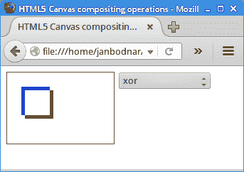

# HTML5 画布合成

> 原文： [https://zetcode.com/gfx/html5canvas/compositing/](https://zetcode.com/gfx/html5canvas/compositing/)

在 HTML5 `canvas`教程的这一部分中，我们使用合成操作。

合成是将来自不同来源的视觉元素组合成单个图像。 它们被用来创建一种幻觉，即所有这些元素都是同一场景的一部分。 合成在电影行业中被广泛使用来创造人群，否则将是昂贵或不可能创造的整个新世界。

本教程的[形状章节](../shapes/#three)中的三个圆圈示例使用`destination-out`合成操作来创建新形状。

## 合成操作

[developer.mozilla.org](https://developer.mozilla.org) 在其[合成和剪辑](https://developer.mozilla.org/en-US/docs/Web/API/Canvas_API/Tutorial/Compositing)一章中列出了 26 种不同的合成操作。 我们在下一个代码示例中展示其中的一些。

假设我们要在画布上绘制两个对象。 绘制的第一个对象称为目标，第二个称为源。 `canvas`上下文的`globalCompositeOperation`属性确定如何将这两个对象混合在一起。 例如，在`source-over`规则（这是默认的构图操作）中，新形状会在现有形状的顶部绘制。

`compositing.html`

```js
<!DOCTYPE html>
<html>
<head>
<title>HTML5 Canvas compositing operations</title>  
<style>
    canvas {border: 1px solid brown}
    select {vertical-align:top}
</style>  
<script>
    var canvas;
    var ctx;
    var value = 'source-over';
    var operations = ['source-over', 'source-in', 'source-out',
        'source-atop', 'destination-over', 'destination-in', 'destination-out',
        'destination-atop', 'lighter', 'copy', 'xor'];

    function init() {

        canvas = document.getElementById('myCanvas');
        ctx = canvas.getContext('2d');
        draw();    
    }

    function getOperation(sel) {

        value = operations[sel.value];
        draw();
    }

    function draw() {

      ctx.save();
      ctx.clearRect(0, 0, canvas.width, canvas.height);
      ctx.fillStyle = 'blue';
      ctx.fillRect(20, 20, 40, 40);

      ctx.globalCompositeOperation = value; 

      ctx.fillStyle = 'green';
      ctx.fillRect(25, 25, 40, 40);
      ctx.restore();
    }    
</script>
</head>

<body onload="init();">

    <canvas id="myCanvas" width="150" height="100">
    </canvas>

    <select id="opers" onchange="getOperation(this)">
      <option value="0" selected="selected">source-over</option>
      <option value="1">source-in</option>
      <option value="2">source-out</option>
      <option value="3">source-atop</option>
      <option value="4">destination-over</option>
      <option value="5">destination-in</option>
      <option value="6">destination-out</option>
      <option value="7">destination-atop</option>
      <option value="8">lighter</option>
      <option value="9">copy</option>
      <option value="10">xor</option>
    </select> 

</body>
</html>

```

在示例中，我们有一个合成操作的下拉列表。 所选操作将应用于两个重叠矩形的图形。

```js
var operations = ['source-over', 'source-in', 'source-out',
    'source-atop', 'destination-over', 'destination-in', 'destination-out',
    'destination-atop', 'lighter', 'copy', 'xor'];

```

`operations`数组包含 11 个合成操作。

```js
function init() {

    canvas = document.getElementById('myCanvas');
    ctx = canvas.getContext('2d');
    draw();    
}

```

在`init()`函数内部，我们获得对`canvas`对象及其绘制上下文的引用。

```js
ctx.save();
...
ctx.restore();

```

每次我们从下拉列表中选择一个选项时，都会使用新的合成操作重新绘制画布。 为了获得正确的结果，我们必须在`save()`和`restore()`方法之间放置绘图代码。 这样，操作彼此隔离。

```js
ctx.clearRect(0, 0, canvas.width, canvas.height);

```

`clearRect()`方法清除先前的输出。

```js
ctx.globalCompositeOperation = value; 

```

`globalCompositeOperation`设置为从下拉列表中选择的值。



图：合成

上图显示了`xor`合成操作。 在此规则中，将形状透明化，使其在其他地方重叠并正常绘制。

在 HTML5 画布教程的这一部分中，我们讨论了图像合成。