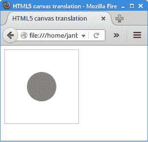
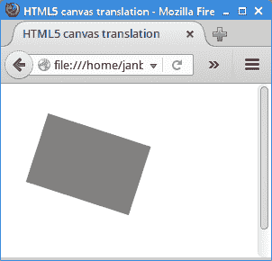
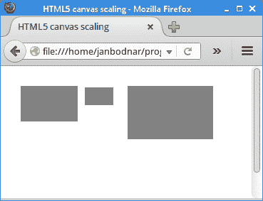
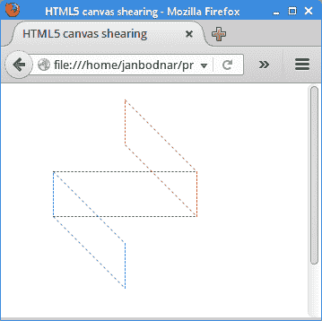

# HTML5 canvas 中的变换

> 原文： [https://zetcode.com/gfx/html5canvas/transformations/](https://zetcode.com/gfx/html5canvas/transformations/)

在 HTML5 画布教程的这一部分中，我们将讨论变换。

仿射变换由零个或多个线性变换（旋转，缩放或剪切）和平移（移位）组成。 几个线性变换可以组合成一个矩阵。 旋转是使刚体绕固定点移动的变换。 缩放是一种放大或缩小对象的变换。 比例因子在所有方向上都是相同的。 平移是使每个点在指定方向上移动恒定距离的变换。 剪切是一种使对象垂直于给定轴移动的变换，该值在轴的一侧比另一侧更大。

有一种`transform()`方法，该方法将当前变换与该方法的参数所描述的矩阵相乘。 我们能够缩放，旋转，移动和剪切上下文。 还有执行特定变换的方法：`translate()`，`rotate`和`scale()`。

## 平移

以下示例显示了一个简单的平移。

`translation.html`

```
<!DOCTYPE html>
<html>
<head>
<title>HTML5 canvas translation</title>
<style>
    canvas {border: 1px solid #bbbbbb}
</style>    
<script>
    function draw() {
        var canvas = document.getElementById('myCanvas');
        var ctx = canvas.getContext('2d');

        ctx.fillStyle = 'gray';
        ctx.translate(canvas.width/2, canvas.height/2);
        ctx.beginPath();
        ctx.arc(0, 0, 30, 0, 2*Math.PI);
        ctx.fill();
    }    
</script>
</head>

<body onload="draw();">
    <canvas id="myCanvas" width="150" height="150">
    </canvas>
</body>
</html>

```

该示例在画布的中间绘制一个圆圈。

```
ctx.translate(canvas.width/2, canvas.height/2);

```

`translate()`方法将坐标系的原点移到画布的中间。

```
ctx.beginPath();
ctx.arc(0, 0, 30, 0, 2*Math.PI);
ctx.fill();

```

画一个圆。 它的中心点是画布的中间。



Figure: Translation

## 旋转

下一个示例演示了旋转。

`rotation.html`

```
<!DOCTYPE html>
<html>
<head>
<title>HTML5 canvas rotation</title>
<script>
    function draw() {
        var canvas = document.getElementById('myCanvas');
        var ctx = canvas.getContext('2d');

        ctx.fillStyle = 'gray';
        ctx.rotate(Math.PI/10);
        ctx.fillRect(50, 10, 120, 80);
    }    
</script>
</head>

<body onload="draw();">
    <canvas id="myCanvas" width="200" height="200">
    </canvas>
</body>
</html>

```

该示例对矩形执行旋转。

```
ctx.rotate(Math.PI/10);

```

`rotate()`方法执行旋转。 角度自变量表示顺时针旋转角度并以弧度表示。



Figure: Rotation

## 缩放

缩放是通过`scale()`方法完成的。 该方法采用两个参数：x 比例因子和 y 比例因子。

`scaling.html`

```
<!DOCTYPE html>
<html>
<head>
<title>HTML5 canvas scaling</title>
<script>
    function draw() {
        var canvas = document.getElementById('myCanvas');
        var ctx = canvas.getContext('2d');

        ctx.fillStyle = 'gray';
        ctx.fillRect(20, 20, 80, 50);

        ctx.save();
        ctx.translate(110, 22);
        ctx.scale(0.5, 0.5);
        ctx.fillRect(0, 0, 80, 50);
        ctx.restore();

        ctx.translate(170, 20);
        ctx.scale(1.5, 1.5);
        ctx.fillRect(0, 0, 80, 50);
    }    
</script>
</head>

<body onload="draw();">
    <canvas id="myCanvas" width="300" height="200">
    </canvas>
</body>
</html>

```

在示例中，有一个矩形对象。 首先，我们缩小比例，然后再放大一点。

```
ctx.save();
ctx.translate(110, 22);
ctx.scale(0.5, 0.5);
ctx.fillRect(0, 0, 80, 50);
ctx.restore();

```

变换操作是累加的。 为了隔离变换和缩放操作，我们将它们放在`save()`和`restore()`方法之间。 `save()`方法保存画布的整个状态，`restore()`方法恢复画布的整个状态。



Figure: Scaling

## 剪切

剪切是使对象的形状沿两个轴中的一个或两个变形的变换。 像缩放和平移一样，可以仅沿一个或两个坐标轴进行剪切。

`shearing.html`

```
<!DOCTYPE html>
<html>
<head>
<title>HTML5 canvas shearing</title>
<script>
    function draw() {
        var canvas = document.getElementById('myCanvas');
        var ctx = canvas.getContext('2d');

        ctx.translate(0.5, 0.5);
        ctx.setLineDash([2]);

        ctx.save();
        ctx.strokeStyle = 'green';
        ctx.strokeRect(50, 90, 160, 50);
        ctx.restore();

        ctx.save();
        ctx.strokeStyle = 'blue';
        ctx.transform(1, 1, 0, 1, 0, 0);
        ctx.strokeRect(50, 40, 80, 50);
        ctx.restore();

        ctx.save();
        ctx.strokeStyle = 'red';
        ctx.transform(1, 1, 0, 1, 0, -130);
        ctx.strokeRect(130, 10, 80, 50);
        ctx.restore();        
    }    
</script>
</head>

<body onload="draw();">
    <canvas id="myCanvas" width="300" height="300">
    </canvas>
</body>
</html>

```

没有特定的剪切方法，我们使用通用的`transform()`方法。

```
ctx.translate(0.5, 0.5);

```

这条线使矩形的线更平滑。

```
ctx.save();
ctx.strokeStyle = 'blue';
ctx.transform(1, 1, 0, 1, 0, 0);
ctx.strokeRect(50, 40, 80, 50);
ctx.restore();

```

蓝色矩形被水平剪切（倾斜）。 `transform()`方法的参数为：水平缩放，水平剪切，垂直剪切，垂直缩放，水平平移和垂直平移。



Figure: Shearing

## 甜甜圈

在下面的示例中，我们通过旋转椭圆来创建复杂的形状。

`DonutEx.java`

```
<!DOCTYPE html>
<html>
<head>
<title>HTML5 canvas donut</title>
<script>
    function draw() {
        var canvas = document.getElementById('myCanvas');
        var ctx = canvas.getContext('2d');

        ctx.fillStyle = 'gray';
        ctx.translate(0.5, 0.5);

        var x = canvas.width/2;
        var y = canvas.height/2;

        for (var deg = 0; deg < 360; deg += 5) {

            var rad = deg * Math.PI / 180; 
            ctx.beginPath();
            ctx.ellipse(x, y, 30, 130, rad, 0, 2*Math.PI);
            ctx.stroke();
        }
    }    
</script>
</head>

<body onload="draw();">
    <canvas id="myCanvas" width="300" height="300">
    </canvas>
</body>
</html>

```

该示例使用`ellipse()`方法，在撰写本教程时，并非所有浏览器都支持该方法。 该示例在 Chrome 和 Opera 上运行。

```
var x = canvas.width/2;
var y = canvas.height/2;

```

椭圆的中心位于画布的中心。

```
for (var deg = 0; deg < 360; deg += 5) {

    var rad = deg * Math.PI / 180; 
    ctx.beginPath();
    ctx.ellipse(x, y, 30, 130, rad, 0, 2*Math.PI);
    ctx.stroke();
}

```

我们创建 36 个椭圆。 椭圆旋转。 `ellipse()`方法采用以下参数：椭圆中心点的 x 和 y 坐标，椭圆的长轴半径，椭圆的短轴半径，旋转，起始角度和终止角度。

在 Java 2D 教程的这一部分中，我们讨论了变换。