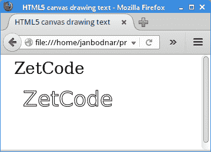
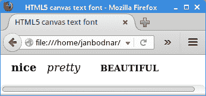
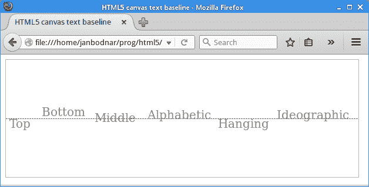
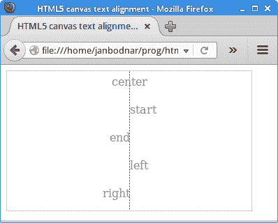

# HTML5 画布中的文字

> 原文： [https://zetcode.com/gfx/html5canvas/text/](https://zetcode.com/gfx/html5canvas/text/)

在 HTML5 画布教程的这一部分中，我们将处理文本。

## 文字和字体

字符是表示诸如字母，数字或标点符号之类的项目的符号。 字形是用于呈现字符或字符序列的形状。 在拉丁字母中，字形通常代表一个字符。 在其他书写系统中，一个字符可能由几个字形组成，例如ť，ž，ú，ô。 这些是带有重音符号的拉丁字符。

可以使用各种字体在画布上绘制文本。 字体是一组具有特定字体设计和大小的字体字符。 各种字体包括 Helvetica，Georgia，Times 或 Verdana。 具有特定样式的字形的集合形成字体面。 字体的集合构成字体家族。

## 绘制文字

HTML5 `canvas`上下文有两种绘制文本的方法：`strokeText()`和`fillText()`。 不同之处在于`fillText()`方法绘制文本的内部，而`strokeText()`方法绘制文本的轮廓。

`drawing_text.html`

```
<!DOCTYPE html>
<html>
<head>
<title>HTML5 canvas drawing text</title>
<script>
    function draw() {
        var canvas = document.getElementById('myCanvas');
        var ctx = canvas.getContext('2d');

        ctx.font = "28px serif";
        ctx.fillText("ZetCode", 15, 25);

        ctx.font = "36px sans-serif";
        ctx.strokeText("ZetCode", 30, 80);
    }      
</script>
</head>

<body onload="draw();">
    <canvas id="myCanvas" width="200" height="150">     
    </canvas>
</body>
</html> 

```

该示例在画布上绘制两个字符串。

```
ctx.font = "28px serif";

```

`canvas`上下文`font`属性指定绘制文本时使用的当前文本样式。 我们指定字体大小和字体系列。

```
ctx.fillText("ZetCode", 15, 25);

```

`fillText()`方法的第一个参数是要渲染的文本。 接下来的两个参数是文本起点的`x`和`y`坐标。



Figure: Drawing text

## 字形

在下面的示例中，我们演示了几种字体属性。

`text_font.html`

```
<!DOCTYPE html>
<html>
<head>
<title>HTML5 canvas drawing text</title>
<script>
    function draw() {
        var canvas = document.getElementById('myCanvas');
        var ctx = canvas.getContext('2d');

        ctx.font = "normal bold 18px serif";
        ctx.fillText('nice', 10, 20); 

        ctx.font = "italic 18px serif";
        ctx.fillText('pretty', 70, 20);

        ctx.font = "small-caps bolder 18px serif";
        ctx.fillText('beautiful', 160, 20);  
    }      
</script>
</head>

<body onload="draw();">
    <canvas id="myCanvas" width="350" height="150">     
    </canvas>
</body>
</html> 

```

该示例绘制了三个具有不同字体样式，变体和粗细的单词。

```
ctx.font = "normal bold 18px serif";

```

此行设置`normal`字体样式和`bold`字体粗细。

```
ctx.font = "small-caps bolder 18px serif";

```

此行设置`small-caps`字体变体和`bolder`字体粗细。



Figure: Text font

## 文字基线

Canvas 2D API 的`textBaseline`属性指定在绘制文本时使用的当前文本基线。 它接受以下值：顶部，底部，中间，字母，悬挂，表意。 默认为字母。

`text_baseline.html`

```
<!DOCTYPE html>
<html>
<head>
<title>HTML5 canvas text baseline</title>
<style>
    canvas {border: 1px solid #bbbbbb}
</style>    
<script>
    function draw() {
        var canvas = document.getElementById('myCanvas');
        var ctx = canvas.getContext('2d');

        ctx.translate(0.5, 0.5);
        ctx.setLineDash([2]);

        ctx.fillStyle = 'gray';
        ctx.lineWidth = 1;
        ctx.beginPath();
        ctx.moveTo(0, 100);
        ctx.lineTo(canvas.width, 100);
        ctx.stroke();

        ctx.font = '20px serif';
        ctx.textBaseline = "top";
        ctx.fillText('Top', 5, 100); 

        ctx.textBaseline = "bottom"; 
        ctx.fillText('Bottom', 60, 100); 

        ctx.textBaseline = "middle"; 
        ctx.fillText('Middle', 150, 100); 

        ctx.textBaseline = "alphabetic"; 
        ctx.fillText('Alphabetic', 240, 100); 

        ctx.textBaseline = "hanging"; 
        ctx.fillText('Hanging', 360, 100); 

        ctx.textBaseline = "ideographic";
        ctx.fillText('Ideographic', 460, 100);

    }    
</script>
</head>

<body onload="draw();">
    <canvas id="myCanvas" width="600" height="200">
    </canvas>
</body>
</html>

```

该示例使用所有可用的文本基线绘制字符串。

```
ctx.textBaseline = "top";
ctx.fillText('Top', 5, 100); 

```

这些行在顶部基线模式下绘制文本。



Figure: Text baseline

## 文字对齐

Canvas 2D API 的`textAlign`属性指定在绘制文本时使用的当前文本对齐方式。 对齐基于`fillText()`方法的`x`值。 可能的值为：左，右，居中，开始和结束。

`text_alignment.html`

```
<!DOCTYPE html>
<html>
<head>
<title>HTML5 canvas text alignment</title>
<style>
    canvas {border: 1px solid #bbbbbb}
</style>    
<script>
    function draw() {
        var canvas = document.getElementById('myCanvas');
        var ctx = canvas.getContext('2d');

        var cw = canvas.width/2;

        ctx.fillStyle = 'gray';
        ctx.translate(0.5, 0.5);
        ctx.setLineDash([2]);

        ctx.beginPath();
        ctx.moveTo(cw, 0);
        ctx.lineTo(cw, canvas.height);
        ctx.stroke();

        ctx.font = "16px serif";

        ctx.textAlign = "center";
        ctx.fillText("center", cw, 20);

        ctx.textAlign = "start";
        ctx.fillText("start", cw, 60);

        ctx.textAlign = "end";
        ctx.fillText("end", cw, 100);

        ctx.textAlign = "left";
        ctx.fillText("left", cw, 140);

        ctx.textAlign = "right";
        ctx.fillText("right", cw, 180);
    }    
</script>
</head>

<body onload="draw();">
    <canvas id="myCanvas" width="350" height="200">
    </canvas>
</body>
</html>

```

该示例使用所有可用的文本对齐方式绘制文本。

```
var cw = canvas.width/2;

```

我们计算画布中间点的`x`坐标。 我们的文字围绕这一点对齐。

```
ctx.beginPath();
ctx.moveTo(cw, 0);
ctx.lineTo(cw, canvas.height);
ctx.stroke();

```

为了更好地视觉理解，我们在画布的中间绘制了一条细的垂直线。

```
ctx.textAlign = "center";
ctx.fillText("center", cw, 20);

```

这些线使文本水平居中。



Figure: Text alignment

在 HTML5 画布教程的这一部分中，我们介绍了文本。