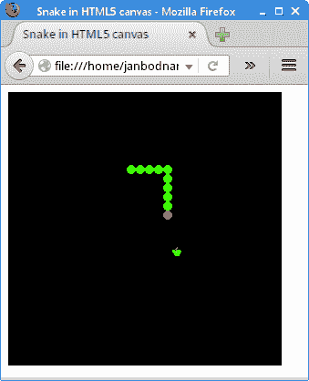

# HTML5 画布中的贪食蛇

> 原文： [https://zetcode.com/gfx/html5canvas/snake/](https://zetcode.com/gfx/html5canvas/snake/)

在 HTML5 画布教程的这一部分中，我们将创建一个 Snake 游戏克隆。

## Snake

贪食蛇是较旧的经典视频游戏。 它最初是在 70 年代后期创建的。 后来它被带到 PC 上。 在这个游戏中，玩家控制蛇。 目的是尽可能多地吃苹果。 蛇每次吃一个苹果，它的身体就会长大。 蛇必须避开墙壁和自己的身体。 该游戏有时称为 Nibbles 。

## 开发

蛇的每个关节的大小为 10 像素。 蛇由光标键控制。 最初，蛇具有三个关节。 如果游戏结束，则画布中间会显示“游戏结束”消息。

`snake.html`

```js
<!DOCTYPE html>
<html>
<head>
<title>Snake in HTML5 canvas</title>    
<style>
    canvas {background: black}
</style>
<script>
    var canvas;
    var ctx;

    var head;
    var apple;
    var ball;

    var dots;
    var apple_x;
    var apple_y;

    var leftDirection = false;
    var rightDirection = true;
    var upDirection = false;
    var downDirection = false;
    var inGame = true;    

    const DOT_SIZE = 10;
    const ALL_DOTS = 900;
    const MAX_RAND = 29;
    const DELAY = 140;
    const C_HEIGHT = 300;
    const C_WIDTH = 300;    

    const LEFT_KEY = 37;
    const RIGHT_KEY = 39;
    const UP_KEY = 38;
    const DOWN_KEY = 40;

    var x = new Array(ALL_DOTS);
    var y = new Array(ALL_DOTS);   

    function init() {

        canvas = document.getElementById('myCanvas');
        ctx = canvas.getContext('2d');

        loadImages();
        createSnake();
        locateApple();
        setTimeout("gameCycle()", DELAY);
    }    

    function loadImages() {

        head = new Image();
        head.src = 'head.png';    

        ball = new Image();
        ball.src = 'dot.png'; 

        apple = new Image();
        apple.src = 'apple.png'; 
    }

    function createSnake() {

        dots = 3;

        for (var z = 0; z < dots; z++) {
            x[z] = 50 - z * 10;
            y[z] = 50;
        }
    }

    function checkApple() {

        if ((x[0] == apple_x) && (y[0] == apple_y)) {

            dots++;
            locateApple();
        }
    }    

    function doDrawing() {

        ctx.clearRect(0, 0, C_WIDTH, C_HEIGHT);

        if (inGame) {

            ctx.drawImage(apple, apple_x, apple_y);

            for (var z = 0; z < dots; z++) {
                if (z == 0) {
                    ctx.drawImage(head, x[z], y[z]);
                } else {
                    ctx.drawImage(ball, x[z], y[z]);
                }
            }  
        } else {

            gameOver();
        }        
    }

    function gameOver() {

        ctx.fillStyle = 'white';
        ctx.textBaseline = 'middle'; 
        ctx.textAlign = 'center'; 
        ctx.font = 'normal bold 18px serif';

        ctx.fillText('Game over', C_WIDTH/2, C_HEIGHT/2);
    }

    function checkApple() {

        if ((x[0] == apple_x) && (y[0] == apple_y)) {

            dots++;
            locateApple();
        }
    }

    function move() {

        for (var z = dots; z > 0; z--) {
            x[z] = x[(z - 1)];
            y[z] = y[(z - 1)];
        }

        if (leftDirection) {
            x[0] -= DOT_SIZE;
        }

        if (rightDirection) {
            x[0] += DOT_SIZE;
        }

        if (upDirection) {
            y[0] -= DOT_SIZE;
        }

        if (downDirection) {
            y[0] += DOT_SIZE;
        }
    }    

    function checkCollision() {

        for (var z = dots; z > 0; z--) {

            if ((z > 4) && (x[0] == x[z]) && (y[0] == y[z])) {
                inGame = false;
            }
        }

        if (y[0] >= C_HEIGHT) {
            inGame = false;
        }

        if (y[0] < 0) {
            inGame = false;
        }

        if (x[0] >= C_WIDTH) {
            inGame = false;
        }

        if (x[0] < 0) {
            inGame = false;
        }
    }

    function locateApple() {

        var r = Math.floor(Math.random() * MAX_RAND);
        apple_x = r * DOT_SIZE;

        r = Math.floor(Math.random() * MAX_RAND);
        apple_y = r * DOT_SIZE;
    }    

    function gameCycle() {

        if (inGame) {

            checkApple();
            checkCollision();
            move();
            doDrawing();
            setTimeout("gameCycle()", DELAY);
        }
    }

    onkeydown = function(e) {

        var key = e.keyCode;

        if ((key == LEFT_KEY) && (!rightDirection)) {
            leftDirection = true;
            upDirection = false;
            downDirection = false;
        }

        if ((key == RIGHT_KEY) && (!leftDirection)) {
            rightDirection = true;
            upDirection = false;
            downDirection = false;
        }

        if ((key == UP_KEY) && (!downDirection)) {
            upDirection = true;
            rightDirection = false;
            leftDirection = false;
        }

        if ((key == DOWN_KEY) && (!upDirection)) {
            downDirection = true;
            rightDirection = false;
            leftDirection = false;
        }        
    };    
</script>
</head>

<body onload="init();">
    <canvas id="myCanvas" width="300" height="300">
    </canvas>
</body>
</html>

```

首先，我们将定义游戏中使用的常量。

```js
const DOT_SIZE = 10;
const ALL_DOTS = 900;
const MAX_RAND = 29;
const DELAY = 140;
const C_HEIGHT = 300;
const C_WIDTH = 300;    

```

`DOT_SIZE`是苹果的大小和蛇的点。 `ALL_DOTS`常数定义画布上可能的最大点数（`900 = 300 * 300/10 * 10`）。 `MAX_RAND`常数用于计算苹果的随机位置。 `DELAY`常数确定游戏的速度。 `C_HEIGHT`和`C_WIDTH`常数存储画布的大小。

```js
const LEFT_KEY = 37;
const RIGHT_KEY = 39;
const UP_KEY = 38;
const DOWN_KEY = 40;

```

这些常量存储箭头键的值。 它们用于提高可读性。

```js
var x = new Array(ALL_DOTS);
var y = new Array(ALL_DOTS); 

```

这两个数组存储蛇的所有关节的 x 和 y 坐标。

```js
function init() {

    canvas = document.getElementById('myCanvas');
    ctx = canvas.getContext('2d');

    loadImages();
    createSnake();
    locateApple();
    setTimeout("gameCycle()", DELAY);
}    

```

`init()`函数获取对画布对象及其上下文的引用。 调用`loadImages()`，`createSnake()`和`locateApple()`功能来执行特定任务。 `setTimeout()`开始动画。

```js
function loadImages() {

    head = new Image();
    head.src = 'head.png';    

    ball = new Image();
    ball.src = 'dot.png'; 

    apple = new Image();
    apple.src = 'apple.png'; 
}

```

在`loadImages()`功能中，我们检索游戏的图像。

```js
function createSnake() {

    dots = 3;

    for (var z = 0; z < dots; z++) {
        x[z] = 50 - z * 10;
        y[z] = 50;
    }
}

```

在`createSnake()`函数中，我们创建蛇对象。 首先，它具有三个关节。

```js
function checkApple() {

    if ((x[0] == apple_x) && (y[0] == apple_y)) {

        dots++;
        locateApple();
    }
} 

```

如果头部与苹果相撞，我们会增加蛇的关节数。 我们称`locateApple()`方法为随机放置一个新的`Apple`对象。

在`move()`方法中，我们有游戏的密钥算法。 要了解它，请看一下蛇是如何运动的。 我们控制蛇的头。 我们可以使用光标键更改其方向。 其余关节在链上向上移动一个位置。 第二关节移动到第一个关节的位置，第三关节移动到第二个关节的位置，依此类推。

```js
for (var z = dots; z > 0; z--) {
    x[z] = x[(z - 1)];
    y[z] = y[(z - 1)];
}

```

该代码将关节向上移动。

```js
if (leftDirection) {
    x[0] -= DOT_SIZE;
}

```

这条线将头向左移动。

在`checkCollision()`方法中，我们确定蛇是否击中了自己或边界之一。

```js
for (var z = dots; z > 0; z--) {

    if ((z > 4) && (x[0] == x[z]) && (y[0] == y[z])) {
        inGame = false;
    }
}

```

如果蛇用头撞到其关节之一，则游戏结束。

```js
if (y[0] >= C_HEIGHT) {
    inGame = false;
}

```

如果蛇撞到画布底部，则游戏结束。

```js
function locateApple() {

    var r = Math.floor(Math.random() * MAX_RAND);
    apple_x = r * DOT_SIZE;

    r = Math.floor(Math.random() * MAX_RAND);
    apple_y = r * DOT_SIZE;
}    

```

`locateApple()`随机选择苹果对象的 x 和 y 坐标。 `apple_x`和`apple_y`是苹果图像左上点的坐标。

```js
function gameCycle() {

    if (inGame) {

        checkApple();
        checkCollision();
        move();
        doDrawing();
        setTimeout("gameCycle()", DELAY);
    }
}

```

`gameCycle()`功能形成游戏周期。 如果游戏尚未完成，我们将执行碰撞检测，移动和绘画。 `setTimeout()`函数递归调用`gameCycle()`函数。

```js
if ((key == LEFT_KEY) && (!rightDirection)) {
    leftDirection = true;
    upDirection = false;
    downDirection = false;
}

```

如果单击左光标键，则将`leftDirection`变量设置为 true。 `move()`函数中使用此变量来更改蛇对象的坐标。 还要注意，当蛇向右行驶时，我们不能立即向左转。



Figure: Snake

这是 HTML5 画布中的贪食蛇游戏。