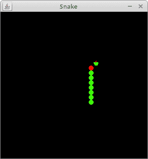

# Java 贪食蛇

> 原文： [https://zetcode.com/tutorials/javagamestutorial/snake/](https://zetcode.com/tutorials/javagamestutorial/snake/)

在 Java 2D 游戏教程的这一部分中，我们创建一个 Java 贪食蛇游戏克隆。 源代码和图像可以在作者的 Github [Java-Snake-Game](https://github.com/janbodnar/Java-Snake-Game) 存储库中找到。

## 贪食蛇

贪食蛇是较旧的经典视频游戏。 它最初是在 70 年代后期创建的。 后来它被带到 PC 上。 在这个游戏中，玩家控制蛇。 目的是尽可能多地吃苹果。 蛇每吃一个苹果，它的身体就会长大。 蛇必须避开墙壁和自己的身体。 该游戏有时称为 Nibbles 。

## Java 贪食蛇游戏的开发

蛇的每个关节的大小为 10 像素。 蛇由光标键控制。 最初，蛇具有三个关节。 如果游戏结束，则在面板中间显示`"Game Over"`消息。

`Board.java`

```java
package com.zetcode;

import java.awt.Color;
import java.awt.Dimension;
import java.awt.Font;
import java.awt.FontMetrics;
import java.awt.Graphics;
import java.awt.Image;
import java.awt.Toolkit;
import java.awt.event.ActionEvent;
import java.awt.event.ActionListener;
import java.awt.event.KeyAdapter;
import java.awt.event.KeyEvent;
import javax.swing.ImageIcon;
import javax.swing.JPanel;
import javax.swing.Timer;

public class Board extends JPanel implements ActionListener {

    private final int B_WIDTH = 300;
    private final int B_HEIGHT = 300;
    private final int DOT_SIZE = 10;
    private final int ALL_DOTS = 900;
    private final int RAND_POS = 29;
    private final int DELAY = 140;

    private final int x[] = new int[ALL_DOTS];
    private final int y[] = new int[ALL_DOTS];

    private int dots;
    private int apple_x;
    private int apple_y;

    private boolean leftDirection = false;
    private boolean rightDirection = true;
    private boolean upDirection = false;
    private boolean downDirection = false;
    private boolean inGame = true;

    private Timer timer;
    private Image ball;
    private Image apple;
    private Image head;

    public Board() {

        initBoard();
    }

    private void initBoard() {

        addKeyListener(new TAdapter());
        setBackground(Color.black);
        setFocusable(true);

        setPreferredSize(new Dimension(B_WIDTH, B_HEIGHT));
        loadImages();
        initGame();
    }

    private void loadImages() {

        ImageIcon iid = new ImageIcon("src/resources/dot.png");
        ball = iid.getImage();

        ImageIcon iia = new ImageIcon("src/resources/apple.png");
        apple = iia.getImage();

        ImageIcon iih = new ImageIcon("src/resources/head.png");
        head = iih.getImage();
    }

    private void initGame() {

        dots = 3;

        for (int z = 0; z < dots; z++) {
            x[z] = 50 - z * 10;
            y[z] = 50;
        }

        locateApple();

        timer = new Timer(DELAY, this);
        timer.start();
    }

    @Override
    public void paintComponent(Graphics g) {
        super.paintComponent(g);

        doDrawing(g);
    }

    private void doDrawing(Graphics g) {

        if (inGame) {

            g.drawImage(apple, apple_x, apple_y, this);

            for (int z = 0; z < dots; z++) {
                if (z == 0) {
                    g.drawImage(head, x[z], y[z], this);
                } else {
                    g.drawImage(ball, x[z], y[z], this);
                }
            }

            Toolkit.getDefaultToolkit().sync();

        } else {

            gameOver(g);
        }        
    }

    private void gameOver(Graphics g) {

        String msg = "Game Over";
        Font small = new Font("Helvetica", Font.BOLD, 14);
        FontMetrics metr = getFontMetrics(small);

        g.setColor(Color.white);
        g.setFont(small);
        g.drawString(msg, (B_WIDTH - metr.stringWidth(msg)) / 2, B_HEIGHT / 2);
    }

    private void checkApple() {

        if ((x[0] == apple_x) && (y[0] == apple_y)) {

            dots++;
            locateApple();
        }
    }

    private void move() {

        for (int z = dots; z > 0; z--) {
            x[z] = x[(z - 1)];
            y[z] = y[(z - 1)];
        }

        if (leftDirection) {
            x[0] -= DOT_SIZE;
        }

        if (rightDirection) {
            x[0] += DOT_SIZE;
        }

        if (upDirection) {
            y[0] -= DOT_SIZE;
        }

        if (downDirection) {
            y[0] += DOT_SIZE;
        }
    }

    private void checkCollision() {

        for (int z = dots; z > 0; z--) {

            if ((z > 4) && (x[0] == x[z]) && (y[0] == y[z])) {
                inGame = false;
            }
        }

        if (y[0] >= B_HEIGHT) {
            inGame = false;
        }

        if (y[0] < 0) {
            inGame = false;
        }

        if (x[0] >= B_WIDTH) {
            inGame = false;
        }

        if (x[0] < 0) {
            inGame = false;
        }

        if (!inGame) {
            timer.stop();
        }
    }

    private void locateApple() {

        int r = (int) (Math.random() * RAND_POS);
        apple_x = ((r * DOT_SIZE));

        r = (int) (Math.random() * RAND_POS);
        apple_y = ((r * DOT_SIZE));
    }

    @Override
    public void actionPerformed(ActionEvent e) {

        if (inGame) {

            checkApple();
            checkCollision();
            move();
        }

        repaint();
    }

    private class TAdapter extends KeyAdapter {

        @Override
        public void keyPressed(KeyEvent e) {

            int key = e.getKeyCode();

            if ((key == KeyEvent.VK_LEFT) && (!rightDirection)) {
                leftDirection = true;
                upDirection = false;
                downDirection = false;
            }

            if ((key == KeyEvent.VK_RIGHT) && (!leftDirection)) {
                rightDirection = true;
                upDirection = false;
                downDirection = false;
            }

            if ((key == KeyEvent.VK_UP) && (!downDirection)) {
                upDirection = true;
                rightDirection = false;
                leftDirection = false;
            }

            if ((key == KeyEvent.VK_DOWN) && (!upDirection)) {
                downDirection = true;
                rightDirection = false;
                leftDirection = false;
            }
        }
    }
}

```

首先，我们将定义游戏中使用的常量。

```java
private final int B_WIDTH = 300;
private final int B_HEIGHT = 300;
private final int DOT_SIZE = 10;
private final int ALL_DOTS = 900;
private final int RAND_POS = 29;
private final int DELAY = 140;

```

`B_WIDTH`和`B_HEIGHT`常数确定电路板的大小。 `DOT_SIZE`是苹果的大小和蛇的点。 `ALL_DOTS`常数定义了板上可能的最大点数（`900 = (300 * 300) / (10 * 10)`）。 `RAND_POS`常数用于计算苹果的随机位置。 `DELAY`常数确定游戏的速度。

```java
private final int x[] = new int[ALL_DOTS];
private final int y[] = new int[ALL_DOTS];

```

这两个数组存储蛇的所有关节的 x 和 y 坐标。

```java
private void loadImages() {

    ImageIcon iid = new ImageIcon("src/resources/dot.png");
    ball = iid.getImage();

    ImageIcon iia = new ImageIcon("src/resources/apple.png");
    apple = iia.getImage();

    ImageIcon iih = new ImageIcon("src/resources/head.png");
    head = iih.getImage();
}

```

在`loadImages()`方法中，我们获得了游戏的图像。 `ImageIcon`类用于显示 PNG 图像。

```java
private void initGame() {

    dots = 3;

    for (int z = 0; z < dots; z++) {
        x[z] = 50 - z * 10;
        y[z] = 50;
    }

    locateApple();

    timer = new Timer(DELAY, this);
    timer.start();
}

```

在`initGame()`方法中，我们创建蛇，在板上随机放置一个苹果，然后启动计时器。

```java
private void checkApple() {

    if ((x[0] == apple_x) && (y[0] == apple_y)) {

        dots++;
        locateApple();
    }
}

```

如果苹果与头部碰撞，我们会增加蛇的关节数。 我们称`locateApple()`方法为随机放置一个新的`Apple`对象。

在`move()`方法中，我们有游戏的关键算法。 要了解它，请看一下蛇是如何运动的。 我们控制蛇的头。 我们可以使用光标键更改其方向。 其余关节在链上向上移动一个位置。 第二关节移动到第一个关节的位置，第三关节移动到第二个关节的位置，依此类推。

```java
for (int z = dots; z > 0; z--) {
    x[z] = x[(z - 1)];
    y[z] = y[(z - 1)];
}

```

该代码将关节向上移动。

```java
if (leftDirection) {
    x[0] -= DOT_SIZE;
}

```

这条线将头向左移动。

在`checkCollision()`方法中，我们确定蛇是否击中了自己或撞墙之一。

```java
for (int z = dots; z > 0; z--) {

    if ((z > 4) && (x[0] == x[z]) && (y[0] == y[z])) {
        inGame = false;
    }
}

```

如果蛇用头撞到其关节之一，则游戏结束。

```java
if (y[0] >= B_HEIGHT) {
    inGame = false;
}

```

如果蛇击中了棋盘的底部，则游戏结束。

`Snake.java`

```java
package com.zetcode;

import java.awt.EventQueue;
import javax.swing.JFrame;

public class Snake extends JFrame {

    public Snake() {

        initUI();
    }

    private void initUI() {

        add(new Board());

        setResizable(false);
        pack();

        setTitle("Snake");
        setLocationRelativeTo(null);
        setDefaultCloseOperation(JFrame.EXIT_ON_CLOSE);
    }

    public static void main(String[] args) {

        EventQueue.invokeLater(() -> {
            JFrame ex = new Snake();
            ex.setVisible(true);
        });
    }
}

```

这是主要的类。

```java
setResizable(false);
pack();

```

`setResizable()`方法会影响某些平台上`JFrame`容器的插入。 因此，在`pack()`方法之前调用它很重要。 否则，蛇的头部与右边界和底边界的碰撞可能无法正常进行。



图：贪食蛇

这是 Java 中的贪食蛇游戏。