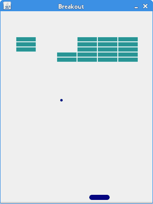

# Breakout 游戏

> 原文： [https://zetcode.com/tutorials/javagamestutorial/breakout/](https://zetcode.com/tutorials/javagamestutorial/breakout/)

在 Java 2D 游戏教程的这一部分中，我们创建一个简单的 Breakout 游戏克隆。 源代码和图像可以在作者的 Github [Java-Breakout-Game](https://github.com/janbodnar/Java-Breakout-Game) 存储库中找到。

Breakout 是一款最初由 Atari Inc. 开发的街机游戏。该游戏创建于 1976 年。

在此游戏中，玩家移动屏幕上的桨叶并弹起一个或多个球。 目的是销毁窗口顶部的砖块。

## 开发

在我们的游戏中，我们只有一个桨，一个球和 30 块砖。 我在 Inkscape 中为球，桨和砖块创建了图像。 我们使用计时器来创建游戏周期。 我们不使用角度，只是改变方向。 顶部，底部，左侧和右侧。 pybreakout 游戏启发了我。 它是由 Nathan Dawson 在 PyGame 库中开发的。

游戏包含七个文件：`Commons.java`，`Sprite.java`，`Ball.java`，`Paddle.java`，`Brick.java`，`Board.java`和`Breakout.java`。

`com/zetcode/Commons.java`

```
package com.zetcode;

public interface Commons {

    int WIDTH = 300;
    int HEIGHT = 400;
    int BOTTOM_EDGE = 390;
    int N_OF_BRICKS = 30;
    int INIT_PADDLE_X = 200;
    int INIT_PADDLE_Y = 360;
    int INIT_BALL_X = 230;
    int INIT_BALL_Y = 355;
    int PERIOD = 10;
}

```

`Commons.java`文件具有一些公共常数。 `WIDTH`和`HEIGHT`常数存储电路板的尺寸。 当球通过`BOTTOM_EDGE`时，比赛结束。 `N_OF_BRICKS`是游戏中的积木数量。 `INIT_PADDLE_X`和`INIT_PADDLE_Y`是桨状对象的初始坐标。 `INIT_BALL_X`和`INIT_BALL_Y`是球对象的初始坐标。 `DELAY`是执行任务之前的初始延迟（以毫秒为单位），`PERIOD`是形成游戏周期的连续任务执行之间的时间（以毫秒为单位）。

`com/zetcode/Sprite.java`

```
package com.zetcode;

import java.awt.Image;
import java.awt.Rectangle;

public class Sprite {

    int x;
    int y;
    int imageWidth;
    int imageHeight;
    Image image;

    protected void setX(int x) {

        this.x = x;
    }

    int getX() {

        return x;
    }

    protected void setY(int y) {

        this.y = y;
    }

    int getY() {

        return y;
    }

    int getImageWidth() {

        return imageWidth;
    }

    int getImageHeight() {

        return imageHeight;
    }

    Image getImage() {

        return image;
    }

    Rectangle getRect() {

        return new Rectangle(x, y,
                image.getWidth(null), image.getHeight(null));
    }

    void getImageDimensions() {

        imageWidth = image.getWidth(null);
        imageHeight = image.getHeight(null);
    }
}

```

`Sprite`类是`Board`中所有对象的基类。 我们将`Ball`，`Brick`和`Paddle`对象中的所有方法和变量都放在此处，例如`getImage()`或`getX()`方法。

`com/zetcode/Brick.java`

```
package com.zetcode;

import javax.swing.ImageIcon;

public class Brick extends Sprite {

    private boolean destroyed;

    public Brick(int x, int y) {

        initBrick(x, y);
    }

    private void initBrick(int x, int y) {

        this.x = x;
        this.y = y;

        destroyed = false;

        loadImage();
        getImageDimensions();
    }

    private void loadImage() {

        var ii = new ImageIcon("src/resources/brick.png");
        image = ii.getImage();
    }

    boolean isDestroyed() {

        return destroyed;
    }

    void setDestroyed(boolean val) {

        destroyed = val;
    }
}

```

这是`Brick`类。

```
private boolean destroyed;

```

在`destroyed`变量中，我们保留砖的状态。

`com/zetcode/Ball.java`

```
package com.zetcode;

import javax.swing.ImageIcon;

public class Ball extends Sprite {

    private int xdir;
    private int ydir;

    public Ball() {

        initBall();
    }

    private void initBall() {

        xdir = 1;
        ydir = -1;

        loadImage();
        getImageDimensions();
        resetState();
    }

    private void loadImage() {

        var ii = new ImageIcon("src/resources/ball.png");
        image = ii.getImage();
    }

    void move() {

        x += xdir;
        y += ydir;

        if (x == 0) {

            setXDir(1);
        }

        if (x == Commons.WIDTH - imageWidth) {

            System.out.println(imageWidth);
            setXDir(-1);
        }

        if (y == 0) {

            setYDir(1);
        }
    }

    private void resetState() {

        x = Commons.INIT_BALL_X;
        y = Commons.INIT_BALL_Y;
    }

    void setXDir(int x) {

        xdir = x;
    }

    void setYDir(int y) {

        ydir = y;
    }

    int getYDir() {

        return ydir;
    }
}

```

这是`Ball`类。

```
void move() {

    x += xdir;
    y += ydir;

    if (x == 0) {

        setXDir(1);
    }

    if (x == Commons.WIDTH - imageWidth) {

        System.out.println(imageWidth);
        setXDir(-1);
    }

    if (y == 0) {

        setYDir(1);
    }
}

```

`move()`方法将球移到`Board`上。 如果球撞到边界，方向将相应更改。

```
void setXDir(int x) {

    xdir = x;
}

void setYDir(int y) {

    ydir = y;
}

```

当球击中桨或砖时，将调用这两种方法。

`com/zetcode/Paddle.java`

```
package com.zetcode;

import java.awt.event.KeyEvent;
import javax.swing.ImageIcon;

public class Paddle extends Sprite  {

    private int dx;

    public Paddle() {

        initPaddle();
    }

    private void initPaddle() {

        loadImage();
        getImageDimensions();

        resetState();
    }

    private void loadImage() {

        var ii = new ImageIcon("src/resources/paddle.png");
        image = ii.getImage();
    }

    void move() {

        x += dx;

        if (x <= 0) {

            x = 0;
        }

        if (x >= Commons.WIDTH - imageWidth) {

            x = Commons.WIDTH - imageWidth;
        }
    }

    void keyPressed(KeyEvent e) {

        int key = e.getKeyCode();

        if (key == KeyEvent.VK_LEFT) {

            dx = -1;
        }

        if (key == KeyEvent.VK_RIGHT) {

            dx = 1;
        }
    }

    void keyReleased(KeyEvent e) {

        int key = e.getKeyCode();

        if (key == KeyEvent.VK_LEFT) {

            dx = 0;
        }

        if (key == KeyEvent.VK_RIGHT) {

            dx = 0;
        }
    }

    private void resetState() {

        x = Commons.INIT_PADDLE_X;
        y = Commons.INIT_PADDLE_Y;
    }
}

```

这是`Paddle`类。 它封装了 Breakout 游戏中的桨对象。 操纵杆通过左右箭头键控制。 通过按箭头键，我们设置方向变量。 通过释放箭头键，将`dx`变量设置为零。 这样，桨停止移动。

```
void move() {

    x += dx;

    if (x <= 0) {

        x = 0;
    }

    if (x >= Commons.WIDTH - imageWidth) {

        x = Commons.WIDTH - imageWidth;
    }
}

```

桨叶仅在水平方向上移动，因此我们仅更新 x 坐标。 如果条件确保桨不通过窗口边缘。

`com/zetcode/Board.java`

```
package com.zetcode;

import javax.swing.JPanel;
import javax.swing.Timer;
import java.awt.Color;
import java.awt.Dimension;
import java.awt.Font;
import java.awt.FontMetrics;
import java.awt.Graphics;
import java.awt.Graphics2D;
import java.awt.Point;
import java.awt.RenderingHints;
import java.awt.Toolkit;
import java.awt.event.ActionEvent;
import java.awt.event.ActionListener;
import java.awt.event.KeyAdapter;
import java.awt.event.KeyEvent;

public class Board extends JPanel {

    private Timer timer;
    private String message = "Game Over";
    private Ball ball;
    private Paddle paddle;
    private Brick[] bricks;
    private boolean inGame = true;

    public Board() {

        initBoard();
    }

    private void initBoard() {

        addKeyListener(new TAdapter());
        setFocusable(true);
        setPreferredSize(new Dimension(Commons.WIDTH, Commons.HEIGHT));

        gameInit();
    }

    private void gameInit() {

        bricks = new Brick[Commons.N_OF_BRICKS];

        ball = new Ball();
        paddle = new Paddle();

        int k = 0;

        for (int i = 0; i < 5; i++) {

            for (int j = 0; j < 6; j++) {

                bricks[k] = new Brick(j * 40 + 30, i * 10 + 50);
                k++;
            }
        }

        timer = new Timer(Commons.PERIOD, new GameCycle());
        timer.start();
    }

    @Override
    public void paintComponent(Graphics g) {
        super.paintComponent(g);

        var g2d = (Graphics2D) g;

        g2d.setRenderingHint(RenderingHints.KEY_ANTIALIASING,
                RenderingHints.VALUE_ANTIALIAS_ON);

        g2d.setRenderingHint(RenderingHints.KEY_RENDERING,
                RenderingHints.VALUE_RENDER_QUALITY);

        if (inGame) {

            drawObjects(g2d);
        } else {

            gameFinished(g2d);
        }

        Toolkit.getDefaultToolkit().sync();
    }

    private void drawObjects(Graphics2D g2d) {

        g2d.drawImage(ball.getImage(), ball.getX(), ball.getY(),
                ball.getImageWidth(), ball.getImageHeight(), this);
        g2d.drawImage(paddle.getImage(), paddle.getX(), paddle.getY(),
                paddle.getImageWidth(), paddle.getImageHeight(), this);

        for (int i = 0; i < Commons.N_OF_BRICKS; i++) {

            if (!bricks[i].isDestroyed()) {

                g2d.drawImage(bricks[i].getImage(), bricks[i].getX(),
                        bricks[i].getY(), bricks[i].getImageWidth(),
                        bricks[i].getImageHeight(), this);
            }
        }
    }

    private void gameFinished(Graphics2D g2d) {

        var font = new Font("Verdana", Font.BOLD, 18);
        FontMetrics fontMetrics = this.getFontMetrics(font);

        g2d.setColor(Color.BLACK);
        g2d.setFont(font);
        g2d.drawString(message,
                (Commons.WIDTH - fontMetrics.stringWidth(message)) / 2,
                Commons.WIDTH / 2);
    }

    private class TAdapter extends KeyAdapter {

        @Override
        public void keyReleased(KeyEvent e) {

            paddle.keyReleased(e);
        }

        @Override
        public void keyPressed(KeyEvent e) {

            paddle.keyPressed(e);
        }
    }

    private class GameCycle implements ActionListener {

        @Override
        public void actionPerformed(ActionEvent e) {

            doGameCycle();
        }
    }

    private void doGameCycle() {

        ball.move();
        paddle.move();
        checkCollision();
        repaint();
    }

    private void stopGame() {

        inGame = false;
        timer.stop();
    }

    private void checkCollision() {

        if (ball.getRect().getMaxY() > Commons.BOTTOM_EDGE) {

            stopGame();
        }

        for (int i = 0, j = 0; i < Commons.N_OF_BRICKS; i++) {

            if (bricks[i].isDestroyed()) {

                j++;
            }

            if (j == Commons.N_OF_BRICKS) {

                message = "Victory";
                stopGame();
            }
        }

        if ((ball.getRect()).intersects(paddle.getRect())) {

            int paddleLPos = (int) paddle.getRect().getMinX();
            int ballLPos = (int) ball.getRect().getMinX();

            int first = paddleLPos + 8;
            int second = paddleLPos + 16;
            int third = paddleLPos + 24;
            int fourth = paddleLPos + 32;

            if (ballLPos < first) {

                ball.setXDir(-1);
                ball.setYDir(-1);
            }

            if (ballLPos >= first && ballLPos < second) {

                ball.setXDir(-1);
                ball.setYDir(-1 * ball.getYDir());
            }

            if (ballLPos >= second && ballLPos < third) {

                ball.setXDir(0);
                ball.setYDir(-1);
            }

            if (ballLPos >= third && ballLPos < fourth) {

                ball.setXDir(1);
                ball.setYDir(-1 * ball.getYDir());
            }

            if (ballLPos > fourth) {

                ball.setXDir(1);
                ball.setYDir(-1);
            }
        }

        for (int i = 0; i < Commons.N_OF_BRICKS; i++) {

            if ((ball.getRect()).intersects(bricks[i].getRect())) {

                int ballLeft = (int) ball.getRect().getMinX();
                int ballHeight = (int) ball.getRect().getHeight();
                int ballWidth = (int) ball.getRect().getWidth();
                int ballTop = (int) ball.getRect().getMinY();

                var pointRight = new Point(ballLeft + ballWidth + 1, ballTop);
                var pointLeft = new Point(ballLeft - 1, ballTop);
                var pointTop = new Point(ballLeft, ballTop - 1);
                var pointBottom = new Point(ballLeft, ballTop + ballHeight + 1);

                if (!bricks[i].isDestroyed()) {

                    if (bricks[i].getRect().contains(pointRight)) {

                        ball.setXDir(-1);
                    } else if (bricks[i].getRect().contains(pointLeft)) {

                        ball.setXDir(1);
                    }

                    if (bricks[i].getRect().contains(pointTop)) {

                        ball.setYDir(1);
                    } else if (bricks[i].getRect().contains(pointBottom)) {

                        ball.setYDir(-1);
                    }

                    bricks[i].setDestroyed(true);
                }
            }
        }
    }
}

```

这是`Board`类。 这里我们把游戏逻辑。

```
private void gameInit() {

    bricks = new Brick[Commons.N_OF_BRICKS];

    ball = new Ball();
    paddle = new Paddle();

    int k = 0;

    for (int i = 0; i < 5; i++) {

        for (int j = 0; j < 6; j++) {

            bricks[k] = new Brick(j * 40 + 30, i * 10 + 50);
            k++;
        }
    }

    timer = new Timer(Commons.PERIOD, new GameCycle());
    timer.start();
}

```

在`gameInit()`方法中，我们创建一个球，一个球拍和三十块积木。 然后，我们创建并启动一个计时器。

```
if (inGame) {

    drawObjects(g2d);
} else {

    gameFinished(g2d);
}

```

根据`inGame`变量，我们可以使用`drawObjects()`方法绘制所有对象，也可以使用`gameFinished()`方法完成游戏。

```
private void drawObjects(Graphics2D g2d) {

    g2d.drawImage(ball.getImage(), ball.getX(), ball.getY(),
            ball.getImageWidth(), ball.getImageHeight(), this);
    g2d.drawImage(paddle.getImage(), paddle.getX(), paddle.getY(),
            paddle.getImageWidth(), paddle.getImageHeight(), this);

    for (int i = 0; i < Commons.N_OF_BRICKS; i++) {

        if (!bricks[i].isDestroyed()) {

            g2d.drawImage(bricks[i].getImage(), bricks[i].getX(),
                    bricks[i].getY(), bricks[i].getImageWidth(),
                    bricks[i].getImageHeight(), this);
        }
    }
}

```

`drawObjects()`方法绘制游戏的所有对象。 使用`drawImage()`方法绘制精灵。

```
private void gameFinished(Graphics2D g2d) {

    var font = new Font("Verdana", Font.BOLD, 18);
    FontMetrics fontMetrics = this.getFontMetrics(font);

    g2d.setColor(Color.BLACK);
    g2d.setFont(font);
    g2d.drawString(message,
            (Commons.WIDTH - fontMetrics.stringWidth(message)) / 2,
            Commons.WIDTH / 2);
}

```

`gameFinished()`方法将“游戏结束”或“胜利”绘制到窗口的中间。

```
private class GameCycle implements ActionListener {

    @Override
    public void actionPerformed(ActionEvent e) {

        doGameCycle();
    }
}

```

计时器会定期调用`actionPerformed()`方法，该方法又调用`doGameCycle()`方法，从而创建游戏周期。

```
private void doGameCycle() {

    ball.move();
    paddle.move();
    checkCollision();
    repaint();
}

```

`doGameCycle()`移动球和球拍。 我们检查是否可能发生碰撞并重新粉刷屏幕。

```
private void checkCollision() {

    if (ball.getRect().getMaxY() > Commons.BOTTOM_EDGE) {

        stopGame();
    }
...

```

如果球触底，我们将停止比赛。

```
for (int i = 0, j = 0; i < Commons.N_OF_BRICKS; i++) {

    if (bricks[i].isDestroyed()) {

        j++;
    }

    if (j == Commons.N_OF_BRICKS) {

        message = "Victory";
        stopGame();
    }
}

```

我们检查了多少砖被破坏了。 如果我们摧毁了所有`N_OF_BRICKS bricks`，我们将赢得这场比赛。

```
if (ballLPos < first) {

    ball.setXDir(-1);
    ball.setYDir(-1);
}

```

如果球碰到了桨的第一部分，我们会将球的方向更改为西北。

```
if (bricks[i].getRect().contains(pointTop)) {

    ball.setYDir(1);
}...

```

如果球撞击砖的底部，我们将改变球的 y 方向； 它下降了。

`com/zetcode/Breakout.java`

```
package com.zetcode;

import javax.swing.JFrame;
import java.awt.EventQueue;

public class Breakout extends JFrame {

    public Breakout() {

        initUI();
    }

    private void initUI() {

        add(new Board());
        setTitle("Breakout");

        setDefaultCloseOperation(EXIT_ON_CLOSE);
        setLocationRelativeTo(null);
        setResizable(false);
        pack();
    }

    public static void main(String[] args) {

        EventQueue.invokeLater(() -> {

            var game = new Breakout();
            game.setVisible(true);
        });
    }
}

```

这是具有主要输入方法的`Breakout`类。



Figure: The Breakout game

这是突破游戏。