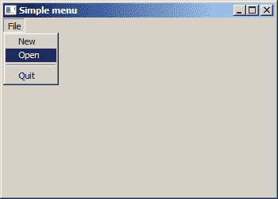
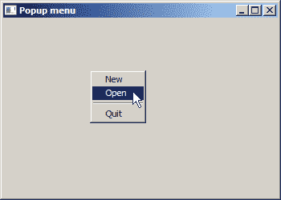
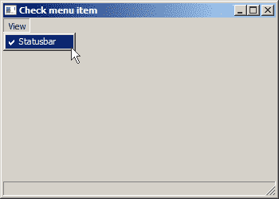
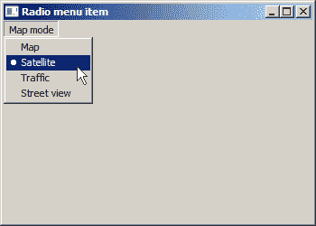
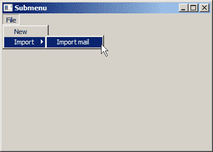

# Windows API 菜单

> 原文： [http://zetcode.com/gui/winapi/menus/](http://zetcode.com/gui/winapi/menus/)

<nav>[Home](/ "Home") [Contents](..) [Subscribe](http://zetcode.us13.list-manage.com/subscribe?u=9def9ccd4c70dbbaf691f90fc&id=6556210f80 "Subscribe to ZetCode news")[Previous](../firststeps/) [Next](../dialogs/)</nav>

在 Windows API 教程的这一部分中，我们创建菜单。 _ 菜单 _ 是位于菜单栏中的一组命令。 _ 菜单栏 _ 包含菜单列表。 菜单可以包含菜单项或其他菜单调用子菜单。 执行命令的菜单项称为命令项或命令。 在 Windows 上，菜单栏有时称为顶层菜单。 菜单和子菜单称为弹出菜单。 菜单项通常分为一些逻辑组。 这些组由分隔符分隔。 分隔符是一条小的水平线。

## 一个简单的菜单

在下面的示例中，我们创建一个菜单栏和三个菜单命令。 我们还创建一个分隔符。

`simplemenu.c`

```
#include <windows.h>

LRESULT CALLBACK WndProc(HWND, UINT, WPARAM, LPARAM);
void AddMenus(HWND);

#define IDM_FILE_NEW 1
#define IDM_FILE_OPEN 2
#define IDM_FILE_QUIT 3

int WINAPI wWinMain(HINSTANCE hInstance, HINSTANCE hPrevInstance,
                    PWSTR lpCmdLine, int nCmdShow) {

    MSG  msg;    
    WNDCLASSW wc = {0};
    wc.lpszClassName = L"Simple menu";
    wc.hInstance     = hInstance;
    wc.hbrBackground = GetSysColorBrush(COLOR_3DFACE);
    wc.lpfnWndProc   = WndProc;
    wc.hCursor       = LoadCursor(0, IDC_ARROW);

    RegisterClassW(&wc);
    CreateWindowW(wc.lpszClassName, L"Simple menu",
                  WS_OVERLAPPEDWINDOW | WS_VISIBLE,
                  100, 100, 350, 250, 0, 0, hInstance, 0);

    while (GetMessage(&msg, NULL, 0, 0)) {

        TranslateMessage(&msg);
        DispatchMessage(&msg);
    }

    return (int) msg.wParam;
}

LRESULT CALLBACK WndProc(HWND hwnd, UINT msg, 
    WPARAM wParam, LPARAM lParam) {

  switch(msg) {

      case WM_CREATE:

          AddMenus(hwnd);
          break;

      case WM_COMMAND:

          switch(LOWORD(wParam)) {

              case IDM_FILE_NEW:
              case IDM_FILE_OPEN:

                  MessageBeep(MB_ICONINFORMATION);
                  break;

              case IDM_FILE_QUIT:

                  SendMessage(hwnd, WM_CLOSE, 0, 0);
                  break;
           }

           break;

      case WM_DESTROY:

          PostQuitMessage(0);
          break;
  }

  return DefWindowProcW(hwnd, msg, wParam, lParam);
}

void AddMenus(HWND hwnd) {

    HMENU hMenubar;
    HMENU hMenu;

    hMenubar = CreateMenu();
    hMenu = CreateMenu();

    AppendMenuW(hMenu, MF_STRING, IDM_FILE_NEW, L"&New");
    AppendMenuW(hMenu, MF_STRING, IDM_FILE_OPEN, L"&Open");
    AppendMenuW(hMenu, MF_SEPARATOR, 0, NULL);
    AppendMenuW(hMenu, MF_STRING, IDM_FILE_QUIT, L"&Quit");

    AppendMenuW(hMenubar, MF_POPUP, (UINT_PTR) hMenu, L"&File");
    SetMenu(hwnd, hMenubar);
}

```

两个菜单项发出短促的声音。 第三个终止应用程序。

```
case WM_COMMAND:

    switch(LOWORD(wParam)) {

        case IDM_FILE_NEW:
        case IDM_FILE_OPEN:

            MessageBeep(MB_ICONINFORMATION);
            break;

        case IDM_FILE_QUIT:

            SendMessage(hwnd, WM_CLOSE, 0, 0);
            break;
    }

    break;

```

如果选择菜单项，则窗口过程会收到`WM_COMMAND`消息。 菜单项 id 在`wParam`值的低位字中。

```
hMenubar = CreateMenu();
hMenu = CreateMenu();

```

使用`CreateMenu()`功能创建菜单栏和菜单。

```
AppendMenuW(hMenu, MF_STRING, IDM_FILE_NEW, L"&New");
AppendMenuW(hMenu, MF_STRING, IDM_FILE_OPEN, L"&Open");
AppendMenuW(hMenu, MF_SEPARATOR, 0, NULL);
AppendMenuW(hMenu, MF_STRING, IDM_FILE_QUIT, L"&Quit");

AppendMenuW(hMenubar, MF_POPUP, (UINT_PTR) hMenu, L"&File");

```

菜单项和子菜单是使用`AppendMenuW()`功能创建的。 我们要追加的内容取决于标志。 `MF_STRING`附加标签，`MF_SEPARATOR`附加分隔符，`MF_POPUP`附加菜单。

```
SetMenu(hwnd, hMenubar);

```

最后，我们设置菜单栏，调用`SetMenu()`函数。



Figure: A simple menu

## 弹出菜单

弹出菜单也称为上下文菜单。 它是在某些情况下显示的命令列表。 例如，在 Firefox Web 浏览器中，当我们右键单击网页时，将获得一个上下文菜单。 在这里，我们可以重新加载页面，返回页面或查看页面源。 如果右键单击工具栏，则将获得另一个用于管理工具栏的上下文菜单。

`popupmenu.c`

```
#include <windows.h>

LRESULT CALLBACK WndProc(HWND, UINT, WPARAM, LPARAM);

#define IDM_FILE_NEW 1
#define IDM_FILE_OPEN 2
#define IDM_FILE_QUIT 3

int WINAPI wWinMain(HINSTANCE hInstance, HINSTANCE hPrevInstance,
                    PWSTR lpCmdLine, int nCmdShow) {
    MSG  msg;    
    WNDCLASSW wc = {0};
    wc.lpszClassName = L"Popup menu";
    wc.hInstance     = hInstance;
    wc.hbrBackground = GetSysColorBrush(COLOR_3DFACE);
    wc.lpfnWndProc   = WndProc;
    wc.hCursor       = LoadCursor(0, IDC_ARROW);

    RegisterClassW(&wc);
    CreateWindowW(wc.lpszClassName, L"Popup menu",
                  WS_OVERLAPPEDWINDOW | WS_VISIBLE,
                  100, 100, 350, 250, 0, 0, hInstance, 0);

    while (GetMessage(&msg, NULL, 0, 0)) {

        TranslateMessage(&msg);
        DispatchMessage(&msg);
    }

    return (int) msg.wParam;
}

LRESULT CALLBACK WndProc(HWND hwnd, UINT msg,
    WPARAM wParam, LPARAM lParam) {

    HMENU hMenu;
    POINT point;

    switch(msg) {

      case WM_COMMAND:

          switch(LOWORD(wParam)) {

              case IDM_FILE_NEW:
              case IDM_FILE_OPEN:

                  MessageBeep(MB_ICONINFORMATION);
                  break;

              case IDM_FILE_QUIT:

                  SendMessage(hwnd, WM_CLOSE, 0, 0);
                  break;
          }

          break;

      case WM_RBUTTONUP:

          point.x = LOWORD(lParam);
          point.y = HIWORD(lParam);

          hMenu = CreatePopupMenu();
          ClientToScreen(hwnd, &point);

          AppendMenuW(hMenu, MF_STRING, IDM_FILE_NEW, L"&New");
          AppendMenuW(hMenu, MF_STRING, IDM_FILE_OPEN, L"&Open");
          AppendMenuW(hMenu, MF_SEPARATOR, 0, NULL);
          AppendMenuW(hMenu, MF_STRING, IDM_FILE_QUIT, L"&Quit");

          TrackPopupMenu(hMenu, TPM_RIGHTBUTTON, point.x, point.y, 0, hwnd, NULL);
          DestroyMenu(hMenu);
          break;

      case WM_DESTROY:

          PostQuitMessage(0);
          break;
    }

    return DefWindowProcW(hwnd, msg, wParam, lParam);
}

```

我们有一个上下文菜单示例，其中包含三个菜单项。

```
case WM_RBUTTONUP:

    point.x = LOWORD(lParam);
    point.y = HIWORD(lParam);
...    

```

当光标在窗口的客户区域中时，用户释放鼠标右键时，将发布`WM_RBUTTONUP`消息。 `lParam`的低位字指定光标的 x 坐标。 高阶字指定光标的 y 坐标。 坐标相对于客户区域的左上角。

```
hMenu = CreatePopupMenu();   

```

`CreatePopupMenu()`功能创建一个弹出菜单。 它将句柄返回到新创建的菜单。 菜单最初是空的。

```
ClientToScreen(hwnd, &point);   

```

`ClientToScreen()`功能将指定点的客户坐标转换为屏幕坐标。 我们需要这些坐标才能显示上下文菜单。

```
AppendMenuW(hMenu, MF_STRING, IDM_FILE_NEW, L"&New");
AppendMenuW(hMenu, MF_STRING, IDM_FILE_OPEN, L"&Open");
AppendMenuW(hMenu, MF_SEPARATOR, 0, NULL);
AppendMenuW(hMenu, MF_STRING, IDM_FILE_QUIT, L"&Quit");   

```

创建三个菜单项和一个分隔符。

```
TrackPopupMenu(hMenu, TPM_RIGHTBUTTON, point.x, point.y, 0, hwnd, NULL);   

```

`TrackPopupMenu()`功能在指定位置显示上下文菜单，并跟踪菜单上项目的选择。

```
DestroyMenu(hMenu);   

```

最后，使用`DestroyMenu()`功能销毁菜单对象。 未分配给窗口的菜单必须被明确销毁。



Figure: A popup menu

## 检查菜单项

复选菜单项是在标签前带有复选标记的菜单项。 菜单项可以使用`CheckMenuItem()`功能选中或取消选中。

`checkmenuitem.c`

```
#include <windows.h>
#include <commctrl.h>

LRESULT CALLBACK WndProc(HWND, UINT, WPARAM, LPARAM);
void AddMenus(HWND);

#define IDM_VIEW_STB 1

HWND ghSb;
HMENU ghMenu;

int WINAPI wWinMain(HINSTANCE hInstance, HINSTANCE hPrevInstance,
                    PWSTR lpCmdLine, int nCmdShow) {

    MSG  msg;    
    WNDCLASSW wc = {0};
    wc.lpszClassName = L"Check menu item";
    wc.hInstance     = hInstance;
    wc.hbrBackground = GetSysColorBrush(COLOR_3DFACE);
    wc.lpfnWndProc   = WndProc;
    wc.hCursor       = LoadCursor(0, IDC_ARROW);

    RegisterClassW(&wc);
    CreateWindowW(wc.lpszClassName, L"Check menu item",
                  WS_OVERLAPPEDWINDOW | WS_VISIBLE,
                  100, 100, 350, 250, 0, 0, hInstance, 0);

    while (GetMessage(&msg, NULL, 0, 0)) {

        TranslateMessage(&msg);
        DispatchMessage(&msg);
    }

    return (int) msg.wParam;
}

LRESULT CALLBACK WndProc(HWND hwnd, UINT msg, 
    WPARAM wParam, LPARAM lParam) {

    UINT state;

    switch(msg) {

      case WM_CREATE:

          AddMenus(hwnd);          
          InitCommonControls();

          ghSb = CreateWindowExW(0, STATUSCLASSNAMEW, NULL, 
              WS_CHILD | WS_VISIBLE, 0, 0, 0, 0, hwnd, 
              (HMENU) 1, GetModuleHandle(NULL), NULL);

          break;

      case WM_COMMAND:

          switch(LOWORD(wParam)) {

              case IDM_VIEW_STB:                                    

                  state = GetMenuState(ghMenu, IDM_VIEW_STB, MF_BYCOMMAND); 

                  if (state == MF_CHECKED) {

                      ShowWindow(ghSb, SW_HIDE);
                      CheckMenuItem(ghMenu, IDM_VIEW_STB, MF_UNCHECKED);  
                  } else {

                      ShowWindow(ghSb, SW_SHOWNA);
                      CheckMenuItem(ghMenu, IDM_VIEW_STB, MF_CHECKED);  
                  }

                  break;
          }

          break;

      case WM_SIZE:

          SendMessage(ghSb, WM_SIZE, wParam, lParam);          
          break;

      case WM_DESTROY:

          PostQuitMessage(0);
          break;
    }

    return DefWindowProcW(hwnd, msg, wParam, lParam);
}

void AddMenus(HWND hwnd) {

    HMENU hMenubar;

    hMenubar = CreateMenu();
    ghMenu = CreateMenu();

    AppendMenuW(ghMenu, MF_STRING, IDM_VIEW_STB, L"&Statusbar");
    CheckMenuItem(ghMenu, IDM_VIEW_STB, MF_CHECKED);  

    AppendMenuW(hMenubar, MF_POPUP, (UINT_PTR) ghMenu, L"&View");

    SetMenu(hwnd, hMenubar);
}

```

在示例中，我们有一个包含一个菜单项的 View 菜单。 该菜单项将显示或隐藏状态栏。 当状态栏可见时，将选中菜单项。

```
#define IDM_VIEW_STB 1

```

这是将显示或隐藏状态栏的菜单项的 ID。

```
InitCommonControls();

```

状态栏是常用控件。 必须使用`InitCommonControls()`功能对其进行初始化。

```
ghSb = CreateWindowExW(0, STATUSCLASSNAMEW, NULL, 
    WS_CHILD | WS_VISIBLE, 0, 0, 0, 0, hwnd, 
    (HMENU) 1, GetModuleHandle(NULL), NULL);  

```

此代码行创建一个状态栏控件。

```
state = GetMenuState(ghMenu, IDM_VIEW_STB, MF_BYCOMMAND); 

```

我们通过`GetMenuState()`功能获得状态栏菜单项的状态。

```
if (state == MF_CHECKED) {

    ShowWindow(ghSb, SW_HIDE);
    CheckMenuItem(ghMenu, IDM_VIEW_STB, MF_UNCHECKED);  
} else {

    ShowWindow(ghSb, SW_SHOWNA);
    CheckMenuItem(ghMenu, IDM_VIEW_STB, MF_CHECKED);  
}

```

根据其状态，我们使用`ShowWindow()`功能显示或隐藏状态栏控件。 菜单项通过`CheckMenuItem()`功能被选中或取消选中。

```
case WM_SIZE:

    SendMessage(ghSb, WM_SIZE, wParam, lParam);          
    break;

```

调整窗口大小后，我们将调整状态栏的大小以适合窗口。



Figure: A check menu item

## 单选菜单项

单选菜单项使您可以从互斥的选项列表中进行选择。 单选菜单项通过`CheckMenuRadioItem()`功能进行管理。

`radiomenuitem.c`

```
#include <windows.h>

LRESULT CALLBACK WndProc(HWND, UINT, WPARAM, LPARAM);
void AddMenus(HWND);

#define IDM_MODE_MAP 1
#define IDM_MODE_SAT 2
#define IDM_MODE_TRA 3
#define IDM_MODE_STR 4

HMENU hMenu;

int WINAPI wWinMain(HINSTANCE hInstance, HINSTANCE hPrevInstance,
                    PWSTR lpCmdLine, int nCmdShow) {

    MSG  msg;    
    WNDCLASSW wc = {0};
    wc.lpszClassName = L"Radio menu item";
    wc.hInstance     = hInstance;
    wc.hbrBackground = GetSysColorBrush(COLOR_3DFACE);
    wc.lpfnWndProc   = WndProc;
    wc.hCursor       = LoadCursor(0, IDC_ARROW);

    RegisterClassW(&wc);
    CreateWindowW(wc.lpszClassName, L"Radio menu item",
                  WS_OVERLAPPEDWINDOW | WS_VISIBLE,
                  100, 100, 350, 250, 0, 0, hInstance, 0);

    while (GetMessage(&msg, NULL, 0, 0)) {

        TranslateMessage(&msg);
        DispatchMessage(&msg);
    }

    return (int) msg.wParam;
}

LRESULT CALLBACK WndProc(HWND hwnd, UINT msg, 
    WPARAM wParam, LPARAM lParam) {

  switch(msg) {

      case WM_CREATE:

          AddMenus(hwnd);
          break;

      case WM_COMMAND:

          switch(LOWORD(wParam)) {

              case IDM_MODE_MAP:
                  CheckMenuRadioItem(hMenu, IDM_MODE_MAP, IDM_MODE_STR, 
                      IDM_MODE_MAP, MF_BYCOMMAND);
                  MessageBeep(MB_ICONERROR);
                  break;

              case IDM_MODE_SAT:
                  CheckMenuRadioItem(hMenu, IDM_MODE_MAP, IDM_MODE_STR, 
                      IDM_MODE_SAT, MF_BYCOMMAND);
                  MessageBeep(0xFFFFFFFF);
                  break;

              case IDM_MODE_TRA:
                  CheckMenuRadioItem(hMenu, IDM_MODE_MAP, IDM_MODE_STR, 
                      IDM_MODE_TRA, MF_BYCOMMAND);
                  MessageBeep(MB_ICONWARNING);
                  break;

              case IDM_MODE_STR:
                  CheckMenuRadioItem(hMenu, IDM_MODE_MAP, IDM_MODE_STR, 
                      IDM_MODE_STR, MF_BYCOMMAND);

                  MessageBeep(MB_ICONINFORMATION);
                  break;
           }

           break;

      case WM_DESTROY:

          PostQuitMessage(0);
          break;
  }

  return DefWindowProcW(hwnd, msg, wParam, lParam);
}

void AddMenus(HWND hwnd) {

    HMENU hMenubar;

    hMenubar = CreateMenu();
    hMenu = CreateMenu();

    AppendMenuW(hMenu, MF_STRING, IDM_MODE_MAP, L"&Map");
    AppendMenuW(hMenu, MF_STRING, IDM_MODE_SAT, L"&Satellite");
    AppendMenuW(hMenu, MF_STRING, IDM_MODE_TRA, L"&Traffic");
    AppendMenuW(hMenu, MF_STRING, IDM_MODE_STR, L"Street &view");

    CheckMenuRadioItem(hMenu, IDM_MODE_MAP, IDM_MODE_STR, 
        IDM_MODE_MAP, MF_BYCOMMAND);

    AppendMenuW(hMenubar, MF_POPUP, (UINT_PTR) hMenu, L"&Map mode");
    SetMenu(hwnd, hMenubar);
}

```

在示例中，我们有四个单选菜单项； 一次只能选择其中之一。 每个单选菜单项都会发出不同的声音。

```
#define IDM_MODE_MAP 1
#define IDM_MODE_SAT 2
#define IDM_MODE_TRA 3
#define IDM_MODE_STR 4

```

这些是单选菜单项的 ID。

```
case IDM_MODE_MAP:
    CheckMenuRadioItem(hMenu, IDM_MODE_MAP, IDM_MODE_STR, 
        IDM_MODE_MAP, MF_BYCOMMAND);
    MessageBeep(MB_ICONERROR);
    break;

```

`CheckMenuRadioItem()`检查指定的菜单项并将其设为单选项目。 此外，它清除关联的菜单项组中的所有其他菜单项。 该函数的第一个参数是包含菜单项组的菜单句柄。 最后一个参数指示前三个参数的含义； 当指定`MF_BYCOMMAND`时，这些参数是菜单项的 ID。 第二个参数是组中第一个菜单项的 ID，第三个参数是组中最后一个菜单项的 ID。 第四个参数是要检查的菜单标识符。

```
...
AppendMenuW(hMenu, MF_STRING, IDM_MODE_STR, L"Street &view");

CheckMenuRadioItem(hMenu, IDM_MODE_MAP, IDM_MODE_STR, 
    IDM_MODE_MAP, MF_BYCOMMAND);

AppendMenuW(hMenubar, MF_POPUP, (UINT_PTR) hMenu, L"&Map mode");
...

```

首先，选择第一个单选项目。



Figure: A radio menu item

## 子菜单

子菜单是位于另一个菜单内的菜单。

`submenu.c`

```
#include <windows.h>

LRESULT CALLBACK WndProc(HWND, UINT, WPARAM, LPARAM);
void AddMenus(HWND);

#define IDM_FILE_NEW 1
#define IDM_FILE_IMPORT 2

#define IDM_IMPORT_MAIL 11

int WINAPI wWinMain(HINSTANCE hInstance, HINSTANCE hPrevInstance,
                    PWSTR lpCmdLine, int nCmdShow) {

    MSG  msg;    
    WNDCLASSW wc = {0};
    wc.lpszClassName = L"Submenu";
    wc.hInstance     = hInstance;
    wc.hbrBackground = GetSysColorBrush(COLOR_3DFACE);
    wc.lpfnWndProc   = WndProc;
    wc.hCursor       = LoadCursor(0, IDC_ARROW);

    RegisterClassW(&wc);
    CreateWindowW(wc.lpszClassName, L"Submenu",
                  WS_OVERLAPPEDWINDOW | WS_VISIBLE,
                  100, 100, 350, 250, 0, 0, hInstance, 0);

    while (GetMessage(&msg, NULL, 0, 0)) {

        TranslateMessage(&msg);
        DispatchMessage(&msg);
    }

    return (int) msg.wParam;
}

LRESULT CALLBACK WndProc(HWND hwnd, UINT msg, 
    WPARAM wParam, LPARAM lParam) {

  switch(msg) {

      case WM_CREATE:

          AddMenus(hwnd);
          break;

      case WM_COMMAND:

          switch(LOWORD(wParam)) {

              case IDM_FILE_NEW:
                  MessageBoxW(NULL, L"New file selected", 
                        L"Information", MB_OK);
                  break;

              case IDM_IMPORT_MAIL:
                  MessageBoxW(NULL, L"Import mail selected", 
                        L"Information", MB_OK);
           }

           break;

      case WM_DESTROY:

          PostQuitMessage(0);
          break;
  }

  return DefWindowProcW(hwnd, msg, wParam, lParam);
}

void AddMenus(HWND hwnd) {

    HMENU hMenubar = CreateMenu();
    HMENU hMenu = CreateMenu();
    HMENU hSubMenu = CreatePopupMenu();

    AppendMenuW(hMenu, MF_STRING, IDM_FILE_NEW, L"&New");

    AppendMenuW(hMenu, MF_STRING | MF_POPUP, (UINT_PTR) hSubMenu, L"&Import");
    AppendMenuW(hSubMenu, MF_STRING, IDM_IMPORT_MAIL, L"Import &mail");

    AppendMenuW(hMenubar, MF_POPUP, (UINT_PTR) hMenu, L"&File");
    SetMenu(hwnd, hMenubar);
}

```

在示例中，我们有两个菜单项； 一个位于“文件”菜单中，另一个位于“文件的导入”子菜单中。 选择每个菜单项都会显示一个消息框。

```
case IDM_IMPORT_MAIL:
    MessageBoxW(NULL, L"Import mail selected", 
          L"Information", MB_OK);

```

当我们选择“导入邮件”子菜单项时，将显示一个带有“导入所选邮件”文本的消息框。

```
HMENU hSubMenu = CreatePopupMenu();

```

使用`CreatePopupMenu()`功能创建一个子菜单。

```
AppendMenuW(hMenu, MF_STRING | MF_POPUP, (UINT_PTR) hSubMenu, L"&Import");

```

通过`AppendMenuW()`功能，我们在 File 菜单中添加了一个子菜单。 `MF_POPUP`标志用于弹出菜单和子菜单。

```
AppendMenuW(hSubMenu, MF_STRING, IDM_IMPORT_MAIL, L"Import &mail");

```

通常使用`AppendMenuW()`功能将菜单项添加到子菜单。



Figure: Submenu

在 Windows API 教程的这一部分中，我们介绍了菜单。