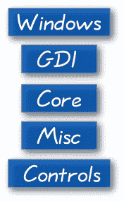
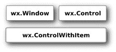
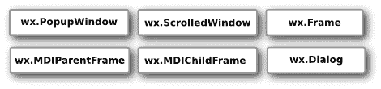
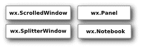
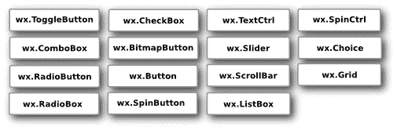
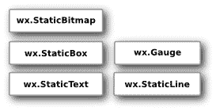
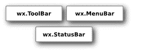
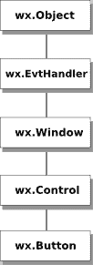

# wxPython 简介

> [http://zetcode.com/wxpython/introduction/](http://zetcode.com/wxpython/introduction/)

本章是 wxPython 工具箱的简介。

wxPython 是用于创建桌面 GUI 应用的跨平台工具包。 wxPython 的主要作者是 Robin Dunn。 使用 wxPython，开发人员可以在 Windows，Mac 和各种 Unix 系统上创建应用。 wxPython 是 wxWidgets 的包装，wxWidgets 是成熟的跨平台 C++ 库。

## Python

 Python 是一种成功的脚本语言。 它最初由 Guido van Rossum 开发。 它于 1991 年首次发布。Python 受 ABC 和 Haskell 编程语言的启发。 Python 是高级通用多平台解释型语言。 有些人喜欢将其称为动态语言。 这很容易学习。 Python 是一种简约语言。 它最明显的功能之一是它不使用分号或方括号。 Python 使用缩进代替。 今天，Python 由世界各地的一大批志愿者维护。

为了创建图形用户界面，Python 程序员可以在三个合适的选项中进行选择：PyGTK，wxPython 和 PyQt。

## wxPython 模块

wxPython 是用于创建桌面 GUI 应用的跨平台工具包。 wxPython 的主要作者是 Robin Dunn。 使用 wxPython，开发人员可以在 Windows，Mac 和各种 Unix 系统上创建应用。 wxPython 是 wxWidgets 的包装，wxWidgets 是成熟的跨平台 C++ 库。 wxPython 由五个基本模块组成。

Figure: wxPython modules

控件模块提供了图形应用中常见的窗口小部件。 例如，按钮，工具栏或笔记本。 小部件在 Windows OS 下称为控件。核心模块由开发中使用的基本类组成。 这些类包括 Object 类（它是所有类的母类），Sizers（用于小部件布局），Events，基本几何类（如 Point 和 Rectangle）。 图形设备接口（GDI）是用于绘制到小部件上的一组类。 此模块包含用于处理字体，颜色，画笔，笔或图像的类。其他模块包含各种其他类和模块功能。 这些类用于日志记录，应用配置，系统设置，与显示器或操纵杆一起使用。Windows 模块由构成应用的各种窗口组成，例如面板，对话框，框架或滚动窗口。

## wxPython API

wxPython API 是一组方法和对象。 小部件是 GUI 应用的基本构建块。 在 Windows 小部件下是被调用控件。 我们可以将程序员大致分为两类：他们编写应用或库。 在我们的案例中，wxPython 是一个库，应用员使用该库对应用进行编码。 从技术上讲，wxPython 是名为 wxWidgets 的 C++  GUI API 的包装。 因此它不是本机 API。 即它不是直接用 Python 编写的。

在 wxPython 中，我们有很多小部件。 这些可以分为一些逻辑组。

### 基本小部件

这些小部件为派生的小部件提供基本功能。 他们被称为祖先。 它们通常不直接使用。

Figure: Base widgets

### 顶级小部件

这些小部件彼此独立存在。

Figure: Top-level widgets

### 容器

容器包含其他小部件。

Figure: Containers

### 动态小部件

这些窗口小部件可以由用户编辑。

Figure: Dynamic widgets

### 静态小部件

这些小部件显示信息。 它们不能由用户编辑。

Figure: Static widgets

### 其他小工具

这些小部件在应用中实现状态栏，工具栏和菜单栏。

Figure: Other widgets

### 继承

wxPython 中的小部件之间有特定的关系。 此关系是通过继承开发的。 继承是面向对象编程的关键部分。 小部件形成层次结构。 小部件可以继承其他小部件的功能。 现有的类称为基类，父母或祖先。 继承的小部件我们称为派生小部件，子小部件或后代。

Figure: Inheritance diagram

假设我们在应用中使用按钮小部件。 按钮小部件继承自四个不同的基类。 最接近的类是`wx.Control`类。 按钮小部件是一种小窗口。 屏幕上显示的所有小部件都是窗口。 因此，它们继承自`wx.Window`类。 有些物体是不可见的。 例如，大小调整程序，设备上下文或区域设置对象。 也有一些可见的类，但它们不是 Windows。 例如，颜色对象，插入符号对象或光标对象。 并非所有的小部件都是控件。 例如`wx.Dialog`不是一种控件。 控件是放置在称为容器的其他窗口小部件上的窗口小部件。 这就是为什么我们有一个单独的`wx.Control`基类。

每个窗口都可以对事件做出反应。 按钮小部件也是如此。 通过单击按钮，我们启动`wx.EVT_COMMAND_BUTTON_CLICKED`事件。 按钮小部件通过`wx.Window`类继承`wx.EvtHandler`。 每个响应事件的小部件都必须继承`wx.EvtHandler`类。 最后，所有对象都继承自`wx.Object`类。

这是 wxPython 的简介。