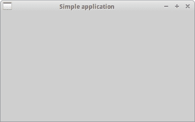

# 第一步

> 原文： [http://zetcode.com/wxpython/firststeps/](http://zetcode.com/wxpython/firststeps/)

在 wxPython 教程的这一部分中，我们将创建一些简单的示例。

## 简单的例子

我们从一个非常简单的例子开始。 我们的第一个脚本只会显示一个小窗口。

它不会做太多。 我们将逐行分析脚本。

`simple.py`

```py
#!/usr/bin/env python3
# -*- coding: utf-8 -*-

# simple.py

import wx

app = wx.App()

frame = wx.Frame(None, title='Simple application')
frame.Show()

app.MainLoop()

```

这是我们在 wxPython 中的第一个示例。

```py
#!/usr/bin/env python3
# -*- coding: utf-8 -*-

# simple.py

```

第一行是 she-bang，后面是通往 Python 解释器的路径。 第二行是一个魔术注释，它指定了源代码的编码。 第四行是提供脚本名称的注释。

```py
import wx

```

此行导入基本的 wxPython 模块。 即核心，控件，GDI，杂项和 windows。 从技术上讲，`wx`是一个名称空间。 基本模块中的所有功能和对象都将以`wx.`前缀开头。 下一行代码将创建一个应用对象。

```py
app = wx.App()

```

每个 wxPython 程序必须具有一个应用对象。

```py
frame = wx.Frame(None, title='Simple application')
frame.Show()

```

在这里，我们创建一个`wx.Frame`对象。 `wx.Frame`小部件是重要的容器小部件。 稍后我们将详细分析此小部件。 `wx.Frame`小部件是其他小部件的父级小部件。 它本身没有父母。 如果为父参数指定`None`，则表明我们的小部件没有父项。 它是小部件层次结构中的顶部小部件。 创建`wx.Frame`小部件后，必须调用`Show()`方法才能将其实际显示在屏幕上。

```py
app.MainLoop()

```

最后一行进入主循环。 主循环是一个无休止的循环。 它捕获并调度应用生命周期内存在的所有事件。

这是一个非常简单的例子。 尽管如此简单，我们仍然可以在此窗口中做很多事情。 我们可以调整窗口大小，最大化，最小化。 此功能需要大量编码。 wxPython 工具箱默认隐藏了所有这些内容并提供了这些内容。 没有理由重新发明轮子。



Figure: Simple example

## 框架

`wx.Frame`小部件是 wxPython 中最重要的小部件之一。 这是一个容器小部件。 这意味着它可以包含其他小部件。 实际上，它可以包含不是框架或对话框的任何窗口。 `wx.Frame`由标题栏，边框和中央容器区域组成。 标题栏和边框是可选的。 它们可以通过各种标志删除。

`wx.Frame`具有以下构造函数：

```py
wx.Frame(wx.Window parent, int id=-1, string title='', wx.Point pos=wx.DefaultPosition, 
    wx.Size size=wx.DefaultSize, style=wx.DEFAULT_FRAME_STYLE, string name="frame")

```

构造函数有七个参数。 第一个参数没有默认值。 其他六个参数确实具有。 这四个参数是可选的。 前三个是强制性的。

`wx.DEFAULT_FRAME_STYLE`是一组默认标志：`wx.MINIMIZE_BOX` | `wx.MAXIMIZE_BOX` | `wx.RESIZE_BORDER` `wx.SYSTEM_MENU` | `wx.CAPTION` | `wx.CLOSE_BOX` | `wx.CLIP_CHILDREN`。 通过组合各种样式，我们可以更改`wx.Frame`小部件的样式。

`no_minimize.py`

```py
#!/usr/bin/env python3
# -*- coding: utf-8 -*-

# no_minimize.py

import wx

app = wx.App()
frame = wx.Frame(None, style=wx.MAXIMIZE_BOX | wx.RESIZE_BORDER
	| wx.SYSTEM_MENU | wx.CAPTION |	 wx.CLOSE_BOX)
frame.Show(True)

app.MainLoop()

```

我们的意图是显示一个没有最小化框的窗口。 因此，我们没有在`style`参数中指定此标志。

## 大小和位置

我们可以通过两种方式指定应用的大小。 我们的小部件的构造函数中有一个`size`参数，或者我们可以调用`SetSize()`方法。

`set_size.py`

```py
#!/usr/bin/env python3
# -*- coding: utf-8 -*-

# set_size.py

import wx

class Example(wx.Frame):

    def __init__(self, parent, title):
        super(Example, self).__init__(parent, title=title,
            size=(350, 250))

def main():

    app = wx.App()
    ex = Example(None, title='Sizing')
    ex.Show()
    app.MainLoop()

if __name__ == '__main__':
    main()

```

在此示例中，应用的大小为`250x200`像素。

```py
def __init__(self, parent, title):
    super(Example, self).__init__(parent, title=title, 
        size=(350, 250))

```

在构造函数中，我们将`wx.Frame`小部件的宽度设置为 350px。 小部件的高度为 250 像素。

同样，我们可以将应用放置在屏幕上。 默认情况下，窗口位于屏幕的左上角。 但是在各种 OS 平台甚至窗口管理器上，它可能都不同。 一些窗口管理器自己放置应用窗口。 他们中的一些人做了一些优化，以使窗口不会重叠。 程序员可以以编程方式定位窗口。 我们已经在`wx.Frame`小部件的构造函数中看到了`pos`参数。 通过提供默认值以外的其他值，我们可以自己控制位置。

| 方法 | 描述 |
| --- | --- |
| `Move(wx.Point point)` | 将窗口移至指定位置 |
| `MoveXY(int x, int y)` | 将窗口移至指定位置 |
| `SetPosition(wx.Point point) `| 设置窗口的位置 |
| `SetDimensions(x, y, width, height, sizeFlags)` | 设置窗口的位置和大小 |

有几种方法可以做到这一点。

`moving.py`

```py
#!/usr/bin/env python3
# -*- coding: utf-8 -*-

# moving.py

import wx

class Example(wx.Frame):

    def __init__(self, parent, title):
        super(Example, self).__init__(parent, title=title,
            size=(300, 200))

        self.Move((800, 250))

def  main():

    app = wx.App()
    ex = Example(None, title='Moving')
    ex.Show()
    app.MainLoop()

if __name__ == '__main__':
    main()

```

有一种特殊情况。 我们可能要最大化显示我们的窗口。 在这种情况下，窗口位于（0，0），并占据整个屏幕。 wxPython 在内部计算屏幕坐标。 为了最大化我们的`wx.Frame`，我们调用`Maximize()`方法。

## 在屏幕上居中

如果要在屏幕上居中放置应用，则 wxPython 有一个方便的方法。 `Centre()`方法只是将窗口居中放在屏幕上。 无需计算屏幕的宽度和高度。 只需调用该方法。

`centering.py`

```py
#!/usr/bin/env python3
# -*- coding: utf-8 -*-

# centering.py

import wx

class Example(wx.Frame):

    def __init__(self, parent, title):
        super(Example, self).__init__(parent, title=title,
            size=(300, 200))

        self.Centre()

def main():

    app = wx.App()
    ex = Example(None, title='Centering')
    ex.Show()
    app.MainLoop()

if __name__ == '__main__':
    main()

```

在此示例中，我们在屏幕上居中了一个小窗口。

```py
self.Centre()

```

`Centre()`方法使窗口在屏幕上居中。

在本章中，我们在 wxPython 中创建了一些简单的代码示例。