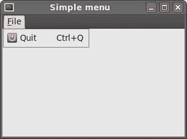
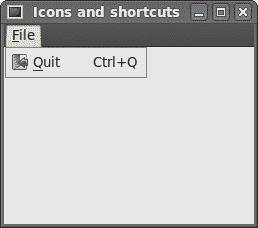
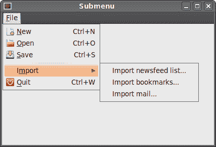
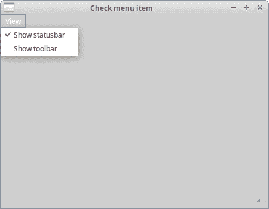
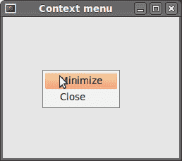
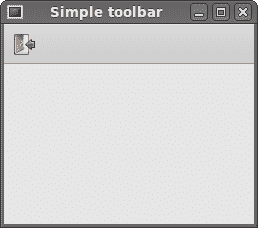
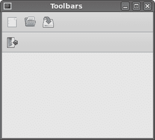
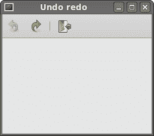

# 菜单和工具栏

> 原文： [http://zetcode.com/wxpython/menustoolbars/](http://zetcode.com/wxpython/menustoolbars/)

GUI 应用中的常见部分是菜单栏。 菜单栏由称为菜单的对象组成。 顶层菜单在菜单栏上带有其标签。 菜单具有菜单项。 菜单项是在应用内部执行特定操作的命令。 菜单也可以具有子菜单，这些子菜单具有自己的菜单项。 以下三个类用于在 wxPython 中创建菜单栏：`wx.MenuBar`，`wx.Menu`和`wx.MenuItem`。

## 简单菜单

在第一个示例中，我们将创建一个带有一个文件菜单的菜单栏。 该菜单将只有一个菜单项。 通过选择项目，应用退出。

`simple_menu.py`

```py
#!/usr/bin/env python3
# -*- coding: utf-8 -*-

"""
ZetCode wxPython tutorial

This example shows a simple menu.

author: Jan Bodnar
website: www.zetcode.com
last modified: April 2018
"""

import wx

class Example(wx.Frame):

    def __init__(self, *args, **kwargs):
        super(Example, self).__init__(*args, **kwargs)

        self.InitUI()

    def InitUI(self):

        menubar = wx.MenuBar()
        fileMenu = wx.Menu()
        fileItem = fileMenu.Append(wx.ID_EXIT, 'Quit', 'Quit application')
        menubar.Append(fileMenu, '&File')
        self.SetMenuBar(menubar)

        self.Bind(wx.EVT_MENU, self.OnQuit, fileItem)

        self.SetSize((300, 200))
        self.SetTitle('Simple menu')
        self.Centre()

    def OnQuit(self, e):
        self.Close()

def main():

    app = wx.App()
    ex = Example(None)
    ex.Show()
    app.MainLoop()

if __name__ == '__main__':
    main()

```

这是一个最小的菜单栏功能示例。

```py
menubar = wx.MenuBar()

```

首先，我们创建一个菜单栏对象。

```py
fileMenu = wx.Menu()

```

接下来，我们创建一个菜单对象。

```py
fileItem = fileMenu.Append(wx.ID_EXIT, 'Quit', 'Quit application')

```

我们将菜单项添加到菜单对象中。 第一个参数是菜单项的 ID。 标准 ID 将自动添加图标和快捷方式，在本例中为 `Ctrl + Q` 。 第二个参数是菜单项的名称。 最后一个参数定义了选择菜单项时在状态栏上显示的简短帮助字符串。 在这里，我们没有明确创建一个`wx.MenuItem`。 它是通过`Append()`方法在后台创建的。 该方法返回创建的菜单项。 稍后将使用此引用来绑定事件。

```py
self.Bind(wx.EVT_MENU, self.OnQuit, fileItem)

```

我们将菜单项的`wx.EVT_MENU`绑定到自定义`OnQuit()`方法。 此方法将关闭应用。

```py
menubar.Append(fileMenu, '&File')
self.SetMenuBar(menubar)

```

之后，我们将菜单添加到菜单栏中。 &字符创建一个加速键。 带下划线的&后面的字符。 这样，可以通过 `Alt + F` 快捷方式访问菜单。 最后，我们调用`SetMenuBar()`方法。 该方法属于`wx.Frame`小部件。 它设置菜单栏。



Figure: A simple menu example

## 图标和快捷方式

下一个示例与上一个示例基本相同。 这次，我们手动创建一个`wx.MenuItem`。

`icons_shortcuts.py`

```py
#!/usr/bin/env python3
# -*- coding: utf-8 -*-

"""
ZetCode wxPython tutorial

In this example, we manually create
a menu item.

author: Jan Bodnar
website: www.zetcode.com
last modified: April 2018
"""

import wx

APP_EXIT = 1

class Example(wx.Frame):

    def __init__(self, *args, **kwargs):
        super(Example, self).__init__(*args, **kwargs)

        self.InitUI()

    def InitUI(self):

        menubar = wx.MenuBar()
        fileMenu = wx.Menu()
        qmi = wx.MenuItem(fileMenu, APP_EXIT, '&Quit\tCtrl+Q')
        qmi.SetBitmap(wx.Bitmap('exit.png'))
        fileMenu.Append(qmi)

        self.Bind(wx.EVT_MENU, self.OnQuit, id=APP_EXIT)

        menubar.Append(fileMenu, '&File')
        self.SetMenuBar(menubar)

        self.SetSize((350, 250))
        self.SetTitle('Icons and shortcuts')
        self.Centre()

    def OnQuit(self, e):
        self.Close()

def main():

    app = wx.App()
    ex = Example(None)
    ex.Show()
    app.MainLoop()

if __name__ == '__main__':
    main()

```

在此示例中，我们创建一个退出菜单项。 我们为菜单项选择一个自定义图标和快捷方式。

```py
qmi = wx.MenuItem(fileMenu, APP_EXIT, '&Quit\tCtrl+Q')
qmi.SetBitmap(wx.Bitmap('exit.png'))
fileMenu.Append(qmi)

```

我们创建一个`wx.MenuItem`对象。 &字符指定加速键。 带“＆”号后面的字符带有下划线。 实际的快捷方式由字符组合定义。 我们指定了 `Ctrl + Q` 字符。 因此，如果我们按 `Ctrl + Q` ，我们将关闭应用。 我们在&字符和快捷方式之间放置一个制表符。 这样，我们设法在它们之间留出一些空间。 为了提供菜单项的图标，我们调用`SetBitmap()`方法。 通过调用`AppendItem()`方法将手动创建的菜单项附加到菜单。

```py
self.Bind(wx.EVT_MENU, self.OnQuit, id=APP_EXIT)

```

当我们选择创建的菜单项时，将调用`OnQuit()`方法。



Figure: Icons and shortcuts

## 子菜单和分隔符

每个菜单也可以有一个子菜单。 这样，我们可以将类似的命令分组。 例如，我们可以将隐藏/显示各种工具栏（例如个人栏，地址栏，状态栏或导航栏）的命令放置在称为工具栏的子菜单中。 在菜单中，我们可以使用分隔符来分隔命令。 这是一条简单的线。 通常的做法是使用单个分隔符将“新建”，“打开”，“保存”等命令与“打印”，“打印预览”等命令分开。 在我们的示例中，我们将看到如何创建子菜单和菜单分隔符。

`submenu.py`

```py
#!/usr/bin/env python3
# -*- coding: utf-8 -*-

"""
ZetCode wxPython tutorial

In this example, we create a submenu and a menu
separator.

author: Jan Bodnar
website: www.zetcode.com
last modified: April 2018
"""

import wx

class Example(wx.Frame):

    def __init__(self, *args, **kwargs):
        super(Example, self).__init__(*args, **kwargs)

        self.InitUI()

    def InitUI(self):

        menubar = wx.MenuBar()

        fileMenu = wx.Menu()
        fileMenu.Append(wx.ID_NEW, '&New')
        fileMenu.Append(wx.ID_OPEN, '&Open')
        fileMenu.Append(wx.ID_SAVE, '&Save')
        fileMenu.AppendSeparator()

        imp = wx.Menu()
        imp.Append(wx.ID_ANY, 'Import newsfeed list...')
        imp.Append(wx.ID_ANY, 'Import bookmarks...')
        imp.Append(wx.ID_ANY, 'Import mail...')

        fileMenu.AppendMenu(wx.ID_ANY, 'I&mport', imp)

        qmi = wx.MenuItem(fileMenu, wx.ID_EXIT, '&Quit\tCtrl+W')
        fileMenu.AppendItem(qmi)

        self.Bind(wx.EVT_MENU, self.OnQuit, qmi)

        menubar.Append(fileMenu, '&File')
        self.SetMenuBar(menubar)

        self.SetSize((350, 250))
        self.SetTitle('Submenu')
        self.Centre()

    def OnQuit(self, e):
        self.Close()

def main():

    app = wx.App()
    ex = Example(None)
    ex.Show()
    app.MainLoop()

if __name__ == '__main__':
    main()

```

在上面的示例中，我们创建了“新建”，“打开”和“保存”标准菜单项。 这些与带有水平分隔符的子菜单分开。 子菜单具有其他三个菜单项。

```py
fileMenu.Append(wx.ID_NEW, '&New')
fileMenu.Append(wx.ID_OPEN, '&Open')
fileMenu.Append(wx.ID_SAVE, '&Save')

```

在这里，我们有三个常见的菜单项：新建，打开和保存。

```py
fileMenu.AppendSeparator()

```

菜单分隔符随`AppendSeparator()`方法附加。

```py
imp = wx.Menu()
imp.Append(wx.ID_ANY, 'Import newsfeed list...')
imp.Append(wx.ID_ANY, 'Import bookmarks...')
imp.Append(wx.ID_ANY, 'Import mail...')

fileMenu.AppendMenu(wx.ID_ANY, 'I&mport', imp)

```

子菜单也是`wx.Menu`。 三个菜单项附加到菜单。 子菜单通过`AppenMenu()`方法附加到文件菜单。



Figure: A submenu example

## 复选菜单项

有树形菜单项。

*   普通项目
*   检查项目
*   广播项目

在下面的示例中，我们将演示复选菜单项。 复选菜单项在菜单中由刻度线直观地表示。

`checkmenu_item.py`

```py
#!/usr/bin/env python3
# -*- coding: utf-8 -*-

"""
ZetCode wxPython tutorial

This example creates a checked
menu item.

author: Jan Bodnar
website: www.zetcode.com
last modified: April 2018
"""

import wx

class Example(wx.Frame):

    def __init__(self, *args, **kwargs):
        super(Example, self).__init__(*args, **kwargs)

        self.InitUI()

    def InitUI(self):

        menubar = wx.MenuBar()
        viewMenu = wx.Menu()

        self.shst = viewMenu.Append(wx.ID_ANY, 'Show statusbar',
            'Show Statusbar', kind=wx.ITEM_CHECK)
        self.shtl = viewMenu.Append(wx.ID_ANY, 'Show toolbar',
            'Show Toolbar', kind=wx.ITEM_CHECK)

        viewMenu.Check(self.shst.GetId(), True)
        viewMenu.Check(self.shtl.GetId(), True)

        self.Bind(wx.EVT_MENU, self.ToggleStatusBar, self.shst)
        self.Bind(wx.EVT_MENU, self.ToggleToolBar, self.shtl)

        menubar.Append(viewMenu, '&View')
        self.SetMenuBar(menubar)

        self.toolbar = self.CreateToolBar()
        self.toolbar.AddTool(1, '', wx.Bitmap('texit.png'))
        self.toolbar.Realize()

        self.statusbar = self.CreateStatusBar()
        self.statusbar.SetStatusText('Ready')

        self.SetSize((450, 350))
        self.SetTitle('Check menu item')
        self.Centre()

    def ToggleStatusBar(self, e):

        if self.shst.IsChecked():
            self.statusbar.Show()
        else:
            self.statusbar.Hide()

    def ToggleToolBar(self, e):

        if self.shtl.IsChecked():
            self.toolbar.Show()
        else:
            self.toolbar.Hide()

def main():

    app = wx.App()
    ex = Example(None)
    ex.Show()
    app.MainLoop()

if __name__ == '__main__':
    main()

```

我们有一个视图菜单，其中有两个复选菜单项。 这两个菜单项将显示和隐藏状态栏和工具栏。

```py
self.shst = viewMenu.Append(wx.ID_ANY, 'Show statusbar', 
    'Show Statusbar', kind=wx.ITEM_CHECK)
self.shtl = viewMenu.Append(wx.ID_ANY, 'Show toolbar', 
    'Show Toolbar', kind=wx.ITEM_CHECK)

```

如果要附加复选菜单项，请将`kind`参数设置为`wx.ITEM_CHECK`。 默认参数是`wx.ITEM_NORMAL`。 `Append()`方法返回`wx.MenuItem`。

```py
viewMenu.Check(self.shst.GetId(), True)
viewMenu.Check(self.shtl.GetId(), True)

```

当应用启动时，状态栏和工具栏都可见。 因此，我们使用`Check()`方法检查两个菜单项。

```py
def ToggleStatusBar(self, e):

    if self.shst.IsChecked():
        self.statusbar.Show()
    else:
        self.statusbar.Hide()

```

我们根据复选菜单项的状态显示或隐藏状态栏。 我们使用`IsChecked()`方法找出复选菜单项的状态。 与工具栏相同。



图：选中菜单项

## 上下文菜单

上下文菜单是在某些上下文下显示的命令列表。 例如，在 Firefox Web 浏览器中，当我们右键单击网页时，将获得一个上下文菜单。 在这里，我们可以重新加载页面，返回或查看页面源代码。 如果右键单击工具栏，则将获得另一个用于管理工具栏的上下文菜单。 上下文菜单有时称为弹出菜单。

`context_menu.py`

```py
#!/usr/bin/env python3
# -*- coding: utf-8 -*-

"""
ZetCode wxPython tutorial

In this example, we create a context menu.

author: Jan Bodnar
website: www.zetcode.com
last modified: April 2018
"""

import wx

class MyPopupMenu(wx.Menu):

    def __init__(self, parent):
        super(MyPopupMenu, self).__init__()

        self.parent = parent

        mmi = wx.MenuItem(self, wx.NewId(), 'Minimize')
        self.Append(mmi)
        self.Bind(wx.EVT_MENU, self.OnMinimize, mmi)

        cmi = wx.MenuItem(self, wx.NewId(), 'Close')
        self.Append(cmi)
        self.Bind(wx.EVT_MENU, self.OnClose, cmi)

    def OnMinimize(self, e):
        self.parent.Iconize()

    def OnClose(self, e):
        self.parent.Close()

class Example(wx.Frame):

    def __init__(self, *args, **kwargs):
        super(Example, self).__init__(*args, **kwargs)

        self.InitUI()

    def InitUI(self):

        self.Bind(wx.EVT_RIGHT_DOWN, self.OnRightDown)

        self.SetSize((350, 250))
        self.SetTitle('Context menu')
        self.Centre()

    def OnRightDown(self, e):
        self.PopupMenu(MyPopupMenu(self), e.GetPosition())

def main():

    app = wx.App()
    ex = Example(None)
    ex.Show()
    app.MainLoop()

if __name__ == '__main__':
    main()

```

在示例中，我们为主窗口创建一个上下文菜单。 它有两个项目。 一个将最小化应用，另一个将终止它。

```py
class MyPopupMenu(wx.Menu):

    def __init__(self, parent):
        super(MyPopupMenu, self).__init__()

```

我们创建一个单独的`wx.Menu`类。

```py
mmi = wx.MenuItem(self, wx.NewId(), 'Minimize')
self.Append(mmi)
self.Bind(wx.EVT_MENU, self.OnMinimize, mmi)

```

将创建一个菜单项并将其附加到上下文菜单。 事件处理程序绑定到此菜单项。

```py
self.Bind(wx.EVT_RIGHT_DOWN, self.OnRightDown)

```

如果我们右键单击框架，我们将调用`OnRightDown()`方法。 为此，我们使用`wx.EVT_RIGHT_DOWN`事件绑定器。

```py
def OnRightDown(self, e):
    self.PopupMenu(MyPopupMenu(self), e.GetPosition())

```

在`OnRightDown()`方法中，我们称为`PopupMenu()`方法。 此方法显示上下文菜单。 第一个参数是要显示的菜单。 第二个参数是上下文菜单出现的位置。 上下文菜单出现在鼠标光标的位置。 为了获得鼠标的实际位置，我们调用提供的事件对象的`GetPosition()`方法。



Figure: Context menu

## 工具栏

菜单将我们可以在应用中使用的所有命令分组。 使用工具栏可以快速访问最常用的命令。

要创建工具栏，我们调用框架窗口小部件的`CreateToolBar()`方法。

`toolbar.py`

```py
#!/usr/bin/env python3
# -*- coding: utf-8 -*-

"""
ZetCode wxPython tutorial

This example creates a simple toolbar.

author: Jan Bodnar
website: www.zetcode.com
last modified: April 2018
"""

import wx

class Example(wx.Frame):

    def __init__(self, *args, **kwargs):
        super(Example, self).__init__(*args, **kwargs)

        self.InitUI()

    def InitUI(self):

        toolbar = self.CreateToolBar()
        qtool = toolbar.AddTool(wx.ID_ANY, 'Quit', wx.Bitmap('texit.png'))
        toolbar.Realize()

        self.Bind(wx.EVT_TOOL, self.OnQuit, qtool)

        self.SetSize((350, 250))
        self.SetTitle('Simple toolbar')
        self.Centre()

    def OnQuit(self, e):
        self.Close()

def main():

    app = wx.App()
    ex = Example(None)
    ex.Show()
    app.MainLoop()

if __name__ == '__main__':
    main()

```

在我们的示例中，我们有一个带有一个工具的工具栏。 当我们单击该工具时，它将关闭该应用。

```py
toolbar = self.CreateToolBar()

```

我们创建一个工具栏。 默认情况下，工具栏是水平的，没有边框并且显示图标。

```py
qtool = toolbar.AddTool(wx.ID_ANY, 'Quit', wx.Bitmap('texit.png'))

```

要创建工具栏工具，我们调用`AddTool()`方法。 第二个参数是工具的标签，第三个参数是工具的图像。 请注意，标签不可见，因为默认样式仅显示图标。

```py
toolbar.Realize()

```

将项目放入工具栏后，我们调用`Realize()`方法。 在 Linux 上，不必强制调用此方法。 在 Windows 上是。

```py
self.Bind(wx.EVT_TOOL, self.OnQuit, qtool)

```

为了处理工具栏事件，我们使用`wx.EVT_TOOL`事件绑定器。



Figure: Simple toolbar

如果我们要创建多个工具栏，则必须以不同的方式进行。

`toolbars.py`

```py
#!/usr/bin/env python3
# -*- coding: utf-8 -*-

'''
ZetCode wxPython tutorial

In this example, we create two horizontal
toolbars.

author: Jan Bodnar
website: www.zetcode.com
last modified: April 2018
'''

import wx

class Example(wx.Frame):

    def __init__(self, *args, **kwargs):
        super(Example, self).__init__(*args, **kwargs)

        self.InitUI()

    def InitUI(self):

        vbox = wx.BoxSizer(wx.VERTICAL)

        toolbar1 = wx.ToolBar(self)
        toolbar1.AddTool(wx.ID_ANY, '', wx.Bitmap('tnew.png'))
        toolbar1.AddTool(wx.ID_ANY, '', wx.Bitmap('topen.png'))
        toolbar1.AddTool(wx.ID_ANY, '', wx.Bitmap('tsave.png'))
        toolbar1.Realize()

        toolbar2 = wx.ToolBar(self)
        qtool = toolbar2.AddTool(wx.ID_EXIT, '', wx.Bitmap('texit.png'))
        toolbar2.Realize()

        vbox.Add(toolbar1, 0, wx.EXPAND)
        vbox.Add(toolbar2, 0, wx.EXPAND)

        self.Bind(wx.EVT_TOOL, self.OnQuit, qtool)

        self.SetSizer(vbox)

        self.SetSize((350, 250))
        self.SetTitle('Toolbars')
        self.Centre()

    def OnQuit(self, e):
        self.Close()

def main():

    app = wx.App()
    ex = Example(None)
    ex.Show()
    app.MainLoop()

if __name__ == '__main__':
    main()

```

在上面的示例中，我们创建了两个水平工具栏。

```py
toolbar1 = wx.ToolBar(self)
... 
toolbar2 = wx.ToolBar(self)

```

我们创建两个工具栏对象。 并将它们放入垂直盒中。



图：工具栏s

## 启用和禁用

在下面的示例中，我们展示了如何启用和禁用工具栏按钮。 我们还添加了分隔线。

`undo_redo.py`

```py
#!/usr/bin/env python3
# -*- coding: utf-8 -*-

"""
ZetCode wxPython tutorial

In this example, we create two horizontal
toolbars.

author: Jan Bodnar
website: www.zetcode.com
last modified: April 2018
"""

import wx

class Example(wx.Frame):

    def __init__(self, *args, **kwargs):
        super(Example, self).__init__(*args, **kwargs)

        self.InitUI()

    def InitUI(self):

        self.count = 5

        self.toolbar = self.CreateToolBar()
        tundo = self.toolbar.AddTool(wx.ID_UNDO, '', wx.Bitmap('tundo.png'))
        tredo = self.toolbar.AddTool(wx.ID_REDO, '', wx.Bitmap('tredo.png'))
        self.toolbar.EnableTool(wx.ID_REDO, False)
        self.toolbar.AddSeparator()
        texit = self.toolbar.AddTool(wx.ID_EXIT, '', wx.Bitmap('texit.png'))
        self.toolbar.Realize()

        self.Bind(wx.EVT_TOOL, self.OnQuit, texit)
        self.Bind(wx.EVT_TOOL, self.OnUndo, tundo)
        self.Bind(wx.EVT_TOOL, self.OnRedo, tredo)

        self.SetSize((350, 250))
        self.SetTitle('Undo redo')
        self.Centre()

    def OnUndo(self, e):
        if self.count > 1 and self.count <= 5:
            self.count = self.count - 1

        if self.count == 1:
            self.toolbar.EnableTool(wx.ID_UNDO, False)

        if self.count == 4:
            self.toolbar.EnableTool(wx.ID_REDO, True)

    def OnRedo(self, e):
        if self.count < 5 and self.count >= 1:
            self.count = self.count + 1

        if self.count == 5:
            self.toolbar.EnableTool(wx.ID_REDO, False)

        if self.count == 2:
            self.toolbar.EnableTool(wx.ID_UNDO, True)

    def OnQuit(self, e):
        self.Close()

def main():

    app = wx.App()
    ex = Example(None)
    ex.Show()
    app.MainLoop()

if __name__ == '__main__':
    main()

```

在我们的示例中，我们有三个工具栏按钮。 一个按钮用于退出应用。 其他两个按钮是撤消和重做按钮。 它们模拟应用中的撤消/重做功能。 （有关真实示例，请参见技巧）。我们进行了 4 个更改。 撤消和重做按钮相应地被禁用。

```py
self.toolbar.EnableTool(wx.ID_REDO, False)
self.toolbar.AddSeparator()

```

首先，重做按钮被禁用。 我们通过调用`EnableTool()`方法来实现。 我们可以在工具栏中创建一些逻辑组。 我们可以用一条小的垂直线将各种按钮组分开。 为此，我们调用`AddSeparator()`方法。

```py
def OnUndo(self, e):
    if self.count > 1 and self.count <= 5:
        self.count = self.count - 1

    if self.count == 1:
        self.toolbar.EnableTool(wx.ID_UNDO, False)

    if self.count == 4:
        self.toolbar.EnableTool(wx.ID_REDO, True)

```

我们模拟撤消和重做功能。 我们有四个变化。 如果没有什么可撤消的，撤消按钮将被禁用。 撤消第一个更改后，我们启用重做按钮。 相同的逻辑适用于`OnRedo()`方法。



Figure: Undo redo

在 wxPython 教程的这一部分中，我们使用了菜单和工具栏。