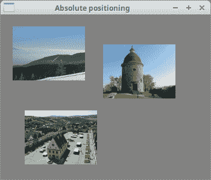
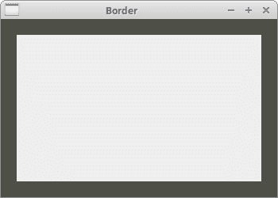
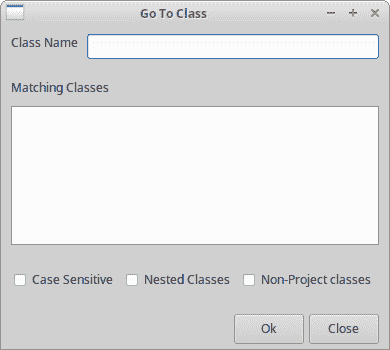
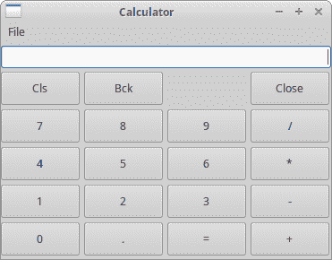
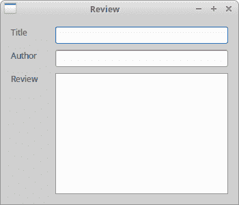
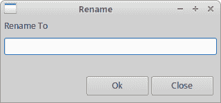
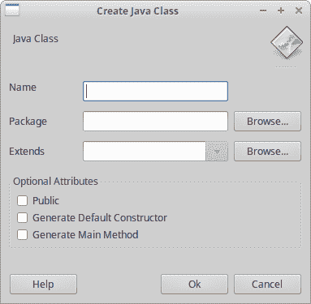

# wxPython 中的布局管理

> 原文： [http://zetcode.com/wxpython/layout/](http://zetcode.com/wxpython/layout/)

典型的应用由各种小部件组成。 这些小部件放置在容器小部件内。 程序员必须管理应用的布局。 这不是一件容易的事。 在 wxPython 中，可以使用绝对定位或使用大小调整器来布局小部件。

## 绝对定位

程序员以像素为单位指定每个小部件的位置和大小。 绝对定位有几个缺点：

*   如果我们调整窗口大小，则小部件的大小和位置不会改变。
*   在各种平台上，应用看起来都不同。
*   在应用中更改字体可能会破坏布局。
*   如果决定更改布局，则必须完全重做布局，这既繁琐又耗时。

在某些情况下，我们可能会使用绝对定位。 例如，小的测试示例。 但是大多数情况下，在现实世界的程序中，程序员使用大小调整器。

在我们的示例中，我们有一个简单的文本编辑器框架。 如果我们调整窗口大小，则`wx.TextCtrl`的大小不会像我们期望的那样改变。

`absolute.py`

```py
#!/usr/bin/env python3
# -*- coding: utf-8 -*-

"""
ZetCode wxPython tutorial

In this example, we lay out widgets using
absolute positioning.

author: Jan Bodnar
website: www.zetcode.com
last modified: April 2018
"""

import wx

class Example(wx.Frame):

    def __init__(self, parent, title):
        super(Example, self).__init__(parent, title=title,
            size=(350, 300))

        self.InitUI()
        self.Centre()

    def InitUI(self):

        self.panel = wx.Panel(self)

        self.panel.SetBackgroundColour("gray")

        self.LoadImages()

        self.mincol.SetPosition((20, 20))
        self.bardejov.SetPosition((40, 160))
        self.rotunda.SetPosition((170, 50))

    def LoadImages(self):

        self.mincol = wx.StaticBitmap(self.panel, wx.ID_ANY,
            wx.Bitmap("mincol.jpg", wx.BITMAP_TYPE_ANY))

        self.bardejov = wx.StaticBitmap(self.panel, wx.ID_ANY,
            wx.Bitmap("bardejov.jpg", wx.BITMAP_TYPE_ANY))

        self.rotunda = wx.StaticBitmap(self.panel, wx.ID_ANY,
            wx.Bitmap("rotunda.jpg", wx.BITMAP_TYPE_ANY))

def main():

    app = wx.App()
    ex = Example(None, title='Absolute positioning')
    ex.Show()
    app.MainLoop()

if __name__ == '__main__':
    main()

```

在上面的示例中，我们使用绝对坐标定位了三个图像。

```py
self.mincol.SetPosition((20, 20))

```

使用`SetPosition()`方法，我们将图像放置在`x = 20`，`y = 20`坐标处。



图：绝对定位

## 使用大小调整器

大小调整器确实解决了绝对定位中提到的所有这些问题。 wxPython 具有以下大小调整器：

*   `wx.BoxSizer`
*   `wx.StaticBoxSizer`
*   `wx.GridSizer`
*   `wx.FlexGridSizer`
*   `wx.GridBagSizer`

## `wx.BoxSizer`

`wx.BoxSizer`使我们可以将几个小部件放在一行或一列中。 我们可以将另一个调整器放到现有的调整器中。 这样，我们可以创建非常复杂的布局。

```py
 box = wx.BoxSizer(integer orient)
 box.Add(wx.Window window, integer proportion=0, integer flag = 0, integer border = 0)

```

方向可以是`wx.VERTICAL`或`wx.HORIZONTAL`。 通过`Add()`方法将小部件添加到`wx.BoxSizer`中。 为了理解它，我们需要查看它的参数。

比例参数定义小部件在定义的方向上如何变化的比例。 假设我们有三个比例分别为 0、1 和 2 的按钮。它们被添加到水平`wx.BoxSizer`中。 比例为 0 的按钮完全不会改变。 在水平方向上比例为 2 的按钮的变化比比例为 1 的按钮大两倍。

使用`flag`参数，您可以进一步在`wx.BoxSizer`中配置小部件的行为。 我们可以控制小部件之间的边界。 我们在小部件之间添加一些像素间距。 为了应用边框，我们需要定义要使用边框的边。 我们可以将它们与`|`运算符结合使用； 例如`wx.LEFT | wx.BOTTOM`。 我们可以在这些标志之间进行选择：

*   左
*   右
*   底部
*   顶部
*   `wx.ALL`

通过`setSizer()`方法将大小调整器设置为面板小部件。

`border.py`

```py
#!/usr/bin/env python3
# -*- coding: utf-8 -*-

"""
ZetCode wxPython tutorial

In this example we place a panel inside 
another panel.

author: Jan Bodnar
website: www.zetcode.com
last modified: April 2018
"""

import wx

class Example(wx.Frame):

    def __init__(self, parent, title):
        super(Example, self).__init__(parent, title=title)

        self.InitUI()
        self.Centre()

    def InitUI(self):

        panel = wx.Panel(self)

        panel.SetBackgroundColour('#4f5049')
        vbox = wx.BoxSizer(wx.VERTICAL)

        midPan = wx.Panel(panel)
        midPan.SetBackgroundColour('#ededed')

        vbox.Add(midPan, wx.ID_ANY, wx.EXPAND | wx.ALL, 20)
        panel.SetSizer(vbox)

def main():

    app = wx.App()
    ex = Example(None, title='Border')
    ex.Show()
    app.MainLoop()

if __name__ == '__main__':
    main()

```

在上面的示例中，我们在面板周围放置了一些空间。

```py
vbox.Add(midPan, wx.ID_ANY, wx.EXPAND | wx.ALL, 20)

```

在`border.py`中，我们在`midPan`面板周围放置了 20 像素边框。 `wx.ALL`将边框大小应用于所有四个侧面。

如果我们使用`wx.EXPAND`标志，则我们的窗口小部件将使用分配给它的所有空间。 最后，我们还可以定义小部件的对齐方式。 我们使用以下标志来实现：

*   wx.ALIGN_LEFT
*   wx.ALIGN_RIGHT
*   wx.ALIGN_TOP
*   wx.ALIGN_BOTTOM
*   wx.ALIGN_CENTER_VERTICAL
*   wx.ALIGN_CENTER_HORIZONTAL
*   wx.ALIGN_CENTER



Figure: Border around a panel

## `GoToClass`示例

在下面的示例中，我们介绍了几个重要的想法。

`goto_class.py`

```py
#!/usr/bin/env python3
# -*- coding: utf-8 -*-

"""
ZetCode wxPython tutorial

In this example we create a Go To class
layout with wx.BoxSizer.

author: Jan Bodnar
website: www.zetcode.com
last modified: April 2018
"""

import wx

class Example(wx.Frame):

    def __init__(self, parent, title):
        super(Example, self).__init__(parent, title=title)

        self.InitUI()
        self.Centre()

    def InitUI(self):

        panel = wx.Panel(self)

        font = wx.SystemSettings.GetFont(wx.SYS_SYSTEM_FONT)

        font.SetPointSize(9)

        vbox = wx.BoxSizer(wx.VERTICAL)

        hbox1 = wx.BoxSizer(wx.HORIZONTAL)
        st1 = wx.StaticText(panel, label='Class Name')
        st1.SetFont(font)
        hbox1.Add(st1, flag=wx.RIGHT, border=8)
        tc = wx.TextCtrl(panel)
        hbox1.Add(tc, proportion=1)
        vbox.Add(hbox1, flag=wx.EXPAND|wx.LEFT|wx.RIGHT|wx.TOP, border=10)

        vbox.Add((-1, 10))

        hbox2 = wx.BoxSizer(wx.HORIZONTAL)
        st2 = wx.StaticText(panel, label='Matching Classes')
        st2.SetFont(font)
        hbox2.Add(st2)
        vbox.Add(hbox2, flag=wx.LEFT | wx.TOP, border=10)

        vbox.Add((-1, 10))

        hbox3 = wx.BoxSizer(wx.HORIZONTAL)
        tc2 = wx.TextCtrl(panel, style=wx.TE_MULTILINE)
        hbox3.Add(tc2, proportion=1, flag=wx.EXPAND)
        vbox.Add(hbox3, proportion=1, flag=wx.LEFT|wx.RIGHT|wx.EXPAND,
            border=10)

        vbox.Add((-1, 25))

        hbox4 = wx.BoxSizer(wx.HORIZONTAL)
        cb1 = wx.CheckBox(panel, label='Case Sensitive')
        cb1.SetFont(font)
        hbox4.Add(cb1)
        cb2 = wx.CheckBox(panel, label='Nested Classes')
        cb2.SetFont(font)
        hbox4.Add(cb2, flag=wx.LEFT, border=10)
        cb3 = wx.CheckBox(panel, label='Non-Project classes')
        cb3.SetFont(font)
        hbox4.Add(cb3, flag=wx.LEFT, border=10)
        vbox.Add(hbox4, flag=wx.LEFT, border=10)

        vbox.Add((-1, 25))

        hbox5 = wx.BoxSizer(wx.HORIZONTAL)
        btn1 = wx.Button(panel, label='Ok', size=(70, 30))
        hbox5.Add(btn1)
        btn2 = wx.Button(panel, label='Close', size=(70, 30))
        hbox5.Add(btn2, flag=wx.LEFT|wx.BOTTOM, border=5)
        vbox.Add(hbox5, flag=wx.ALIGN_RIGHT|wx.RIGHT, border=10)

        panel.SetSizer(vbox)

def main():

    app = wx.App()
    ex = Example(None, title='Go To Class')
    ex.Show()
    app.MainLoop()

if __name__ == '__main__':
    main()

```

布局僵硬。 我们创建一个垂直大小调整器。 然后，我们将五个水平大小调整器放入其中。

```py
font = wx.SystemSettings.GetFont(wx.SYS_SYSTEM_FONT)

font.SetPointSize(9)

```

我们将字体大小更改为 9 像素。

```py
vbox.Add(hbox3, proportion=1, flag=wx.LEFT|wx.RIGHT|wx.EXPAND, 
    border=10)

vbox.Add((-1, 25))

```

我们已经知道可以通过组合`flag`参数和`border`参数来控制小部件之间的距离。 但是有一个真正的约束。 在`Add()`方法中，我们只能为所有给定的边指定一个边框。 在我们的示例中，我们在右侧和左侧分别设置了 10 像素。 但是我们不能给底部 25 像素。 我们可以做的是在底部给 10px，如果省略`wx.BOTTOM`则给 0px。 因此，如果我们需要不同的值，则可以添加一些额外的空间。 使用`Add()`方法，我们也可以插入小部件和空间。

```py
vbox.Add(hbox5, flag=wx.ALIGN_RIGHT|wx.RIGHT, border=10)

```

我们将两个按钮放在窗口的右侧。 实现这一点很重要的三件事：比例，对齐标志和`wx.EXPAND`标志。 比例必须为零。 调整窗口大小时，按钮的大小不应更改。 我们一定不要指定`wx.EXPAND`标志。 这些按钮仅占用分配给它们的区域。 最后，我们必须指定`wx.ALIGN_RIGHT`标志。 水平大小调整器从窗口的左侧扩展到右侧。 因此，如果我们指定`wx.ALIGN_RIGHT`标志，则按钮将放置在右侧。



Figure: A GoToClass window

## `wx.GridSizer`

`wx.GridSizer`在二维表中布置小部件。 表格中的每个单元格都具有相同的大小。

```py
wx.GridSizer(int rows=1, int cols=0, int vgap=0, int hgap=0)

```

在构造函数中，我们指定表中的行和列数以及单元格之间的垂直和水平空间。

在我们的示例中，我们创建了计算器的骨架。

`calculator.py`

```py
#!/usr/bin/env python3
# -*- coding: utf-8 -*-

"""
ZetCode wxPython tutorial

In this example we create a layout
of a calculator with wx.GridSizer.

author: Jan Bodnar
website: www.zetcode.com
last modified: April 2018
"""

import wx

class Example(wx.Frame):

    def __init__(self, parent, title):
        super(Example, self).__init__(parent, title=title)

        self.InitUI()
        self.Centre()

    def InitUI(self):

        menubar = wx.MenuBar()
        fileMenu = wx.Menu()
        menubar.Append(fileMenu, '&File')
        self.SetMenuBar(menubar)

        vbox = wx.BoxSizer(wx.VERTICAL)
        self.display = wx.TextCtrl(self, style=wx.TE_RIGHT)
        vbox.Add(self.display, flag=wx.EXPAND|wx.TOP|wx.BOTTOM, border=4)
        gs = wx.GridSizer(5, 4, 5, 5)

        gs.AddMany( [(wx.Button(self, label='Cls'), 0, wx.EXPAND),
            (wx.Button(self, label='Bck'), 0, wx.EXPAND),
            (wx.StaticText(self), wx.EXPAND),
            (wx.Button(self, label='Close'), 0, wx.EXPAND),
            (wx.Button(self, label='7'), 0, wx.EXPAND),
            (wx.Button(self, label='8'), 0, wx.EXPAND),
            (wx.Button(self, label='9'), 0, wx.EXPAND),
            (wx.Button(self, label='/'), 0, wx.EXPAND),
            (wx.Button(self, label='4'), 0, wx.EXPAND),
            (wx.Button(self, label='5'), 0, wx.EXPAND),
            (wx.Button(self, label='6'), 0, wx.EXPAND),
            (wx.Button(self, label='*'), 0, wx.EXPAND),
            (wx.Button(self, label='1'), 0, wx.EXPAND),
            (wx.Button(self, label='2'), 0, wx.EXPAND),
            (wx.Button(self, label='3'), 0, wx.EXPAND),
            (wx.Button(self, label='-'), 0, wx.EXPAND),
            (wx.Button(self, label='0'), 0, wx.EXPAND),
            (wx.Button(self, label='.'), 0, wx.EXPAND),
            (wx.Button(self, label='='), 0, wx.EXPAND),
            (wx.Button(self, label='+'), 0, wx.EXPAND) ])

        vbox.Add(gs, proportion=1, flag=wx.EXPAND)
        self.SetSizer(vbox)

def main():

    app = wx.App()
    ex = Example(None, title='Calculator')
    ex.Show()
    app.MainLoop()

if __name__ == '__main__':
    main()

```

注意我们如何设法在返回和关闭按钮之间放置一个空格。 我们只需在其中放置一个空的`wx.StaticText`。

在我们的示例中，我们使用了`AddMany()`方法。 这是一次同时添加多个小部件的便捷方法。

```py
gs.AddMany( [(wx.Button(self, label='Cls'), 0, wx.EXPAND),
...

```

将小部件按顺序放置在表中，然后将它们添加。 第一行先填充，然后第二行等。



Figure: Calculator

## `wx.FlexGridSizer`

该大小调整器类似于`wx.GridSizer`。 它还确实将其小部件布置在二维表中。 它增加了一些灵活性。 `wx.GridSizer`细胞大小相同。 `wx.FlexGridSizer`中的所有单元格都具有相同的高度。 一列中所有单元格的宽度均相同。 但是，所有行和列不一定都具有相同的高度或宽度。

```py
wx.FlexGridSizer(int rows=1, int cols=0, int vgap=0, int hgap=0)

```

`rows`和`cols`指定大小调整器中的行数和列数。 `vgap`和`hgap`在两个方向的小部件之间添加了一些空间。

很多时候，开发人员必须开发用于数据输入和修改的对话框。 我发现`wx.FlexGridSizer`适用于此类任务。 开发人员可以使用此 sizer 轻松设置对话框窗口。 也可以使用`wx.GridSizer`完成此操作，但由于每个单元格必须具有相同的大小的限制，因此看起来不太好。

`review.py`

```py
#!/usr/bin/env python3
# -*- coding: utf-8 -*-

"""
ZetCode wxPython tutorial

In this example we create review
layout with wx.FlexGridSizer.

author: Jan Bodnar
website: www.zetcode.com
last modified: April 2018
"""

import wx

class Example(wx.Frame):

    def __init__(self, parent, title):
        super(Example, self).__init__(parent, title=title)

        self.InitUI()
        self.Centre()
        self.Show()

    def InitUI(self):

        panel = wx.Panel(self)

        hbox = wx.BoxSizer(wx.HORIZONTAL)

        fgs = wx.FlexGridSizer(3, 2, 9, 25)

        title = wx.StaticText(panel, label="Title")
        author = wx.StaticText(panel, label="Author")
        review = wx.StaticText(panel, label="Review")

        tc1 = wx.TextCtrl(panel)
        tc2 = wx.TextCtrl(panel)
        tc3 = wx.TextCtrl(panel, style=wx.TE_MULTILINE)

        fgs.AddMany([(title), (tc1, 1, wx.EXPAND), (author),
            (tc2, 1, wx.EXPAND), (review, 1, wx.EXPAND), (tc3, 1, wx.EXPAND)])

        fgs.AddGrowableRow(2, 1)
        fgs.AddGrowableCol(1, 1)

        hbox.Add(fgs, proportion=1, flag=wx.ALL|wx.EXPAND, border=15)
        panel.SetSizer(hbox)

def main():

    app = wx.App()
    ex = Example(None, title='Review')
    ex.Show()
    app.MainLoop()

if __name__ == '__main__':
    main()

```

在上面的代码示例中，我们使用`FlexGridSizer`创建一个`Review`窗口。

```py
hbox = wx.BoxSizer(wx.HORIZONTAL)
...
hbox.Add(fgs, proportion=1, flag=wx.ALL|wx.EXPAND, border=15)

```

我们创建一个水平框大小调整器，以便在小部件表周围放置一些空间（15 像素）。

```py
fgs.AddMany([(title), (tc1, 1, wx.EXPAND), (author), 
    (tc2, 1, wx.EXPAND), (review, 1, wx.EXPAND), (tc3, 1, wx.EXPAND)])

```

我们使用`AddMany()`方法将小部件添加到大小调整器中。 `wx.FlexGridSizer`和`wx.GridSizer`都共享此方法。

```py
fgs.AddGrowableRow(2, 1)
fgs.AddGrowableCol(1, 1)

```

我们使第三行和第二列可增长。 这样，当调整窗口大小时，我们使文本控件增加。 前两个文本控件将在水平方向上增长，第三个文本控件将在两个方向上增长。 我们一定不要忘记使小部件可以使用`wx.EXPAND`进行扩展以使其起作用。



图：回顾 example

## `wx.GridBagSizer`

`wx.GridBagSizer`是 wxPython 中最灵活的大小调整器。 这种大小调整器不仅仅适用于 wxPython。 我们也可以在其他工具包中找到它。

该大小调整器可以显式定位项目。 项还可以选择跨越多个行或一列。 `wx.GridBagSizer`具有简单的构造函数。

```py
wx.GridBagSizer(integer vgap, integer hgap)

```

垂直和水平间隙定义了所有子级之间使用的像素间隔。 我们使用`Add()`方法将项目添加到网格中。

```py
Add(self, item, tuple pos, tuple span=wx.DefaultSpan, integer flag=0, 
    integer border=0, userData=None)

```

`Item`是插入网格中的小部件。 pos 指定虚拟网格中的位置。 左上角的单元格的位置为（0，0）。 范围是窗口小部件的可选范围； 例如 （3，2）的范围跨 3 行和 2 列跨越一个窗口小部件。 `wx.BoxSizer`前面已经讨论了标志和边界。 调整窗口大小时，网格中的项目可以更改其大小或保留默认大小。 如果我们希望您的项目增加和缩小，可以使用以下两种方法：

```py
AddGrowableRow(integer row)
AddGrowableCol(integer col)

```

## 重命名窗口示例

在第一个示例中，我们创建一个“重命名”窗口。 它将具有一个`wx.StaticText`，一个`wx.TextCtrl`和两个`wx.Button`小部件。

`rename.py`

```py
#!/usr/bin/env python3
# -*- coding: utf-8 -*-

"""
ZetCode wxPython tutorial

In this example we create a rename layout
with wx.GridBagSizer.

author: Jan Bodnar
website: www.zetcode.com
last modified: April 2018
"""

import wx

class Example(wx.Frame):

    def __init__(self, parent, title):
        super(Example, self).__init__(parent, title=title)

        self.InitUI()
        self.Centre()

    def InitUI(self):

        panel = wx.Panel(self)
        sizer = wx.GridBagSizer(4, 4)

        text = wx.StaticText(panel, label="Rename To")
        sizer.Add(text, pos=(0, 0), flag=wx.TOP|wx.LEFT|wx.BOTTOM, border=5)

        tc = wx.TextCtrl(panel)
        sizer.Add(tc, pos=(1, 0), span=(1, 5),
            flag=wx.EXPAND|wx.LEFT|wx.RIGHT, border=5)

        buttonOk = wx.Button(panel, label="Ok", size=(90, 28))
        buttonClose = wx.Button(panel, label="Close", size=(90, 28))
        sizer.Add(buttonOk, pos=(3, 3))
        sizer.Add(buttonClose, pos=(3, 4), flag=wx.RIGHT|wx.BOTTOM, border=10)

        sizer.AddGrowableCol(1)
        sizer.AddGrowableRow(2)
        panel.SetSizer(sizer)

def main():

    app = wx.App()
    ex = Example(None, title='Rename')
    ex.Show()
    app.MainLoop()

if __name__ == '__main__':
    main()

```

我们必须将窗口视为一个大的网格表。

```py
text = wx.StaticText(panel, label="Rename To")
sizer.Add(text, pos=(0, 0), flag=wx.TOP|wx.LEFT|wx.BOTTOM, border=10)

```

文本“重命名为”转到左上角。 因此，我们指定（0，0）位置。 然后在底部，左侧和底部添加一些空间。

```py
tc = wx.TextCtrl(panel)
sizer.Add(tc, pos=(1, 0), span=(1, 5), 
    flag=wx.EXPAND|wx.LEFT|wx.RIGHT, border=5)

```

`wx.TextCtrl`转到第二行的开头（1、0）。 请记住，我们从零开始计数。 它扩展了 1 行和 5 列（1、5）。 然后，在小部件的左侧和右侧放置 5 个像素的空间。

```py
sizer.Add(buttonOk, pos=(3, 3))
sizer.Add(buttonClose, pos=(3, 4), flag=wx.RIGHT|wx.BOTTOM, border=10)

```

我们在第四行中放置了两个按钮。 第三行留空，以便我们在`wx.TextCtrl`和按钮之间留出一些空间。 我们将“确定”按钮放入第四列，将“关闭”按钮放入第五列。 请注意，一旦我们向一个小部件应用了一些空间，它就会被应用于整行。 这就是为什么我们没有为“确定”按钮指定底部空间的原因。 细心的读者可能会注意到，我们没有在两个按钮之间指定任何空格。 也就是说，我们没有在“确定”按钮的右侧或“关闭”按钮的右侧放置任何空格。 在`wx.GridBagSizer`的构造函数中，我们在所有小部件之间放置了一些空间。 所以已经有一些空间了。

```py
sizer.AddGrowableCol(1)
sizer.AddGrowableRow(2)

```

我们必须做的最后一件事是使对话框可调整大小。 我们使第二列和第三行可增长。 现在我们可以扩大或缩小窗口。 尝试注释这两行，然后看看会发生什么。



Figure: Rename window

## 新类示例

在下一个示例中，我们创建一个窗口，可以在 JDeveloper 中找到它。 这是用于在 Java 中创建新类的窗口。

`new_class.py`

```py
#!/usr/bin/env python3
# -*- coding: utf-8 -*-

"""
ZetCode wxPython tutorial

In this example we create a new class layout
with wx.GridBagSizer.

author: Jan Bodnar
website: www.zetcode.com
last modified: April 2018
"""

import wx

class Example(wx.Frame):

    def __init__(self, parent, title):
        super(Example, self).__init__(parent, title=title)

        self.InitUI()
        self.Centre()

    def InitUI(self):

        panel = wx.Panel(self)

        sizer = wx.GridBagSizer(5, 5)

        text1 = wx.StaticText(panel, label="Java Class")
        sizer.Add(text1, pos=(0, 0), flag=wx.TOP|wx.LEFT|wx.BOTTOM,
            border=15)

        icon = wx.StaticBitmap(panel, bitmap=wx.Bitmap('exec.png'))
        sizer.Add(icon, pos=(0, 4), flag=wx.TOP|wx.RIGHT|wx.ALIGN_RIGHT,
            border=5)

        line = wx.StaticLine(panel)
        sizer.Add(line, pos=(1, 0), span=(1, 5),
            flag=wx.EXPAND|wx.BOTTOM, border=10)

        text2 = wx.StaticText(panel, label="Name")
        sizer.Add(text2, pos=(2, 0), flag=wx.LEFT, border=10)

        tc1 = wx.TextCtrl(panel)
        sizer.Add(tc1, pos=(2, 1), span=(1, 3), flag=wx.TOP|wx.EXPAND)

        text3 = wx.StaticText(panel, label="Package")
        sizer.Add(text3, pos=(3, 0), flag=wx.LEFT|wx.TOP, border=10)

        tc2 = wx.TextCtrl(panel)
        sizer.Add(tc2, pos=(3, 1), span=(1, 3), flag=wx.TOP|wx.EXPAND,
            border=5)

        button1 = wx.Button(panel, label="Browse...")
        sizer.Add(button1, pos=(3, 4), flag=wx.TOP|wx.RIGHT, border=5)

        text4 = wx.StaticText(panel, label="Extends")
        sizer.Add(text4, pos=(4, 0), flag=wx.TOP|wx.LEFT, border=10)

        combo = wx.ComboBox(panel)
        sizer.Add(combo, pos=(4, 1), span=(1, 3),
            flag=wx.TOP|wx.EXPAND, border=5)

        button2 = wx.Button(panel, label="Browse...")
        sizer.Add(button2, pos=(4, 4), flag=wx.TOP|wx.RIGHT, border=5)

        sb = wx.StaticBox(panel, label="Optional Attributes")

        boxsizer = wx.StaticBoxSizer(sb, wx.VERTICAL)
        boxsizer.Add(wx.CheckBox(panel, label="Public"),
            flag=wx.LEFT|wx.TOP, border=5)
        boxsizer.Add(wx.CheckBox(panel, label="Generate Default Constructor"),
            flag=wx.LEFT, border=5)
        boxsizer.Add(wx.CheckBox(panel, label="Generate Main Method"),
            flag=wx.LEFT|wx.BOTTOM, border=5)
        sizer.Add(boxsizer, pos=(5, 0), span=(1, 5),
            flag=wx.EXPAND|wx.TOP|wx.LEFT|wx.RIGHT , border=10)

        button3 = wx.Button(panel, label='Help')
        sizer.Add(button3, pos=(7, 0), flag=wx.LEFT, border=10)

        button4 = wx.Button(panel, label="Ok")
        sizer.Add(button4, pos=(7, 3))

        button5 = wx.Button(panel, label="Cancel")
        sizer.Add(button5, pos=(7, 4), span=(1, 1),
            flag=wx.BOTTOM|wx.RIGHT, border=10)

        sizer.AddGrowableCol(2)

        panel.SetSizer(sizer)
        sizer.Fit(self)

def main():

    app = wx.App()
    ex = Example(None, title="Create Java Class")
    ex.Show()
    app.MainLoop()

if __name__ == '__main__':
    main()

```

这是一个更复杂的布局。 我们同时使用`wx.GridBagSizer`和`wx.StaticBoxsizer`。

```py
line = wx.StaticLine(panel)
sizer.Add(line, pos=(1, 0), span=(1, 5), 
    flag=wx.EXPAND|wx.BOTTOM, border=10)

```

该行用于分隔布局中的小部件组。

```py
icon = wx.StaticBitmap(panel, bitmap=wx.Bitmap('exec.png'))
sizer.Add(icon, pos=(0, 4), flag=wx.TOP|wx.RIGHT|wx.ALIGN_RIGHT, 
    border=5)

```

我们将`wx.StaticBitmap`放入网格的第一行。 我们将其放在行的右侧。

```py
sb = wx.StaticBox(panel, label="Optional Attributes")
boxsizer = wx.StaticBoxSizer(sb, wx.VERTICAL)

```

`wxStaticBoxSizer`类似于普通的`wx.BoxSizer`，但它在大小调整器周围添加了一个静态框。 我们将复选框放入静态框大小调整器中。



Figure: New class window

wxPython 教程的这一部分专门用于布局管理。