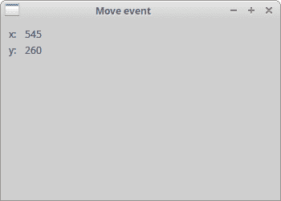
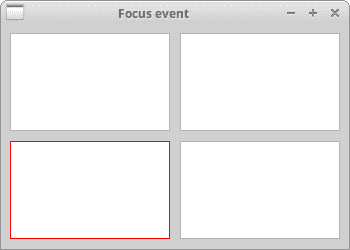

# wxPython 中的事件

> 原文： [http://zetcode.com/wxpython/events/](http://zetcode.com/wxpython/events/)

事件是每个 GUI 应用不可或缺的一部分。 所有 GUI 应用都是事件驱动的。 应用会对在其生命周期内生成的不同事件类型做出反应。 事件主要由应用的用户生成。 但是它们也可以通过其他方式生成。 例如互联网连接，窗口管理器或计时器。 因此，当我们调用`MainLoop()`方法时，我们的应用将等待事件生成。 当我们退出应用时，`MainLoop()`方法结束。

## 定义

事件是来自底层框架（通常是 GUI 工具箱）的应用级信息。事件循环是一种程序结构，用于等待并调度程序中的事件或消息。 事件循环反复查找要处理的事件。调度程序是将事件映射到事件处理程序的过程。 事件处理程序是对事件做出反应的方法。

事件对象是与事件关联的对象。 通常是一个窗口。事件类型是已生成的唯一事件。事件绑定器是将事件类型与事件处理程序绑定在一起的对象。

## wxPython `wx.EVT_MOVE`示例

在下面的示例中，我们对`wx.MoveEvent`事件做出反应。 当我们将窗口移到新位置时会生成该事件。 此事件的事件绑定器为`wx.EVT_MOVE`。

`simple_event.py`

```py
#!/usr/bin/env python3
# -*- coding: utf-8 -*-

"""
ZetCode wxPython tutorial

This is a wx.MoveEvent event demostration.

author: Jan Bodnar
website: www.zetcode.com
last modified: April 2018
"""

import wx

class Example(wx.Frame):

    def __init__(self, *args, **kw):
        super(Example, self).__init__(*args, **kw)

        self.InitUI()

    def InitUI(self):

        wx.StaticText(self, label='x:', pos=(10,10))
        wx.StaticText(self, label='y:', pos=(10,30))

        self.st1 = wx.StaticText(self, label='', pos=(30, 10))
        self.st2 = wx.StaticText(self, label='', pos=(30, 30))

        self.Bind(wx.EVT_MOVE, self.OnMove)

        self.SetSize((350, 250))
        self.SetTitle('Move event')
        self.Centre()

    def OnMove(self, e):

        x, y = e.GetPosition()
        self.st1.SetLabel(str(x))
        self.st2.SetLabel(str(y))

def main():

    app = wx.App()
    ex = Example(None)
    ex.Show()
    app.MainLoop()

if __name__ == '__main__':
    main() 

```

该示例显示窗口的当前位置。

```py
self.Bind(wx.EVT_MOVE, self.OnMove)

```

在这里，我们将`wx.EVT_MOVE`事件绑定器绑定到`OnMove()`方法。

```py
def OnMove(self, e):

    x, y = e.GetPosition()
    self.st1.SetLabel(str(x))
    self.st2.SetLabel(str(y))

```

`OnMove()`方法中的事件参数是特定于特定事件类型的对象。 在我们的例子中，它是`wx.MoveEvent`类的实例。 该对象保存有关事件的信息。 例如事件对象或窗口的位置。 在我们的例子中，事件对象是`wx.Frame`小部件。 我们可以通过调用事件的`GetPosition()`方法找出当前位置。



图：移动事件

## wxPython 事件绑定

在 wxPython 中使用事件的三个​​步骤是：

*   标识事件绑定程序名称：`wx.EVT_SIZE`，`wx.EVT_CLOSE`等。
*   创建一个事件处理程序。 生成事件时将调用此方法。
*   将事件绑定到事件处理程序。

在 wxPython 中，我们说将方法绑定到事件。 有时会使用单词钩子。 您可以通过调用`Bind()`方法来绑定事件。 该方法具有以下参数：

```py
Bind(event, handler, source=None, id=wx.ID_ANY, id2=wx.ID_ANY)

```

`event`是`EVT*`对象之一。 它指定事件的类型。 `handler`是要调用的对象。 换句话说，它是程序员绑定到事件的一种方法。 当我们要区分相同事件类型和不同小部件时，使用`source`参数。 当我们有多个按钮，菜单项等时，将使用`id`参数。`id`用于在它们之间进行区分。 当需要将处理程序绑定到 ID 范围时，例如`EVT_MENU_RANGE`，可以使用`id2`。

注意，方法`Bind()`在类`EvtHandler`中定义。 它是`wx.Window`继承的类。 `wx.Window`是 wxPython 中大多数小部件的基类。 还有一个相反的过程。 如果要从事件中取消绑定方法，请调用`Unbind()`方法。 它具有与上述相同的参数。

## 取消事件

有时我们需要停止处理事件。 为此，我们称方法`Veto()`。

`event_veto.py`

```py
#!/usr/bin/env python3
# -*- coding: utf-8 -*-

import wx

"""
ZetCode wxPython tutorial

In this example we veto an event.

author: Jan Bodnar
website: www.zetcode.com
last modified: April 2018
"""

class Example(wx.Frame):

    def __init__(self, *args, **kw):
        super(Example, self).__init__(*args, **kw)

        self.InitUI()

    def InitUI(self):

        self.Bind(wx.EVT_CLOSE, self.OnCloseWindow)

        self.SetTitle('Event veto')
        self.Centre()

    def OnCloseWindow(self, e):

        dial = wx.MessageDialog(None, 'Are you sure to quit?', 'Question',
            wx.YES_NO | wx.NO_DEFAULT | wx.ICON_QUESTION)

        ret = dial.ShowModal()

        if ret == wx.ID_YES:
            self.Destroy()
        else:
            e.Veto()

def main():

    app = wx.App()
    ex = Example(None)
    ex.Show()
    app.MainLoop()

if __name__ == '__main__':
    main()

```

在我们的示例中，我们处理`wx.CloseEvent`。 当我们单击标题栏上的 X 按钮，按 `Alt + F4` 或从系统菜单中选择关闭时，将称为此事件。 在许多应用中，如果要进行一些更改，我们希望防止意外关闭窗口。 为此，我们必须绑定`wx.EVT_CLOSE`事件绑定器。

```py
dial = wx.MessageDialog(None, 'Are you sure to quit?', 'Question',
    wx.YES_NO | wx.NO_DEFAULT | wx.ICON_QUESTION)

ret = dial.ShowModal()

```

在处理关闭事件期间，我们显示一个消息对话框。

```py
if ret == wx.ID_YES:
    self.Destroy()
else:
    event.Veto()

```

根据对话框的返回值，我们销毁窗口或否决事件。 注意，要关闭窗口，我们必须调用`Destroy()`方法。 通过调用`Close()`方法，我们将陷入无尽的循环。

## wxPython 事件传播

事件有两种类型：基本事件和命令事件。 它们的传播方式不同。 事件传播是事件从子窗口小部件到父窗口小部件和祖父窗口小部件的传播。 基本事件不会传播。 命令事件确实传播。 例如，`wx.CloseEvent`是一个基本事件。 此事件传播到父窗口小部件没有任何意义。

默认情况下，在事件处理程序中捕获的事件停止传播。 为了继续传播，我们调用`Skip()`方法。

`event_propagation.py`

```py
#!/usr/bin/env python3
# -*- coding: utf-8 -*-

"""
ZetCode wxPython tutorial

This example demonstrates event propagation.

author: Jan Bodnar
website: www.zetcode.com
last modified: April 2018
"""

import wx

class MyPanel(wx.Panel):

    def __init__(self, *args, **kw):
        super(MyPanel, self).__init__(*args, **kw)

        self.Bind(wx.EVT_BUTTON, self.OnButtonClicked)

    def OnButtonClicked(self, e):

        print('event reached panel class')
        e.Skip()

class MyButton(wx.Button):

    def __init__(self, *args, **kw):
        super(MyButton, self).__init__(*args, **kw)

        self.Bind(wx.EVT_BUTTON, self.OnButtonClicked)

    def OnButtonClicked(self, e):

        print('event reached button class')
        e.Skip()

class Example(wx.Frame):

    def __init__(self, *args, **kw):
        super(Example, self).__init__(*args, **kw)

        self.InitUI()

    def InitUI(self):

        mpnl = MyPanel(self)

        MyButton(mpnl, label='Ok', pos=(15, 15))

        self.Bind(wx.EVT_BUTTON, self.OnButtonClicked)

        self.SetTitle('Propagate event')
        self.Centre()

    def OnButtonClicked(self, e):

        print('event reached frame class')
        e.Skip()

def main():

    app = wx.App()
    ex = Example(None)
    ex.Show()
    app.MainLoop()

if __name__ == '__main__':
    main()

```

在我们的示例中，面板上有一个按钮。 面板放置在框架小部件中。 我们为所有小部件定义一个处理程序。

```py
def OnButtonClicked(self, e):

    print('event reached button class')
    e.Skip()

```

我们在自定义按钮类中处理按钮单击事件。 `Skip()`方法将事件进一步传播到面板类。

尝试省略一些`Skip()`方法，看看会发生什么。

## 窗口标识符

窗口标识符是在事件系统中唯一确定窗口标识的整数。 有三种创建窗口 ID 的方法。

*   让系统自动创建一个 ID
*   使用标准标识符
*   创建自己的 ID

```py
wx.Button(parent, -1)
wx.Button(parent, wx.ID_ANY)

```

如果为 id 参数提供 -1 或`wx.ID_ANY`，则让 wxPython 自动为我们创建一个 id。 自动创建的 ID 始终为负，而用户指定的 ID 必须始终为正。 当我们不需要更改窗口小部件状态时，通常使用此选项。 例如，静态文本在应用的生命周期内将永远不会更改。 如果需要，我们仍然可以获取 ID。 有一种确定 ID 的方法`GetId()`。

`default_ids.py`

```py
#!/usr/bin/env python3
# -*- coding: utf-8 -*-

"""
ZetCode wxPython tutorial

In this example we use automatic ids
with wx.ID_ANY.

author: Jan Bodnar
website: www.zetcode.com
last modified: April 2018
"""

import wx

class Example(wx.Frame):

    def __init__(self, *args, **kw):
        super(Example, self).__init__(*args, **kw)

        self.InitUI()

    def InitUI(self):

        pnl = wx.Panel(self)
        exitButton = wx.Button(pnl, wx.ID_ANY, 'Exit', (10, 10))

        self.Bind(wx.EVT_BUTTON,  self.OnExit, id=exitButton.GetId())

        self.SetTitle("Automatic ids")
        self.Centre()

    def OnExit(self, event):

        self.Close()

def main():

    app = wx.App()
    ex = Example(None)
    ex.Show()
    app.MainLoop()

if __name__ == '__main__':
    main()

```

在此示例中，我们不在乎实际的 ID 值。

```py
self.Bind(wx.EVT_BUTTON,  self.OnExit, id=exitButton.GetId())

```

我们通过调用`GetId()`方法来获取自动生成的 ID。

建议使用标准标识符。 标识符可以在某些平台上提供一些标准的图形或行为。

## wxPython 标准 ID

wxPython 包含一些标准 ID，例如`wx.ID_SAVE`或`wx.ID_NEW`。

`standard_ids.py`

```py
#!/usr/bin/env python3
# -*- coding: utf-8 -*-

"""
ZetCode wxPython tutorial

In this example we create buttons with standard ids.

author: Jan Bodnar
website: www.zetcode.com
last modified: April 2018
"""

import wx

class Example(wx.Frame):

    def __init__(self, *args, **kw):
        super(Example, self).__init__(*args, **kw)

        self.InitUI()

    def InitUI(self):

        pnl = wx.Panel(self)
        grid = wx.GridSizer(3, 2)

        grid.AddMany([(wx.Button(pnl, wx.ID_CANCEL), 0, wx.TOP | wx.LEFT, 9),
            (wx.Button(pnl, wx.ID_DELETE), 0, wx.TOP, 9),
            (wx.Button(pnl, wx.ID_SAVE), 0, wx.LEFT, 9),
            (wx.Button(pnl, wx.ID_EXIT)),
            (wx.Button(pnl, wx.ID_STOP), 0, wx.LEFT, 9),
            (wx.Button(pnl, wx.ID_NEW))])

        self.Bind(wx.EVT_BUTTON, self.OnQuitApp, id=wx.ID_EXIT)

        pnl.SetSizer(grid)

        self.SetTitle("Standard ids")
        self.Centre()

    def OnQuitApp(self, event):

        self.Close()

def main():

    app = wx.App()
    ex = Example(None)
    ex.Show()
    app.MainLoop()

if __name__ == '__main__':
    main()

```

在我们的示例中，我们在按钮上使用标准标识符。 在 Linux 上，按钮带有图标。

```py
grid.AddMany([(wx.Button(pnl, wx.ID_CANCEL), 0, wx.TOP | wx.LEFT, 9),
    (wx.Button(pnl, wx.ID_DELETE), 0, wx.TOP, 9),
    (wx.Button(pnl, wx.ID_SAVE), 0, wx.LEFT, 9),
    (wx.Button(pnl, wx.ID_EXIT)),
    (wx.Button(pnl, wx.ID_STOP), 0, wx.LEFT, 9),
    (wx.Button(pnl, wx.ID_NEW))])

```

我们向网格大小调整器添加六个按钮。 `wx.ID_CANCEL`，`wx.ID_DELETE`，`wx.ID_SAVE`，`wx.ID_EXIT`，`wx.ID_STOP`和`wx.ID_NEW`是标准标识符。

```py
self.Bind(wx.EVT_BUTTON, self.OnQuitApp, id=wx.ID_EXIT)

```

我们将按钮单击事件绑定到`OnQuitApp()`事件处理程序。 `id`参数用于区分按钮。 我们唯一地标识事件的来源。


图：标准标识符

## 自定义事件 ID

最后一个选择是使用自己的标识符。 我们定义了自己的全局 ID。

`custom_ids.py`

```py
#!/usr/bin/env python3
# -*- coding: utf-8 -*-

"""
ZetCode wxPython tutorial

In this example we use custom event ids.

author: Jan Bodnar
website: www.zetcode.com
last modified: April 2018
"""

import wx

ID_MENU_NEW = wx.NewId()
ID_MENU_OPEN = wx.NewId()
ID_MENU_SAVE = wx.NewId()

class Example(wx.Frame):

    def __init__(self, *args, **kw):
        super(Example, self).__init__(*args, **kw)

        self.InitUI()

    def InitUI(self):

        self.CreateMenuBar()
        self.CreateStatusBar()

        self.SetSize((350, 250))
        self.SetTitle('Custom ids')
        self.Centre()

    def CreateMenuBar(self):

        mb = wx.MenuBar()

        fMenu = wx.Menu()
        fMenu.Append(ID_MENU_NEW, 'New')
        fMenu.Append(ID_MENU_OPEN, 'Open')
        fMenu.Append(ID_MENU_SAVE, 'Save')

        mb.Append(fMenu, '&File')
        self.SetMenuBar(mb)

        self.Bind(wx.EVT_MENU, self.DisplayMessage, id=ID_MENU_NEW)
        self.Bind(wx.EVT_MENU, self.DisplayMessage, id=ID_MENU_OPEN)
        self.Bind(wx.EVT_MENU, self.DisplayMessage, id=ID_MENU_SAVE)

    def DisplayMessage(self, e):

        sb = self.GetStatusBar()

        eid = e.GetId()

        if eid == ID_MENU_NEW:
            msg = 'New menu item selected'
        elif eid == ID_MENU_OPEN:
            msg = 'Open menu item selected'
        elif eid == ID_MENU_SAVE:
            msg = 'Save menu item selected'

        sb.SetStatusText(msg)

def main():

    app = wx.App()
    ex = Example(None)
    ex.Show()
    app.MainLoop()

if __name__ == '__main__':
    main() 

```

在代码示例中，我们创建一个包含三个菜单项的菜单。 此菜单项的 ID 是全局创建的。

```py
ID_MENU_NEW = wx.NewId()
ID_MENU_OPEN = wx.NewId()
ID_MENU_SAVE = wx.NewId()

```

`wx.NewId()`方法创建一个新的唯一 ID。

```py
self.Bind(wx.EVT_MENU, self.DisplayMessage, id=ID_MENU_NEW)
self.Bind(wx.EVT_MENU, self.DisplayMessage, id=ID_MENU_OPEN)
self.Bind(wx.EVT_MENU, self.DisplayMessage, id=ID_MENU_SAVE) 

```

这三个菜单项均由其唯一 ID 标识。

```py
eid = e.GetId()

if eid == ID_MENU_NEW:
    msg = 'New menu item selected'
elif eid == ID_MENU_OPEN:
    msg = 'Open menu item selected'
elif eid == ID_MENU_SAVE:
    msg = 'Save menu item selected'

```

从事件对象中，我们检索 ID。 根据 ID 值，我们准备消息，该消息显示在应用的状态栏中。

## `wx.PaintEvent`

重绘窗口时会生成一次绘制事件。 当我们调整窗口大小或最大化窗口时，会发生这种情况。 绘图事件也可以通过编程方式生成。 例如，当我们调用`SetLabel()`方法来更改`wx.StaticText`小部件时。 请注意，当我们最小化窗口时，不会生成任何绘制事件。

`paint_event.py`

```py
#!/usr/bin/env python3
# -*- coding: utf-8 -*-

"""
ZetCode wxPython tutorial

In this example we count paint events.

author: Jan Bodnar
website: www.zetcode.com
last modified: April 2018
"""

import wx

class Example(wx.Frame):

    def __init__(self, *args, **kw):
        super(Example, self).__init__(*args, **kw)

        self.InitUI()

    def InitUI(self):

        self.count = 0
        self.Bind(wx.EVT_PAINT, self.OnPaint)

        self.SetTitle('Paint events')
        self.SetSize((350, 250))
        self.Centre()

    def OnPaint(self, e):

        self.count += 1
        dc = wx.PaintDC(self)
        text = "Number of paint events: {0}".format(self.count)
        dc.DrawText(text, 20, 20)

def main():

    app = wx.App()
    ex  = Example(None)
    ex.Show()
    app.MainLoop()

if __name__ == '__main__':
    main()

```

在我们的示例中，我们计算绘制事件的数量并在窗口上绘制当前生成的事件的数量。

```py
self.Bind(wx.EVT_PAINT, self.OnPaint)

```

我们将`EVT_PAINT`事件绑定到`OnPaint()`方法。

```py
def OnPaint(self, e):

    self.count += 1
    dc = wx.PaintDC(self)
    text = "Number of paint events: {0}".format(self.count)
    dc.DrawText(text, 20, 20)

```

在`OnPaint()`事件内部，我们使用`DrawText()`方法增加了计数器绘制窗口上绘图事件的数量。

## `wx.FocusEvent`

焦点指示应用中当前选择的窗口小部件。 从键盘输入或从剪贴板粘贴的文本将发送到具有焦点的小部件。 有两种与焦点有关的事件类型。 `wx.EVT_SET_FOCUS`事件，当窗口小部件获得焦点时生成。 小部件失去焦点时，将生成`wx.EVT_KILL_FOCUS`。 通常，通过单击或使用键盘键来更改焦点，通常是`选项卡`或 `Shift + 选项卡`。

`focus_event.py`

```py
#!/usr/bin/env python3
# -*- coding: utf-8 -*-

"""
ZetCode wxPython tutorial

In this example we work with wx.FocusEvent.

author: Jan Bodnar
website: www.zetcode.com
last modified: April 2018
"""

import wx

class MyWindow(wx.Panel):

    def __init__(self, parent):
        super(MyWindow, self).__init__(parent)

        self.color = '#b3b3b3'

        self.Bind(wx.EVT_PAINT, self.OnPaint)
        self.Bind(wx.EVT_SIZE, self.OnSize)
        self.Bind(wx.EVT_SET_FOCUS, self.OnSetFocus)
        self.Bind(wx.EVT_KILL_FOCUS, self.OnKillFocus)

    def OnPaint(self, e):

        dc = wx.PaintDC(self)

        dc.SetPen(wx.Pen(self.color))
        x, y = self.GetSize()
        dc.DrawRectangle(0, 0, x, y)

    def OnSize(self, e):

        self.Refresh()

    def OnSetFocus(self, e):

        self.color = '#ff0000'
        self.Refresh()

    def OnKillFocus(self, e):

        self.color = '#b3b3b3'
        self.Refresh()

class Example(wx.Frame):

    def __init__(self, *args, **kw):
        super(Example, self).__init__(*args, **kw)

        self.InitUI()

    def InitUI(self):

        grid = wx.GridSizer(2, 2, 10, 10)
        grid.AddMany([(MyWindow(self), 0, wx.EXPAND|wx.TOP|wx.LEFT, 9),
            (MyWindow(self), 0, wx.EXPAND|wx.TOP|wx.RIGHT, 9),
            (MyWindow(self), 0, wx.EXPAND|wx.BOTTOM|wx.LEFT, 9),
            (MyWindow(self), 0, wx.EXPAND|wx.BOTTOM|wx.RIGHT, 9)])

        self.SetSizer(grid)

        self.SetSize((350, 250))
        self.SetTitle('Focus event')
        self.Centre()

    def OnMove(self, e):

        print(e.GetEventObject())
        x, y = e.GetPosition()
        self.st1.SetLabel(str(x))
        self.st2.SetLabel(str(y))

def main():

    app = wx.App()
    ex = Example(None)
    ex.Show()
    app.MainLoop()

if __name__ == '__main__':
    main()

```

在我们的示例中，我们有四个面板。 重点突出显示的面板。

```py
self.Bind(wx.EVT_SET_FOCUS, self.OnSetFocus)
self.Bind(wx.EVT_KILL_FOCUS, self.OnKillFocus)

```

我们将两个焦点事件绑定到事件处理程序。

```py
def OnPaint(self, e):

    dc = wx.PaintDC(self)

    dc.SetPen(wx.Pen(self.color))
    x, y = self.GetSize()
    dc.DrawRectangle(0, 0, x, y)

```

在`OnPaint()`方法中，我们在窗口上绘制。 轮廓线的颜色取决于窗口是否具有焦点。 聚焦窗口的轮廓以红色绘制。

```py
def OnSetFocus(self, e):

    self.color = '#ff0000'
    self.Refresh()

```

在`OnSetFocus()`方法中，我们将`self.color`变量设置为红色。 我们刷新框架窗口，这将为其所有子窗口小部件生成一个绘制事件。 重新绘制了窗口，焦点所在的窗口的轮廓线有了新的颜色。

```py
def OnKillFocus(self, e):

    self.color = '#b3b3b3'
    self.Refresh()

```

当窗口失去焦点时，将调用`OnKillFocus()`方法。 我们更改颜色值并刷新。



图：焦点事件

## `wx.KeyEvent`

当我们按下键盘上的一个键时，会生成一个`wx.KeyEvent`。 此事件发送到当前具有焦点的窗口小部件。 共有三种不同的密钥处理程序：

*   wx.EVT_KEY_DOWN
*   wx.EVT_KEY_UP
*   wx.EVT_CHAR

常见的请求是在按下 `Esc` 键时关闭应用。

`key_event.py`

```py
#!/usr/bin/env python3
# -*- coding: utf-8 -*-

"""
ZetCode wxPython tutorial

In this example we work with wx.KeyEvent.

author: Jan Bodnar
website: www.zetcode.com
last modified: April 2018
"""

import wx

class Example(wx.Frame):

    def __init__(self, *args, **kw):
        super(Example, self).__init__(*args, **kw)

        self.InitUI()

    def InitUI(self):

        pnl = wx.Panel(self)
        pnl.Bind(wx.EVT_KEY_DOWN, self.OnKeyDown)
        pnl.SetFocus()

        self.SetSize((350, 250))
        self.SetTitle('Key event')
        self.Centre()

    def OnKeyDown(self, e):

        key = e.GetKeyCode()

        if key == wx.WXK_ESCAPE:

            ret  = wx.MessageBox('Are you sure to quit?', 'Question',
                wx.YES_NO | wx.NO_DEFAULT, self)

            if ret == wx.YES:
                self.Close()

def main():

    app = wx.App()
    ex = Example(None)
    ex.Show()
    app.MainLoop()

if __name__ == '__main__':
    main()

```

在此示例中，我们处理 `Esc` 按键。 显示一个消息框，以确认应用的终止。

```py
pnl.Bind(wx.EVT_KEY_DOWN, self.OnKeyDown)

```

我们将事件处理程序绑定到`wx.EVT_KEY_DOWN`事件。

```py
key = e.GetKeyCode()

```

在这里，我们获得了按下的键的键控代码。

```py
if key == wx.WXK_ESCAPE:

```

我们检查密钥。 `Esc` 键具有`wx.WXK_ESCAPE`代码。

在本章中，我们讨论了 wxPython 中的事件。