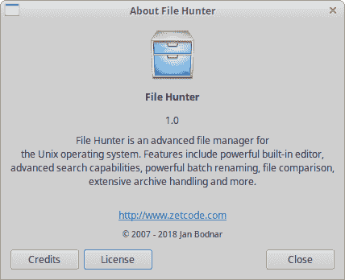
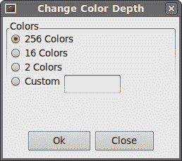

# wxPython 对话框

> 原文： [http://zetcode.com/wxpython/dialogs/](http://zetcode.com/wxpython/dialogs/)

对话框窗口或对话框是大多数现代 GUI 应用必不可少的部分。 对话被定义为两个或更多人之间的对话。 在计算机应用中，对话框是一个窗口，用于与应用“对话”。 对话框用于输入数据，修改数据，更改应用设置等。对话框是用户与计算机程序之间进行通信的重要手段。

## 一个简单的消息框

一个消息框向用户提供简短信息。 一个很好的例子是 CD 刻录应用。 CD 刻录完成后，将弹出一个消息框。

`message_box.py`

```py
#!/usr/bin/env python3
# -*- coding: utf-8 -*-

"""
ZetCode wxPython tutorial

This example shows a simple
message box.

author: Jan Bodnar
website: www.zetcode.com
last modified: April 2018
"""

import wx

class Example(wx.Frame):

    def __init__(self, *args, **kwargs):
        super(Example, self).__init__(*args, **kwargs)

        self.InitUI()

    def InitUI(self):

        wx.CallLater(3000, self.ShowMessage)

        self.SetSize((300, 200))
        self.SetTitle('Message box')
        self.Centre()

    def ShowMessage(self):
        wx.MessageBox('Download completed', 'Info',
            wx.OK | wx.ICON_INFORMATION)

def main():

    app = wx.App()
    ex = Example(None)
    ex.Show()
    app.MainLoop()

if __name__ == '__main__':
    main()

```

此示例显示三秒钟后的消息框。

```py
wx.CallLater(3000, self.ShowMessage)

```

`wx.CallLater`在三秒钟后调用一个方法。 第一个参数是时间值，之后将调用给定方法。 该参数以毫秒为单位。 第二个参数是要调用的方法。

```py
def ShowMessage(self):
    wx.MessageBox('Download completed', 'Info', 
        wx.OK | wx.ICON_INFORMATION)

```

`wx.MessageBox`显示一个小的对话框窗口。 我们提供了三个参数：文本消息，标题消息和标志。 这些标志用于显示不同的按钮和图标。 在本例中，我们显示一个确定按钮和信息图标。


Figure: A Message box

## 预定义对话框

wxPython 有几个预定义的对话框。 这些是用于常见编程任务的对话框，例如显示文本，接收输入，加载和保存文件。

## 消息对话框

消息对话框用于向用户显示消息。 它们比我们在前面的示例中看到的简单消息框更加灵活。 它们是可定制的。 我们可以更改将在对话框中显示的图标和按钮。

| 旗 | 含义 |
| --- | --- |
| 确定 | 显示确定按钮 |
| 取消 | 显示取消按钮 |
| wx.YES_NO | 显示是，否按钮 |
| wx.YES_DEFAULT | 将是按钮设为默认 |
| wx.NO_DEFAULT | 将无按钮设为默认 |
| wx.ICON_EXCLAMATION | 显示警报图标 |
| wx.ICON_ERROR | 显示错误图标 |
| wx.ICON_HAND | 与 wx.ICON_ERROR 相同 |
| wx.ICON_INFORMATION | 显示信息图标 |
| wx.ICON_QUESTION | 显示问题图标 |

这些是可以与`wx.MessageDialog`类一起使用的标志。

`message_dialogs.py`

```py
#!/usr/bin/env python3
# -*- coding: utf-8 -*-

"""
ZetCode wxPython tutorial

This example shows four types of
message dialogs.

author: Jan Bodnar
website: www.zetcode.com
last modified: April 2018
"""

import wx

class Example(wx.Frame):

    def __init__(self, *args, **kwargs):
        super(Example, self).__init__(*args, **kwargs)

        self.InitUI()

    def InitUI(self):

        panel = wx.Panel(self)

        hbox = wx.BoxSizer()
        sizer = wx.GridSizer(2, 2, 2, 2)

        btn1 = wx.Button(panel, label='Info')
        btn2 = wx.Button(panel, label='Error')
        btn3 = wx.Button(panel, label='Question')
        btn4 = wx.Button(panel, label='Alert')

        sizer.AddMany([btn1, btn2, btn3, btn4])

        hbox.Add(sizer, 0, wx.ALL, 15)
        panel.SetSizer(hbox)

        btn1.Bind(wx.EVT_BUTTON, self.ShowMessage1)
        btn2.Bind(wx.EVT_BUTTON, self.ShowMessage2)
        btn3.Bind(wx.EVT_BUTTON, self.ShowMessage3)
        btn4.Bind(wx.EVT_BUTTON, self.ShowMessage4)

        self.SetSize((300, 200))
        self.SetTitle('Messages')
        self.Centre()

    def ShowMessage1(self, event):
        dial = wx.MessageDialog(None, 'Download completed', 'Info', wx.OK)
        dial.ShowModal()

    def ShowMessage2(self, event):
        dial = wx.MessageDialog(None, 'Error loading file', 'Error',
            wx.OK | wx.ICON_ERROR)
        dial.ShowModal()

    def ShowMessage3(self, event):
        dial = wx.MessageDialog(None, 'Are you sure to quit?', 'Question',
            wx.YES_NO | wx.NO_DEFAULT | wx.ICON_QUESTION)
        dial.ShowModal()

    def ShowMessage4(self, event):
        dial = wx.MessageDialog(None, 'Unallowed operation', 'Exclamation',
            wx.OK | wx.ICON_EXCLAMATION)
        dial.ShowModal()

def main():

    app = wx.App()
    ex = Example(None)
    ex.Show()
    app.MainLoop()

if __name__ == '__main__':
    main()

```

在我们的示例中，我们创建了四个按钮并将它们放入网格大小调整器中。 这些按钮将显示四个不同的对话框窗口。 我们通过指定不同的样式标志来创建它们。

```py
def ShowMessage2(self, event):
    dial = wx.MessageDialog(None, 'Error loading file', 'Error', 
        wx.OK | wx.ICON_ERROR)
    dial.ShowModal()

```

消息对话框的创建很简单。 通过将 None 作为父级，将对话框设置为顶级窗口。 这两个字符串提供了消息文本和对话框标题。 通过指定`wx.OK`和`wx.ICON_ERROR`标志，我们显示一个 OK 按钮和一个错误图标。 为了在屏幕上显示对话框，我们调用`ShowModal()`方法。

## 关于对话框

几乎每个应用都有一个典型的“关于”对话框。 通常将其放在“帮助”菜单中。 该对话框的目的是向用户提供有关应用名称和版本的基本信息。 过去，这些对话框非常简短。 如今，这些框中的大多数都提供了有关作者的其他信息。 他们感谢其他程序员或文档编写者。 他们还提供有关应用许可证的信息。 这些框可以显示公司徽标或应用徽标。

为了创建一个 About 对话框，我们必须创建两个对象。 一个`wx.adv.AboutDialogInfo`和一个`wx.adv.AboutBox`。

wxPython 可以显示两种“关于”框。 这取决于我们使用的平台和调用的方法。 它可以是本机对话框，也可以是 wxPython 通用对话框。 Windows 本机“关于”对话框无法显示自定义图标，许可证文本或 URL。 如果我们省略这三个字段，则 wxPython 将显示一个本机对话框。 否则，它将诉诸通用。 如果我们想保持本地化，建议在单独的菜单项中提供许可证信息。 GTK+ 可以显示所有这些字段。

`about_dialog.py`

```py
#!/usr/bin/env python3
# -*- coding: utf-8 -*-

'''
ZetCode wxPython tutorial

In this example, we create an
about dialog box.

author: Jan Bodnar
website: www.zetcode.com
last modified: April 2018
'''

import wx
import wx.adv

class Example(wx.Frame):

    def __init__(self, *args, **kwargs):
        super(Example, self).__init__(*args, **kwargs)

        self.InitUI()

    def InitUI(self):

        menubar = wx.MenuBar()
        help = wx.Menu()
        help.Append(wx.ID_ANY, '&About')
        help.Bind(wx.EVT_MENU, self.OnAboutBox)

        menubar.Append(help, '&Help')
        self.SetMenuBar(menubar)

        self.SetSize((350, 250))
        self.SetTitle('About dialog box')
        self.Centre()

    def OnAboutBox(self, e):

        description = """File Hunter is an advanced file manager for
the Unix operating system. Features include powerful built-in editor,
advanced search capabilities, powerful batch renaming, file comparison,
extensive archive handling and more.
"""

        licence = """File Hunter is free software; you can redistribute
it and/or modify it under the terms of the GNU General Public License as
published by the Free Software Foundation; either version 2 of the License,
or (at your option) any later version.

File Hunter is distributed in the hope that it will be useful,
but WITHOUT ANY WARRANTY; without even the implied warranty of
MERCHANTABILITY or FITNESS FOR A PARTICULAR PURPOSE.
See the GNU General Public License for more details. You should have
received a copy of the GNU General Public License along with File Hunter;
if not, write to the Free Software Foundation, Inc., 59 Temple Place,
Suite 330, Boston, MA  02111-1307  USA"""

        info = wx.adv.AboutDialogInfo()

        info.SetIcon(wx.Icon('hunter.png', wx.BITMAP_TYPE_PNG))
        info.SetName('File Hunter')
        info.SetVersion('1.0')
        info.SetDescription(description)
        info.SetCopyright('(C) 2007 - 2019 Jan Bodnar')
        info.SetWebSite('http://www.zetcode.com')
        info.SetLicence(licence)
        info.AddDeveloper('Jan Bodnar')
        info.AddDocWriter('Jan Bodnar')
        info.AddArtist('The Tango crew')
        info.AddTranslator('Jan Bodnar')

        wx.adv.AboutBox(info)

def main():

    app = wx.App()
    ex = Example(None)
    ex.Show()
    app.MainLoop()

if __name__ == '__main__':
    main()

```

该示例有一个关于菜单项。 选择项目后，将显示关于框。

```py
        description = """File Hunter is an advanced file manager for 
the Unix operating system. Features include powerful built-in editor, 
advanced search capabilities, powerful batch renaming, file comparison, 
extensive archive handling and more.
"""

```

最好不要在应用的代码中放入太多文本。 我们不想使示例过于复杂，因此我们将所有文本放入代码中。 但是在实际程序中，文本应单独放置在文件中。 它有助于我们维护应用。 例如，如果我们想将我们的应用翻译成其他语言。

```py
info = wx.adv.AboutDialogInfo()

```

首先要做的是创建一个`wx.AboutDialogInfo`对象。 构造函数为空。 它不接受任何参数。

```py
info.SetIcon(wx.Icon('hunter.png', wx.BITMAP_TYPE_PNG))
info.SetName('File Hunter')
info.SetVersion('1.0')
info.SetDescription(description)
info.SetCopyright('(C) 2007 - 2014 Jan Bodnar')
info.SetWebSite('http://www.zetcode.com')
info.SetLicence(licence)
info.AddDeveloper('Jan Bodnar')
info.AddDocWriter('Jan Bodnar')
info.AddArtist('The Tango crew')
info.AddTranslator('Jan Bodnar')

```

下一步是在创建的`wx.AboutDialogInfo`对象上调用所有必需的方法。

```py
wx.adv.AboutBox(info)

```

最后，我们创建一个`wx.adv.AboutBox`小部件。 它唯一需要的参数是`wx.adv.AboutDialogInfo`对象。



Figure: About dialog box

## 自定义对话框

在下一个示例中，我们创建一个自定义对话框。 图像编辑应用可以更改图片的颜色深度。 为了提供这种功能，我们可以创建一个合适的对话框。

`custom_dialog.py`

```py
#!/usr/bin/env python3
# -*- coding: utf-8 -*-

'''
ZetCode wxPython tutorial

In this code example, we create a
custom dialog.

author: Jan Bodnar
website: www.zetcode.com
last modified: April 2018
'''

import wx

class ChangeDepthDialog(wx.Dialog):

    def __init__(self, *args, **kw):
        super(ChangeDepthDialog, self).__init__(*args, **kw)

        self.InitUI()
        self.SetSize((250, 200))
        self.SetTitle("Change Color Depth")

    def InitUI(self):

        pnl = wx.Panel(self)
        vbox = wx.BoxSizer(wx.VERTICAL)

        sb = wx.StaticBox(pnl, label='Colors')
        sbs = wx.StaticBoxSizer(sb, orient=wx.VERTICAL)
        sbs.Add(wx.RadioButton(pnl, label='256 Colors',
            style=wx.RB_GROUP))
        sbs.Add(wx.RadioButton(pnl, label='16 Colors'))
        sbs.Add(wx.RadioButton(pnl, label='2 Colors'))

        hbox1 = wx.BoxSizer(wx.HORIZONTAL)
        hbox1.Add(wx.RadioButton(pnl, label='Custom'))
        hbox1.Add(wx.TextCtrl(pnl), flag=wx.LEFT, border=5)
        sbs.Add(hbox1)

        pnl.SetSizer(sbs)

        hbox2 = wx.BoxSizer(wx.HORIZONTAL)
        okButton = wx.Button(self, label='Ok')
        closeButton = wx.Button(self, label='Close')
        hbox2.Add(okButton)
        hbox2.Add(closeButton, flag=wx.LEFT, border=5)

        vbox.Add(pnl, proportion=1,
            flag=wx.ALL|wx.EXPAND, border=5)
        vbox.Add(hbox2, flag=wx.ALIGN_CENTER|wx.TOP|wx.BOTTOM, border=10)

        self.SetSizer(vbox)

        okButton.Bind(wx.EVT_BUTTON, self.OnClose)
        closeButton.Bind(wx.EVT_BUTTON, self.OnClose)

    def OnClose(self, e):

        self.Destroy()

class Example(wx.Frame):

    def __init__(self, *args, **kw):
        super(Example, self).__init__(*args, **kw)

        self.InitUI()

    def InitUI(self):

        tb = self.CreateToolBar()
        tb.AddTool(toolId=wx.ID_ANY, label='', bitmap=wx.Bitmap('color.png'))

        tb.Realize()

        tb.Bind(wx.EVT_TOOL, self.OnChangeDepth)

        self.SetSize((350, 250))
        self.SetTitle('Custom dialog')
        self.Centre()

    def OnChangeDepth(self, e):

        cdDialog = ChangeDepthDialog(None,
            title='Change Color Depth')
        cdDialog.ShowModal()
        cdDialog.Destroy()

def main():

    app = wx.App()
    ex = Example(None)
    ex.Show()
    app.MainLoop()

if __name__ == '__main__':
    main()

```

在上面的示例中，我们创建了一个自定义对话框。

```py
class ChangeDepthDialog(wx.Dialog):

    def __init__(self, *args, **kw):
        super(ChangeDepthDialog, self).__init__(*args, **kw) 

```

在我们的代码示例中，我们创建了一个自定义的 ChangeDepthDialog 对话框。 我们继承自`wx.Dialog`小部件。

```py
def OnChangeDepth(self, e):

    cdDialog = ChangeDepthDialog(None,
        title='Change Color Depth')
    cdDialog.ShowModal()
    cdDialog.Destroy()

```

我们实例化一个`ChangeDepthDialog class`。 然后我们调用`ShowModal()`方法。 稍后，我们必须使用`Destroy()`销毁对话框。请注意，对话框和顶层窗口之间的视觉差异。 下图的对话框已激活。 在对话框被销毁之前，我们无法使用顶层窗口。 窗口的标题栏有明显的区别。



Figure: A custom dialog

在本章中，我们介绍了对话框。