# 小部件

> 原文： [http://zetcode.com/wxpython/widgets/](http://zetcode.com/wxpython/widgets/)

在本节中，我们将介绍 wxPython 中的基本小部件。 每个小部件都有一个小的代码示例。 小部件是应用程序的基本构建块。 wxPythont 有各种各样的小部件，包括按钮，复选框，滑块和列表框。


*   [wx.Button](#button)
*   [wx.ToggleButton](#togglebutton)
*   [wx.StaticText](#statictext)
*   [wx.StaticLine](#staticline)
*   [wx.StaticBox](#staticbox)
*   [wx.ComboBox](#combobox)
*   [wx.CheckBox](#checkbox)
*   [wx.StatusBar](#statusbar)
*   [wx.RadioButton](#radiobutton)
*   [wx.Gauge](#gauge)
*   [wx.Slider](#slider)
*   [wx.SpinCtrl](#spinctrl)


## 按钮

`wx.Button`是一个简单的小部件。 它包含一个文本字符串。 用于触发动作。

`button_wid.py`

```
#!/usr/bin/env python3
# -*- coding: utf-8 -*-

"""
ZetCode wxPython tutorial

In this code example, we create a
button widget.

author: Jan Bodnar
website: www.zetcode.com
last modified: April 2018
"""

import wx

class Example(wx.Frame):

    def __init__(self, *args, **kw):
        super(Example, self).__init__(*args, **kw)

        self.InitUI()

    def InitUI(self):

        pnl = wx.Panel(self)
        closeButton = wx.Button(pnl, label='Close', pos=(20, 20))

        closeButton.Bind(wx.EVT_BUTTON, self.OnClose)

        self.SetSize((350, 250))
        self.SetTitle('wx.Button')
        self.Centre()

    def OnClose(self, e):

        self.Close(True)

def main():

    app = wx.App()
    ex = Example(None)
    ex.Show()
    app.MainLoop()

if __name__ == '__main__':
    main()  

```

在代码示例中，我们创建一个“关闭”按钮，当按下该按钮时，它将终止应用程序。

```
cbtn = wx.Button(pnl, label='Close', pos=(20, 20))

```

`wx.Button`小部件已创建。 在小部件的构造函数中，我们提供按钮的标签和面板上的位置。

```
cbtn.Bind(wx.EVT_BUTTON, self.OnClose)

```

当我们单击按钮时，将触发`wx.EVT_BUTTON`事件。 我们为事件指定事件处理程序。

```
def OnClose(self, e):

    self.Close(True)   

```

在`OnClose()`方法中，我们使用`Close()`方法终止应用程序。

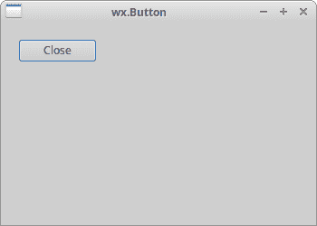

Figure: wx.Button

## wx.ToggleButton

`wx.ToggleButton`是具有两种状态的按钮：已按下和未按下。 通过单击可以在这两种状态之间切换。 在某些情况下此功能非常合适。

`toggle_buttons.py`

```
#!/usr/bin/env python3
# -*- coding: utf-8 -*-

"""
ZetCode wxPython tutorial

In this code example, we create three
toggle button widgets.

author: Jan Bodnar
website: www.zetcode.com
last modified: April 2018
"""

import wx

class Example(wx.Frame):

    def __init__(self, *args, **kw):
        super(Example, self).__init__(*args, **kw)

        self.InitUI()

    def InitUI(self):

        pnl = wx.Panel(self)

        self.col = wx.Colour(0, 0, 0)

        rtb = wx.ToggleButton(pnl, label='red', pos=(20, 25))
        gtb = wx.ToggleButton(pnl, label='green', pos=(20, 60))
        btb = wx.ToggleButton(pnl, label='blue', pos=(20, 100))

        self.cpnl  = wx.Panel(pnl, pos=(150, 20), size=(110, 110))
        self.cpnl.SetBackgroundColour(self.col)

        rtb.Bind(wx.EVT_TOGGLEBUTTON, self.ToggleRed)
        gtb.Bind(wx.EVT_TOGGLEBUTTON, self.ToggleGreen)
        btb.Bind(wx.EVT_TOGGLEBUTTON, self.ToggleBlue)

        self.SetSize((350, 250))
        self.SetTitle('Toggle buttons')
        self.Centre()

    def ToggleRed(self, e):

        obj = e.GetEventObject()
        isPressed = obj.GetValue()

        green = self.col.Green()
        blue = self.col.Blue()

        if isPressed:
            self.col.Set(255, green, blue)
        else:
            self.col.Set(0, green, blue)

        self.cpnl.SetBackgroundColour(self.col)
        self.cpnl.Refresh()

    def ToggleGreen(self, e):

        obj = e.GetEventObject()
        isPressed = obj.GetValue()

        red = self.col.Red()
        blue = self.col.Blue()

        if isPressed:
            self.col.Set(red, 255, blue)
        else:
            self.col.Set(red, 0, blue)

        self.cpnl.SetBackgroundColour(self.col)
        self.cpnl.Refresh()

    def ToggleBlue(self, e):

        obj = e.GetEventObject()
        isPressed = obj.GetValue()

        red = self.col.Red()
        green = self.col.Green()

        if isPressed:
            self.col.Set(red, green, 255)
        else:
            self.col.Set(red, green, 0)

        self.cpnl.SetBackgroundColour(self.col)
        self.cpnl.Refresh()

def main():

    app = wx.App()
    ex = Example(None)
    ex.Show()
    app.MainLoop()

if __name__ == '__main__':
    main()

```

我们有红色，绿色和蓝色的切换按钮和一个面板。 我们通过单击切换按钮来更改面板的颜色。

```
rtb = wx.ToggleButton(pnl, label='red', pos=(20, 25)) 

```

`wx.ToggleButton`小部件已创建。

```
self.cpnl  = wx.Panel(pnl, pos=(150, 20), size=(110, 110))
self.cpnl.SetBackgroundColour(self.col) 

```

这是一个面板的颜色，我们将使用切换按钮对其进行修改。

```
rtb.Bind(wx.EVT_TOGGLEBUTTON, self.ToggleRed) 

```

当我们单击`rtb`切换按钮时，将调用`ToggleRed()`事件处理程序。

```
def ToggleRed(self, e):

    obj = e.GetEventObject()
    isPressed = obj.GetValue()

    green = self.col.Green()
    blue = self.col.Blue()

    if isPressed:
        self.col.Set(255, green, blue)
    else:
        self.col.Set(0, green, blue)

    self.cpnl.SetBackgroundColour(self.col)

```

在`ToggleRed()`方法中，我们对按下`rtb`按钮这一事实作出反应。 我们找出颜色部分并更新颜色面板的颜色。

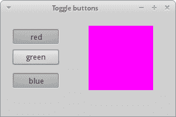

Figure: Toggle buttons

## wx.StaticText

wx.StaticText 小部件显示一行或多行只读文本。

`static_text.py`

```
#!/usr/bin/python
# -*- coding: utf-8 -*-

"""
ZetCode wxPython tutorial

In this code example, we create a static text.

author: Jan Bodnar
website: www.zetcode.com
last modified: April 2018
"""

import wx

class Example(wx.Frame):

    def __init__(self, *args, **kw):
        super(Example, self).__init__(*args, **kw)

        self.InitUI()

    def InitUI(self):

        txt1 = '''I'm giving up the ghost of love
in the shadows cast on devotion
She is the one that I adore
creed of my silent suffocation
Break this bittersweet spell on me
lost in the arms of destiny'''

        txt2 = '''There is something in the way
You're always somewhere else
Feelings have deserted me
To a point of no return
I don't believe in God
But I pray for you'''

        pnl = wx.Panel(self)
        vbox = wx.BoxSizer(wx.VERTICAL)

        font = wx.Font(13, wx.DEFAULT, wx.NORMAL, wx.DEFAULT)

        st1 = wx.StaticText(pnl, label=txt1, style=wx.ALIGN_LEFT)
        st2 = wx.StaticText(pnl, label=txt2, style=wx.ALIGN_LEFT)

        st1.SetFont(font)
        st2.SetFont(font)

        vbox.Add(st1, flag=wx.ALL, border=15)
        vbox.Add(st2, flag=wx.ALL, border=15)

        pnl.SetSizer(vbox)

        self.SetTitle('Bittersweet')
        self.Centre()

def main():

    app = wx.App()
    ex = Example(None)
    ex.Show()
    app.MainLoop()

if __name__ == '__main__':
    main()

```

在示例中，我们使用`wx.StaticText`小部件显示了两首 Bittersweet 歌曲的节奏。

```
font = wx.Font(13, wx.DEFAULT, wx.NORMAL, wx.DEFAULT)

```

我们为文本创建一个字体对象。

```
        txt1 = '''I'm giving up the ghost of love
in the shadows cast on devotion
She is the one that I adore
creed of my silent suffocation
Break this bittersweet spell on me
lost in the arms of destiny'''

```

这是要在`wx.StaticText`小部件中显示的字符串。

```
st1 = wx.StaticText(pnl, label=txt1, style=wx.ALIGN_LEFT)

```

我们创建`wx.StaticText`小部件。 文本将向左对齐。

```
st1.SetFont(font)
st2.SetFont(font)

```

我们使用`SetFont()`将字体设置为静态文本小部件。

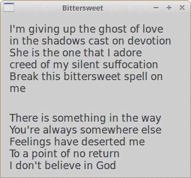

Figure: wx.StaticText

## wx.StaticLine

此小部件在窗口上显示一条简单的线。 它可以是水平或垂直的。

`static_line.py`

```
#!/usr/bin/env python3
# -*- coding: utf-8 -*-

"""
ZetCode wxPython tutorial

In this code example, we create a static line.

author: Jan Bodnar
website: www.zetcode.com
last modified: April 2018
"""

import wx

class Example(wx.Frame):

    def __init__(self, *args, **kw):
        super(Example, self).__init__(*args, **kw)

        self.InitUI()

    def InitUI(self):

        pnl = wx.Panel(self)

        font = wx.Font(10, wx.DEFAULT, wx.NORMAL, wx.BOLD)
        heading = wx.StaticText(self, label='The Central Europe',
                                pos=(25, 15), size=(200, -1))
        heading.SetFont(font)

        wx.StaticLine(self, pos=(25, 50), size=(300,1))

        wx.StaticText(self, label='Slovakia', pos=(25, 80))
        wx.StaticText(self, label='Hungary', pos=(25, 100))
        wx.StaticText(self, label='Poland', pos=(25, 120))
        wx.StaticText(self, label='Czech Republic', pos=(25, 140))
        wx.StaticText(self, label='Germany', pos=(25, 160))
        wx.StaticText(self, label='Slovenia', pos=(25, 180))
        wx.StaticText(self, label='Austria', pos=(25, 200))
        wx.StaticText(self, label='Switzerland', pos=(25, 220))

        wx.StaticText(self, label='5 445 000', pos=(250, 80))
        wx.StaticText(self, label='10 014 000', pos=(250, 100))
        wx.StaticText(self, label='38 186 000', pos=(250, 120))
        wx.StaticText(self, label='10 562 000', pos=(250, 140))
        wx.StaticText(self, label='81 799 000', pos=(250, 160))
        wx.StaticText(self, label='2 050 000', pos=(250, 180))
        wx.StaticText(self, label='8 414 000', pos=(250, 200))
        wx.StaticText(self, label='7 866 000', pos=(250, 220))

        wx.StaticLine(self, pos=(25, 260), size=(300,1))

        tsum = wx.StaticText(self, label='164 336 000', pos=(240, 280))
        sum_font = tsum.GetFont()
        sum_font.SetWeight(wx.BOLD)
        tsum.SetFont(sum_font)

        btn = wx.Button(self, label='Close', pos=(140, 310))

        btn.Bind(wx.EVT_BUTTON, self.OnClose)

        self.SetSize((360, 380))
        self.SetTitle('wx.StaticLine')
        self.Centre()

    def OnClose(self, e):

        self.Close(True)

def main():

    app = wx.App()
    ex = Example(None)
    ex.Show()
    app.MainLoop()

if __name__ == '__main__':
    main()

```

该脚本显示了中欧国家及其人口。 `wx.StatLine`使它看起来更具视觉吸引力。

```
wx.StaticLine(self, pos=(25, 50), size=(300,1))

```

这是`wx.StaticLine`的构造函数

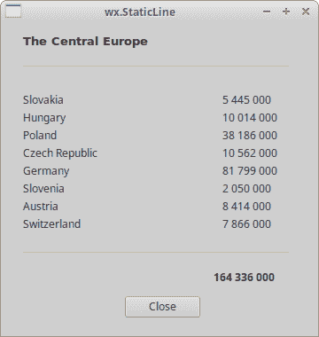

Figure: wx.StaticLine

## wx.StaticBox

这是一种装饰器小部件。 它用于对各种小部件进行逻辑分组。 请注意，必须在其包含的窗口小部件之前创建此窗口小部件，并且这些窗口小部件应该是静态框的同级，而不是子级。

```
#!/usr/bin/python
# -*- coding: utf-8 -*-

import wx

class Example(wx.Frame):

    def __init__(self, *args, **kw):
        super(Example, self).__init__(*args, **kw) 

        self.InitUI()

    def InitUI(self):   

        pnl = wx.Panel(self)

        wx.StaticBox(pnl, label='Personal Info', pos=(5, 5), size=(240, 170))
        wx.CheckBox(pnl, label='Male', pos=(15, 30))
        wx.CheckBox(pnl, label='Married', pos=(15, 55))
        wx.StaticText(pnl, label='Age', pos=(15, 95))
        wx.SpinCtrl(pnl, value='1', pos=(55, 90), size=(60, -1), min=1, max=120)

        btn = wx.Button(pnl, label='Ok', pos=(90, 185), size=(60, -1))

        btn.Bind(wx.EVT_BUTTON, self.OnClose)

        self.SetSize((270, 250))
        self.SetTitle('Static box')
        self.Centre()
        self.Show(True)          

    def OnClose(self, e):

        self.Close(True)    

def main():

    ex = wx.App()
    Example(None)
    ex.MainLoop()    

if __name__ == '__main__':
    main()   

```

我们有一个`wx.StaticBox`来装饰其他四个小部件。

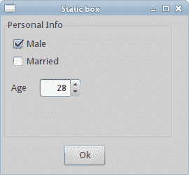

Figure: Static box

## wx.ComboBox

`wx.ComboBox`是单行文本字段，带有向下箭头图像的按钮和列表框的组合。 当您按下按钮时，将出现一个列表框。 用户只能从提供的字符串列表中选择一个选项。

```
#!/usr/bin/python
# -*- coding: utf-8 -*-

import wx

class Example(wx.Frame):

    def __init__(self, *args, **kw):
        super(Example, self).__init__(*args, **kw) 

        self.InitUI()

    def InitUI(self):   

        pnl = wx.Panel(self)

        distros = ['Ubuntu', 'Arch', 'Fedora', 'Debian', 'Mint']
        cb = wx.ComboBox(pnl, pos=(50, 30), choices=distros, 
            style=wx.CB_READONLY)

        self.st = wx.StaticText(pnl, label='', pos=(50, 140))
        cb.Bind(wx.EVT_COMBOBOX, self.OnSelect)

        self.SetSize((250, 230))
        self.SetTitle('wx.ComboBox')
        self.Centre()
        self.Show(True)          

    def OnSelect(self, e):

        i = e.GetString()
        self.st.SetLabel(i)

def main():

    ex = wx.App()
    Example(None)
    ex.MainLoop()    

if __name__ == '__main__':
    main()   

```

从组合框中选择的选项显示在下面的标签中。

```
distros = ['Ubuntu', 'Arch', 'Fedora', 'Debian', 'Mint']

```

组合框将包含此字符串列表。

```
cb = wx.ComboBox(pnl, pos=(50, 30), choices=distros, 
            style=wx.CB_READONLY)

```

`wx.ComboBox`小部件已创建。 choices 参数采用要在组合框显示的字符串列表。 `wx.CB_READONLY`样式使列表的字符串为只读。

```
cb.Bind(wx.EVT_COMBOBOX, self.OnSelect)

```

当我们从组合框中选择一个选项时，将触发`wx.EVT_COMBOBOX`事件。 我们将`OnSelect()`事件处理程序插入此事件。

```
def OnSelect(self, e):

    i = e.GetString()
    self.st.SetLabel(i)

```

我们从组合框中获取选定的项目并将其设置为标签。

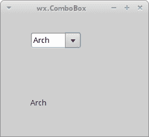

Figure: wx.ComboBox

## wx.CheckBox

`wx.CheckBox`是具有两种状态的窗口小部件：开和关。 这是一个带有标签的盒子。 标签可以设置在框的右侧或左侧。 如果选中`wx.CheckBox`，则在方框中用勾号表示。

`checkbox.py`

```
#!/usr/bin/env python3
# -*- coding: utf-8 -*-

"""
ZetCode wxPython tutorial

In this example we create a checkbox widget.

author: Jan Bodnar
website: www.zetcode.com
last modified: April 2018
"""

import wx

class Example(wx.Frame):

    def __init__(self, *args, **kw):
        super(Example, self).__init__(*args, **kw)

        self.InitUI()

    def InitUI(self):

        pnl = wx.Panel(self)

        vbox = wx.BoxSizer(wx.HORIZONTAL)

        cb = wx.CheckBox(pnl, label='Show title')
        cb.SetValue(True)
        cb.Bind(wx.EVT_CHECKBOX, self.ShowOrHideTitle)

        vbox.Add(cb, flag=wx.TOP|wx.LEFT, border=30)

        pnl.SetSizer(vbox)

        self.SetTitle('wx.CheckBox')
        self.Centre()

    def ShowOrHideTitle(self, e):

        sender = e.GetEventObject()
        isChecked = sender.GetValue()

        if isChecked:
            self.SetTitle('wx.CheckBox')
        else:
            self.SetTitle('')

def main():

    app = wx.App()
    ex = Example(None)
    ex.Show()
    app.MainLoop()

if __name__ == '__main__':
    main()

```

在上面的示例中，我们使用`wx.CheckBox`小部件显示或隐藏窗口标题。

```
cb = wx.CheckBox(pnl, label='Show title')

```

这是`wx.CheckBox`小部件的构造函数。

```
cb.SetValue(True)

```

默认情况下显示框架窗口的标题，因此我们使用`SetValue()`方法检查`wx.CheckBox`小部件。

```
cb.Bind(wx.EVT_CHECKBOX, self.ShowOrHideTitle)

```

当我们单击`wx.CheckBox`小部件时，将触发`wx.EVT_CHECKBOX`事件。 在此事件上调用`ShowOrHideTitle()`事件处理程序。

```
def ShowOrHideTitle(self, e):

    sender = e.GetEventObject()
    isChecked = sender.GetValue()

    if isChecked:
        self.SetTitle('wx.CheckBox')            
    else: 
        self.SetTitle('')   

```

在`ShowOrHideTitle()`方法中，我们根据`wx.CheckBox`小部件的状态显示或隐藏标题。

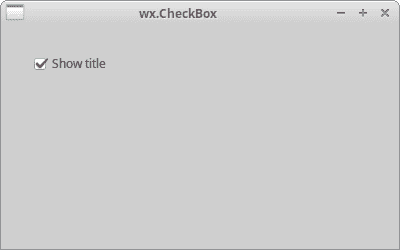

Figure: wx.CheckBox

## wx.StatusBar

`wx.StatusBar`小部件用于显示应用程序状态信息。 它可以分为几个部分以显示不同类型的信息。 我们可以在`wx.StatusBar`中插入其他小部件。 它可以用作对话框的替代方法，因为对话框经常被滥用，并且大多数用户不喜欢它们。 我们可以通过两种方式创建`wx.StatusBar`。 我们可以手动创建自己的`wx.StatusBar`并调用`SetStatusBar()`方法，也可以简单地调用 CreateStatusBar（）方法。 后一种方法为我们创建了默认的`wx.StatusBar`。

```
#!/usr/bin/python
# -*- coding: utf-8 -*-

import wx

class Example(wx.Frame):

    def __init__(self, *args, **kw):
        super(Example, self).__init__(*args, **kw) 

        self.InitUI()

    def InitUI(self):   

        pnl = wx.Panel(self)

        button = wx.Button(pnl, label='Button', pos=(20, 20))
        text = wx.CheckBox(pnl, label='CheckBox', pos=(20, 90))
        combo = wx.ComboBox(pnl, pos=(120, 22), choices=['Python', 'Ruby'])
        slider = wx.Slider(pnl, 5, 6, 1, 10, (120, 90), (110, -1))        

        pnl.Bind(wx.EVT_ENTER_WINDOW, self.OnWidgetEnter)
        button.Bind(wx.EVT_ENTER_WINDOW, self.OnWidgetEnter)
        text.Bind(wx.EVT_ENTER_WINDOW, self.OnWidgetEnter)
        combo.Bind(wx.EVT_ENTER_WINDOW, self.OnWidgetEnter)
        slider.Bind(wx.EVT_ENTER_WINDOW, self.OnWidgetEnter)

        self.sb = self.CreateStatusBar()

        self.SetSize((250, 230))
        self.SetTitle('wx.Statusbar')
        self.Centre()
        self.Show(True)     

    def OnWidgetEnter(self, e):

        name = e.GetEventObject().GetClassName()
        self.sb.SetStatusText(name + ' widget')
        e.Skip()               

def main():

    ex = wx.App()
    Example(None)
    ex.MainLoop()    

if __name__ == '__main__':
    main()   

```

在我们的示例中，我们有一个`wx.Frame`小部件以及其他五个小部件。 如果将鼠标指针悬停在窗口小部件上，则其名称将显示在`wx.StatusBar`中。

```
pnl.Bind(wx.EVT_ENTER_WINDOW, self.OnWidgetEnter)

```

如果我们输入小部件的区域，则会生成`EVT_ENTER_WINDOW`事件。

```
self.sb = self.CreateStatusBar()

```

使用`CreateStatusBar()`方法创建状态栏。

```
def OnWidgetEnter(self, e):

    name = e.GetEventObject().GetClassName()
    self.sb.SetStatusText(name + ' widget')
    e.Skip()  

```

在`OnWidgetEnter()`方法内部，我们找出使用鼠标指针输入的小部件的名称。 我们使用`SetStatusText()`方法设置状态文本。

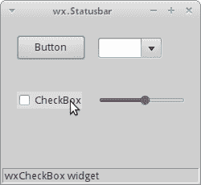

Figure: wx.StatusBar

## wx.RadioButton

`wx.RadioButton`是一个小部件，允许用户从一组选项中选择一个唯一选项。 通过使组中的第一个单选按钮包含`wx.RB_GROUP`样式来定义单选按钮组。 在第一个带有此样式标记的单选按钮之后定义的所有其他单选按钮将添加到第一个单选按钮的功能组中。 用`wx.RB_GROUP`标志声明另一个单选按钮将启动一个新的单选按钮组。

```
#!/usr/bin/python
# -*- coding: utf-8 -*-

import wx

class Example(wx.Frame):

    def __init__(self, *args, **kw):
        super(Example, self).__init__(*args, **kw) 

        self.InitUI()

    def InitUI(self):   

        pnl = wx.Panel(self)

        self.rb1 = wx.RadioButton(pnl, label='Value A', pos=(10, 10), 
            style=wx.RB_GROUP)
        self.rb2 = wx.RadioButton(pnl, label='Value B', pos=(10, 30))
        self.rb3 = wx.RadioButton(pnl, label='Value C', pos=(10, 50))

        self.rb1.Bind(wx.EVT_RADIOBUTTON, self.SetVal)
        self.rb2.Bind(wx.EVT_RADIOBUTTON, self.SetVal)
        self.rb3.Bind(wx.EVT_RADIOBUTTON, self.SetVal)

        self.sb = self.CreateStatusBar(3)

        self.sb.SetStatusText("True", 0)
        self.sb.SetStatusText("False", 1)
        self.sb.SetStatusText("False", 2)   

        self.SetSize((210, 210))
        self.SetTitle('wx.RadioButton')
        self.Centre()
        self.Show(True)     

    def SetVal(self, e):

        state1 = str(self.rb1.GetValue())
        state2 = str(self.rb2.GetValue())
        state3 = str(self.rb3.GetValue())

        self.sb.SetStatusText(state1, 0)
        self.sb.SetStatusText(state2, 1)
        self.sb.SetStatusText(state3, 2)            

def main():

    ex = wx.App()
    Example(None)
    ex.MainLoop()    

if __name__ == '__main__':
    main()   

```

我们有一组三个单选按钮。 每个单选按钮的状态显示在状态栏中。

```
self.rb1 = wx.RadioButton(pnl, label='Value A', pos=(10, 10), 
    style=wx.RB_GROUP)
self.rb2 = wx.RadioButton(pnl, label='Value B', pos=(10, 30))
self.rb3 = wx.RadioButton(pnl, label='Value C', pos=(10, 50))

```

我们创建三个单选按钮。 第一个单选按钮设置为`wx.RB_GROUP`样式。 它将启动一个新的广播组。

```
self.rb1.Bind(wx.EVT_RADIOBUTTON, self.SetVal)

```

我们将`wx.EVT_RADIOBUTTON`事件绑定到`SetVal()`事件处理程序。

```
self.sb = self.CreateStatusBar(3)

self.sb.SetStatusText("True", 0)
self.sb.SetStatusText("False", 1)
self.sb.SetStatusText("False", 2) 

```

我们创建一个带有三个字段的状态栏。 我们将初始文本设置为与单选按钮状态相对应的状态栏。

```
def SetVal(self, e):

    state1 = str(self.rb1.GetValue())
    state2 = str(self.rb2.GetValue())
    state3 = str(self.rb3.GetValue())

    self.sb.SetStatusText(state1, 0)
    self.sb.SetStatusText(state2, 1)
    self.sb.SetStatusText(state3, 2)  

```

在`SetVal()`方法内，我们找出单选按钮的状态。 我们将状态栏字段更新为当前的单选按钮值。

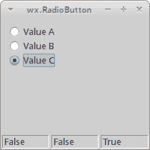

Figure: wx.RadioButton

## 量规

`wx.Gauge`是在处理冗长的任务时使用的小部件。 它具有一个指示器以显示任务的当前状态。

`gauge_wid.py`

```
#!/usr/bin/env python3
# -*- coding: utf-8 -*-

"""
ZetCode wxPython tutorial

In this example we create gauge widget.

author: Jan Bodnar
website: www.zetcode.com
last modified: April 2018
"""

import wx

TASK_RANGE = 50

class Example(wx.Frame):

    def __init__(self, *args, **kw):
        super(Example, self).__init__(*args, **kw)

        self.InitUI()

    def InitUI(self):

        self.timer = wx.Timer(self, 1)
        self.count = 0

        self.Bind(wx.EVT_TIMER, self.OnTimer, self.timer)

        pnl = wx.Panel(self)
        vbox = wx.BoxSizer(wx.VERTICAL)
        hbox1 = wx.BoxSizer(wx.HORIZONTAL)
        hbox2 = wx.BoxSizer(wx.HORIZONTAL)
        hbox3 = wx.BoxSizer(wx.HORIZONTAL)

        self.gauge = wx.Gauge(pnl, range=TASK_RANGE, size=(250, -1))
        self.btn1 = wx.Button(pnl, wx.ID_OK)
        self.btn2 = wx.Button(pnl, wx.ID_STOP)
        self.text = wx.StaticText(pnl, label='Task to be done')

        self.Bind(wx.EVT_BUTTON, self.OnOk, self.btn1)
        self.Bind(wx.EVT_BUTTON, self.OnStop, self.btn2)

        hbox1.Add(self.gauge, proportion=1, flag=wx.ALIGN_CENTRE)
        hbox2.Add(self.btn1, proportion=1, flag=wx.RIGHT, border=10)
        hbox2.Add(self.btn2, proportion=1)
        hbox3.Add(self.text, proportion=1)

        vbox.Add((0, 30))

        vbox.Add(hbox1, flag=wx.ALIGN_CENTRE)

        vbox.Add((0, 20))

        vbox.Add(hbox2, proportion=1, flag=wx.ALIGN_CENTRE)
        vbox.Add(hbox3, proportion=1, flag=wx.ALIGN_CENTRE)

        pnl.SetSizer(vbox)

        self.SetTitle('wx.Gauge')
        self.Centre()

    def OnOk(self, e):

        if self.count >= TASK_RANGE:
            return

        self.timer.Start(100)
        self.text.SetLabel('Task in Progress')

    def OnStop(self, e):

        if self.count == 0 or self.count >= TASK_RANGE or not self.timer.IsRunning():
            return

        self.timer.Stop()
        self.text.SetLabel('Task Interrupted')

    def OnTimer(self, e):

        self.count = self.count + 1
        self.gauge.SetValue(self.count)

        if self.count == TASK_RANGE:

            self.timer.Stop()
            self.text.SetLabel('Task Completed')

def main():

    app = wx.App()
    ex = Example(None)
    ex.Show()
    app.MainLoop()

if __name__ == '__main__':
    main()                

```

我们有一个压力表和两个按钮。 一个按钮启动压力表，另一按钮停止压力表。

```
self.timer = wx.Timer(self, 1)
self.count = 0

```

我们使用`wx.Timer`在特定间隔执行代码。 届时我们将更新量规。 count 变量用于确定已完成任务的一部分。

```
self.gauge = wx.Gauge(pnl, range=TASK_RANGE, size=(250, -1))

```

这是`wx.Gauge`小部件的构造函数。 range 参数设置窗口小部件的最大整数值。

```
def OnOk(self, e):

    if self.count >= TASK_RANGE:
        return

    self.timer.Start(100)
    self.text.SetLabel('Task in Progress')

```

当我们单击确定按钮时，将调用`OnOk()`方法。 我们首先检查 count 变量是否在任务范围内。 如果没有，我们从方法中返回。 如果任务尚未完成，我们将启动计时器并更新静态文本。

```
def OnStop(self, e):

    if self.count == 0 or self.count >= TASK_RANGE or not self.timer.IsRunning():
        return

    self.timer.Stop()
    self.text.SetLabel('Task Interrupted')

```

当我们单击停止按钮时，将调用`OnStop()`方法。 我们检查停止任务的条件。 如果遇到他们，我们将停止计时器并更新静态文本。

```
def OnTimer(self, e):

    self.count = self.count + 1
    self.gauge.SetValue(self.count)

    if self.count == TASK_RANGE:

        self.timer.Stop()
        self.text.SetLabel('Task Completed')

```

启动计时器后，会定期调用`OnTimer()`方法。 在该方法中，我们更新了 cout 变量和 gauge 控件。 如果 count 变量等于`TASK_RANGE`，我们将停止计时器并更新静态文本。

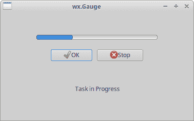

Figure: wx.Gauge

## 滑块

`wx.Slider`是具有简单句柄的小部件。 该手柄可以前后拉动。 这样，我们可以选择特定任务。

`slider_wid.py`

```
#!/usr/bin/env python3
# -*- coding: utf-8 -*-

"""
ZetCode wxPython tutorial

In this example we create slider control.

author: Jan Bodnar
website: www.zetcode.com
last modified: April 2018
"""

import wx

class Example(wx.Frame):

    def __init__(self, *args, **kw):
        super(Example, self).__init__(*args, **kw)

        self.InitUI()

    def InitUI(self):

        pnl = wx.Panel(self)

        sizer = wx.GridBagSizer(5, 5)

        sld = wx.Slider(pnl, value=200, minValue=150, maxValue=500,
                        style=wx.SL_HORIZONTAL)

        sld.Bind(wx.EVT_SCROLL, self.OnSliderScroll)
        sizer.Add(sld, pos=(0, 0), flag=wx.ALL|wx.EXPAND, border=25)

        self.txt = wx.StaticText(pnl, label='200')
        sizer.Add(self.txt, pos=(0, 1), flag=wx.TOP|wx.RIGHT, border=25)

        sizer.AddGrowableCol(0)
        pnl.SetSizer(sizer)

        self.SetTitle('wx.Slider')
        self.Centre()

    def OnSliderScroll(self, e):

        obj = e.GetEventObject()
        val = obj.GetValue()

        self.txt.SetLabel(str(val))

def main():

    app = wx.App()
    ex = Example(None)
    ex.Show()
    app.MainLoop()

if __name__ == '__main__':
    main()  

```

静态文本中显示了在滑块中选择的值。

```
sld = wx.Slider(pnl, value=200, minValue=150, maxValue=500,
                style=wx.SL_HORIZONTAL)

```

创建了`wx.Slider`。 我们使用值参数提供滑块的初始位置，并使用`minValue`和`maxValue`参数提供最小和最大滑块位置。 `wx.SL_HORIZONTAL`使滑块变为水平。

```
sld.Bind(wx.EVT_SCROLL, self.OnSliderScroll)

```

遇到`wx.EVT_SCROLL`事件时，将调用`OnSliderScroll()`方法。

```
self.txt = wx.StaticText(pnl, label='200')

```

当前选择的滑块值显示在静态文本中，该文本位于滑块下方。

```
def OnSliderScroll(self, e):

    obj = e.GetEventObject()
    val = obj.GetValue()

    self.txt.SetLabel(str(val)) 

```

在`OnSliderScroll()`方法中，我们获取事件的发送者。 我们获取滑块的当前值并将其设置为静态文本。

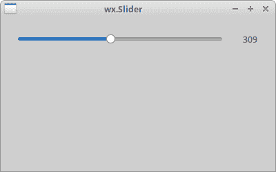

Figure: wx.Slider

## wx.SpinCtrl

`wx.SpinCtrl`小部件使我们可以增加和减少值。

`spin_ctrl.py`

```
#!/usr/bin/env python3
# -*- coding: utf-8 -*-

"""
ZetCode wxPython tutorial

In this example we create spin control.

author: Jan Bodnar
website: www.zetcode.com
last modified: April 2018
"""

import wx

class Example(wx.Frame):

    def __init__(self, *args, **kw):
        super(Example, self).__init__(*args, **kw)

        self.InitUI()

    def InitUI(self):

        pnl = wx.Panel(self)

        sizer = wx.GridBagSizer(5, 5)

        st1 = wx.StaticText(pnl, label='Convert Fahrenheit temperature to Celsius')
        sizer.Add(st1, pos=(0, 0), span=(1, 2), flag=wx.ALL, border=15)

        st2 = wx.StaticText(pnl, label='Fahrenheit:')
        sizer.Add(st2, pos=(1, 0), flag=wx.ALL | wx.ALIGN_CENTER, border=15)

        self.sc = wx.SpinCtrl(pnl, value='0')
        self.sc.SetRange(-459, 1000)

        sizer.Add(self.sc, pos=(1, 1), flag=wx.ALIGN_CENTER)

        st3 = wx.StaticText(pnl, label='Celsius:')
        sizer.Add(st3, pos=(2, 0), flag=wx.ALL|wx.ALIGN_RIGHT, border=15)

        self.celsius = wx.StaticText(pnl, label='')
        sizer.Add(self.celsius, pos=(2, 1), flag=wx.ALL, border=15)

        computeButton = wx.Button(pnl, label='Compute')
        computeButton.SetFocus()
        sizer.Add(computeButton, pos=(3, 0), flag=wx.ALIGN_RIGHT|wx.TOP, border=30)

        closeButton = wx.Button(pnl, label='Close')
        sizer.Add(closeButton, pos=(3, 1), flag=wx.ALIGN_LEFT|wx.TOP, border=30)

        computeButton.Bind(wx.EVT_BUTTON, self.OnCompute)
        closeButton.Bind(wx.EVT_BUTTON, self.OnClose)

        pnl.SetSizer(sizer)

        self.SetTitle('wx.SpinCtrl')
        self.Centre()

    def OnClose(self, e):

        self.Close(True)

    def OnCompute(self, e):

        fahr = self.sc.GetValue()
        cels = round((fahr - 32) * 5 / 9.0, 2)
        self.celsius.SetLabel(str(cels))

def main():

    app = wx.App()
    ex = Example(None)
    ex.Show()
    app.MainLoop()

if __name__ == '__main__':
    main()       

```

该脚本将华氏温度转换为摄氏温度。 我们使用`wx.SpinCtrl`小部件为华氏温度选择一个值。

```
self.sc = wx.SpinCtrl(pnl, value='0')
self.sc.SetRange(-459, 1000)

```

我们创建一个初始值为 0 的`wx.SpinCtrl`小部件。`SetRange()`设置该小部件的值范围。

```
def OnCompute(self, e):

    fahr = self.sc.GetValue()
    cels = round((fahr - 32) * 5 / 9.0, 2)
    self.celsius.SetLabel(str(cels)) 

```

当我们单击计算按钮时，将调用`OnCompute()`方法。 在方法的主体中，我们从旋转控件中获取当前值。 我们计算摄氏温度并将计算的温度设置为静态文本小部件。

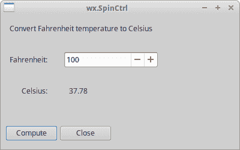

Figure: wx.SpinCtrl

wxPython 教程的这一部分专用于核心 wxPython 小部件。