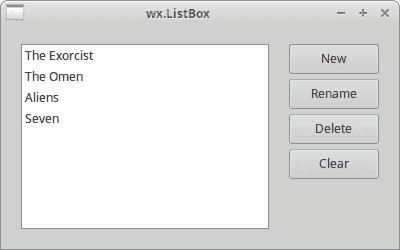
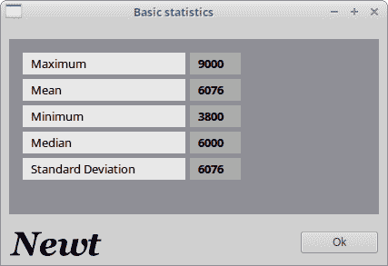
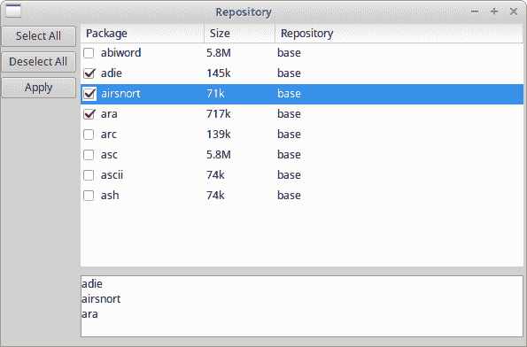

# wxPython 中的高级小部件

> 原文： [http://zetcode.com/wxpython/advanced/](http://zetcode.com/wxpython/advanced/)

在本章中，我们讨论以下高级小部件：`wx.ListBox`，`wx.html.HtmlWindow`和`wx.ListCtrl`。

wxPython 有几个众所周知的高级小部件。 例如，树小部件，HTML 窗口，网格小部件，列表框小部件，列表小部件或具有高级样式功能的编辑器。

## `wx.ListBox`小部件

`wx.ListBox`用于显示和使用项目列表。 可以在两种不同的状态下创建`wx.ListBox`：处于单选状态或多选状态。 单一选择状态是默认状态。

`wx.ListBox`中有两个重要事件。 第一个是`wx.EVT_COMMAND_LISTBOX_SELECTED`事件。 当我们在`wx.ListBox`中选择一个项目时，将生成此事件。 第二个事件是`wx.EVT_COMMAND_LISTBOX_DOUBLE_CLICKED`事件。 当我们双击`wx.ListBox`中的项目时会生成该文件。 元素从零开始编号。 如果需要，滚动条会自动显示。

`listbox.py`

```py
#!/usr/bin/env python3
# -*- coding: utf-8 -*-

"""
ZetCode wxPython tutorial

In this example, we create a wx.ListBox widget.

author: Jan Bodnar
website: www.zetcode.com
last modified: May 2018
"""

import wx

class Example(wx.Frame):

    def __init__(self, *args, **kw):
        super(Example, self).__init__(*args, **kw)

        self.InitUI()

    def InitUI(self):

        panel = wx.Panel(self)
        hbox = wx.BoxSizer(wx.HORIZONTAL)

        self.listbox = wx.ListBox(panel)
        hbox.Add(self.listbox, wx.ID_ANY, wx.EXPAND | wx.ALL, 20)

        btnPanel = wx.Panel(panel)
        vbox = wx.BoxSizer(wx.VERTICAL)
        newBtn = wx.Button(btnPanel, wx.ID_ANY, 'New', size=(90, 30))
        renBtn = wx.Button(btnPanel, wx.ID_ANY, 'Rename', size=(90, 30))
        delBtn = wx.Button(btnPanel, wx.ID_ANY, 'Delete', size=(90, 30))
        clrBtn = wx.Button(btnPanel, wx.ID_ANY, 'Clear', size=(90, 30))

        self.Bind(wx.EVT_BUTTON, self.NewItem, id=newBtn.GetId())
        self.Bind(wx.EVT_BUTTON, self.OnRename, id=renBtn.GetId())
        self.Bind(wx.EVT_BUTTON, self.OnDelete, id=delBtn.GetId())
        self.Bind(wx.EVT_BUTTON, self.OnClear, id=clrBtn.GetId())
        self.Bind(wx.EVT_LISTBOX_DCLICK, self.OnRename)

        vbox.Add((-1, 20))
        vbox.Add(newBtn)
        vbox.Add(renBtn, 0, wx.TOP, 5)
        vbox.Add(delBtn, 0, wx.TOP, 5)
        vbox.Add(clrBtn, 0, wx.TOP, 5)

        btnPanel.SetSizer(vbox)
        hbox.Add(btnPanel, 0.6, wx.EXPAND | wx.RIGHT, 20)
        panel.SetSizer(hbox)

        self.SetTitle('wx.ListBox')
        self.Centre()

    def NewItem(self, event):

        text = wx.GetTextFromUser('Enter a new item', 'Insert dialog')
        if text != '':
            self.listbox.Append(text)

    def OnRename(self, event):

        sel = self.listbox.GetSelection()
        text = self.listbox.GetString(sel)
        renamed = wx.GetTextFromUser('Rename item', 'Rename dialog', text)

        if renamed != '':
            self.listbox.Delete(sel)
            item_id = self.listbox.Insert(renamed, sel)
            self.listbox.SetSelection(item_id)

    def OnDelete(self, event):

        sel = self.listbox.GetSelection()
        if sel != -1:
            self.listbox.Delete(sel)

    def OnClear(self, event):
        self.listbox.Clear()

def main():

    app = wx.App()
    ex = Example(None)
    ex.Show()
    app.MainLoop()

if __name__ == '__main__':
    main()

```

该示例显示了如何从`wx.ListBox`添加，修改和删除项目。

```py
self.listbox = wx.ListBox(panel)
hbox.Add(self.listbox, wx.ID_ANY, wx.EXPAND | wx.ALL, 20)

```

我们创建一个空的`wx.ListBox`。 我们在列表框周围放置了 20px 的边框。

```py
self.Bind(wx.EVT_LISTBOX_DCLICK, self.OnRename)

```

我们使用`wx.EVT_LISTBOX_DCLICK`事件绑定器将`wx.EVT_COMMAND_LISTBOX_DOUBLE_CLICKED`事件类型与`OnRename()`方法绑定。 这样，如果我们双击列表框中的特定元素，我们将显示一个重命名对话框。

```py
def NewItem(self, event):

    text = wx.GetTextFromUser('Enter a new item', 'Insert dialog')
    if text != '':
        self.listbox.Append(text)        

```

我们通过单击“新建”按钮来调用`NewItem()`方法。 此方法使用包装器`wx.GetTextFromUser()`方法显示`wx.TextEntryDialog`。 我们输入的文本将返回到 text 变量。 如果文本不为空，则使用`Append()`方法将其附加到列表框。

```py
if renamed != '':
    self.listbox.Delete(sel)
    item_id = self.listbox.Insert(renamed, sel)
    self.listbox.SetSelection(item_id)      

```

我们通过删除项目并在同一位置插入新项目来重命名该项目。 我们还将选择重新设置为修改后的项目。

```py
def OnDelete(self, event):

    sel = self.listbox.GetSelection()
    if sel != -1:
        self.listbox.Delete(sel)

```

要删除项目，我们通过调用`GetSelection()`方法找到所选项目的索引。 然后，我们使用`Delete()`方法删除该项目。 `Delete()`方法的参数是所选索引。

```py
def OnClear(self, event):
    self.listbox.Clear()

```

最简单的方法是清除整个列表框。 我们只需调用`Clear()`方法。



Figure: wx.ListBox widget

## `wx.html.HtmlWindow`小部件

`wx.html.HtmlWindow`小部件显示 HTML 页面。 它不是完整的浏览器。 我们可以使用`wx.html.HtmlWindow`小部件来做一些有趣的事情。

例如，在下面的程序中，我们创建一个显示基本统计信息的窗口。

`page.html`

```py
<!DOCTYPE html>
<html>
<body bgcolor="#8e8e95">
  <table cellspacing="5" border="0" width="250">
    <tr width="200" align="left">
    <td bgcolor="#e7e7e7">&nbsp;&nbsp;Maximum</td>
    <td bgcolor="#aaaaaa">&nbsp;&nbsp;<b>9000</b></td>
    </tr>
    <tr align="left">
    <td bgcolor="#e7e7e7">&nbsp;&nbsp;Mean</td>
    <td bgcolor="#aaaaaa">&nbsp;&nbsp;<b>6076</b></td>
    </tr>
    <tr align="left">
    <td bgcolor="#e7e7e7">&nbsp;&nbsp;Minimum</td>
    <td bgcolor="#aaaaaa">&nbsp;&nbsp;<b>3800</b></td>
    </tr>
    <tr align="left">
    <td bgcolor="#e7e7e7">&nbsp;&nbsp;Median</td>
    <td bgcolor="#aaaaaa">&nbsp;&nbsp;<b>6000</b></td>
    </tr>
    <tr align="left">
    <td bgcolor="#e7e7e7">&nbsp;&nbsp;Standard Deviation</td>
    <td bgcolor="#aaaaaa">&nbsp;&nbsp;<b>6076</b></td>
    </tr>
  </table>
</body>
</html>

```

这是要显示的 HTML 页面。

`htmlwin.py`

```py
#!/usr/bin/env python3
# -*- coding: utf-8 -*-

"""
ZetCode wxPython tutorial

In this example, we create a wx.html.HtmlWindow widget.

author: Jan Bodnar
website: www.zetcode.com
last modified: May 2018
"""

import wx
import wx.html

class Example(wx.Frame):

    def __init__(self, *args, **kw):
        super(Example, self).__init__(*args, **kw)

        self.InitUI()

    def InitUI(self):

        panel = wx.Panel(self)

        vbox = wx.BoxSizer(wx.VERTICAL)
        hbox = wx.BoxSizer(wx.HORIZONTAL)

        htmlwin = wx.html.HtmlWindow(panel, wx.ID_ANY, style=wx.NO_BORDER)
        htmlwin.SetStandardFonts()
        htmlwin.LoadPage("page.html")

        vbox.Add((-1, 10), 0)
        vbox.Add(htmlwin, 1, wx.EXPAND | wx.ALL, 9)

        bitmap = wx.StaticBitmap(panel, wx.ID_ANY, wx.Bitmap('newt.png'))
        hbox.Add(bitmap, 0, wx.LEFT | wx.BOTTOM | wx.TOP, 10)
        btnOk = wx.Button(panel, wx.ID_ANY, 'Ok')

        self.Bind(wx.EVT_BUTTON, self.OnClose, id=btnOk.GetId())

        hbox.Add((100, -1), 1, wx.EXPAND | wx.ALIGN_RIGHT)
        hbox.Add(btnOk, flag=wx.TOP | wx.BOTTOM | wx.RIGHT, border=10)
        vbox.Add(hbox, 0, wx.EXPAND)

        panel.SetSizer(vbox)

        self.SetTitle('Basic statistics')
        self.Centre()

    def OnClose(self, event):
        self.Close()

def main():

    app = wx.App()
    ex = Example(None)
    ex.Show()
    app.MainLoop()

if __name__ == '__main__':
    main()

```

该示例在`wx.html.HtmlWindow`小部件中分配 HTML 文件。

```py
htmlwin = wx.html.HtmlWindow(panel, wx.ID_ANY, style=wx.NO_BORDER)
htmlwin.SetStandardFonts()
htmlwin.LoadPage("page.html")   

```

`wx.html.HtmlWindow`已创建。 HTML 文件使用`LoadPage()`方法加载。



Figure: wx.html.HtmlWindow example

## 帮助窗口

我们可以使用`wx.html.HtmlWindow`在我们的应用中提供帮助。 我们可以创建一个独立的窗口，也可以创建将成为应用一部分的窗口。 以下脚本将使用后一种想法创建一个帮助窗口。

`helpwindow.py`

```py
#!/usr/bin/env python3
# -*- coding: utf-8 -*-

"""
ZetCode wxPython tutorial

In this example, we create a help window window
with wx.html.HtmlWindow.

author: Jan Bodnar
website: www.zetcode.com
last modified: May 2018
"""

import wx
import wx.html as html

class Example(wx.Frame):

    def __init__(self, *args, **kw):
        super(Example, self).__init__(*args, **kw)

        self.InitUI()

    def InitUI(self):

        toolbar = self.CreateToolBar()
        toolbar.AddTool(1, 'Exit', wx.Bitmap('exit.png'))
        toolbar.AddTool(2, 'Help', wx.Bitmap('help.png'))
        toolbar.Realize()

        self.splitter = wx.SplitterWindow(self)
        self.panelLeft = wx.Panel(self.splitter, wx.ID_ANY, style=wx.BORDER_SUNKEN)

        self.panelRight = wx.Panel(self.splitter)
        vbox2 = wx.BoxSizer(wx.VERTICAL)
        header = wx.Panel(self.panelRight, wx.ID_ANY)

        header.SetBackgroundColour('#6f6a59')
        header.SetForegroundColour('white')

        hbox = wx.BoxSizer(wx.HORIZONTAL)

        st = wx.StaticText(header, wx.ID_ANY, 'Help')
        font = st.GetFont()
        font.SetFamily(wx.FONTFAMILY_ROMAN)
        font.SetPointSize(11)
        st.SetFont(font)

        hbox.Add(st, 1, wx.TOP | wx.BOTTOM | wx.LEFT, 8)

        closeBtn = wx.BitmapButton(header, wx.ID_ANY, wx.Bitmap('closebutton.png',
              wx.BITMAP_TYPE_PNG), style=wx.NO_BORDER)
        closeBtn.SetBackgroundColour('#6f6a59')

        hbox.Add(closeBtn, 0, wx.TOP|wx.BOTTOM, 8)
        header.SetSizer(hbox)

        vbox2.Add(header, 0, wx.EXPAND)

        helpWin = html.HtmlWindow(self.panelRight, style=wx.NO_BORDER)
        helpWin.LoadPage('help.html')

        vbox2.Add(helpWin, 1, wx.EXPAND)

        self.panelRight.SetSizer(vbox2)
        self.panelLeft.SetFocus()

        self.splitter.SplitVertically(self.panelLeft, self.panelRight)
        self.splitter.Unsplit()

        self.Bind(wx.EVT_BUTTON, self.CloseHelp, id=closeBtn.GetId())
        self.Bind(wx.EVT_TOOL, self.OnClose, id=1)
        self.Bind(wx.EVT_TOOL, self.OnHelp, id=2)

        self.panelLeft.Bind(wx.EVT_KEY_DOWN, self.OnKeyPressed)
        self.panelLeft.SetFocus()

        self.CreateStatusBar()

        self.SetTitle('Help')
        self.Centre()

    def OnClose(self, e):
        self.Close()

    def OnHelp(self, e):

        self.splitter.SplitVertically(self.panelLeft, self.panelRight)
        self.panelLeft.SetFocus()

    def CloseHelp(self, e):

        self.splitter.Unsplit()
        self.panelLeft.SetFocus()

    def OnKeyPressed(self, e):

        keycode = e.GetKeyCode()
        print(keycode)

        if keycode == wx.WXK_F1:

            self.splitter.SplitVertically(self.panelLeft, self.panelRight)
            self.panelLeft.SetFocus()

def main():

    app = wx.App()
    ex = Example(None)
    ex.Show()
    app.MainLoop()

if __name__ == '__main__':
    main()

```

帮助窗口一开始是隐藏的。 我们可以通过点击工具栏上的帮助按钮或按 `F1` 表现出来。 帮助窗口出现在应用的右侧。 要隐藏的帮助窗口，我们点击关闭按钮。

```py
self.splitter.SplitVertically(self.panelLeft, self.panelRight)
self.splitter.Unsplit()

```

我们创建左面板和右面板并将其垂直拆分。 之后，我们调用`Unsplit()`方法。 默认情况下，该方法隐藏右侧或底部窗格。

我们将右侧面板分为两部分。 面板的标题和主体。 标头是已调整的`wx.Panel`。 标题由静态文本和位图按钮组成。 我们将`wx.html.Window`放入面板的主体中。

```py
closeBtn = wx.BitmapButton(header, wx.ID_ANY, wx.Bitmap('closebutton.png',
      wx.BITMAP_TYPE_PNG), style=wx.NO_BORDER)
closeBtn.SetBackgroundColour('#6f6a59')

```

位图按钮样式设置为`wx.NO_BORDER`。 背景颜色设置为标题面板的颜色。 这样做是为了使按钮显示为标题的一部分。

```py
helpWin = html.HtmlWindow(self.panelRight, style=wx.NO_BORDER)
helpWin.LoadPage('help.html')

```

我们在右侧面板上创建一个`wx.html.HtmlWindow`小部件。 我们的 HTML 代码位于单独的文件中。 这次我们调用`LoadPage()`方法来获取 HTML 代码。

```py
self.panelLeft.Bind(wx.EVT_KEY_DOWN, self.OnKeyPressed)
self.panelLeft.SetFocus()

```

我们将重点放在左侧面板上。 我们可以使用 F1 键启动帮助窗口。 为了使用键盘控制窗口，必须具有焦点。 如果未设置焦点，则必须首先单击面板，然后才能通过按 `F1` 键启动帮助窗口。

```py
def OnHelp(self, e):

    self.splitter.SplitVertically(self.panelLeft, self.panelRight)
    self.panelLeft.SetFocus()

```

为了显示帮助窗口，我们调用`OnHelp()`方法。 它将垂直拆分两个面板。 我们一定不要忘记再次设置焦点，因为初始焦点会因拆分而丢失。

以下是我们在应用中加载的 HTML 文件。

`help.html`

```py
<!DOCTYPE html>
<html>

<body bgcolor="#ababab">
<h4>Table of Contents</h4>

<ul>
<li><a href="#basic">Basic statistics</a></li>
<li><a href="#advanced">Advanced statistics</a></li>
<li><a href="#intro">Introducing Newt</a></li>
<li><a href="#charts">Working with charts</a></li>
<li><a href="#pred">Predicting values</a></li>
<li><a href="#neural">Neural networks</a></li>
<li><a href="#glos">Glossary</a></li>
</ul>

<p>
<a name="basic">
<h6>Basic Statistics</h6>
Overview of elementary concepts in statistics.
Variables. Correlation. Measurement scales. Statistical significance. 
Distributions. Normality assumption.
</a>
</p>

<p>
<a name="advanced">
<h6>Advanced Statistics</h6>
Overview of advanced concepts in statistics. Anova. Linear regression. 
Estimation and  hypothesis testing.
Error terms.
</a>
</p>

<p>
<a name="intro">
<h6>Introducing Newt</h6>
Introducing the basic functionality of the Newt application. Creating sheets. 
Charts. Menus and Toolbars. Importing data. Saving data in various formats. 
Exporting data. Shortcuts. List of methods.
</a>
</p>

<p>
<a name="charts">
<h6>Charts</h6>
Working with charts. 2D charts. 3D charts. Bar, line, box, pie, range charts. 
Scatterplots. Histograms.
</a>
</p>

<p>
<a name="pred">
<h6>Predicting values</h6>
Time series and forecasting. Trend Analysis. Seasonality. Moving averages. 
Univariate methods. Multivariate methods. Holt-Winters smoothing. 
Exponential smoothing. ARIMA. Fourier analysis.
</a>
</p>

<p>
<a name="neural">
<h6>Neural networks</h6>
Overview of neural networks. Biology behind neural networks.
Basic artificial Model. Training. Preprocessing. Postprocessing. 
Types of neural networks.
</a>
</p>

<p>
<a name="glos">
<h6>Glossary</h6>
Terms and definitions in statistics.
</a>
</p>

</body>
</html>

```

HTML 文件包含应用帮助的目录。


Figure: Help window

## `wx.ListCtrl`小部件

`wx.ListCtrl`是项目列表的图形表示。 一个`wx.ListBox`只能有一列。 `wx.ListCtrl`可以有多个栏。 `wx.ListCtrl`是一个非常常见且有用的小部件。 例如，文件管理器使用`wx.ListCtrl`在文件系统上显示目录和文件。 cd 刻录机应用显示要在`wx.ListCtrl`中刻录的文件。

`wx.ListCtrl`可以三种不同的格式使用。 在列表视图，报告视图或图标视图中。 这些格式由`wx.ListCtrl`窗口样式控制。 `wx.LC_REPORT`，`wx.LC_LIST`和`wx.LC_ICON`。

## wx.ListCtrl 样式

*   wx.LC_LIST
*   wx.LC_REPORT
*   wx.LC_VIRTUAL
*   wx.LC_ICON
*   wx.LC_SMALL_ICON
*   wx.LC_ALIGN_LEFT
*   wx.LC_EDIT_LABELS
*   wx.LC_NO_HEADER
*   wx.LC_SORT_ASCENDING
*   wx.LC_SORT_DESCENDING
*   wx.LC_HRULES
*   wx.LC_VRULES

### 简单的例子

第一个示例介绍了`wx.ListCtrl`的一些基本功能。

`actresses.py`

```py
#!/usr/bin/env python3
# -*- coding: utf-8 -*-

"""
ZetCode wxPython tutorial

In this example, we create a simple
wx.ListCtrl widget.

author: Jan Bodnar
website: www.zetcode.com
last modified: May 2018
"""

import wx

data = [('Jessica Alba', 'Pomona', '1981'), ('Sigourney Weaver', 'New York', '1949'),
  ('Angelina Jolie', 'los angeles', '1975'), ('Natalie Portman', 'Jerusalem', '1981'),
  ('Rachel Weiss', 'London', '1971'), ('Scarlett Johansson', 'New York', '1984' )]

class Example(wx.Frame):

    def __init__(self, *args, **kw):
        super(Example, self).__init__(*args, **kw)

        self.InitUI()

    def InitUI(self):

        hbox = wx.BoxSizer(wx.HORIZONTAL)
        panel = wx.Panel(self)

        self.list = wx.ListCtrl(panel, wx.ID_ANY, style=wx.LC_REPORT)
        self.list.InsertColumn(0, 'name', width=140)
        self.list.InsertColumn(1, 'place', width=130)
        self.list.InsertColumn(2, 'year', wx.LIST_FORMAT_RIGHT, 90)

        idx = 0

        for i in data:

            index = self.list.InsertItem(idx, i[0])
            self.list.SetItem(index, 1, i[1])
            self.list.SetItem(index, 2, i[2])
            idx += 1

        hbox.Add(self.list, 1, wx.EXPAND)
        panel.SetSizer(hbox)

        self.SetTitle('Actresses')
        self.Centre()

def main():

    app = wx.App()
    ex = Example(None)
    ex.Show()
    app.MainLoop()

if __name__ == '__main__':
    main()

```

该代码示例在`wx.ListCtrl`中显示有关女演员的数据。

```py
self.list = wx.ListCtrl(panel, wx.ID_ANY, style=wx.LC_REPORT)

```

我们用`wx.LC_REPORT`样式创建一个`wx.ListCtrl`。

```py
self.list.InsertColumn(0, 'name', width=140)
self.list.InsertColumn(1, 'place', width=130)
self.list.InsertColumn(2, 'year', wx.LIST_FORMAT_RIGHT, 90)

```

我们插入三列。 我们可以指定列的`width`和列的`format`。 默认格式为`wx.LIST_FORMAT_LEFT`。

```py
idx = 0

for i in data:

    index = self.list.InsertItem(idx, i[0])
    self.list.SetItem(index, 1, i[1])
    self.list.SetItem(index, 2, i[2])
    idx += 1

```

我们使用两种方法将数据插入`wx.ListCtrl`。 每行以`InsertItem()`方法开头。 方法的第一个参数指定行号。 该方法返回行索引。 `SetItem()`方法将数据添加到当前行的连续列中。

### Mixin

Mixins 是进一步增强`wx.ListCtrl`功能的类。 它们位于`wx.lib.mixins.listctrl`模块中。 为了使用它们，我们必须从这些类继承。

有六个 mixin：

*   wx.ColumnSorterMixin
*   wx.ListCtrlAutoWidthMixin
*   wx.ListCtrlSelectionManagerMix
*   wx.TextEditMixin
*   wx.CheckListCtrlMixin
*   wx.ListRowHighlighter

`wx.ColumnSorterMixin`是一个混合器，可以对报表视图中的列进行排序。 `wx.ListCtrlAutoWidthMixin`类自动将最后一列的大小调整为`wx.ListCtrl`的末尾。 默认情况下，最后一列不占用剩余空间。 请参阅前面的示例。 `wx.ListCtrlSelectionManagerMix`定义了平台无关的选择策略。 `wx.TextEditMixin`可以编辑文本。 `wx.CheckListCtrlMixin`向每行添加一个复选框。 这样我们可以控制行。 我们可以将每一行设置为选中或取消选中。 `wx.ListRowHighlighter`处理`wx.ListCtrl`中交替行的自动背景突出显示。

### `wx.lib.mixins.listctrl.ListCtrlAutoWidthMixin`

以下代码显示了如何使用`wx.lib.mixins.listctrl.ListCtrlAutoWidthMixin`

`autowidth.py`

```py
#!/usr/bin/env python3
# -*- coding: utf-8 -*-

"""
ZetCode wxPython tutorial

In this example, we use wx.lib.mixins.listctrl.ListCtrlAutoWidthMixin
with a wx.ListBox.

author: Jan Bodnar
website: www.zetcode.com
last modified: May 2018
"""

import wx
import wx.lib.mixins.listctrl

data = [('Jessica Alba', 'Pomona', '1981'), ('Sigourney Weaver', 'New York', '1949'),
  ('Angelina Jolie', 'Los Angeles', '1975'), ('Natalie Portman', 'Jerusalem', '1981'),
  ('Rachel Weiss', 'London', '1971'), ('Scarlett Johansson', 'New York', '1984')]

class AutoWidthListCtrl(wx.ListCtrl, wx.lib.mixins.listctrl.ListCtrlAutoWidthMixin):

    def __init__(self, parent, *args, **kw):
        wx.ListCtrl.__init__(self, parent, wx.ID_ANY, style=wx.LC_REPORT)
        wx.lib.mixins.listctrl.ListCtrlAutoWidthMixin.__init__(self)

class Example(wx.Frame):

    def __init__(self, *args, **kw):
        super(Example, self).__init__(*args, **kw)

        self.InitUI()

    def InitUI(self):        

        hbox = wx.BoxSizer(wx.HORIZONTAL)

        panel = wx.Panel(self)

        self.list = AutoWidthListCtrl(panel)
        self.list.InsertColumn(0, 'name', width=140)
        self.list.InsertColumn(1, 'place', width=130)
        self.list.InsertColumn(2, 'year', wx.LIST_FORMAT_RIGHT, 90)

        idx = 0

        for i in data:

            index = self.list.InsertItem(idx, i[0])
            self.list.SetItem(index, 1, i[1])
            self.list.SetItem(index, 2, i[2])
            idx += 1

        hbox.Add(self.list, 1, wx.EXPAND)
        panel.SetSizer(hbox)

        self.SetTitle('Actresses')
        self.Centre()

def main():

    app = wx.App()
    ex = Example(None)
    ex.Show()
    app.MainLoop()

if __name__ == '__main__':
    main()

```

我们稍微改变前面的示例。

```py
import wx.lib.mixins.listctrl

```

在这里，我们导入 mixin 模块。

```py
class AutoWidthListCtrl(wx.ListCtrl, wx.lib.mixins.listctrl.ListCtrlAutoWidthMixin):

    def __init__(self, parent, *args, **kw):
        wx.ListCtrl.__init__(self, parent, wx.ID_ANY, style=wx.LC_REPORT)
        wx.lib.mixins.listctrl.ListCtrlAutoWidthMixin.__init__(self)

```

我们创建一个新的`AutoWidthListCtrl`类。 此类从`wx.ListCtrl`和`wx.lib.mixins.listctrl.ListCtrlAutoWidthMixin`继承。 这称为多重继承。 最后一列将自动调整大小以占据`wx.ListCtrl`的剩余宽度。

### `wx.lib.mixins.listctrl.ColumnSorterMixin`

以下示例创建可排序的列。 如果单击列标题，则会对列中的相应行进行排序。

`sorted.py`

```py
#!/usr/bin/env python3
# -*- coding: utf-8 -*-

"""
ZetCode wxPython tutorial

In this example, we create sortable columns with
wx.lib.mixins.listctrl.ColumnSorterMixin

author: Jan Bodnar
website: www.zetcode.com
last modified: May 2018
"""

import wx
import wx.lib.mixins.listctrl

actresses = {
1 : ('Jessica Alba', 'Pomona', '1981'),
2 : ('Sigourney Weaver', 'New York', '1949'),
3 : ('Angelina Jolie', 'Los Angeles', '1975'),
4 : ('Natalie Portman', 'Jerusalem', '1981'),
5 : ('Rachel Weiss', 'London', '1971'),
6 : ('Scarlett Johansson', 'New York', '1984')
}

class SortedListCtrl(wx.ListCtrl, wx.lib.mixins.listctrl.ColumnSorterMixin):

    def __init__(self, parent):

        wx.ListCtrl.__init__(self, parent, wx.ID_ANY, style=wx.LC_REPORT)
        wx.lib.mixins.listctrl.ColumnSorterMixin.__init__(self, len(actresses))
        self.itemDataMap = actresses

    def GetListCtrl(self):
        return self

class Example(wx.Frame):

    def __init__(self, *args, **kw):
        super(Example, self).__init__(*args, **kw)

        self.InitUI()

    def InitUI(self):        

        hbox = wx.BoxSizer(wx.HORIZONTAL)
        panel = wx.Panel(self)

        self.list = SortedListCtrl(panel)
        self.list.InsertColumn(0, 'name', width=140)
        self.list.InsertColumn(1, 'place', width=130)
        self.list.InsertColumn(2, 'year', wx.LIST_FORMAT_RIGHT, 90)

        items = actresses.items()

        idx = 0

        for key, data in items:

            index = self.list.InsertItem(idx, data[0])
            self.list.SetItem(index, 1, data[1])
            self.list.SetItem(index, 2, data[2])
            self.list.SetItemData(index, key)
            idx += 1

        hbox.Add(self.list, 1, wx.EXPAND)
        panel.SetSizer(hbox)

        self.SetTitle('Actresses')
        self.Centre()

def main():

    app = wx.App()
    ex = Example(None)
    ex.Show()
    app.MainLoop()

if __name__ == '__main__':
    main()

```

我们将再次在女演员中使用该示例。

```py
wx.lib.mixins.listctrl.ColumnSorterMixin.__init__(self, len(actresses))

```

`wx.lib.mixins.listctrl.ColumnSorterMixin`接受一个参数：要排序的列数。

```py
self.itemDataMap = actresses

```

我们必须将要显示在列表控件中的数据映射到`itemDataMap`属性。 数据必须为字典数据类型。

```py
def GetListCtrl(self):
    return self

```

我们必须创建一个`GetListCtrl()`方法。 此方法返回将要排序的`wx.ListCtrl`小部件。

```py
self.list.SetItemData(index, key)

```

我们必须将每行与一个特殊索引相关联。 这是通过`SetItemData`方法完成的。

## `wx.lib.mixins.listctrl.CheckListCtrl`

可以在列表控件内放置一个复选框。 在 wxPython 中，我们可以使用`wx.lib.mixins.listctrl.CheckListCtrl`。

`repository.py`

```py
#!/usr/bin/env python3
# -*- coding: utf-8 -*-

"""
ZetCode wxPython tutorial

In this example, we create a check list control widget.

author: Jan Bodnar
website: www.zetcode.com
last modified: May 2018
"""

import wx
from wx.lib.mixins.listctrl import CheckListCtrlMixin, ListCtrlAutoWidthMixin

packages = [('abiword', '5.8M', 'base'), ('adie', '145k', 'base'),
    ('airsnort', '71k', 'base'), ('ara', '717k', 'base'), ('arc', '139k', 'base'),
    ('asc', '5.8M', 'base'), ('ascii', '74k', 'base'), ('ash', '74k', 'base')]

class CheckListCtrl(wx.ListCtrl, CheckListCtrlMixin, ListCtrlAutoWidthMixin):

    def __init__(self, parent):
        wx.ListCtrl.__init__(self, parent, wx.ID_ANY, style=wx.LC_REPORT |
                wx.SUNKEN_BORDER)
        CheckListCtrlMixin.__init__(self)
        ListCtrlAutoWidthMixin.__init__(self)

class Example(wx.Frame):

    def __init__(self, *args, **kw):
        super(Example, self).__init__(*args, **kw)

        panel = wx.Panel(self)

        vbox = wx.BoxSizer(wx.VERTICAL)
        hbox = wx.BoxSizer(wx.HORIZONTAL)

        leftPanel = wx.Panel(panel)
        rightPanel = wx.Panel(panel)

        self.log = wx.TextCtrl(rightPanel, style=wx.TE_MULTILINE|wx.TE_READONLY)
        self.list = CheckListCtrl(rightPanel)
        self.list.InsertColumn(0, 'Package', width=140)
        self.list.InsertColumn(1, 'Size')
        self.list.InsertColumn(2, 'Repository')

        idx = 0

        for i in packages:

            index = self.list.InsertItem(idx, i[0])
            self.list.SetItem(index, 1, i[1])
            self.list.SetItem(index, 2, i[2])
            idx += 1

        vbox2 = wx.BoxSizer(wx.VERTICAL)

        selBtn = wx.Button(leftPanel, label='Select All')
        desBtn = wx.Button(leftPanel, label='Deselect All')
        appBtn = wx.Button(leftPanel, label='Apply')

        self.Bind(wx.EVT_BUTTON, self.OnSelectAll, id=selBtn.GetId())
        self.Bind(wx.EVT_BUTTON, self.OnDeselectAll, id=desBtn.GetId())
        self.Bind(wx.EVT_BUTTON, self.OnApply, id=appBtn.GetId())

        vbox2.Add(selBtn, 0, wx.TOP|wx.BOTTOM, 5)
        vbox2.Add(desBtn, 0, wx.BOTTOM, 5)
        vbox2.Add(appBtn)

        leftPanel.SetSizer(vbox2)

        vbox.Add(self.list, 4, wx.EXPAND | wx.TOP, 3)
        vbox.Add((-1, 10))
        vbox.Add(self.log, 1, wx.EXPAND)
        vbox.Add((-1, 10))

        rightPanel.SetSizer(vbox)

        hbox.Add(leftPanel, 0, wx.EXPAND | wx.RIGHT, 5)
        hbox.Add(rightPanel, 1, wx.EXPAND)
        hbox.Add((3, -1))

        panel.SetSizer(hbox)

        self.SetTitle('Repository')
        self.Centre()

    def OnSelectAll(self, event):

        num = self.list.GetItemCount()
        for i in range(num):
            self.list.CheckItem(i)

    def OnDeselectAll(self, event):

        num = self.list.GetItemCount()
        for i in range(num):
            self.list.CheckItem(i, False)

    def OnApply(self, event):

        num = self.list.GetItemCount()

        for i in range(num):

            if i == 0: self.log.Clear()

            if self.list.IsChecked(i):
                self.log.AppendText(self.list.GetItemText(i) + '\n')

def main():

    app = wx.App()
    ex = Example(None)
    ex.Show()
    app.MainLoop()

if __name__ == '__main__':
    main()

```

该示例使用`wx.lib.mixins.listctrl.CheckListCtrl`创建存储库 UI。

```py
class CheckListCtrl(wx.ListCtrl, CheckListCtrlMixin, ListCtrlAutoWidthMixin):

    def __init__(self, parent):
        wx.ListCtrl.__init__(self, parent, wx.ID_ANY, style=wx.LC_REPORT |
                wx.SUNKEN_BORDER)
        CheckListCtrlMixin.__init__(self)
        ListCtrlAutoWidthMixin.__init__(self)

```

我们从三个不同的类继承。

```py
def OnSelectAll(self, event):

    num = self.list.GetItemCount()

    for i in range(num):
        self.list.CheckItem(i)

```

`OnSelectAll()`方法选择所有复选框。 `GetItemCount()`确定项目数，`CheckItem()`方法标记当前复选框。



Figure: Repository

在 wxPython 教程的这一部分中，我们介绍了几个高级小部件，包括`wx.ListBox`，`wx.html.HtmlWindow`和`wx.ListCtrl`。