# wxPython 图形

> 原文： [http://zetcode.com/wxpython/gdi/](http://zetcode.com/wxpython/gdi/)

GDI（图形设备接口）是用于处理图形的接口。 它用于与图形设备（例如监视器，打印机或文件）进行交互。 GDI 允许程序员在屏幕或打印机上显示数据，而不必担心特定设备的详细信息。 GDI 使程序员与硬件隔离。

从程序员的角度来看，GDI 是用于处理图形的一组类和方法。 GDI 由 2D 向量图形，字体和图像组成。


Figure: The GDI structure

要开始绘制图形，我们必须创建一个设备上下文（DC）对象。 在 wxPython 中，设备上下文称为`wx.DC`。 该文档将`wx.DC`定义为可以在其上绘制图形和文本的设备上下文。 它以通用方式表示设备数量。 同一段代码可以写入不同类型的设备。 无论是屏幕还是打印机。 `wx.DC`不能直接使用。 相反，程序员应选择派生类之一。 每个派生类都打算在特定条件下使用。

## 派生的`wx.DC`类

*   wxBufferedDC
*   wxBufferedPaintDC
*   wxPostScriptDC
*   wxMemoryDC
*   wxPrinterDC
*   wxScreenDC
*   wxClientDC
*   wxPaintDC
*   wxWindowDC

`wx.ScreenDC`用于在屏幕上的任何地方绘制。 如果要在整个窗口上绘制（仅 Windows），则使用`wx.WindowDC`。 这包括窗口装饰。 `wx.ClientDC`用于绘制窗口的客户区域。 客户区域是没有装饰（标题和边框）的窗口区域。 `wx.PaintDC`也用于绘制客户区。 但是`wx.PaintDC`和`wx.ClientDC`之间有一个区别。 仅可从`wx.PaintEvent`使用`wx.PaintDC`。 不应从`wx.PaintEvent`中使用`wx.ClientDC`。 `wx.MemoryDC`用于在位图上绘制图形。 `wx.PostScriptDC`用于在任何平台上写入 PostScript 文件。 `wx.PrinterDC`用于访问打印机（仅 Windows）。

## 画一条简单的线

我们的第一个示例将在窗口的客户区域上画一条简单的线。

```py
DrawLine(self, x1, y1, x2, y2)

```

此方法从第一个点到第二个点画一条线。 不包括第二点。

`draw_line.py`

```py
#!/usr/bin/env python3
# -*- coding: utf-8 -*-

"""
ZetCode wxPython tutorial

This program draws a line on the
frame window after a while.

author: Jan Bodnar
website: zetcode.com
last edited: May 2018
"""

import wx

class Example(wx.Frame):

    def __init__(self, *args, **kw):
        super(Example, self).__init__(*args, **kw)

        self.InitUI()

    def InitUI(self):

        wx.CallLater(2000, self.DrawLine)

        self.SetTitle("Line")
        self.Centre()

    def DrawLine(self):

        dc = wx.ClientDC(self)
        dc.DrawLine(50, 60, 190, 60)

def main():

    app = wx.App()
    ex = Example(None)
    ex.Show()
    app.MainLoop()

if __name__ == '__main__':
    main()

```

两秒钟后，我们在框架窗口上画了一条线。

```py
wx.FutureCall(2000, self.DrawLine)

```

创建窗口后，我们将调用`DrawLine()`方法。 我们这样做是因为在创建窗口时会绘制它。 因此，我们所有的图纸都将丢失。 我们可以在创建窗口之后开始绘制。 这就是为什么我们调用`wx.FutureCall()`方法的原因。

```py
def DrawLine(self):

    dc = wx.ClientDC(self)
    dc.DrawLine(50, 60, 190, 60)

```

我们创建一个`wx.ClientDC`设备上下文。 唯一的参数是我们要在其上绘制的窗口。 在我们的例子中是`self`，它是对`wx.Frame`小部件的引用。 我们称为设备上下文的`DrawLine()`方法。 该调用实际上在我们的窗口上画了一条线。

了解以下行为非常重要。 如果我们调整窗口大小，该行将消失。 为什么会这样呢？ 如果调整了每个窗口的大小，则会重新绘制每个窗口。 如果最大化，它也会被重画。 如果我们用另一个窗口覆盖该窗口，然后再将其打开，则该窗口也会重新绘制。 窗口被绘制为其默认状态，我们的行丢失了。 每次调整窗口大小时，我们都必须画一条线。 解决方法是`wx.PaintEvent`。 每次重新绘制窗口时都会触发此事件。 我们将在挂钩到 paint 事件的方法内绘制线条。

以下示例显示了它是如何完成的。

`draw_line2.py`

```py
#!/usr/bin/env python3
# -*- coding: utf-8 -*-

"""
ZetCode wxPython tutorial

This program draws a line in
a paint event.

author: Jan Bodnar
website: zetcode.com
last edited: May 2018
"""

import wx

class Example(wx.Frame):

    def __init__(self, *args, **kw):
        super(Example, self).__init__(*args, **kw)

        self.InitUI()

    def InitUI(self):

        self.Bind(wx.EVT_PAINT, self.OnPaint)

        self.SetTitle("Line")
        self.Centre()

    def OnPaint(self, e):

        dc = wx.PaintDC(self)
        dc.DrawLine(50, 60, 190, 60)

def main():

    app = wx.App()
    ex = Example(None)
    ex.Show()
    app.MainLoop()

if __name__ == '__main__':
    main()

```

我们画同一条线。 这次是对绘图事件的反应。

```py
self.Bind(wx.EVT_PAINT, self.OnPaint)

```

在这里，我们将`OnPaint`方法绑定到`wx.PaintEvent`事件。 这意味着每次重新绘制窗口时，我们都会调用`OnPaint()`方法。 现在，如果我们调整窗口大小（覆盖，最大化窗口），该行将不会消失。

```py
dc = wx.PaintDC(self)

```

注意，这一次我们使用了`wx.PaintDC`设备上下文。

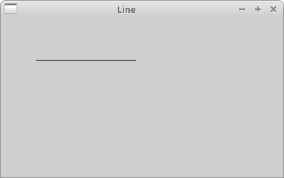

Figure: drawing a line

## 计算机图形

有两种不同的计算机图形：向量和光栅图形。 栅格图形将图像表示为像素的集合。 向量图形是使用诸如点，线，曲线或多边形之类的几何图元来表示图像。 这些基元是使用数学方程式创建的。

两种类型的计算机图形都有优点和缺点。 向量图形优于栅格的优点是：

*   较小的大小
*   无限放大的能力
*   移动，缩放，填充或旋转不会降低图像质量

### 基本类型

以下是图形基元的部分列表。

*   点
*   线
*   折线
*   多边形
*   区域
*   椭圆
*   样条

### 设备上下文属性

设备上下文包含几个属性，例如笔刷，钢笔或字体。 `wx.Brush`是用于填充区域的绘图工具。 它用于绘制形状的背景。 它具有颜色和样式。 `wx.Pen`用于绘制形状轮廓。 它具有颜色，宽度和样式。 `wx.Font`是确定文本外观的对象。

## 基本要素

在下面的几行中，我们介绍几个基本对象：颜色，画笔，笔，连接，盖帽和渐变。

### 颜色

颜色是代表红色，绿色和蓝色（RGB）强度值的组合的对象。 有效的 RGB 值在 0 到 255 之间。有三种设置颜色的方法。 我们可以创建`wx.Colour`对象，使用预定义的颜色名称或十六进制值字符串。 `wx.Colour(0,0,255)`，`'BLUE'`和`'#0000FF'`。 这三个符号产生相同的颜色。

可以在 [colorjack.com](http://www.colorjack.com) 网站上找到处理颜色的理想工具。 或者我们可以使用 Gimp 这样的工具。

我们还提供了可在程序中使用的预定义颜色名称的列表。

| | | | | |
| --- | --- | --- | --- | --- |
| AQUAMARINE | BLACK | BLUE | BLUE VIOLET | BROWN |
| CADET BLUE | CORAL | CORNFLOWER BLUE | CYAN | DARK GREY |
| DARK GREEN | DARK OLIVE GREEN | DARK ORCHID | DARK SLATE BLUE | DARK SLATE GREY |
| DARK TURQUOISE | DIM GREY | FIREBRICK | FOREST GREEN | GOLD |
| GOLDENROD | GREY | GREEN | GREEN YELLOW | INDIAN RED |
| KHAKI | LIGHT BLUE | LIGHT GREY | LIGHT STEEL BLUE | LIME GREEN |
| MAGENTA | MAROON | MEDIUM AQUAMARINE | MEDIUM BLUE | MEDIUM FOREST GREEN |
| MEDIUM GOLDENROD | MEDIUM ORCHID | MEDIUM SEA GREEN | MEDIUM SLATE BLUE | MEDIUM SPRING GREEN |
| MEDIUM TURQUOISE | MEDIUM VIOLET RED | MIDNIGHT BLUE | NAVY | ORANGE |
| ORANGE RED | ORCHID | PALE GREEN | PINK | PLUM |
| PURPLE | RED | SALMON | SEA GREEN | SIENNA |
| SKY BLUE | SLATE BLUE | SPRING GREEN | STEEL BLUE | TAN |
| THISTLE | TURQUOISE | VIOLET | VIOLET RED | WHEAT |
| WHITE | YELLOW | YELLOW GREEN | | |


下面的示例使用一些颜色值。

`colours.py`

```py
#!/usr/bin/env python3
# -*- coding: utf-8 -*-

"""
ZetCode wxPython tutorial

This program draws nine coloured rectangles
on the window.

author: Jan Bodnar
website: zetcode.com
last edited: May 2018
"""

import wx

class Example(wx.Frame):

    def __init__(self, *args, **kw):
        super(Example, self).__init__(*args, **kw)

        self.InitUI()

    def InitUI(self):

        self.Bind(wx.EVT_PAINT, self.OnPaint)

        self.SetTitle("Colours")
        self.Centre()

    def OnPaint(self, e):

        dc = wx.PaintDC(self)
        dc.SetPen(wx.Pen('#d4d4d4'))

        dc.SetBrush(wx.Brush('#c56c00'))
        dc.DrawRectangle(10, 15, 90, 60)

        dc.SetBrush(wx.Brush('#1ac500'))
        dc.DrawRectangle(130, 15, 90, 60)

        dc.SetBrush(wx.Brush('#539e47'))
        dc.DrawRectangle(250, 15, 90, 60)

        dc.SetBrush(wx.Brush('#004fc5'))
        dc.DrawRectangle(10, 105, 90, 60)

        dc.SetBrush(wx.Brush('#c50024'))
        dc.DrawRectangle(130, 105, 90, 60)

        dc.SetBrush(wx.Brush('#9e4757'))
        dc.DrawRectangle(250, 105, 90, 60)

        dc.SetBrush(wx.Brush('#5f3b00'))
        dc.DrawRectangle(10, 195, 90, 60)

        dc.SetBrush(wx.Brush('#4c4c4c'))
        dc.DrawRectangle(130, 195, 90, 60)

        dc.SetBrush(wx.Brush('#785f36'))
        dc.DrawRectangle(250, 195, 90, 60)

def main():

    app = wx.App()
    ex = Example(None)
    ex.Show()
    app.MainLoop()

if __name__ == '__main__':
    main()

```

我们绘制九个矩形，并用不同的颜色填充它们。

```py
dc.SetBrush(wx.Brush('#c56c00'))
dc.DrawRectangle(10, 15, 90, 60)

```

我们以十六进制表示法指定画笔的颜色。 笔刷是形状的背景填充。 然后，使用`DrawRectangle()`方法绘制矩形。

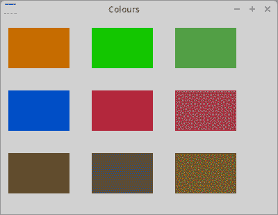

Figure: Colours

### 笔

笔是基本的图形对象。 它用于绘制矩形，椭圆形，多边形或其他形状的线，曲线和轮廓。

```py
wx.Pen(wx.Colour colour, width=1, style=wx.SOLID)

```

`wx.Pen`构造函数具有三个参数：`colour`，`width`和`style`。 以下是可能的笔样式的列表：

*   `wx.solid`
*   `wx.DOT`
*   `wx.LONG_DASH`
*   `wx.SHORT_DASH`
*   `wx.DOT_DASH`
*   `wx.TRANSPARENT`

`pens.py`

```py
#!/usr/bin/env python3
# -*- coding: utf-8 -*-

"""
ZetCode wxPython tutorial

This program draws six rectangles with different pens.

author: Jan Bodnar
website: zetcode.com
last edited: May 2018
"""

import wx

class Example(wx.Frame):

    def __init__(self, *args, **kw):
        super(Example, self).__init__(*args, **kw)

        self.InitUI()

    def InitUI(self):

        self.Bind(wx.EVT_PAINT, self.OnPaint)

        self.SetTitle("Pens")
        self.Centre()

    def OnPaint(self, event):
        dc = wx.PaintDC(self)

        dc.SetPen(wx.Pen('#4c4c4c', 1, wx.SOLID))
        dc.DrawRectangle(10, 15, 90, 60)

        dc.SetPen(wx.Pen('#4c4c4c', 1, wx.DOT))
        dc.DrawRectangle(130, 15, 90, 60)

        dc.SetPen(wx.Pen('#4c4c4c', 1, wx.LONG_DASH))
        dc.DrawRectangle(250, 15, 90, 60)

        dc.SetPen(wx.Pen('#4c4c4c', 1, wx.SHORT_DASH))
        dc.DrawRectangle(10, 105, 90, 60)

        dc.SetPen(wx.Pen('#4c4c4c', 1, wx.DOT_DASH))
        dc.DrawRectangle(130, 105, 90, 60)

        dc.SetPen(wx.Pen('#4c4c4c', 1, wx.TRANSPARENT))
        dc.DrawRectangle(250, 105, 90, 60)

def main():

    app = wx.App()
    ex = Example(None)
    ex.Show()
    app.MainLoop()

if __name__ == '__main__':
    main()

```

如果未指定自定义画笔，则使用默认画笔。 默认画笔为`wx.WHITE_BRUSH`。 矩形的周长由笔绘制。 最后一个没有边界。 它是透明的，即不可见。

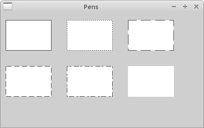

Figure: Pens

### 连接和盖帽

笔对象具有其他两个参数：连接和盖帽。 连接定义线之间的连接如何绘制。 连接样式具有以下选项：

*   wx.JOIN_MITER
*   wx.JOIN_BEVEL
*   wx.JOIN_ROUND

使用`wx.JOIN_MITER`时，线条的外边缘会延伸。 他们以一个角度相遇，并且该区域被填充。 在`wx.JOIN_BEVEL`中，两条线之间的三角形缺口被填充。 在`wx.JOIN_ROUND`中，填充了两条线之间的圆弧。 默认值为`wx.JOIN_ROUND`。

笔帽定义了笔将如何绘制线条的末端。 选项包括：

*   wx.CAP_ROUND
*   wx.CAP_PROJECTING
*   wx.CAP_BUTT

`wx.CAP_ROUND`绘制圆形末端。 `wx.CAP_PROJECTING`和`wx.CAP_BUTT`画出方形末端。 它们之间的区别是`wx.CAP_PROJECTING`将超出端点超出行大小的一半。 `wx.CAP_ROUND`也将延伸到终点之外。

`joins_caps.py`

```py
#!/usr/bin/env python3
# -*- coding: utf-8 -*-

"""
ZetCode wxPython tutorial

This program draws uses different joins
and caps in drawing.

author: Jan Bodnar
website: zetcode.com
last edited: May 2018
"""

import wx

class Example(wx.Frame):

    def __init__(self, *args, **kw):
        super(Example, self).__init__(*args, **kw)

        self.InitUI()

    def InitUI(self):

        self.Bind(wx.EVT_PAINT, self.OnPaint)

        self.SetTitle("Joins and caps")
        self.Centre()

    def OnPaint(self, e):

        dc = wx.PaintDC(self)

        pen = wx.Pen('#4c4c4c', 10, wx.SOLID)

        pen.SetJoin(wx.JOIN_MITER)
        dc.SetPen(pen)
        dc.DrawRectangle(15, 15, 80, 50)

        pen.SetJoin(wx.JOIN_BEVEL)
        dc.SetPen(pen)
        dc.DrawRectangle(125, 15, 80, 50)

        pen.SetJoin(wx.JOIN_ROUND)
        dc.SetPen(pen)
        dc.DrawRectangle(235, 15, 80, 50)

        pen.SetCap(wx.CAP_BUTT)
        dc.SetPen(pen)
        dc.DrawLine(30, 150,  150, 150)

        pen.SetCap(wx.CAP_PROJECTING)
        dc.SetPen(pen)
        dc.DrawLine(30, 190,  150, 190)

        pen.SetCap(wx.CAP_ROUND)
        dc.SetPen(pen)
        dc.DrawLine(30, 230,  150, 230)

        pen2 = wx.Pen('#4c4c4c', 1, wx.SOLID)
        dc.SetPen(pen2)
        dc.DrawLine(30, 130, 30, 250)
        dc.DrawLine(150, 130, 150, 250)
        dc.DrawLine(155, 130, 155, 250)

def main():

    app = wx.App()
    ex = Example(None)
    ex.Show()
    app.MainLoop()

if __name__ == '__main__':
    main()

```

```py
pen = wx.Pen('#4c4c4c', 10, wx.SOLID)

```

为了查看各种连接样式和盖帽样式，我们需要将笔的宽度设置为大于 1。

```py
dc.DrawLine(150, 130, 150, 250)
dc.DrawLine(155, 130, 155, 250)

```

注意两条封闭的垂直线。 它们之间的距离是 5px。 恰好是当前笔宽的一半。

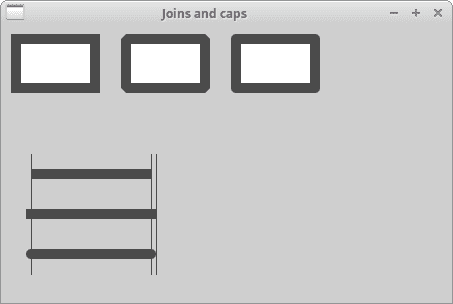

Figure: Joins and Caps

### 渐变色

在计算机图形学中，渐变是从浅到深或从一种颜色到另一种颜色的阴影的平滑混合。 在 2D 绘图程序和绘图程序中，渐变用于创建彩色背景和特殊效果以及模拟灯光和阴影。

```py
GradientFillLinear(self, rect, initialColour, destColour, nDirection=RIGHT)

```

此方法使用线性渐变填充`rect`指定的区域，该区域从`initialColour`开始并最终逐渐变为`destColour`。 `nDirection`参数指定颜色改变的方向； 默认值为`wx.EAST`。

`gradients.py`

```py
#!/usr/bin/env python3
# -*- coding: utf-8 -*-

"""
ZetCode wxPython tutorial

This program draws four rectangles filled
with gradients.

author: Jan Bodnar
website: zetcode.com
last edited: May 2018
"""

import wx

class Example(wx.Frame):

    def __init__(self, *args, **kw):
        super(Example, self).__init__(*args, **kw)

        self.InitUI()

    def InitUI(self):

        self.Bind(wx.EVT_PAINT, self.OnPaint)

        self.SetTitle("Gradients")
        self.Centre()

    def OnPaint(self, event):

        dc = wx.PaintDC(self)

        dc.GradientFillLinear((20, 20, 180, 40), '#ffec00', '#000000', wx.NORTH)
        dc.GradientFillLinear((20, 80, 180, 40), '#ffec00', '#000000', wx.SOUTH)
        dc.GradientFillLinear((20, 140, 180, 40), '#ffec00', '#000000', wx.EAST)
        dc.GradientFillLinear((20, 200, 180, 40), '#ffec00', '#000000', wx.WEST)

def main():

    app = wx.App()
    ex = Example(None)
    ex.Show()
    app.MainLoop()

if __name__ == '__main__':
    main()

```

在该示例中，四个矩形填充有渐变。

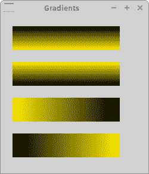

Figure: Gradients

### `wx.brush`

画笔是基本的图形对象。 它用于绘制图形形状的背景，例如矩形，椭圆形或多边形。

wxPython 具有以下内置画笔类型：

*   wx.solid
*   wx.STIPPLE
*   wx.BDIAGONAL_HATCH
*   wx.CROSSDIAG_HATCH
*   wx.FDIAGONAL_HATCH
*   wx.CROSS_HATCH
*   wx.HORIZONTAL_HATCH
*   wx.VERTICAL_HATCH
*   透明

`brushes.py`

```py
#!/usr/bin/env python3
# -*- coding: utf-8 -*-

"""
ZetCode wxPython tutorial

This program draws eight rectangles filled
with different brushes.

author: Jan Bodnar
website: zetcode.com
last edited: May 2018
"""

import wx

class Example(wx.Frame):

    def __init__(self, *args, **kw):
        super(Example, self).__init__(*args, **kw)

        self.InitUI()

    def InitUI(self):

        self.Bind(wx.EVT_PAINT, self.OnPaint)

        self.SetTitle("Brushes")
        self.Centre()

    def OnPaint(self, e):

        dc = wx.PaintDC(self)

        dc.SetBrush(wx.Brush('#4c4c4c', wx.CROSS_HATCH))
        dc.DrawRectangle(10, 15, 90, 60)

        dc.SetBrush(wx.Brush('#4c4c4c', wx.SOLID))
        dc.DrawRectangle(130, 15, 90, 60)

        dc.SetBrush(wx.Brush('#4c4c4c', wx.BDIAGONAL_HATCH))
        dc.DrawRectangle(250, 15, 90, 60)

        dc.SetBrush(wx.Brush('#4c4c4c', wx.CROSSDIAG_HATCH))
        dc.DrawRectangle(10, 105, 90, 60)

        dc.SetBrush(wx.Brush('#4c4c4c', wx.FDIAGONAL_HATCH))
        dc.DrawRectangle(130, 105, 90, 60)

        dc.SetBrush(wx.Brush('#4c4c4c', wx.HORIZONTAL_HATCH))
        dc.DrawRectangle(250, 105, 90, 60)

        dc.SetBrush(wx.Brush('#4c4c4c', wx.VERTICAL_HATCH))
        dc.DrawRectangle(10, 195, 90, 60)

        dc.SetBrush(wx.Brush('#4c4c4c', wx.TRANSPARENT))
        dc.DrawRectangle(130, 195, 90, 60)

def main():

    app = wx.App()
    ex = Example(None)
    ex.Show()
    app.MainLoop()

if __name__ == '__main__':
    main()

```

在示例中使用了八种不同的内置画笔类型。

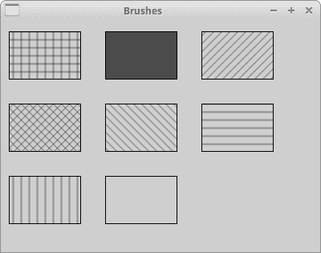

Figure: Brushes

### 自定义模式

我们不限于使用预定义的模式。 我们可以轻松创建自己的自定义模式。

`custom_patterns.py`

```py
#!/usr/bin/env python3
# -*- coding: utf-8 -*-

"""
ZetCode wxPython tutorial

This program draws three rectangles with custom
brush patterns.

author: Jan Bodnar
website: zetcode.com
last edited: May 2018
"""

import wx

class Example(wx.Frame):

    def __init__(self, *args, **kw):
        super(Example, self).__init__(*args, **kw)

        self.InitUI()

    def InitUI(self):

        self.Bind(wx.EVT_PAINT, self.OnPaint)

        self.SetTitle("Custom patterns")
        self.Centre()

    def OnPaint(self, e):

        dc = wx.PaintDC(self)

        dc.SetPen(wx.Pen('#C7C3C3'))

        brush1 = wx.Brush(wx.Bitmap('pattern1.png'))
        dc.SetBrush(brush1)
        dc.DrawRectangle(10, 15, 90, 60)

        brush2 = wx.Brush(wx.Bitmap('pattern2.png'))
        dc.SetBrush(brush2)
        dc.DrawRectangle(130, 15, 90, 60)

        brush3 = wx.Brush(wx.Bitmap('pattern3.png'))
        dc.SetBrush(brush3)
        dc.DrawRectangle(250, 15, 90, 60)

def main():

    app = wx.App()
    ex = Example(None)
    ex.Show()
    app.MainLoop()

if __name__ == '__main__':
    main()

```

我们创建了一些小的位图。 位图是在 Gimp 中创建的。

```py
brush1 = wx.Brush(wx.Bitmap('pattern1.png'))
dc.SetBrush(brush1)
dc.DrawRectangle(10, 15, 90, 60)

```

从位图创建画笔，并将其设置为设备上下文。 它用于填充矩形的内部。

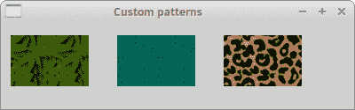

Figure: Custom Patterns

### 点

最简单的几何对象是一个点。 它是窗口上的一个普通点。

```py
DrawPoint(self, x, y)

```

此方法在 x，y 坐标处绘制点。

`points.py`

```py
#!/usr/bin/env python3
# -*- coding: utf-8 -*-

"""
ZetCode wxPython tutorial

This program draws one thousand points
randomly on the window.

author: Jan Bodnar
website: zetcode.com
last edited: May 2018
"""

import wx
import random

class Example(wx.Frame):

    def __init__(self, *args, **kw):
        super(Example, self).__init__(*args, **kw)

        self.InitUI()

    def InitUI(self):

        self.Bind(wx.EVT_PAINT, self.OnPaint)

        self.SetTitle("Points")
        self.Centre()

    def OnPaint(self, e):

        dc = wx.PaintDC(self)

        dc.SetPen(wx.Pen('RED'))

        for i in range(1000):

            w, h = self.GetSize()
            x = random.randint(1, w-1)
            y = random.randint(1, h-1)
            dc.DrawPoint(x, y)

def main():

    app = wx.App()
    ex = Example(None)
    ex.Show()
    app.MainLoop()

if __name__ == '__main__':
    main()

```

一个点可能很难看清，因此我们创建了 1000 个点。

```py
dc.SetPen(wx.Pen('RED'))

```

在这里，我们将笔的颜色设置为红色。

```py
w, h = self.GetSize()
x = random.randint(1, w-1)

```

这些点在窗口的客户区域周围随机分布。 它们也可以动态分配。 如果我们调整窗口的大小，将在新的客户端大小上随机绘制点。 `randint(a, b)`方法返回范围为`[a，b]`的随机整数，例如 包括两点。

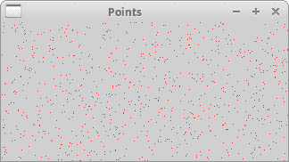

Figure: drawing points

## 形状

形状是更复杂的几何对象。 在以下示例中，我们绘制了各种几何形状。

`shapes.py`

```py
#!/usr/bin/env python3
# -*- coding: utf-8 -*-

"""
ZetCode wxPython tutorial

This program draws various shapes on
the window.

author: Jan Bodnar
website: zetcode.com
last edited: May 2018
"""

import wx

class Example(wx.Frame):

    def __init__(self, *args, **kw):
        super(Example, self).__init__(*args, **kw)

        self.InitUI()

    def InitUI(self):

        self.Bind(wx.EVT_PAINT, self.OnPaint)

        self.SetTitle("Shapes")
        self.Centre()

    def OnPaint(self, e):

        dc = wx.PaintDC(self)
        dc.SetBrush(wx.Brush('#777'))
        dc.SetPen(wx.Pen("#777"))

        dc.DrawEllipse(20, 20, 90, 60)
        dc.DrawRoundedRectangle(130, 20, 90, 60, 10)
        dc.DrawArc(240, 40, 340, 40, 290, 20)

        dc.DrawRectangle(20, 120, 80, 50)
        dc.DrawPolygon(((130, 140), (180, 170), (180, 140), (220, 110), (140, 100)))
        dc.DrawSpline(((240, 170), (280, 170), (285, 110), (325, 110)))

        dc.DrawLines(((20, 260), (100, 260), (20, 210), (100, 210)))
        dc.DrawCircle(170, 230, 35)
        dc.DrawRectangle(250, 200, 60, 60)

def main():

    app = wx.App()
    ex = Example(None)
    ex.Show()
    app.MainLoop()

if __name__ == '__main__':
    main()

```

在我们的示例中，我们绘制了一个椭圆，一个圆角矩形，一个圆弧，一个矩形，一个多边形，样条曲线，线，一个圆和一个正方形。 圆形是一种特殊的椭圆，而正方形是一种特殊的矩形。

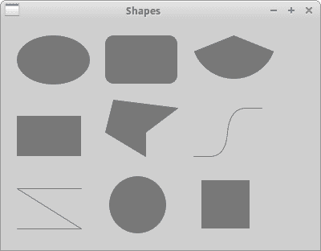

Figure: Shapes

## 区域

设备上下文可以分为几个部分，称为区域。 区域可以是任何形状，例如矩形或圆形。 使用`Union`，`Intersect`，`Substract`和`Xor`操作，我们可以创建复杂区域。 区域用于概述，填充和裁剪。

我们可以通过三种方式创建区域。 最简单的方法是创建一个矩形区域。 可以从位图的点列表创建更复杂的区域。

在前往区域之前，我们将首先创建一个小示例。 我们将该主题分为几个部分，以便于理解。 您可能会发现修改学校数学是一个好主意。 [在这里](http://en.wikipedia.org/wiki/Circle)我们可以找到一篇不错的文章。

`lines.py`

```py
#!/usr/bin/env python3
# -*- coding: utf-8 -*-

"""
ZetCode wxPython tutorial

This program draws various shapes on
the window.

author: Jan Bodnar
website: zetcode.com
last edited: May 2018
"""

import wx
from math import hypot, sin, cos, pi

class Example(wx.Frame):

    def __init__(self, *args, **kw):
        super(Example, self).__init__(*args, **kw)

        self.InitUI()

    def InitUI(self):

        self.Bind(wx.EVT_PAINT, self.OnPaint)

        self.SetTitle('Lines')
        self.Centre()

    def OnPaint(self, e):

        dc = wx.PaintDC(self)
        size_x, size_y = self.GetClientSize()
        dc.SetDeviceOrigin(size_x/2, size_y/2)

        radius = hypot(size_x/2, size_y/2)
        angle = 0

        while (angle < 2*pi):
            x = radius*cos(angle)
            y = radius*sin(angle)
            dc.DrawLine((0, 0), (x, y))
            angle = angle + 2*pi/360

def main():

    app = wx.App()
    ex = Example(None)
    ex.Show()
    app.MainLoop()

if __name__ == '__main__':
    main()

```

在此示例中，我们从客户区域的中间绘制了 360 条线。 两条线之间的距离是 1 度。 我们创造了一个有趣的人物。

```py
import wx
from math import hypot, sin, cos, pi

```

我们需要数学模块中的三个数学函数和一个常数。

```py
dc.SetDeviceOrigin(size_x/2, size_y/2)

```

方法`SetDeviceOrigin()`创建坐标系的新起点。 我们将其放入客户区的中间。 通过重新定位坐标系，我们使图形的复杂程度降低了。

```py
radius = hypot(size_x/2, size_y/2)

```

在这里，我们得到了斜边。 这是最长的线，我们可以从客户区域的中间绘制。 它是从开始到窗口角落的线段长度。 这样，大多数线条都无法完全画出。 重叠部分不可见。 参见[斜边](http://en.wikipedia.org/wiki/Hypotenuse)。

```py
x = radius*cos(angle)
y = radius*sin(angle)

```

这些是参数函数。 它们用于在曲线上找到`[x，y]`点。 从坐标系的开始一直到圆上的点绘制所有 360 条线。

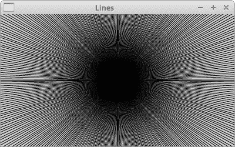

Figure: Lines

## 剪裁

`Clipping`将绘图限制在特定区域。 裁剪通常用于创建效果并改善应用的性能。 我们使用`SetClippingRegionAsRegion()`方法将绘图限制在特定区域。

在下面的示例中，我们将修改和增强我们以前的程序。

`star.py`

```py
#!/usr/bin/env python3
# -*- coding: utf-8 -*-

"""
ZetCode wxPython tutorial

This program demonstrates a clipping operation
when drawing a star object.

author: Jan Bodnar
website: zetcode.com
last edited: May 2018
"""

import wx
from math import hypot, sin, cos, pi

class Example(wx.Frame):

    def __init__(self, *args, **kw):
        super(Example, self).__init__(*args, **kw)

        self.InitUI()

    def InitUI(self):

        self.Bind(wx.EVT_PAINT, self.OnPaint)

        self.SetTitle("Star")
        self.Centre()

    def OnPaint(self, e):

        dc = wx.PaintDC(self)

        dc.SetPen(wx.Pen('#424242'))
        size_x, size_y = self.GetClientSize()
        dc.SetDeviceOrigin(size_x/2, size_y/2)

        points = (((0, 85), (75, 75), (100, 10), (125, 75), (200, 85),
            (150, 125), (160, 190), (100, 150), (40, 190), (50, 125)))

        region = wx.Region(points)
        dc.SetDeviceClippingRegion(region)

        radius = hypot(size_x/2, size_y/2)
        angle = 0

        while (angle < 2*pi):

            x = radius*cos(angle)
            y = radius*sin(angle)
            dc.DrawLine((0, 0), (x, y))
            angle = angle + 2*pi/360

        dc.DestroyClippingRegion()

def main():

    app = wx.App()
    ex = Example(None)
    ex.Show()
    app.MainLoop()

if __name__ == '__main__':
    main()

```

我们再次绘制所有 360 线。 但是这次，只绘制了一部分客户区域。 我们将绘图限制到的区域是星形对象。

```py
region = wx.Region(points)
dc.SetDeviceClippingRegion(region)

```

我们从点列表创建一个区域。 `SetDeviceClippingRegion()`方法将图形限制在指定的区域。 在我们的情况下，它是一个恒星对象。

```py
dc.DestroyClippingRegion()

```

我们必须销毁剪切区域。

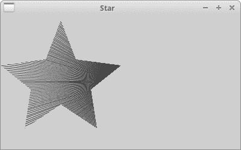

Figure: Star

## 区域操作

可以组合区域以创建更复杂的形状。 我们可以使用四个集合运算：并集，相交，减法，异或。

以下示例显示了所有正在执行的四个操作。

`region_operations.py`

```py
#!/usr/bin/env python3
# -*- coding: utf-8 -*-

"""
ZetCode wxPython tutorial

This program performs set operations on regions.

author: Jan Bodnar
website: zetcode.com
last edited: May 2018
"""

import wx

class Example(wx.Frame):

    def __init__(self, *args, **kw):
        super(Example, self).__init__(*args, **kw)

        self.InitUI()

    def InitUI(self):

         self.Bind(wx.EVT_PAINT, self.OnPaint)

         self.SetTitle("Regions")
         self.Centre()

    def OnPaint(self, e):

         dc = wx.PaintDC(self)
         dc.SetPen(wx.Pen('#d4d4d4'))

         dc.DrawRectangle(20, 20, 50, 50)
         dc.DrawRectangle(30, 40, 50, 50)

         dc.SetBrush(wx.Brush('#ffffff'))
         dc.DrawRectangle(100, 20, 50, 50)
         dc.DrawRectangle(110, 40, 50, 50)

         region1 = wx.Region(100, 20, 50, 50)
         region2 = wx.Region(110, 40, 50, 50)
         region1.Intersect(region2)

         rect = region1.GetBox()
         dc.SetDeviceClippingRegion(region1)
         dc.SetBrush(wx.Brush('#ff0000'))
         dc.DrawRectangle(rect)
         dc.DestroyClippingRegion()

         dc.SetBrush(wx.Brush('#ffffff'))
         dc.DrawRectangle(180, 20, 50, 50)
         dc.DrawRectangle(190, 40, 50, 50)

         region1 = wx.Region(180, 20, 50, 50)
         region2 = wx.Region(190, 40, 50, 50)
         region1.Union(region2)
         dc.SetDeviceClippingRegion(region1)

         rect = region1.GetBox()
         dc.SetBrush(wx.Brush('#fa8e00'))
         dc.DrawRectangle(rect)
         dc.DestroyClippingRegion()

         dc.SetBrush(wx.Brush('#ffffff'))
         dc.DrawRectangle(20, 120, 50, 50)
         dc.DrawRectangle(30, 140, 50, 50)
         region1 = wx.Region(20, 120, 50, 50)
         region2 = wx.Region(30, 140, 50, 50)
         region1.Xor(region2)

         rect = region1.GetBox()
         dc.SetDeviceClippingRegion(region1)
         dc.SetBrush(wx.Brush('#619e1b'))
         dc.DrawRectangle(rect)
         dc.DestroyClippingRegion()

         dc.SetBrush(wx.Brush('#ffffff'))
         dc.DrawRectangle(100, 120, 50, 50)
         dc.DrawRectangle(110, 140, 50, 50)
         region1 = wx.Region(100, 120, 50, 50)
         region2 = wx.Region(110, 140, 50, 50)
         region1.Subtract(region2)

         rect = region1.GetBox()
         dc.SetDeviceClippingRegion(region1)
         dc.SetBrush(wx.Brush('#715b33'))
         dc.DrawRectangle(rect)
         dc.DestroyClippingRegion()

         dc.SetBrush(wx.Brush('#ffffff'))
         dc.DrawRectangle(180, 120, 50, 50)
         dc.DrawRectangle(190, 140, 50, 50)
         region1 = wx.Region(180, 120, 50, 50)
         region2 = wx.Region(190, 140, 50, 50)
         region2.Subtract(region1)

         rect = region2.GetBox()
         dc.SetDeviceClippingRegion(region2)
         dc.SetBrush(wx.Brush('#0d0060'))
         dc.DrawRectangle(rect)
         dc.DestroyClippingRegion()

def main():

    app = wx.App()
    ex = Example(None)
    ex.Show()
    app.MainLoop()

if __name__ == '__main__':
    main()

```

在示例中，我们提出了六个区域设置操作。

```py
 region1 = wx.Region(100, 20, 50, 50)
 region2 = wx.Region(110, 40, 50, 50)
 region1.Intersect(region2)

```

此代码在两个区域上执行交叉操作。

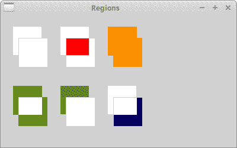

Figure: Set operations on regions

## 映射模式

映射模式定义用于将页面空间单位转换为设备空间单位的度量单位，并且还定义设备的 x 和 y 轴的方向。

### 用英语说，用公制衡量

英语成为全球交流的语言。 度量系统也因此成为度量系统中的全局系统。 根据[维基百科文章](http://en.wikipedia.org/wiki/Metric_system)的介绍，只有三个例外。 美国，利比里亚和缅甸。 例如，美国人用华氏温度来测量温度，用加仑来加油或用磅来称重。

即使我们在欧洲使用公制，也有例外。 美国主导着 IT，我们正在导入其标准。 所以我们也说我们有一台 17 英寸的显示器。 图形可以放入文件中，可以在监视器或其他设备（相机，摄像机，移动电话）的屏幕上显示，也可以用打印机进行打印。 纸张大小可以以毫米，点或英寸为单位设置，屏幕的分辨率以像素为单位，文本的质量取决于每英寸的点数。 我们也有点，位或样本。 这是我们拥有逻辑和设备单元的原因之一。

## 逻辑和设备单元

如果在客户区上绘制文本或几何图元，则使用逻辑单元对其进行定位。

如果要绘制一些文本，请提供`text`参数和 x，y 位置。 x，y 以逻辑单位表示。 然后，设备以设备为单位绘制文本。 逻辑和设备单元可以相同，也可以不同。 逻辑单位由人（毫米）使用，设备单位是`particular`设备固有的。 例如，屏幕的本机设备单位是像素。 `HEWLETT PACKARD LaserJet 1022`的本机设备单位为 1200dpi（每英寸点数）。

到目前为止，我们已经讨论了各种度量单位。 设备的映射模式是一种将逻辑单元转换为设备单元的方法。 wxPython 具有以下映射模式：

| 映射模式 | 逻辑单元 |
| --- | --- |
| `wx.MM_TEXT` | 1 像素 |
| `wx.MM_METRIC` | 1 毫米 |
| `wx.MM_LOMETRIC` | 1/10 毫米 |
| `wx.MM_POINTS` | 1 点，1/72 英寸 |
| `wx.MM_TWIPS` | 点的 1/20 或 1/1440 英寸 |

默认的映射模式是`wx.MM_TEXT`。 在此模式下，逻辑单元与设备单元相同。 人们将对象放置在屏幕上或设计网页时，他们通常以像素为单位思考。 Web 设计人员创建三列页面，这些列以像素为单位设置。 页面的最低公分母通常是 800px 等。这种想法很自然，因为我们知道我们的显示器具有`1024x768`像素 我们不打算进行转换，而是习惯于以像素为单位进行思考。 如果要以毫米为单位绘制结构，则可以使用两种度量映射模式。 对于屏幕而言，以毫米为单位直接绘制太厚了，这就是为什么我们要使用`wx.MM_LOMETRIC`映射模式。

要设置不同的映射模式，我们使用`SetMapMode()`方法。

## 标尺示例

标尺以像素为单位测量屏幕对象。

`ruler.py`

```py
#!/usr/bin/env python3
# -*- coding: utf-8 -*-

"""
ZetCode wxPython tutorial

This program creates a ruler.

author: Jan Bodnar
website: zetcode.com
last edited: May 2018
"""

import wx

RW = 701 # ruler width
RM = 10  # ruler margin
RH = 80  # ruler height

class Example(wx.Frame):

    def __init__(self, parent):
        wx.Frame.__init__(self, parent, size=(RW + 2*RM, RH),
            style=wx.FRAME_NO_TASKBAR | wx.NO_BORDER | wx.STAY_ON_TOP)
        self.font = wx.Font(7, wx.FONTFAMILY_DEFAULT, wx.FONTSTYLE_NORMAL,
            wx.FONTWEIGHT_BOLD, False, 'Courier 10 Pitch')

        self.InitUI()

    def InitUI(self):

        self.Bind(wx.EVT_PAINT, self.OnPaint)
        self.Bind(wx.EVT_LEFT_DOWN, self.OnLeftDown)
        self.Bind(wx.EVT_LEFT_UP, self.OnLeftUp)
        self.Bind(wx.EVT_RIGHT_DOWN, self.OnRightDown)
        self.Bind(wx.EVT_MOTION, self.OnMouseMove)

        self.Centre()
        self.Show(True)

    def OnPaint(self, e):

        dc = wx.PaintDC(self)

        brush = wx.Brush(wx.Bitmap('granite.png'))
        dc.SetBrush(brush)
        dc.DrawRectangle(0, 0, RW+2*RM, RH)
        dc.SetFont(self.font)

        dc.SetPen(wx.Pen('#F8FF25'))
        dc.SetTextForeground('#F8FF25')

        for i in range(RW):

            if not (i % 100):

                dc.DrawLine(i+RM, 0, i+RM, 10)
                w, h = dc.GetTextExtent(str(i))
                dc.DrawText(str(i), i+RM-w/2, 11)

            elif not (i % 20):

                dc.DrawLine(i+RM, 0, i+RM, 8)

            elif not (i % 2):

                dc.DrawLine(i+RM, 0, i+RM, 4)

    def OnLeftDown(self, e):

        x, y = self.ClientToScreen(e.GetPosition())
        ox, oy = self.GetPosition()

        dx = x - ox
        dy = y - oy

        self.delta = ((dx, dy))

    def OnMouseMove(self, e):

        if e.Dragging() and e.LeftIsDown():

            self.SetCursor(wx.Cursor(wx.CURSOR_HAND))

            x, y = self.ClientToScreen(e.GetPosition())
            fp = (x - self.delta[0], y - self.delta[1])
            self.Move(fp)

    def OnLeftUp(self, e):

        self.SetCursor(wx.Cursor(wx.CURSOR_ARROW))

    def OnRightDown(self, e):

        self.Close()

def main():

    app = wx.App()
    ex = Example(None)
    ex.Show()
    app.MainLoop()

if __name__ == '__main__':
    main()

```

在此示例中，我们创建一个标尺。 此标尺以像素为单位测量屏幕对象。 我们保留了默认的映射模式，即`wx.MM_TEXT`。 正如我们已经提到的，此模式具有相同的逻辑和设备单元。 在我们的例子中，这些是像素。

```py
def __init__(self, parent):
    wx.Frame.__init__(self, parent, size=(RW + 2*RM, RH),
        style=wx.FRAME_NO_TASKBAR | wx.NO_BORDER | wx.STAY_ON_TOP)

```

我们创建了一个无边界的窗口。 标尺宽 721 像素：`RW + 2 * RM = 701 + 20 = 721`。标尺显示 700 个数字；`0 ... 700`为 701 像素。 标尺两边都有空白，`2 * 10`是 20 像素。 两者合计为 721 像素。

```py
brush = wx.Brush(wx.Bitmap('granite.png'))
dc.SetBrush(brush)
dc.DrawRectangle(0, 0, RW+2*RM, RH)

```

在这里，我们在窗口上绘制一个自定义模式。 我们使用了 Gimp 中可用的预定义模式。 它被称为花岗岩。

```py
w, h = dc.GetTextExtent(str(i))
dc.DrawText(str(i), i+RM-w/2, 11)

```

这些行确保我们正确对齐文本。 `GetTextExtent()`方法返回文本的宽度和高度。

窗口周围没有边框。 因此，我们必须手动处理移动。 `OnLeftDown()`和`OnMouseMove()`方法使我们能够移动标尺。

```py
def OnLeftDown(self, e):

    x, y = self.ClientToScreen(e.GetPosition())
    ox, oy = self.GetPosition()

    dx = x - ox
    dy = y - oy

    self.delta = ((dx, dy))

```

在`OnLeftDown()`方法中，我们确定窗口和鼠标光标的坐标；`delta`值是鼠标指针距窗口左上角的距离。 我们需要`delta`值才能移动窗口。

```py
def OnMouseMove(self, e):

    if e.Dragging() and e.LeftIsDown():

        self.SetCursor(wx.Cursor(wx.CURSOR_HAND))

        x, y = self.ClientToScreen(e.GetPosition())
        fp = (x - self.delta[0], y - self.delta[1])
        self.Move(fp)

```

当我们同时拖动窗口并按下鼠标左键时，将执行该代码。 在代码块中，我们使用`SetCursor()`更改鼠标光标，并使用`Move()`方法移动窗口。 增量值用于获取距离。

```py
def OnLeftUp(self, e):

    self.SetCursor(wx.Cursor(wx.CURSOR_ARROW))

```

释放鼠标左键时，将光标改回到箭头。

```py
def OnRightDown(self, e):

    self.Close()

```

右键单击窗口区域可关闭窗口。

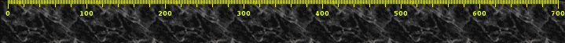

Figure: Ruler example

在本章中，我们使用了 wxPython 中的图形。