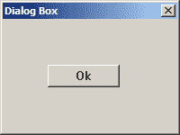
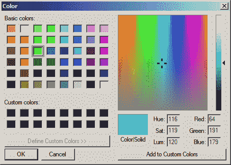
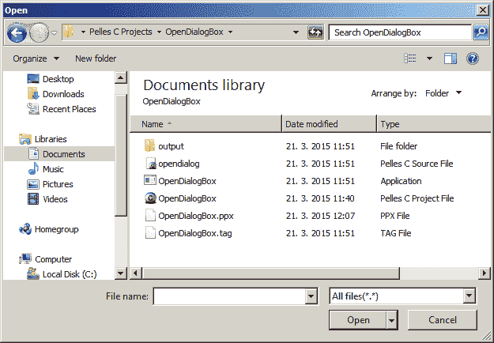

# Windows API 对话框

> 原文： [http://zetcode.com/gui/winapi/dialogs/](http://zetcode.com/gui/winapi/dialogs/)

对话框窗口或对话框是大多数现代 GUI 应用程序必不可少的部分。 对话被定义为两个或更多人之间的对话。 在计算机应用程序中，对话框是一个窗口，用于与应用程序“对话”。 对话框用于输入数据，修改数据，更改应用程序设置等。对话框是用户与计算机程序之间进行通信的重要手段。

## 非模态对话框

非模态对话框不会限制您使用特定的窗口。 用户可以在对话框和程序的其他窗口之间切换。 典型的非模态对话框是“查找和替换”对话框或浮动工具栏。

```
#include <windows.h>

LRESULT CALLBACK WndProc(HWND, UINT, WPARAM, LPARAM);
LRESULT CALLBACK DialogProc(HWND, UINT, WPARAM, LPARAM);

void CreateDialogBox(HWND);
void RegisterDialogClass(HWND);

HINSTANCE ghInstance;

int WINAPI wWinMain(HINSTANCE hInstance, HINSTANCE hPrevInstance,
    PWSTR pCmdLine, int nCmdShow) {

  MSG  msg;    
  HWND hwnd;

  WNDCLASSW wc = {0};

  wc.lpszClassName = L"Window";
  wc.hInstance     = hInstance;
  wc.hbrBackground = GetSysColorBrush(COLOR_3DFACE);
  wc.lpfnWndProc   = WndProc;

  RegisterClassW(&wc);
  hwnd = CreateWindowW(wc.lpszClassName, L"Window",
                WS_OVERLAPPEDWINDOW | WS_VISIBLE,
                100, 100, 250, 150, NULL, NULL, hInstance, NULL);  

  ghInstance = hInstance;

  while( GetMessage(&msg, NULL, 0, 0)) {
    DispatchMessage(&msg);
  }

  return (int) msg.wParam;
}

LRESULT CALLBACK WndProc(HWND hwnd, UINT msg, WPARAM wParam, LPARAM lParam) {

  switch(msg) {

      case WM_CREATE:
          RegisterDialogClass(hwnd);
          CreateWindowW(L"button", L"Show dialog",    
              WS_VISIBLE | WS_CHILD ,
              20, 50, 95, 25, hwnd, (HMENU) 1, NULL, NULL);  
          break;

      case WM_COMMAND:
          CreateDialogBox(hwnd);
          break;

      case WM_DESTROY:
      {
          PostQuitMessage(0);
          return 0;
      }
  }
  return DefWindowProcW(hwnd, msg, wParam, lParam);
}

LRESULT CALLBACK DialogProc(HWND hwnd, UINT msg, WPARAM wParam, LPARAM lParam)
{
  switch(msg) {

    case WM_CREATE:
        CreateWindowW(L"button", L"Ok",    
          WS_VISIBLE | WS_CHILD ,
          50, 50, 80, 25, hwnd, (HMENU) 1, NULL, NULL);  
    break;

    case WM_COMMAND:
        DestroyWindow(hwnd);
    break;

    case WM_CLOSE:
        DestroyWindow(hwnd);
        break;

  }

  return (DefWindowProcW(hwnd, msg, wParam, lParam));
}

void RegisterDialogClass(HWND hwnd) {

  WNDCLASSEXW wc = {0};
  wc.cbSize           = sizeof(WNDCLASSEXW);
  wc.lpfnWndProc      = (WNDPROC) DialogProc;
  wc.hInstance        = ghInstance;
  wc.hbrBackground    = GetSysColorBrush(COLOR_3DFACE);
  wc.lpszClassName    = L"DialogClass";
  RegisterClassExW(&wc);

}

void CreateDialogBox(HWND hwnd) {

  CreateWindowExW(WS_EX_DLGMODALFRAME | WS_EX_TOPMOST,  L"DialogClass", L"Dialog Box", 
        WS_VISIBLE | WS_SYSMENU | WS_CAPTION , 100, 100, 200, 150, 
        NULL, NULL, ghInstance,  NULL);
}

```

对话框只是一种特殊的窗口。 它被创建为带有某些特定标志的普通窗口。

```
CreateWindowExW(WS_EX_DLGMODALFRAME | WS_EX_TOPMOST,  L"DialogClass", L"Dialog Box", 
    WS_VISIBLE | WS_SYSMENU | WS_CAPTION , 100, 100, 200, 150, 
    NULL, NULL, ghInstance,  NULL);

```

使用常规标志`WS_VISIBLE | WS_SYSMENU | WS_CAPTION`和扩展标志`WS_EX_DLGMODALFRAME | WS_EX_TOPMOST`的组合创建对话框。



Figure: Modeless dialog

## 常用对话框

这些是用于执行常见任务的对话框。 打开和保存文件，打印文档，选择颜色等。通用对话框为程序员节省了大量工作。 它们有助于促进应用程序中的标准。

### 颜色对话框

这是选择颜色的常用对话框。

```
#include <windows.h>

LRESULT CALLBACK WndProc(HWND, UINT, WPARAM, LPARAM);
LRESULT CALLBACK PanelProc(HWND, UINT, WPARAM, LPARAM);

void RegisterPanel(void);
COLORREF ShowColorDialog(HWND);

COLORREF gColor = RGB(255, 255, 255);

int WINAPI wWinMain(HINSTANCE hInstance, HINSTANCE hPrevInstance,
    PWSTR pCmdLine, int nCmdShow) {

  MSG  msg ;    
  WNDCLASSW wc = {0};
  wc.lpszClassName = L"Color dialog box";
  wc.hInstance     = hInstance;
  wc.hbrBackground = GetSysColorBrush(COLOR_3DFACE);
  wc.lpfnWndProc   = WndProc;

  RegisterClassW(&wc);
  CreateWindowW( wc.lpszClassName, L"Color dialog box",
                WS_OVERLAPPEDWINDOW | WS_VISIBLE,
                150, 150, 250, 200, 0, 0, hInstance, 0);  

  while( GetMessage(&msg, NULL, 0, 0)) {
    DispatchMessage(&msg);
  }

  return (int) msg.wParam;
}

LRESULT CALLBACK WndProc(HWND hwnd, UINT msg, WPARAM wParam, LPARAM lParam) {

  static HWND hwndPanel;

  switch(msg) {

    case WM_CREATE:
    {
        CreateWindowW(L"button", L"Color",
           WS_VISIBLE | WS_CHILD ,
           20, 30, 80, 25,
           hwnd, (HMENU) 1, NULL, NULL);

        RegisterPanel();
        hwndPanel = CreateWindowW(L"Panel", NULL, 
                    WS_CHILD | WS_VISIBLE,
                    130, 30, 80, 80, hwnd, (HMENU) 2, NULL, NULL);   
        break;
    }

    case WM_COMMAND:
    {
        gColor = ShowColorDialog(hwnd);
        InvalidateRect(hwndPanel, NULL, TRUE);    
        break;
    }

    case WM_DESTROY:
    {
        PostQuitMessage(0);
        break;
    }
  }

  return DefWindowProcW(hwnd, msg, wParam, lParam);
}

LRESULT CALLBACK PanelProc(HWND hwnd, UINT msg, WPARAM wParam, LPARAM lParam) {

  HDC hdc;
  PAINTSTRUCT ps; 
  RECT rect;

  switch(msg) {

    case WM_PAINT:
    {
        GetClientRect(hwnd, &rect);
        hdc = BeginPaint(hwnd, &ps);
        SetBkColor(hdc, gColor);
        ExtTextOut(hdc, 0, 0, ETO_OPAQUE, &rect, "", 0, NULL);
        EndPaint(hwnd, &ps);
        break;
    }
  }

  return DefWindowProc(hwnd, msg, wParam, lParam);
}

COLORREF ShowColorDialog(HWND hwnd) {

  CHOOSECOLOR cc;
  static COLORREF crCustClr[16];

  ZeroMemory(&cc, sizeof(cc));
  cc.lStructSize = sizeof(cc);
  cc.hwndOwner = hwnd;
  cc.lpCustColors = (LPDWORD) crCustClr;
  cc.rgbResult = RGB(0, 255, 0);
  cc.Flags = CC_FULLOPEN | CC_RGBINIT;
  ChooseColor(&cc);

  return cc.rgbResult;
}

void RegisterPanel(void) {

  WNDCLASSW rwc = {0};
  rwc.lpszClassName = L"Panel";
  rwc.hbrBackground = (HBRUSH) GetStockObject(WHITE_BRUSH);
  rwc.lpfnWndProc   = PanelProc;
  RegisterClassW(&rwc);
}

```

在我们的示例中，我们有一个按钮控件和一个子窗口。 子窗口的颜色在开始时为白色。 我们可以通过按下按钮并选择自定义颜色值来更改子窗口的颜色。

```
COLORREF gColor = RGB(255, 255, 255);

```

我们定义一个全局颜色值； 默认情况下为白色。

```
gColor = ShowColorDialog(hwnd);

```

颜色对话框显示在`ShowColorDialog()`用户功能中。 该函数返回所选的颜色值。

```
CHOOSECOLOR cc; 

```

要创建颜色对话框，我们必须定义并填充`CHOOSECOLOR`结构。

```
cc.rgbResult = RGB(0, 255, 0);
cc.Flags = CC_FULLOPEN | CC_RGBINIT;

```

如果我们提供`CC_RGBINIT`，则显示对话框时，`rgbResult`成员是最初选择的颜色。 如果用户单击确定按钮，则`rgbResult`指定用户的颜色选择。

```
ChooseColor(&cc);

```

显示颜色对话框。

```
gColor = ShowColorDialog(hwnd);
InvalidateRect(hwndPanel, NULL, TRUE); 

```

获得颜色值后，我们调用`InvalidateRect()`函数。 此功能会将`WM_PAINT`消息发送到我们的子窗口。

```
SetBkColor(hdc, gColor);
ExtTextOut(hdc, 0, 0, ETO_OPAQUE, &rect, "", 0, NULL);

```

在面板过程中，我们更改子窗口的背景色。 除了在窗口上显示文本之外，`ExtTextOut()`功能还可以更改窗口的背景色。 我们不会显示任何文本，我们只会更改背景颜色。 如果提供`ETO_OPAQUE`标志，则`ExtTextOut()`函数将使用`SetBkColor()`函数指定的颜色。



Figure: Color dialog box

### 文件打开对话框

这是打开文件的常用对话框。 不要使用 UNICODE 编译此示例。

```
#include <windows.h>

LRESULT CALLBACK WndProc(HWND, UINT, WPARAM, LPARAM);
void CreateMenubar(HWND);
void OpenDialog(HWND);
void LoadFile(LPSTR);

#define IDM_FILE_NEW 1
HWND ghwndEdit;

int WINAPI WinMain( HINSTANCE hInstance, HINSTANCE hPrevInstance, 
    LPSTR lpCmdLine, int nCmdShow) {

  MSG  msg ;    
  WNDCLASS wc = {0};
  wc.lpszClassName = TEXT( "Opendialog" );
  wc.hInstance     = hInstance ;
  wc.hbrBackground = GetSysColorBrush(COLOR_3DFACE);
  wc.lpfnWndProc   = WndProc ;
  wc.hCursor       = LoadCursor(0, IDC_ARROW);

  RegisterClass(&wc);
  CreateWindow( wc.lpszClassName, TEXT("Opendialog"),
                WS_OVERLAPPEDWINDOW | WS_VISIBLE,
                150, 150, 265, 200, 0, 0, hInstance, 0);  

  while( GetMessage(&msg, NULL, 0, 0)) {
    DispatchMessage(&msg);
  }

  return (int) msg.wParam;
}

LRESULT CALLBACK WndProc( HWND hwnd, UINT msg, WPARAM wParam, LPARAM lParam) {

  switch(msg) {

      case WM_CREATE:
          ghwndEdit = CreateWindowEx(WS_EX_RIGHTSCROLLBAR, TEXT("edit"), NULL,
                    WS_VISIBLE | WS_CHILD | WS_HSCROLL | WS_VSCROLL | ES_MULTILINE,
                    0, 0, 260, 180,
                    hwnd, (HMENU) 1, NULL, NULL);

          CreateMenubar(hwnd);
          break;

      case WM_SIZE:
          SetWindowPos(ghwndEdit, NULL, 0, 0, LOWORD(lParam), HIWORD(lParam),
             SWP_NOMOVE | SWP_NOZORDER);
          break;

      case WM_COMMAND:
          if (wParam==IDM_FILE_NEW) {
              OpenDialog(hwnd);
          }
          break;

      case WM_DESTROY:
          PostQuitMessage(0);
          break;
  }

  return DefWindowProc(hwnd, msg, wParam, lParam);
}

void CreateMenubar(HWND hwnd) {

  HMENU hMenubar;
  HMENU hMenu;

  hMenubar = CreateMenu();
  hMenu = CreateMenu();
  AppendMenu(hMenubar, MF_POPUP, (UINT_PTR)hMenu, TEXT("&File"));
  AppendMenu(hMenu, MF_STRING, IDM_FILE_NEW, TEXT("&Open"));
  SetMenu(hwnd, hMenubar);
}

void OpenDialog(HWND hwnd) {

  OPENFILENAME ofn;
  TCHAR szFile[MAX_PATH];

  ZeroMemory(&ofn, sizeof(ofn));
  ofn.lStructSize = sizeof(ofn);
  ofn.lpstrFile = szFile;
  ofn.lpstrFile[0] = '\0';
  ofn.hwndOwner = hwnd;
  ofn.nMaxFile = sizeof(szFile);
  ofn.lpstrFilter = TEXT("All files(*.*)\0*.*\0");
  ofn.nFilterIndex = 1;
  ofn.lpstrInitialDir = NULL;
  ofn.lpstrFileTitle = NULL;
  ofn.Flags = OFN_PATHMUSTEXIST | OFN_FILEMUSTEXIST;

  if(GetOpenFileName(&ofn))
      LoadFile(ofn.lpstrFile);
}

void LoadFile(LPSTR file) {

  HANDLE hFile;
  DWORD dwSize;
  DWORD dw;

  LPBYTE lpBuffer = NULL;

  hFile = CreateFile(file, GENERIC_READ, 0, NULL, OPEN_EXISTING, 0, NULL);
  dwSize = GetFileSize(hFile, NULL);
  lpBuffer = (LPBYTE) HeapAlloc(GetProcessHeap(), 
      HEAP_GENERATE_EXCEPTIONS, dwSize + 1);
  ReadFile(hFile, (LPWSTR)lpBuffer, dwSize, &dw, NULL);
  CloseHandle(hFile);
  lpBuffer[dwSize] = 0;
  SetWindowText(ghwndEdit, (LPSTR) lpBuffer);
  HeapFree(GetProcessHeap(), 0, lpBuffer);
}

```

在这个例子中，我们创建一个带有多行编辑控件的窗口。

要创建一个 openfile 对话框，我们创建并填充`OPENFILENAME`结构。

```
ofn.lpstrFile = szFile;

```

如果`OpenFileName()`函数返回`TRUE`，则所选文件的名称位于`lpstrFile`成员中。

```
ofn.lpstrFilter = TEXT("All files(*.*)\0*.*\0");

```

这定义了文件过滤器。 在我们的示例中，对话框显示所有文件类型。

```
ofn.nFilterIndex = 1;

```

在“文件类型”组合框控件中指定当前所选过滤器的索引。

```
if(GetOpenFileName(&ofn))
    LoadFile(ofn.lpstrFile);

```

我们调用`GetOpenFileName()`函数显示“打开文件”对话框。 如果单击“打开”按钮，该函数将返回`TRUE`，然后调用用户定义的`LoadFile()`函数。

在`LoadFile()`函数内部，我们读取文件并将文件内容放入编辑控件中。 我们创建一个文件句柄。 比我们找出文件大小。 为文件内容分配动态内存。 将内容读入内存，然后将其放入编辑控件。 要将内容放入编辑控件，我们调用`SetWindowText()`函数。 我们一定不要忘记关闭文件句柄并释放动态内存。



Figure: Openfile dialog box

在 Windows API 教程的这一部分中，我们使用了对话框。