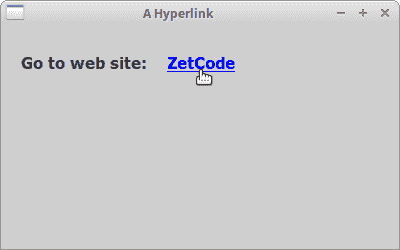
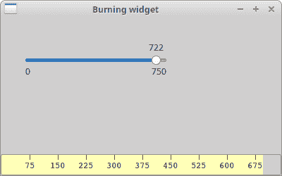
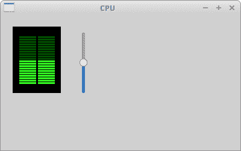

# 创建自定义小部件

> 原文： [http://zetcode.com/wxpython/customwidgets/](http://zetcode.com/wxpython/customwidgets/)

工具箱通常仅提供最常见的窗口小部件，例如按钮，文本窗口小部件，滚动条，滑块等。没有工具箱可以提供所有可能的窗口小部件。 wxPython 有许多小部件； 客户程序员创建了更多专门的小部件。

自定义窗口小部件有两种创建方式：要么修改或增强现有窗口小部件，要么从头开始创建自定义窗口小部件。

## 超链接小部件

第一个示例将创建一个超链接。 超链接小部件将基于现有的`wx.lib.stattext.GenStaticText`小部件。

`hyperlink.py`

```py
#!/usr/bin/env python3
# -*- coding: utf-8 -*-

"""
ZetCode wxPython tutorial

This program creates a Hyperlink widget.

author: Jan Bodnar
website: zetcode.com
last edited: May 2018
"""

import wx
from wx.lib.stattext import GenStaticText
import webbrowser

class Link(GenStaticText):

    def __init__(self, *args, **kw):
        super(Link, self).__init__(*args, **kw)

        self.font1 = wx.Font(11, wx.SWISS, wx.NORMAL, wx.BOLD, True, 'Verdana')
        self.font2 = wx.Font(11, wx.SWISS, wx.NORMAL, wx.BOLD, False, 'Verdana')

        self.SetFont(self.font2)
        self.SetForegroundColour('#0000ff')

        self.Bind(wx.EVT_MOUSE_EVENTS, self.OnMouseEvent)
        self.Bind(wx.EVT_MOTION, self.OnMouseEvent)

    def SetUrl(self, url):

        self.url = url

    def OnMouseEvent(self, e):

        if e.Moving():

            self.SetCursor(wx.Cursor(wx.CURSOR_HAND))
            self.SetFont(self.font1)

        elif e.LeftUp():

            webbrowser.open_new(self.url)

        else:
            self.SetCursor(wx.NullCursor)
            self.SetFont(self.font2)

        e.Skip()

class Example(wx.Frame):

    def __init__(self, *args, **kw):
        super(Example, self).__init__(*args, **kw)

        self.InitUI()

    def InitUI(self):

        panel = wx.Panel(self)

        vbox = wx.BoxSizer(wx.VERTICAL)
        hbox = wx.BoxSizer(wx.HORIZONTAL)

        st = GenStaticText(panel, label='Go to web site:')
        st.SetFont(wx.Font(11, wx.SWISS, wx.NORMAL, wx.BOLD, False, 'Verdana'))
        hbox.Add(st, flag=wx.LEFT, border=20)

        link_wid = Link(panel, label='ZetCode')
        link_wid.SetUrl('http://www.zetcode.com')
        hbox.Add(link_wid, flag=wx.LEFT, border=20)

        vbox.Add(hbox, flag=wx.TOP, border=30)
        panel.SetSizer(vbox)

        self.SetTitle('A Hyperlink')
        self.Centre()

def main():

    app = wx.App()
    ex = Example(None)
    ex.Show()
    app.MainLoop()

if __name__ == '__main__':
    main()

```

此超链接窗口小部件基于现有的窗口小部件。 在此示例中，我们不绘制任何内容，仅使用现有的小部件，对其进行了一些修改。

```py
from wx.lib.stattext import GenStaticText
import webbrowser

```

在这里，我们导入基础窗口小部件，从中可以导出我们的超链接窗口小部件和`webbrowser`模块。 `webbrowser`模块是标准的 Python 模块。 我们将使用它在默认浏览器中打开链接。

```py
self.SetFont(self.font2)
self.SetForegroundColour('#0000ff')

```

创建超链接窗口小部件的想法很简单。 我们从基础`wx.lib.stattext.GenStaticText`小部件类继承。 因此，我们有一个文本小部件。 然后我们对其进行一些修改。 我们更改字体和文本的颜色。

```py
if e.Moving():

    self.SetCursor(wx.Cursor(wx.CURSOR_HAND))
    self.SetFont(self.font1)

```

如果将鼠标指针悬停在链接上，则会将字体更改为带下划线的字体，还将鼠标指针更改为手形光标。

```py
elif e.LeftUp():

    webbrowser.open_new(self.url)

```

如果我们左键单击该链接，则会在默认浏览器中打开该链接。



图：一个超链接小部件

## 刻录小部件

这是我们从头开始创建的小部件的示例。 我们在窗口底部放置一个`wx.Panel`并手动绘制整个窗口小部件。 如果您曾经刻录过 CD 或 DVD，那么您已经看到了这种小部件。

`burning.py`

```py
#!/usr/bin/env python3
# -*- coding: utf-8 -*-

"""
ZetCode wxPython tutorial

This program creates a Burning widget.

author: Jan Bodnar
website: zetcode.com
last edited: May 2018
"""

import wx

class Burning(wx.Panel):
    def __init__(self, parent):
        wx.Panel.__init__(self, parent, size=(-1, 30), style=wx.SUNKEN_BORDER)

        self.parent = parent
        self.font = wx.Font(9, wx.FONTFAMILY_DEFAULT, wx.FONTSTYLE_NORMAL,
            wx.FONTWEIGHT_NORMAL, False, 'Courier 10 Pitch')

        self.Bind(wx.EVT_PAINT, self.OnPaint)
        self.Bind(wx.EVT_SIZE, self.OnSize)

    def OnPaint(self, e):

        num = range(75, 700, 75)
        dc = wx.PaintDC(self)
        dc.SetFont(self.font)
        w, h = self.GetSize()

        self.cw = self.parent.GetParent().cw

        step = int(round(w / 10.0))

        j = 0

        till = (w / 750.0) * self.cw
        full = (w / 750.0) * 700

        if self.cw >= 700:

            dc.SetPen(wx.Pen('#FFFFB8'))
            dc.SetBrush(wx.Brush('#FFFFB8'))
            dc.DrawRectangle(0, 0, full, 30)
            dc.SetPen(wx.Pen('#ffafaf'))
            dc.SetBrush(wx.Brush('#ffafaf'))
            dc.DrawRectangle(full, 0, till-full, 30)
        else:

            dc.SetPen(wx.Pen('#FFFFB8'))
            dc.SetBrush(wx.Brush('#FFFFB8'))
            dc.DrawRectangle(0, 0, till, 30)

        dc.SetPen(wx.Pen('#5C5142'))

        for i in range(step, 10*step, step):

            dc.DrawLine(i, 0, i, 6)
            width, height = dc.GetTextExtent(str(num[j]))
            dc.DrawText(str(num[j]), i-width/2, 8)
            j = j + 1

    def OnSize(self, e):

        self.Refresh()

class Example(wx.Frame):

    def __init__(self, *args, **kwargs):
        super(Example, self).__init__(*args, **kwargs)

        self.InitUI()

    def InitUI(self):

        self.cw = 75

        panel = wx.Panel(self)
        CenterPanel = wx.Panel(panel)

        self.sld = wx.Slider(CenterPanel, value=75, maxValue=750, size=(200, -1),
            style=wx.SL_LABELS)

        vbox = wx.BoxSizer(wx.VERTICAL)
        hbox = wx.BoxSizer(wx.HORIZONTAL)
        hbox2 = wx.BoxSizer(wx.HORIZONTAL)
        hbox3 = wx.BoxSizer(wx.HORIZONTAL)

        self.wid = Burning(panel)
        hbox.Add(self.wid, 1, wx.EXPAND)

        hbox2.Add(CenterPanel, 1, wx.EXPAND)
        hbox3.Add(self.sld, 0, wx.LEFT|wx.TOP, 35)

        CenterPanel.SetSizer(hbox3)

        vbox.Add(hbox2, 1, wx.EXPAND)
        vbox.Add(hbox, 0, wx.EXPAND)

        self.Bind(wx.EVT_SCROLL, self.OnScroll)

        panel.SetSizer(vbox)

        self.sld.SetFocus()

        self.SetTitle("Burning widget")
        self.Centre()

    def OnScroll(self, e):

        self.cw = self.sld.GetValue()
        self.wid.Refresh()

def main():

    app = wx.App()
    ex = Example(None)
    ex.Show()
    app.MainLoop()

if __name__ == '__main__':
    main()

```

此小部件以图形方式显示了介质的总容量和可供我们使用的可用空间。 小部件由滑块控制。 自定义窗口小部件的最小值为 0，最大值为 750。如果值达到 700，则开始绘制红色。 这通常表示过度燃烧。

```py
w, h = self.GetSize()
self.cw = self.parent.GetParent().cw
...
till = (w / 750.0) * self.cw
full = (w / 750.0) * 700

```

我们动态绘制小部件。 窗口越大，刻录小部件越大。 反之亦然。 这就是为什么我们必须计算在其上绘制自定义窗口小部件的`wx.Panel`的大小。 `till`参数确定要绘制的总大小。 该值来自滑块小部件。 它占整个面积的一部分。 `full`参数确定了我们开始绘制红色的点。 注意使用浮点算法。 这是为了达到更高的精度。

实际图纸包括三个步骤。 我们绘制黄色或红色和黄色矩形。 然后，我们绘制垂直线，这些垂直线将小部件分为几个部分。 最后，我们画出数字来表示介质的容量。

```py
def OnSize(self, e):

    self.Refresh()

```

每次调整窗口大小时，我们都会刷新小部件。 这将导致小部件重新绘制自身。

```py
def OnScroll(self, e):

    self.cw = self.sld.GetValue()
    self.wid.Refresh()

```

如果滚动滑块的拇指，我们将获得实际值并将其保存到`self.cw`参数中。 绘制刻录窗口小部件时使用此值。 然后，我们使小部件重新绘制。



图：刻录小部件

## CPU 小部件

有一些系统应用可以测量系统资源，例如温度，内存或 CPU 消耗。 创建专用的小部件以使应用更具吸引力。

以下窗口小部件通常在系统应用中使用。

`cpu.py`

```py
#!/usr/bin/env python3
# -*- coding: utf-8 -*-

"""
ZetCode wxPython tutorial

This program creates a CPU widget.

author: Jan Bodnar
website: zetcode.com
last edited: May 2018
"""

import wx

class CPU(wx.Panel):

    def __init__(self, parent):
        wx.Panel.__init__(self, parent, size=(80, 110))

        self.parent = parent
        self.SetBackgroundColour('#000000')
        self.Bind(wx.EVT_PAINT, self.OnPaint)

    def OnPaint(self, e):

        dc = wx.PaintDC(self)

        dc.SetDeviceOrigin(0, 100)
        dc.SetAxisOrientation(True, True)

        pos = self.parent.GetParent().GetParent().sel
        rect = pos / 5

        for i in range(1, 21):

            if i > rect:

                dc.SetBrush(wx.Brush('#075100'))
                dc.DrawRectangle(10, i*4, 30, 5)
                dc.DrawRectangle(41, i*4, 30, 5)

            else:
                dc.SetBrush(wx.Brush('#36ff27'))
                dc.DrawRectangle(10, i*4, 30, 5)
                dc.DrawRectangle(41, i*4, 30, 5)

class Example(wx.Frame):

    def __init__(self, *args, **kwargs):
        super(Example, self).__init__(*args, **kwargs)

        self.InitUI()

    def InitUI(self):

        self.sel = 0

        panel = wx.Panel(self)
        centerPanel = wx.Panel(panel)

        self.cpu = CPU(centerPanel)

        hbox = wx.BoxSizer(wx.HORIZONTAL)

        self.slider = wx.Slider(panel, value=self.sel, maxValue=100, size=(-1, 100),
		      style=wx.VERTICAL | wx.SL_INVERSE)
        self.slider.SetFocus()

        hbox.Add(centerPanel, 0,  wx.LEFT | wx.TOP, 20)
        hbox.Add(self.slider, 0, wx.LEFT | wx.TOP, 30)

        self.Bind(wx.EVT_SCROLL, self.OnScroll)

        panel.SetSizer(hbox)

        self.SetTitle("CPU")
        self.Centre()

    def OnScroll(self, e):

        self.sel = e.GetInt()
        self.cpu.Refresh()

def main():

    app = wx.App()
    ex = Example(None)
    ex.Show()
    app.MainLoop()

if __name__ == '__main__':
    main()

```

我们创建一个黑色面板。 然后，我们在此面板上绘制小矩形。 矩形的颜色取决于滑块的值。 颜色可以是深绿色或亮绿色。

```py
dc.SetDeviceOrigin(0, 100)
dc.SetAxisOrientation(True, True)

```

在这里，我们将默认坐标系更改为笛卡尔坐标。 这是为了使图形直观。

```py
pos = self.parent.GetParent().GetParent().sel
rect = pos / 5

```

在这里，我们获得了大小调整器的值。 每列有 20 个矩形。 滑块有 100 个数字。 `rect`参数将滑块值转换为以鲜绿色绘制的矩形。

```py
for i in range(1, 21):

    if i > rect:
        dc.SetBrush(wx.Brush('#075100'))
        dc.DrawRectangle(10, i*4, 30, 5)
        dc.DrawRectangle(41, i*4, 30, 5)

    else:
        dc.SetBrush(wx.Brush('#36ff27'))
        dc.DrawRectangle(10, i*4, 30, 5)
        dc.DrawRectangle(41, i*4, 30, 5)

```

这里我们绘制 40 个矩形，每列 20 个。 如果要绘制的矩形的数目大于转换后的`rect`值，则将其绘制为深绿色；否则，将其绘制为深绿色。 否则为亮绿色。



图：`CPU`小部件

在本章中，我们在 wxPython 中创建了自定义窗口小部件。