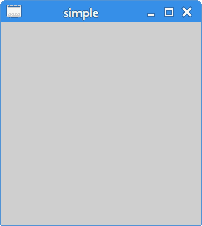
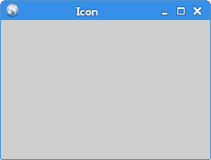
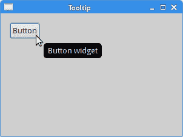
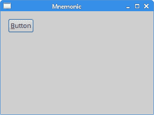

# GTK+ 中的第一个程序

> 原文： [http://zetcode.com/gui/gtk2/firstprograms/](http://zetcode.com/gui/gtk2/firstprograms/)

在 GTK+ 编程教程的这一部分中，我们在 GTK+ 中创建第一个程序。 我们在屏幕上居中放置一个窗口，在标题栏中显示一个图标，显示一个小的工具提示，并为按钮小部件创建一个助记符。

## 简单的例子

我们的第一个示例显示了一个基本窗口。

`simple.c`

```c
#include <gtk/gtk.h>

int main(int argc, char *argv[]) {

  GtkWidget *window;

  gtk_init(&argc, &argv);

  window = gtk_window_new(GTK_WINDOW_TOPLEVEL);
  gtk_widget_show(window);

  g_signal_connect(window, "destroy",
      G_CALLBACK(gtk_main_quit), NULL);  

  gtk_main();

  return 0;
}

```

本示例在屏幕上显示一个基本窗口。

```c
GtkWidget *window;

```

`GtkWidget`是 GTK+ 中所有小部件都派生的基类。 它管理小部件的生命周期，状态和样式。

```c
gtk_init(&argc, &argv);

```

`gtk_init()`函数初始化 GTK+ 并解析一些标准命令行选项。 在使用任何其他 GTK+ 函数之前，必须先调用此函数。

```c
window = gtk_window_new(GTK_WINDOW_TOPLEVEL);

```

`gtk_window_new()`函数创建一个新的`GtkWindow`，这是一个可以包含其他窗口小部件的顶层窗口。 窗口类型为`GTK_WINDOW_TOPLEVEL`； 顶层窗口具有标题栏和边框。 它们由窗口管理器管理。

```c
gtk_widget_show(window);

```

`get_widget_show()`标记要显示的小部件。 任何未显示的小部件都不会出现在屏幕上。

```c
g_signal_connect(window, "destroy",
    G_CALLBACK(gtk_main_quit), NULL);  

```

`g_signal_connect()`函数将回调函数连接到特定对象的信号。 默认情况下，该窗口不响应`destroy`信号。 我们必须通过将`destroy`信号连接到内置的`gtk_main_quit()`函数来显式终止应用，该函数会终止应用。

```c
gtk_main();

```

该代码进入 GTK+ 主循环。 从这一点开始，应用就坐下来等待事件发生。

```c
$ gcc -o simple simple.c `pkg-config --libs --cflags gtk+-2.0`

```

这就是我们编译示例的方式。



Figure: Simple

## 使窗口居中

如果我们不自己定位窗口，则窗口管理器将为我们定位。 在下一个示例中，我们将窗口居中。

`center.c`

```c
#include <gtk/gtk.h>

int main(int argc, char *argv[]) {

  GtkWidget *window;

  gtk_init(&argc, &argv);

  window = gtk_window_new(GTK_WINDOW_TOPLEVEL);
  gtk_window_set_title(GTK_WINDOW(window), "Center");
  gtk_window_set_default_size(GTK_WINDOW(window), 230, 150);
  gtk_window_set_position(GTK_WINDOW(window), GTK_WIN_POS_CENTER);
  gtk_widget_show(window);

  g_signal_connect(G_OBJECT(window), "destroy",
      G_CALLBACK(gtk_main_quit), NULL);

  gtk_main();

  return 0;
}

```

在示例中，我们将窗口居中，设置标题，并调整窗口大小。

```c
gtk_window_set_title(GTK_WINDOW(window), "Center");

```

`gtk_window_set_title()`功能设置窗口标题。 如果我们自己不设置标题，则 GTK+ 将使用源文件的名称作为标题。

```c
gtk_window_set_default_size(GTK_WINDOW(window), 230, 150);

```

此`gtk_window_set_default_size()`将窗口的大小设置为 230x150。 请注意，我们谈论的是客户区域，不包括窗口管理器提供的装饰。

```c
gtk_window_set_position(GTK_WINDOW(window), GTK_WIN_POS_CENTER);

```

将`GTK_WIN_POS_CENTER`常量传递给`gtk_window_set_position()`函数，使程序在屏幕上居中。

## 应用图标

在下一个示例中，我们显示应用图标。 大多数窗口管理器在标题栏的左上角以及任务栏上都显示图标。

`icon.c`

```c
#include <gtk/gtk.h>

GdkPixbuf *create_pixbuf(const gchar * filename) {

   GdkPixbuf *pixbuf;
   GError *error = NULL;
   pixbuf = gdk_pixbuf_new_from_file(filename, &error);

   if (!pixbuf) {

      fprintf(stderr, "%s\n", error->message);
      g_error_free(error);
   }

   return pixbuf;
}

int main(int argc, char *argv[]) {

  GtkWidget *window;
  GdkPixbuf *icon;

  gtk_init(&argc, &argv);

  window = gtk_window_new(GTK_WINDOW_TOPLEVEL);
  gtk_window_set_title(GTK_WINDOW(window), "Icon");
  gtk_window_set_default_size(GTK_WINDOW(window), 230, 150);
  gtk_window_set_position(GTK_WINDOW(window), GTK_WIN_POS_CENTER);

  icon = create_pixbuf("web.png");  
  gtk_window_set_icon(GTK_WINDOW(window), icon);

  gtk_widget_show(window);

  g_signal_connect(G_OBJECT(window), "destroy",
      G_CALLBACK(gtk_main_quit), NULL);

  g_object_unref(icon);    

  gtk_main();

  return 0;
}

```

该代码示例显示了一个应用图标。

```c
pixbuf = gdk_pixbuf_new_from_file(filename, &error);

```

`gdk_pixbuf_new_from_file()`功能通过从文件加载图像来创建新的 pixbuf。 自动检测文件格式。 如果返回 NULL，则将设置错误。

```c
if (!pixbuf) {

    fprintf(stderr, "%s\n", error->message);
    g_error_free(error);
}

```

如果无法加载该图标，则会显示一条错误消息。

```c
icon = create_pixbuf("web.png");  
gtk_window_set_icon(GTK_WINDOW(window), icon);

```

`gtk_window_set_icon()`显示窗口的图标。 `create_pixbuf()`从 PNG 文件创建`GdkPixbuf`。

```c
g_object_unref(icon);

```

`g_object_unref()`减少 pixbuf 对象的参考计数。 当其引用计数降至 0 时，该对象将被终结（即释放其内存）。



Figure: Icon

## 工具提示

工具提示是一个小的矩形窗口，它提供有关对象的简短信息。 它通常是一个 GUI 组件。 它是应用帮助系统的一部分。

`tooltip.c`

```c
#include <gtk/gtk.h>

int main(int argc, char *argv[]) {

  GtkWidget *window;
  GtkWidget *button;
  GtkWidget *halign;

  gtk_init(&argc, &argv);

  window = gtk_window_new(GTK_WINDOW_TOPLEVEL);
  gtk_window_set_title(GTK_WINDOW(window), "Tooltip");
  gtk_window_set_default_size(GTK_WINDOW(window), 300, 200);
  gtk_container_set_border_width(GTK_CONTAINER(window), 15);

  button = gtk_button_new_with_label("Button");
  gtk_widget_set_tooltip_text(button, "Button widget");

  halign = gtk_alignment_new(0, 0, 0, 0);
  gtk_container_add(GTK_CONTAINER(halign), button);
  gtk_container_add(GTK_CONTAINER(window), halign);  

  gtk_widget_show_all(window);

  g_signal_connect(G_OBJECT(window), "destroy",
      G_CALLBACK(gtk_main_quit), NULL);  

  gtk_main();

  return 0;
}

```

该示例显示了按钮小部件上的基本工具提示。

```c
gtk_container_set_border_width(GTK_CONTAINER(window), 15);

```

`gtk_container_set_border_width()`在窗口边缘周围设置一些边框空间。

```c
gtk_widget_set_tooltip_text(button, "Button widget");

```

`gtk_widget_set_tooltip_text()`设置给定窗口小部件的基本工具提示。

```c
halign = gtk_alignment_new(0, 0, 0, 0);
gtk_container_add(GTK_CONTAINER(halign), button);

```

`GtkAlignment`是一个基本容器，可用于将其子控件与窗口的侧面对齐。 在我们的例子中，该按钮位于窗口的左上角。 该函数的第一个参数是 xalign 和 yalign。 xalign 的值为 0 表示左对齐； yalign 的值为 0 表示顶部对齐。 第三和第四参数是缩放值。 将两个参数都传递 0 表示小部件不会在两个方向上展开。

```c
gtk_container_add(GTK_CONTAINER(window), halign);

```

`GtkAlignment`被设置为窗口的主要容器。

```c
gtk_widget_show_all(window);

```

当我们处理多个窗口小部件时，在容器上调用`gtk_widget_show_all()`比单独显示所有窗口小部件容易。 在我们的例子中，窗口和按钮都显示在一个镜头中。



Figure: Tooltip

## 助记符

助记符是用于激活支持助记符的窗口小部件的快捷键。 它们可以与标签，按钮或菜单项一起使用。 助记符是通过在小部件的标签上添加字符来创建的。 它使下一个字符成为助记符。 字符与无鼠标修饰符（通常为 `Alt` ）结合在一起。 选择的字符带有下划线，但是可以以平台特定的方式强调。 在某些平台上，仅在按下无鼠标修饰符后才对字符加下划线。

`mnemonic.c`

```c
#include <gtk/gtk.h>

void print_msg(GtkWidget *widget, gpointer window) {

  g_printf("Button clicked\n");
}

int main(int argc, char *argv[]) {

  GtkWidget *window;
  GtkWidget *button;
  GtkWidget *halign;

  gtk_init(&argc, &argv);

  window = gtk_window_new(GTK_WINDOW_TOPLEVEL);
  gtk_window_set_title(GTK_WINDOW(window), "Mnemonic");
  gtk_window_set_default_size(GTK_WINDOW(window), 300, 200);
  gtk_container_set_border_width(GTK_CONTAINER(window), 15);

  button = gtk_button_new_with_mnemonic("_Button");

  g_signal_connect(button, "clicked", 
      G_CALLBACK(print_msg), NULL);  

  halign = gtk_alignment_new(0, 0, 0, 0);
  gtk_container_add(GTK_CONTAINER(halign), button);
  gtk_container_add(GTK_CONTAINER(window), halign);  

  gtk_widget_show_all(window);

  g_signal_connect(G_OBJECT(window), "destroy",
      G_CALLBACK(gtk_main_quit), NULL); 

  gtk_main();

  return 0;
}

```

我们为按钮小部件设置了助记符。 可以使用 `Alt` + `B` 键盘快捷键激活。

```c
button = gtk_button_new_with_mnemonic("_Button");

```

`gtk_button_new_with_mnemonic()`函数创建一个包含标签的新`GtkButton`。 如果标签中的字符前面带有下划线，则会在其下划线。

```c
g_signal_connect(button, "clicked", 
    G_CALLBACK(print_msg), NULL); 

```

当我们触发按钮时，一条消息会打印到控制台上。 通过`g_signal_connect()`功能，我们将`clicked`信号连接到`print_msg`功能。

目前，有三种激活按钮的方式：单击鼠标左键， `Alt` + `B` 快捷方式以及`空格键` 按钮具有焦点）。



Figure: Mnemonic

在本章中，我们创建了一些简单的 GTK+ 程序。