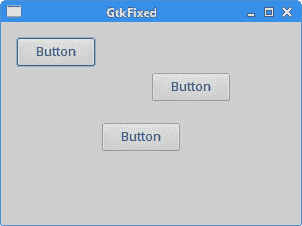
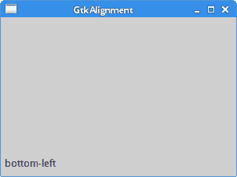
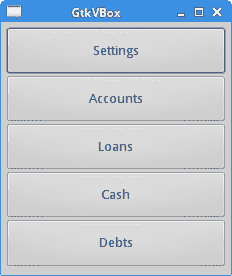
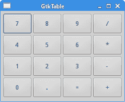
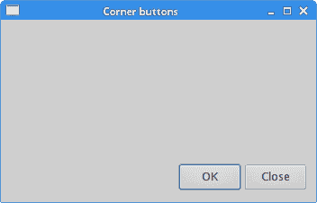
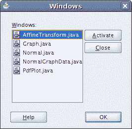
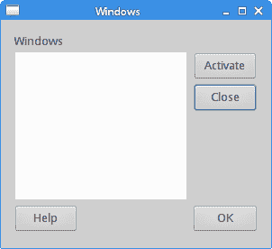

# GTK+ 布局管理

> 原文： [http://zetcode.com/gui/gtk2/gtklayoutmanagement/](http://zetcode.com/gui/gtk2/gtklayoutmanagement/)

在本章中，我们将展示如何在窗口或对话框中布置窗口小部件。

在设计应用的 UI 时，我们决定要使用哪些小部件以及如何组织这些小部件。 为了组织窗口小部件，我们使用称为布局容器的专用非可见窗口小部件。 在本章中，我们将提及`GtkAlignment`，`GtkFixed`，`GtkVBox`和`GtkTable`。

## `GtkFixed`

`GtkFixed`容器将子窗口小部件放置在固定位置并具有固定大小。 此容器不执行自动布局管理。 因此，它不适用于翻译，字体更改或主题。 在大多数应用中，我们不使用`GtkFixed`容器。 可能会有一些专门的区域可以使用容器（例如，定位图或图像）。

`fixed.c`

```c
#include <gtk/gtk.h>

int main(int argc, char *argv[]) {

  GtkWidget *window;
  GtkWidget *fixed;

  GtkWidget *btn1;
  GtkWidget *btn2;
  GtkWidget *btn3;

  gtk_init(&argc, &argv);

  window = gtk_window_new(GTK_WINDOW_TOPLEVEL);
  gtk_window_set_title(GTK_WINDOW(window), "GtkFixed");
  gtk_window_set_default_size(GTK_WINDOW(window), 300, 200);
  gtk_window_set_position(GTK_WINDOW(window), GTK_WIN_POS_CENTER);

  fixed = gtk_fixed_new();
  gtk_container_add(GTK_CONTAINER(window), fixed);

  btn1 = gtk_button_new_with_label("Button");
  gtk_fixed_put(GTK_FIXED(fixed), btn1, 150, 50);
  gtk_widget_set_size_request(btn1, 80, 30);

  btn2 = gtk_button_new_with_label("Button");
  gtk_fixed_put(GTK_FIXED(fixed), btn2, 15, 15);
  gtk_widget_set_size_request(btn2, 80, 30);

  btn3 = gtk_button_new_with_label("Button");
  gtk_fixed_put(GTK_FIXED(fixed), btn3, 100, 100);
  gtk_widget_set_size_request(btn3, 80, 30);

  g_signal_connect(G_OBJECT(window), "destroy", 
      G_CALLBACK(gtk_main_quit), NULL);

  gtk_widget_show_all(window);

  gtk_main();

  return 0;
}

```

在我们的示例中，我们创建了三个按钮并将它们放置在固定坐标上。 当我们调整应用窗口的大小时，按钮将保持其大小和位置。

```c
fixed = gtk_fixed_new();

```

`get_fixed_new()`函数创建一个`GtkFixed`容器。

```c
gtk_fixed_put(GTK_FIXED(fixed), btn1, 150, 50);

```

使用`gtk_fixed_put()`功能将第一个按钮放置在坐标 x = 150 和 y = 50 处。

```c
gtk_widget_set_size_request(btn1, 80, 30);

```

`gtk_widget_set_size_request()`设置小部件的最小大小。 它是小部件可以接受的最小尺寸，同时仍可以正常运行并正确绘制自身。



Figure: GtkFixed container

## `GtkAlignment`

`GtkAlignment`控制小部件的对齐。 此外，它可以管理其缩放比例。

`bottomleft.c`

```c
#include <gtk/gtk.h>

int main(int argc, char *argv[]) {

  GtkWidget *window;
  GtkWidget *align;

  GtkWidget *lbl;

  gtk_init(&argc, &argv);

  window = gtk_window_new(GTK_WINDOW_TOPLEVEL);
  gtk_window_set_title(GTK_WINDOW(window), "GtkAlignment");
  gtk_window_set_default_size(GTK_WINDOW(window), 300, 200);
  gtk_window_set_position(GTK_WINDOW(window), GTK_WIN_POS_CENTER);
  gtk_container_set_border_width(GTK_CONTAINER(window), 5);

  align = gtk_alignment_new(0, 1, 0, 0);
  lbl = gtk_label_new("bottom-left");

  gtk_container_add(GTK_CONTAINER(align), lbl);
  gtk_container_add(GTK_CONTAINER(window), align);

  g_signal_connect(G_OBJECT(window), "destroy", 
      G_CALLBACK(gtk_main_quit), NULL);

  gtk_widget_show_all(window);

  gtk_main();

  return 0;
}

```

在示例中，标签位于窗口的左下角。

```c
align = gtk_alignment_new(0, 1, 0, 0);

```

`gtk_alignment_new()`函数创建`GtkAlignment`容器。 参数的取值范围是 0 到 1。第一个参数是水平对齐方式，其中 0 左，1 右。 第二个参数是垂直对齐方式，其中 0 是顶部，1 是底部。 第三个参数是水平比例尺，它是子窗口小部件水平扩展以填充未使用空间的数量。 值为 0 表示子窗口小部件永远不应扩展。 最后一个参数是垂直刻度。

```c
lbl = gtk_label_new("bottom-left");

```

使用`gtk_label_new()`功能创建标签窗口小部件。

```c
gtk_container_add(GTK_CONTAINER(align), lbl);

```

标签被添加到`GtkAlignment`容器中。

```c
gtk_container_add(GTK_CONTAINER(window), align);

```

最后，将对齐容器放入窗口中。



Figure: GtkAlignment

## `GtkVBox`

`GtkVBox`是一个垂直盒式容器。 它将其子窗口小部件放置在单个列中。 `GtkHBox`是一个非常相似的容器； 它将其子窗口小部件放在一行中。

`vbox.c`

```c
#include <gtk/gtk.h>

int main(int argc, char *argv[]) {

  GtkWidget *window;
  GtkWidget *vbox;

  GtkWidget *settings;
  GtkWidget *accounts;
  GtkWidget *loans;
  GtkWidget *cash;
  GtkWidget *debts;

  gtk_init(&argc, &argv);

  window = gtk_window_new(GTK_WINDOW_TOPLEVEL);
  gtk_window_set_position(GTK_WINDOW(window), GTK_WIN_POS_CENTER);
  gtk_window_set_default_size(GTK_WINDOW(window), 230, 250);
  gtk_window_set_title(GTK_WINDOW(window), "GtkVBox");
  gtk_container_set_border_width(GTK_CONTAINER(window), 5);

  vbox = gtk_vbox_new(TRUE, 1);
  gtk_container_add(GTK_CONTAINER(window), vbox);

  settings = gtk_button_new_with_label("Settings");
  accounts = gtk_button_new_with_label("Accounts");
  loans = gtk_button_new_with_label("Loans");
  cash = gtk_button_new_with_label("Cash");
  debts = gtk_button_new_with_label("Debts");

  gtk_box_pack_start(GTK_BOX(vbox), settings, TRUE, TRUE, 0);
  gtk_box_pack_start(GTK_BOX(vbox), accounts, TRUE, TRUE, 0);
  gtk_box_pack_start(GTK_BOX(vbox), loans, TRUE, TRUE, 0);
  gtk_box_pack_start(GTK_BOX(vbox), cash, TRUE, TRUE, 0);
  gtk_box_pack_start(GTK_BOX(vbox), debts, TRUE, TRUE, 0);

  g_signal_connect(G_OBJECT(window), "destroy",
        G_CALLBACK(gtk_main_quit), G_OBJECT(window));

  gtk_widget_show_all(window);

  gtk_main();

  return 0;
}

```

本示例将五个按钮打包到一栏中。 如果我们调整应用窗口的大小，则子窗口小部件也将被调整大小。

```c
vbox = gtk_vbox_new(TRUE, 1);

```

`gtk_vbox_new()`函数创建一个`GtkVBox`容器。 我们将`homogeneous`参数设置为`TRUE`。 这意味着我们所有的按钮都将具有相同的大小。 小部件之间的间距设置为 1 像素。

```c
gtk_box_pack_start(GTK_BOX(vbox), settings, TRUE, TRUE, 0);

```

`gtk_box_pack_start()`功能将小部件添加到框中。 前两个参数是 box 容器和子窗口小部件。 接下来的三个参数是`expand`，`fill`和`padding`。 注意，如果`expand`参数设置为`FALSE`，则 fill 参数无效。 同样，如果我们创建的容器的均质参数设置为`TRUE`，则`expand`参数无效。 在我们的情况下，当窗口放大且窗口小部件填充额外区域时，“设置”按钮将获得额外的空间。



Figure: GtkVBox container

## `GtkTable`

`GtkTable`小部件按行和列排列小部件。

`table.c`

```c
#include <gtk/gtk.h>

int main(int argc, char *argv[]) {

  GtkWidget *window;
  GtkWidget *table;
  GtkWidget *button;

  gchar *values[16] = { "7", "8", "9", "/", 
     "4", "5", "6", "*",
     "1", "2", "3", "-",
     "0", ".", "=", "+"
  };

  gtk_init(&argc, &argv);

  window = gtk_window_new(GTK_WINDOW_TOPLEVEL);
  gtk_window_set_position(GTK_WINDOW(window), GTK_WIN_POS_CENTER);
  gtk_window_set_default_size(GTK_WINDOW(window), 250, 180);
  gtk_window_set_title(GTK_WINDOW(window), "GtkTable");

  gtk_container_set_border_width(GTK_CONTAINER(window), 5);

  table = gtk_table_new(4, 4, TRUE);
  gtk_table_set_row_spacings(GTK_TABLE(table), 2);
  gtk_table_set_col_spacings(GTK_TABLE(table), 2);

  int i = 0;
  int j = 0;
  int pos = 0;

  for (i=0; i < 4; i++) {
    for (j=0; j < 4; j++) {
      button = gtk_button_new_with_label(values[pos]);
      gtk_table_attach_defaults(GTK_TABLE(table), button, j, j+1, i, i+1);
      pos++;
    }
  }

  gtk_container_add(GTK_CONTAINER(window), table);

  g_signal_connect(G_OBJECT(window), "destroy",
        G_CALLBACK(gtk_main_quit), NULL);

  gtk_widget_show_all(window);

  gtk_main();

  return 0;
}

```

在此示例中，我们创建了一组在计算器中看到的按钮。

```c
table = gtk_table_new(4, 4, TRUE);

```

我们创建一个具有 4 行 4 列的新`GtkTable`小部件。 当我们将`TRUE`传递给第三个参数时，所有表单元格的大小都将调整为包含最大窗口小部件的单元格的大小。

```c
gtk_table_set_row_spacings(GTK_TABLE(table), 2);
gtk_table_set_col_spacings(GTK_TABLE(table), 2);

```

我们在行和列之间设置一些空间。

```c
for (i=0; i < 4; i++) {
  for (j=0; j < 4; j++) {
    button = gtk_button_new_with_label(values[pos]);
    gtk_table_attach_defaults(GTK_TABLE(table), button, j, j+1, i, i+1 );
    pos++;
  }
}

```

这段代码创建了 16 个按钮，并将它们放入容器中。 `gtk_table_attach_defaults()`将子项添加到具有相同填充和扩展选项的表容器中。



Figure: GtkTable

## 角按钮

下一个示例在窗口的右下角放置两个按钮。

`cornerbuttons.c`

```c
#include <gtk/gtk.h>

int main(int argc, char *argv[]) {

  GtkWidget *window;
  GtkWidget *okBtn;
  GtkWidget *clsBtn;

  GtkWidget *vbox;
  GtkWidget *hbox;
  GtkWidget *halign;
  GtkWidget *valign;

  gtk_init(&argc, &argv);

  window = gtk_window_new(GTK_WINDOW_TOPLEVEL);
  gtk_window_set_position(GTK_WINDOW(window), GTK_WIN_POS_CENTER);
  gtk_window_set_default_size(GTK_WINDOW(window), 350, 200);
  gtk_window_set_title(GTK_WINDOW(window), "Corner buttons");
  gtk_container_set_border_width(GTK_CONTAINER(window), 10);

  vbox = gtk_vbox_new(FALSE, 5);

  valign = gtk_alignment_new(0, 1, 0, 0);
  gtk_container_add(GTK_CONTAINER(vbox), valign);
  gtk_container_add(GTK_CONTAINER(window), vbox);

  hbox = gtk_hbox_new(TRUE, 3);

  okBtn = gtk_button_new_with_label("OK");
  gtk_widget_set_size_request(okBtn, 70, 30);
  gtk_container_add(GTK_CONTAINER(hbox), okBtn);
  clsBtn = gtk_button_new_with_label("Close");
  gtk_container_add(GTK_CONTAINER(hbox), clsBtn);

  halign = gtk_alignment_new(1, 0, 0, 0);
  gtk_container_add(GTK_CONTAINER(halign), hbox);

  gtk_box_pack_start(GTK_BOX(vbox), halign, FALSE, FALSE, 0);

  g_signal_connect(G_OBJECT(window), "destroy",
        G_CALLBACK(gtk_main_quit), G_OBJECT(window));

  gtk_widget_show_all(window);

  gtk_main();

  return 0;
}

```

在示例中，我们使用一个水平框，一个垂直框和两个对齐容器。

```c
valign = gtk_alignment_new(0, 1, 0, 0);

```

此对齐容器将其子窗口小部件放在底部。

```c
gtk_container_add(GTK_CONTAINER(vbox), valign);

```

在这里，我们将对齐小部件放置在垂直框中。

```c
hbox = gtk_hbox_new(TRUE, 3);

okBtn = gtk_button_new_with_label("OK");
gtk_widget_set_size_request(okBtn, 70, 30);
gtk_container_add(GTK_CONTAINER(hbox), okBtn);
clsBtn = gtk_button_new_with_label("Close");
gtk_container_add(GTK_CONTAINER(hbox), clsBtn);

```

我们创建一个水平框，并在其中放置两个按钮。 `gtk_widget_set_size_request()`设置小部件的最小尺寸。 由于我们已经将`GtkHBox`的`homogeneous`参数设置为`TRUE`，因此另一个按钮也被调整为新的尺寸。

```c
halign = gtk_alignment_new(1, 0, 0, 0);
gtk_container_add(GTK_CONTAINER(halign), hbox);

gtk_box_pack_start(GTK_BOX(vbox), halign, FALSE, FALSE, 0);

```

这将创建一个对齐容器，将其子窗口小部件放在右侧。 我们将水平框添加到对齐容器中，然后将对齐容器包装到垂直框中。 对齐容器只能使用一个子窗口小部件； 因此，我们还必须使用盒子。



Figure: Corner buttons

## 窗口

接下来，我们将创建一个更高级的示例。 我们显示一个可以在 JDeveloper 中找到的窗口。



Figure: Windows dialog in JDeveloper

该对话框显示所有打开的窗口，或更确切地说是 JDeveloper 应用中的选项卡。

`windows.c`

```c
#include <gtk/gtk.h>

int main(int argc, char *argv[]) {

  GtkWidget *window;
  GtkWidget *table;
  GtkWidget *title;
  GtkWidget *wins;

  GtkWidget *halign;
  GtkWidget *halign2;
  GtkWidget *valign;

  GtkWidget *actBtn;
  GtkWidget *clsBtn;
  GtkWidget *hlpBtn;
  GtkWidget *okBtn;

  gtk_init(&argc, &argv);

  window = gtk_window_new(GTK_WINDOW_TOPLEVEL);
  gtk_window_set_position(GTK_WINDOW(window), GTK_WIN_POS_CENTER);
  gtk_widget_set_size_request (window, 300, 250);

  gtk_window_set_title(GTK_WINDOW(window), "Windows");

  gtk_container_set_border_width(GTK_CONTAINER(window), 15);

  table = gtk_table_new(6, 4, FALSE);
  gtk_table_set_col_spacings(GTK_TABLE(table), 3);
  gtk_table_set_row_spacing(GTK_TABLE(table), 0, 3);

  title = gtk_label_new("Windows");
  halign = gtk_alignment_new(0, 0, 0, 0);
  gtk_container_add(GTK_CONTAINER(halign), title);
  gtk_table_attach(GTK_TABLE(table), halign, 0, 1, 0, 1, 
      GTK_FILL, GTK_FILL, 0, 0);

  wins = gtk_text_view_new();
  gtk_text_view_set_editable(GTK_TEXT_VIEW(wins), FALSE);
  gtk_text_view_set_cursor_visible(GTK_TEXT_VIEW(wins), FALSE);
  gtk_table_attach(GTK_TABLE(table), wins, 0, 2, 1, 3, 
      GTK_FILL | GTK_EXPAND, GTK_FILL | GTK_EXPAND, 1, 1);

  actBtn = gtk_button_new_with_label("Activate");
  gtk_widget_set_size_request(actBtn, 50, 30);
  gtk_table_attach(GTK_TABLE(table), actBtn, 3, 4, 1, 2, 
      GTK_FILL, GTK_SHRINK, 1, 1);

  valign = gtk_alignment_new(0, 0, 0, 0);
  clsBtn = gtk_button_new_with_label("Close");

  gtk_widget_set_size_request(clsBtn, 70, 30);
  gtk_container_add(GTK_CONTAINER(valign), clsBtn);
  gtk_table_set_row_spacing(GTK_TABLE(table), 1, 3);
  gtk_table_attach(GTK_TABLE(table), valign, 3, 4, 2, 3, 
      GTK_FILL, GTK_FILL | GTK_EXPAND, 1, 1);

  halign2 = gtk_alignment_new(0, 1, 0, 0);
  hlpBtn = gtk_button_new_with_label("Help");
  gtk_container_add(GTK_CONTAINER(halign2), hlpBtn);
  gtk_widget_set_size_request(hlpBtn, 70, 30);
  gtk_table_set_row_spacing(GTK_TABLE(table), 3, 5);
  gtk_table_attach(GTK_TABLE(table), halign2, 0, 1, 4, 5, 
      GTK_FILL, GTK_FILL, 0, 0);

  okBtn = gtk_button_new_with_label("OK");
  gtk_widget_set_size_request(okBtn, 70, 30);
  gtk_table_attach(GTK_TABLE(table), okBtn, 3, 4, 4, 5, 
      GTK_FILL, GTK_FILL, 0, 0);

  gtk_container_add(GTK_CONTAINER(window), table);

  g_signal_connect(G_OBJECT(window), "destroy",
        G_CALLBACK(gtk_main_quit), G_OBJECT(window));

  gtk_widget_show_all(window);
  gtk_main();

  return 0;
}

```

该示例使用一个表容器和三个对齐容器。

```c
table = gtk_table_new(6, 4, FALSE);

```

创建一个`GtkTable`容器。 它有六行四列。

```c
gtk_table_set_col_spacings(GTK_TABLE(table), 3);

```

`gtk_table_set_col_spacings()`将表中每列之间的间隔设置为 3。

```c
gtk_table_set_row_spacing(GTK_TABLE(table), 0, 3);

```

`gtk_table_row_spacing()`设置第一行和第二行之间的空间。

```c
title = gtk_label_new("Windows");
halign = gtk_alignment_new(0, 0, 0, 0);
gtk_container_add(GTK_CONTAINER(halign), title);
gtk_table_attach(GTK_TABLE(table), halign, 0, 1, 0, 1, 
    GTK_FILL, GTK_FILL, 0, 0);

```

这段代码创建了一个左对齐的标签。 标签放置在`GtkTable`容器的第一行和第一列中。

```c
wins = gtk_text_view_new();
gtk_text_view_set_editable(GTK_TEXT_VIEW(wins), FALSE);
gtk_text_view_set_cursor_visible(GTK_TEXT_VIEW(wins), FALSE);
gtk_table_attach(GTK_TABLE(table), wins, 0, 2, 1, 3, 
    GTK_FILL | GTK_EXPAND, GTK_FILL | GTK_EXPAND, 1, 1);

```

`GtkText`小部件跨越两行两列。 我们使用`gtk_text_view_set_editable()`方法使窗口小部件不可编辑，并使用`gtk_text_view_set_cursor_visible()`方法隐藏其光标。

```c
valign = gtk_alignment_new(0, 0, 0, 0);
clsBtn = gtk_button_new_with_label("Close");

gtk_widget_set_size_request(clsBtn, 70, 30);
gtk_container_add(GTK_CONTAINER(valign), clsBtn);
gtk_table_set_row_spacing(GTK_TABLE(table), 1, 3);
gtk_table_attach(GTK_TABLE(table), valign, 3, 4, 2, 3, 
    GTK_FILL, GTK_FILL | GTK_EXPAND, 1, 1);

```

我们将“关闭”按钮放在文本视图窗口小部件旁边的第四列中。 我们将按钮添加到对齐小部件中，以便我们可以将其对齐到顶部。

```c
halign2 = gtk_alignment_new(0, 1, 0, 0);
hlpBtn = gtk_button_new_with_label("Help");
gtk_container_add(GTK_CONTAINER(halign2), hlpBtn);
gtk_widget_set_size_request(hlpBtn, 70, 30);
gtk_table_set_row_spacing(GTK_TABLE(table), 3, 5);
gtk_table_attach(GTK_TABLE(table), halign2, 0, 1, 4, 5, 
    GTK_FILL, GTK_FILL, 0, 0);

```

“帮助”按钮向左对齐。 它位于文本小部件下方。 我们在文本小部件和按钮之间放置一些空间。

```c
okBtn = gtk_button_new_with_label("OK");
gtk_widget_set_size_request(okBtn, 70, 30);
gtk_table_attach(GTK_TABLE(table), okBtn, 3, 4, 4, 5, 
    GTK_FILL, GTK_FILL, 0, 0);

```

“确定”按钮转到“激活”和“关闭”按钮下面的第二列。



Figure: Windows

本章专门介绍布局管理。