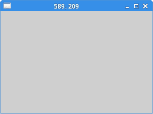
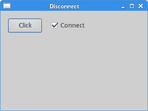

# GTK+ 事件和信号

> 原文： [http://zetcode.com/gui/gtk2/gtkevents/](http://zetcode.com/gui/gtk2/gtkevents/)

在 GTK+ 编程教程的这一部分中，我们讨论事件系统。

GTK+ 是事件驱动的系统。 所有 GUI 应用都是事件驱动的。 应用启动一个主循环，该循环不断检查新生成的事件。 如果没有事件，则应用将等待并且不执行任何操作。 在 GTK+ 中，事件是来自 X 服务器的消息。 当事件到达窗口小部件时，它可以通过发出信号对此事件做出反应。 GTK+ 程序员可以将特定的回调连接到信号。 回调是对信号做出反应的处理函数。

## 点击按钮

触发按钮时，它会发送`clicked`信号。 可以通过鼠标指针或使用`空格键`触发按钮（只要按钮具有焦点）。

`buttonclick.c`

```c
#include <gtk/gtk.h>

void button_clicked(GtkWidget *widget, gpointer data) {

  g_print("clicked\n");
}

int main(int argc, char *argv[]) {

  GtkWidget *window;
  GtkWidget *halign;
  GtkWidget *btn;

  gtk_init(&argc, &argv);

  window = gtk_window_new(GTK_WINDOW_TOPLEVEL);
  gtk_window_set_title(GTK_WINDOW(window), "GtkButton");
  gtk_window_set_default_size(GTK_WINDOW(window), 300, 200);
  gtk_container_set_border_width(GTK_CONTAINER(window), 15);
  gtk_window_set_position(GTK_WINDOW(window), GTK_WIN_POS_CENTER);

  halign = gtk_alignment_new(0, 0, 0, 0);
  btn = gtk_button_new_with_label("Click");
  gtk_widget_set_size_request(btn, 70, 30);

  gtk_container_add(GTK_CONTAINER(halign), btn);
  gtk_container_add(GTK_CONTAINER(window), halign);

  g_signal_connect(G_OBJECT(btn), "clicked", 
      G_CALLBACK(button_clicked), NULL);

  g_signal_connect(G_OBJECT(window), "destroy", 
      G_CALLBACK(gtk_main_quit), NULL);

  gtk_widget_show_all(window);

  gtk_main();

  return 0;
}

```

在应用中，我们有两个信号：`clicked`信号和`destroy`信号。

```c
g_signal_connect(G_OBJECT(btn), "clicked", 
    G_CALLBACK(button_clicked), NULL);

```

我们使用`g_signal_connect()`函数将`clicked`信号连接到`button_clicked()`回调。

```c
void button_clicked(GtkWidget *widget, gpointer data) {

  g_print("clicked\n");
}

```

回调将“`clicked`”字符串打印到控制台。 回调函数的第一个参数是发出信号的对象。 在我们的例子中是单击按钮。 第二个参数是可选的。 我们可能会向回调发送一些数据。 在我们的案例中，我们没有发送任何数据； 我们为`g_signal_connect()`函数的第四个参数提供了`NULL`值。

```c
g_signal_connect(G_OBJECT(window), "destroy", 
     G_CALLBACK(gtk_main_quit), NULL);

```

如果按标题栏右上角的 x 按钮，或按 `Atl + F4` ，则会发出`destroy`信号。 调用`gtk_main_quit()`函数，该函数将终止应用。

## 移动窗口

下一个示例显示了我们如何应对窗口移动事件。

`moveevent.c`

```c
#include <gtk/gtk.h>

void configure_callback(GtkWindow *window, 
      GdkEvent *event, gpointer data) {

   int x, y;
   GString *buf;

   x = event->configure.x;
   y = event->configure.y;

   buf = g_string_new(NULL);   
   g_string_printf(buf, "%d, %d", x, y);

   gtk_window_set_title(window, buf->str);

   g_string_free(buf, TRUE);
}

int main(int argc, char *argv[]) {

  GtkWidget *window;

  gtk_init(&argc, &argv);

  window = gtk_window_new(GTK_WINDOW_TOPLEVEL);
  gtk_window_set_position(GTK_WINDOW(window), GTK_WIN_POS_CENTER);
  gtk_window_set_default_size(GTK_WINDOW(window), 300, 200);
  gtk_widget_add_events(GTK_WIDGET(window), GDK_CONFIGURE);

  g_signal_connect(G_OBJECT(window), "destroy",
        G_CALLBACK(gtk_main_quit), G_OBJECT(window));

  g_signal_connect(G_OBJECT(window), "configure-event",
        G_CALLBACK(configure_callback), NULL);

  gtk_widget_show(window);
  gtk_main();

  return 0;
}

```

在示例中，我们在标题栏中显示了窗口左上角的当前位置。

```c
gtk_widget_add_events(GTK_WIDGET(window), GDK_CONFIGURE);

```

小部件的事件掩码确定特定小部件将接收的事件类型。 一些事件是预先配置的，其他事件必须添加到事件掩码中。 `gtk_widget_add_events()`将`GDK_CONFIGURE`事件类型添加到掩码。 `GDK_CONFIGURE`事件类型说明了窗口的所有大小，位置和堆叠顺序。

```c
g_signal_connect(G_OBJECT(window), "configure-event",
    G_CALLBACK(configure_callback), NULL);

```

当窗口小部件的窗口的大小，位置或堆栈发生更改时，将发出`configure-event`。

```c
void configure_callback(GtkWindow *window, 
      GdkEvent *event, gpointer data) {

   int x, y;
   GString *buf;

   x = event->configure.x;
   y = event->configure.y;

   buf = g_string_new(NULL);   
   g_string_printf(buf, "%d, %d", x, y);

   gtk_window_set_title(window, buf->str);

   g_string_free(buf, TRUE);
}

```

回调函数具有三个参数：发出信号的对象，`GdkEvent`和可选数据。 我们确定 x，y 坐标，构建一个字符串，并将其设置为窗口标题。



图：移动事件

## 输入信号

以下示例显示了我们如何对`enter`信号做出反应。 当我们使用鼠标指针进入小部件的区域时，将发出`enter`信号。

`entersignal.c`

```c
#include <gtk/gtk.h>

void enter_button(GtkWidget *widget, gpointer data) {

  GdkColor col = {0, 27000, 30000, 35000};   

  gtk_widget_modify_bg(widget, GTK_STATE_PRELIGHT, &col);
}

int main(int argc, char *argv[]) {

  GtkWidget *window;
  GtkWidget *halign;
  GtkWidget *btn;

  gtk_init(&argc, &argv);

  window = gtk_window_new(GTK_WINDOW_TOPLEVEL);
  gtk_window_set_position(GTK_WINDOW(window), GTK_WIN_POS_CENTER);
  gtk_window_set_default_size(GTK_WINDOW(window), 300, 200);
  gtk_container_set_border_width(GTK_CONTAINER(window), 15);
  gtk_window_set_title(GTK_WINDOW(window), "Enter signal");

  halign = gtk_alignment_new(0, 0, 0, 0);

  btn = gtk_button_new_with_label("Button");
  gtk_widget_set_size_request(btn, 70, 30);

  gtk_container_add(GTK_CONTAINER(halign), btn);
  gtk_container_add(GTK_CONTAINER(window), halign);

  g_signal_connect(G_OBJECT(btn), "enter", 
      G_CALLBACK(enter_button), NULL);

  g_signal_connect(G_OBJECT(window), "destroy",
      G_CALLBACK(gtk_main_quit), NULL);

  gtk_widget_show_all(window);

  gtk_main();

  return 0;
}

```

在该示例中，当我们将鼠标指针悬停在其上方时，按钮小部件的背景颜色会更改。

```c
g_signal_connect(G_OBJECT(btn), "enter", 
    G_CALLBACK(enter_button), NULL);

```

当`enter`信号出现时，我们调用`enter_button()`用户功能。

```c
void enter_button(GtkWidget *widget, gpointer data) {

  GdkColor col = {0, 27000, 30000, 35000};   

  gtk_widget_modify_bg(widget, GTK_STATE_PRELIGHT, &col);
}

```

在回调内部，我们通过调用`gtk_widget_modify_bg()`函数来更改按钮的背景。

## 断开回调

我们可以从信号断开回调。 下一个代码示例演示了这种情况。

`disconnect.c`

```c
#include <gtk/gtk.h>

gint handler_id;

void button_clicked(GtkWidget *widget, gpointer data) {

  g_print("clicked\n");
}

void toogle_signal(GtkWidget *widget, gpointer window) {

  if (gtk_toggle_button_get_active(GTK_TOGGLE_BUTTON(widget))) {
     handler_id = g_signal_connect(G_OBJECT(window), "clicked", 
           G_CALLBACK(button_clicked), NULL);
  } else {
     g_signal_handler_disconnect(window, handler_id);
  }
}

int main(int argc, char *argv[]) {

  GtkWidget *window;
  GtkWidget *hbox;
  GtkWidget *vbox;
  GtkWidget *btn;
  GtkWidget *cb;

  gtk_init(&argc, &argv);

  window = gtk_window_new(GTK_WINDOW_TOPLEVEL);
  gtk_window_set_position(GTK_WINDOW(window), GTK_WIN_POS_CENTER);
  gtk_window_set_default_size(GTK_WINDOW(window), 300, 200);
  gtk_container_set_border_width(GTK_CONTAINER(window), 15);
  gtk_window_set_title(GTK_WINDOW(window), "Disconnect");

  hbox = gtk_hbox_new(FALSE, 15);

  btn = gtk_button_new_with_label("Click");
  gtk_widget_set_size_request(btn, 70, 30);
  gtk_box_pack_start(GTK_BOX(hbox), btn, FALSE, FALSE, 0);

  cb = gtk_check_button_new_with_label("Connect");
  gtk_toggle_button_set_active(GTK_TOGGLE_BUTTON(cb), TRUE);
  gtk_box_pack_start(GTK_BOX(hbox), cb, FALSE, FALSE, 0);

  vbox = gtk_vbox_new(FALSE, 5);
  gtk_box_pack_start(GTK_BOX(vbox), hbox, FALSE, FALSE, 0);
  gtk_container_add(GTK_CONTAINER(window), vbox);  

  handler_id = g_signal_connect(G_OBJECT(btn), "clicked", 
      G_CALLBACK(button_clicked), NULL);

  g_signal_connect(G_OBJECT(cb), "clicked",
      G_CALLBACK(toogle_signal), (gpointer) btn);

  g_signal_connect(G_OBJECT(window), "destroy",
      G_CALLBACK(gtk_main_quit), NULL);

  gtk_widget_show_all(window);

  gtk_main();

  return 0;
}

```

在代码示例中，我们有一个按钮和一个复选框。 复选框用于从按钮的`clicked`信号连接或断开回调。

```c
handler_id = g_signal_connect(G_OBJECT(btn), "clicked", 
    G_CALLBACK(button_clicked), NULL);

```

`g_signal_connect()`返回唯一标识回调的处理程序 ID。

```c
if (gtk_toggle_button_get_active(GTK_TOGGLE_BUTTON(widget))) {
   handler_id = g_signal_connect(G_OBJECT(window), "clicked", 
         G_CALLBACK(button_clicked), NULL);
} else {
   g_signal_handler_disconnect(window, handler_id);
}

```

此代码确定复选框的状态。 根据状态，它通过`g_signal_connect()`功能连接回调或通过`g_signal_handler_disconnect()`功能断开连接。



图：断开连接

## 拖放示例

在下一个示例中，我们显示无边界窗口，并学习如何拖动和移动这样的窗口。

`dragdrop.c`

```c
#include <gtk/gtk.h>

gboolean on_button_press(GtkWidget* widget,
  GdkEventButton *event, GdkWindowEdge edge) {

  if (event->type == GDK_BUTTON_PRESS) {

    if (event->button == 1) {
      gtk_window_begin_move_drag(GTK_WINDOW(gtk_widget_get_toplevel(widget)),
          event->button,
          event->x_root,
          event->y_root,
          event->time);
    }
  }

  return TRUE;
}

int main(int argc, char *argv[]) {

  GtkWidget *window;

  gtk_init(&argc, &argv);

  window = gtk_window_new(GTK_WINDOW_TOPLEVEL);
  gtk_window_set_position(GTK_WINDOW(window), GTK_WIN_POS_CENTER);
  gtk_window_set_default_size(GTK_WINDOW(window), 250, 200);
  gtk_window_set_title(GTK_WINDOW(window), "Drag & drop");
  gtk_window_set_decorated(GTK_WINDOW(window), FALSE);
  gtk_widget_add_events(window, GDK_BUTTON_PRESS_MASK);

  g_signal_connect(G_OBJECT(window), "button-press-event",
      G_CALLBACK(on_button_press), NULL);

  g_signal_connect(G_OBJECT(window), "destroy",
        G_CALLBACK(gtk_main_quit), G_OBJECT(window));

  gtk_widget_show(window);

  gtk_main();

  return 0;
}

```

该示例演示了无边界窗口的拖放操作。

```c
gtk_window_set_decorated(GTK_WINDOW(window), FALSE);

```

我们使用`gtk_window_set_decorated()`功能删除窗口装饰。 这意味着该窗口将没有边框和标题栏。

```c
g_signal_connect(G_OBJECT(window), "button-press-event",
    G_CALLBACK(on_button_press), NULL);

```

我们将窗口连接到`button-press-event`信号。

```c
gboolean on_button_press(GtkWidget* widget,
  GdkEventButton *event, GdkWindowEdge edge) {

  if (event->type == GDK_BUTTON_PRESS) {

    if (event->button == 1) {
      gtk_window_begin_move_drag(GTK_WINDOW(gtk_widget_get_toplevel(widget)),
          event->button,
          event->x_root,
          event->y_root,
          event->time);
    }
  }

  return TRUE;
}

```

在`on_button_press()`功能内，我们执行拖放操作。 我们检查是否按下了鼠标左键。 然后我们调用`gtk_window_begin_move_drag()`函数，该函数开始移动窗口。

## 计时器示例

下面的示例演示一个计时器示例。 当我们有一些重复的任务时使用计时器。 可能是时钟，倒数，视觉效果或动画。

`timer.c`

```c
#include <cairo.h>
#include <gtk/gtk.h>

gchar buf[256];

gboolean on_expose_event(GtkWidget *widget,
    GdkEventExpose *event,
    gpointer data) {

  cairo_t *cr;

  cr = gdk_cairo_create(widget->window);

  cairo_move_to(cr, 30, 30);
  cairo_set_font_size(cr, 15);
  cairo_show_text(cr, buf);

  cairo_destroy(cr);

  return FALSE;
}

gboolean time_handler(GtkWidget *widget) {

  if (widget->window == NULL) return FALSE;

  GDateTime *now = g_date_time_new_now_local(); 
  gchar *my_time = g_date_time_format(now, "%H:%M:%S");

  g_sprintf(buf, "%s", my_time);

  g_free(my_time);
  g_date_time_unref(now);

  gtk_widget_queue_draw(widget);

  return TRUE;
}

int main(int argc, char *argv[]) {

  GtkWidget *window;
  GtkWidget *darea;

  gtk_init(&argc, &argv);

  window = gtk_window_new(GTK_WINDOW_TOPLEVEL);

  darea = gtk_drawing_area_new();
  gtk_container_add(GTK_CONTAINER(window), darea);

  g_signal_connect(darea, "expose-event",
      G_CALLBACK(on_expose_event), NULL);
  g_signal_connect(window, "destroy",
      G_CALLBACK(gtk_main_quit), NULL);

  gtk_window_set_position(GTK_WINDOW(window), GTK_WIN_POS_CENTER);
  gtk_window_set_default_size(GTK_WINDOW(window), 300, 200);

  gtk_window_set_title(GTK_WINDOW(window), "Timer");
  g_timeout_add(1000, (GSourceFunc) time_handler, (gpointer) window);
  gtk_widget_show_all(window);
  time_handler(window);

  gtk_main();

  return 0;
}

```

该示例在窗口上显示当前本地时间。 也使用 Cairo 2D 库。

```c
g_signal_connect(darea, "expose-event",
    G_CALLBACK(on_expose_event), NULL);

```

我们在`on_expose_event()`回调中绘制时间。 回调连接到`expose-event`信号，该信号在要重绘窗口时发出。

```c
g_timeout_add(1000, (GSourceFunc) time_handler, (gpointer) window);

```

此功能注册计时器。 `time_handler()`功能会定期重复调用。 就我们而言，每一秒钟。 将调用计时器函数，直到返回`FALSE`。

```c
time_handler(window);

```

这将立即调用计时器功能。 否则，将延迟一秒钟。

```c
cairo_t *cr;

cr = gdk_cairo_create(widget->window);

cairo_move_to(cr, 30, 30);
cairo_set_font_size(cr, 15);
cairo_show_text(cr, buf);

cairo_destroy(cr);

```

此代码在窗口上绘制当前时间。 有关 Cairo 2D 库的更多信息，请参见 ZetCode 的 [Cairo 图形教程](http://www.zetcode.com/gfx/cairo/)。

```c
if (widget->window == NULL) return FALSE;

```

当窗口被破坏时，可能会调用计时器函数。 这行代码可以防止处理已经销毁的窗口小部件。

```c
GDateTime *now = g_date_time_new_now_local(); 
gchar *my_time = g_date_time_format(now, "%H:%M:%S");

g_sprintf(buf, "%s", my_time);

```

这些行确定当前的本地时间。 时间存储在全局`buf`变量中。

```c
gtk_widget_queue_draw(widget);

```

`gtk_widget_queue_draw()`功能使窗口区域无效，然后发出`expose-event`信号。

本章是关于 GTK+ 中的事件的。