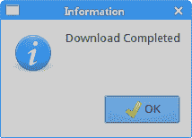
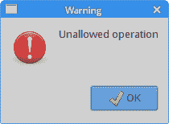
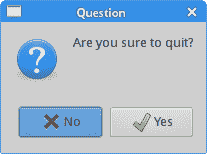
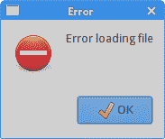
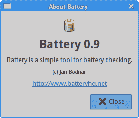
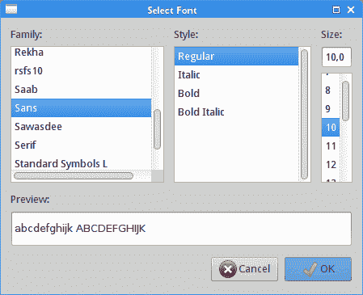
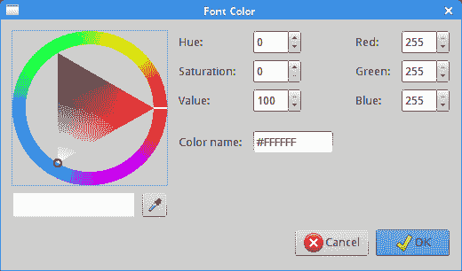

# GTK+ 对话框

> 原文： [http://zetcode.com/gui/gtk2/gtkdialogs/](http://zetcode.com/gui/gtk2/gtkdialogs/)

在 GTK+ 编程教程的这一部分中，我们使用对话框。

对话框窗口或对话框是大多数现代 GUI 应用必不可少的部分。 对话被定义为两个或更多人之间的对话。 在计算机应用中，对话框是一个窗口，用于与应用“对话”。 对话框用于输入数据，修改数据，更改应用设置等。

## 消息对话框

消息对话框是方便的对话框，可向应用的用户提供消息。 该消息包含文本和图像数据。

`messagedialogs.c`

```
#include <gtk/gtk.h>

void show_info(GtkWidget *widget, gpointer window) {

  GtkWidget *dialog;
  dialog = gtk_message_dialog_new(GTK_WINDOW(window),
            GTK_DIALOG_DESTROY_WITH_PARENT,
            GTK_MESSAGE_INFO,
            GTK_BUTTONS_OK,
            "Download Completed");
  gtk_window_set_title(GTK_WINDOW(dialog), "Information");
  gtk_dialog_run(GTK_DIALOG(dialog));
  gtk_widget_destroy(dialog);
}

void show_error(GtkWidget *widget, gpointer window) {

  GtkWidget *dialog;
  dialog = gtk_message_dialog_new(GTK_WINDOW(window),
            GTK_DIALOG_DESTROY_WITH_PARENT,
            GTK_MESSAGE_ERROR,
            GTK_BUTTONS_OK,
            "Error loading file");
  gtk_window_set_title(GTK_WINDOW(dialog), "Error");
  gtk_dialog_run(GTK_DIALOG(dialog));
  gtk_widget_destroy(dialog);
}

void show_question(GtkWidget *widget, gpointer window) {

  GtkWidget *dialog;
  dialog = gtk_message_dialog_new(GTK_WINDOW(window),
            GTK_DIALOG_DESTROY_WITH_PARENT,
            GTK_MESSAGE_QUESTION,
            GTK_BUTTONS_YES_NO,
            "Are you sure to quit?");
  gtk_window_set_title(GTK_WINDOW(dialog), "Question");
  gtk_dialog_run(GTK_DIALOG(dialog));
  gtk_widget_destroy(dialog);
}

void show_warning(GtkWidget *widget, gpointer window) {

  GtkWidget *dialog;
  dialog = gtk_message_dialog_new(GTK_WINDOW(window),
            GTK_DIALOG_DESTROY_WITH_PARENT,
            GTK_MESSAGE_WARNING,
            GTK_BUTTONS_OK,
            "Unallowed operation");
  gtk_window_set_title(GTK_WINDOW(dialog), "Warning");
  gtk_dialog_run(GTK_DIALOG(dialog));
  gtk_widget_destroy(dialog);
}

int main(int argc, char *argv[]) {

  GtkWidget *window;
  GtkWidget *table;

  GtkWidget *info;
  GtkWidget *warn;
  GtkWidget *que;
  GtkWidget *err;

  gtk_init(&argc, &argv);

  window = gtk_window_new(GTK_WINDOW_TOPLEVEL);
  gtk_window_set_position(GTK_WINDOW(window), GTK_WIN_POS_CENTER);
  gtk_window_set_default_size(GTK_WINDOW(window), 220, 150);
  gtk_window_set_title(GTK_WINDOW(window), "Message dialogs");

  table = gtk_table_new(2, 2, TRUE);
  gtk_table_set_row_spacings(GTK_TABLE(table), 2);
  gtk_table_set_col_spacings(GTK_TABLE(table), 2);

  info = gtk_button_new_with_label("Info");
  warn = gtk_button_new_with_label("Warning");
  que = gtk_button_new_with_label("Question");
  err = gtk_button_new_with_label("Error");

  gtk_table_attach(GTK_TABLE(table), info, 0, 1, 0, 1, 
      GTK_FILL, GTK_FILL, 3, 3);
  gtk_table_attach(GTK_TABLE(table), warn, 1, 2, 0, 1, 
      GTK_FILL, GTK_FILL, 3, 3);
  gtk_table_attach(GTK_TABLE(table), que, 0, 1, 1, 2, 
      GTK_FILL, GTK_FILL, 3, 3);
  gtk_table_attach(GTK_TABLE(table), err, 1, 2, 1, 2, 
      GTK_FILL, GTK_FILL, 3, 3);

  gtk_container_add(GTK_CONTAINER(window), table);
  gtk_container_set_border_width(GTK_CONTAINER(window), 15);

  g_signal_connect(G_OBJECT(info), "clicked", 
        G_CALLBACK(show_info), (gpointer) window); 

  g_signal_connect(G_OBJECT(warn), "clicked", 
        G_CALLBACK(show_warning), (gpointer) window); 

  g_signal_connect(G_OBJECT(que), "clicked", 
        G_CALLBACK(show_question), (gpointer) window); 

  g_signal_connect(G_OBJECT(err), "clicked", 
        G_CALLBACK(show_error), (gpointer) window); 

  g_signal_connect(G_OBJECT(window), "destroy",
        G_CALLBACK(gtk_main_quit), G_OBJECT(window));

  gtk_widget_show_all(window);

  gtk_main();

  return 0;
}

```

在我们的示例中，我们显示了四种消息对话框：信息，警告，问题和错误消息对话框。

```
void show_question(GtkWidget *widget, gpointer window) {

  GtkWidget *dialog;
  dialog = gtk_message_dialog_new(GTK_WINDOW(window),
            GTK_DIALOG_DESTROY_WITH_PARENT,
            GTK_MESSAGE_QUESTION,
            GTK_BUTTONS_YES_NO,
            "Are you sure to quit?");
  gtk_window_set_title(GTK_WINDOW(dialog), "Question");
  gtk_dialog_run(GTK_DIALOG(dialog));
  gtk_widget_destroy(dialog);
}

```

在`show_question()`功能中，我们弹出消息对话框。 消息对话框是使用`gtk_message_dialog_new()`调用创建的。 函数的参数指定我们创建哪种消息对话框。 `GTK_MESSAGE_QUESTION`常量创建一个问题类型对话框。 `GTK_BUTTONS_YES_NO`常量将在对话框中添加“是”和“否”按钮。 最后一个参数是我们在对话框中显示的文本。 `gtk_dialog_run()`功能显示对话框并阻塞主循环，直到对话框响应或被破坏为止。 该对话框必须使用`gtk_widget_destroy()`功能销毁。









Figure: Message dialogs

## `GtkAboutDialog`

`GtkAboutDialog`是一个对话框，其目的是显示有关应用的信息。 它可以显示徽标，应用名称，版本，版权，网站和许可证信息。 也有可能对作者，文档撰写者，翻译者和艺术家予以赞扬。

`aboutdialog.c`

```
#include <gtk/gtk.h>

void show_about(GtkWidget *widget, gpointer data) {

  GdkPixbuf *pixbuf = gdk_pixbuf_new_from_file("battery.png", NULL);

  GtkWidget *dialog = gtk_about_dialog_new();
  gtk_about_dialog_set_name(GTK_ABOUT_DIALOG(dialog), "Battery");
  gtk_about_dialog_set_version(GTK_ABOUT_DIALOG(dialog), "0.9"); 
  gtk_about_dialog_set_copyright(GTK_ABOUT_DIALOG(dialog),"(c) Jan Bodnar");
  gtk_about_dialog_set_comments(GTK_ABOUT_DIALOG(dialog), 
     "Battery is a simple tool for battery checking.");
  gtk_about_dialog_set_website(GTK_ABOUT_DIALOG(dialog), 
     "http://www.batteryhq.net");
  gtk_about_dialog_set_logo(GTK_ABOUT_DIALOG(dialog), pixbuf);
  g_object_unref(pixbuf), pixbuf = NULL;
  gtk_dialog_run(GTK_DIALOG (dialog));
  gtk_widget_destroy(dialog);
}

int main(int argc, char *argv[]) {

  GtkWidget *window;
  GtkWidget *about;
  GdkPixbuf *battery;

  gtk_init(&argc, &argv);

  window = gtk_window_new(GTK_WINDOW_TOPLEVEL);
  gtk_window_set_position(GTK_WINDOW(window), GTK_WIN_POS_CENTER);
  gtk_window_set_default_size(GTK_WINDOW(window), 220, 150);
  gtk_window_set_title(GTK_WINDOW(window), "Battery");

  gtk_container_set_border_width(GTK_CONTAINER(window), 15);
  gtk_widget_add_events(window, GDK_BUTTON_PRESS_MASK);

  g_signal_connect(G_OBJECT(window), "button-press-event", 
        G_CALLBACK(show_about), (gpointer) window); 

  g_signal_connect(G_OBJECT(window), "destroy",
        G_CALLBACK(gtk_main_quit), G_OBJECT(window));

  gtk_widget_show_all(window);

  gtk_main();

  return 0;
}

```

该代码示例使用具有某些功能的`GtkAboutDialog`。 单击窗口的客户区域会弹出对话框。

```
GtkWidget *dialog = gtk_about_dialog_new();

```

`GtkAboutDialog`是使用`gtk_about_dialog_new()`功能创建的。

```
gtk_about_dialog_set_name(GTK_ABOUT_DIALOG(dialog), "Battery");
gtk_about_dialog_set_version(GTK_ABOUT_DIALOG(dialog), "0.9"); 
gtk_about_dialog_set_copyright(GTK_ABOUT_DIALOG(dialog), 
    "(c) Jan Bodnar");

```

这些函数调用设置应用的名称，版本和版权。

```
gtk_about_dialog_set_comments(GTK_ABOUT_DIALOG(dialog), 
    "Battery is a simple tool for battery checking.");
gtk_about_dialog_set_website(GTK_ABOUT_DIALOG(dialog), 
    "http://www.batteryhq.net");

```

这些行设置了描述性注释和应用的网站。

```
GdkPixbuf *pixbuf = gdk_pixbuf_new_from_file("battery.png", NULL);
...
gtk_about_dialog_set_logo(GTK_ABOUT_DIALOG(dialog), pixbuf);
g_object_unref(pixbuf), pixbuf = NULL;

```

此代码创建应用的徽标。



Figure: GtkAboutDialog

## `GtkFontSelectionDialog`

`GtkFontSelectionDialog`是用于选择字体的对话框。 它通常用于进行一些文本编辑或格式化的应用中。

`fontdialog.c`

```
#include <gtk/gtk.h>

void select_font(GtkWidget *widget, gpointer label) {

  GtkResponseType result;

  GtkWidget *dialog = gtk_font_selection_dialog_new("Select Font");

  result = gtk_dialog_run(GTK_DIALOG(dialog));

  if (result == GTK_RESPONSE_OK || result == GTK_RESPONSE_APPLY) {

     PangoFontDescription *font_desc;
     gchar *fontname = gtk_font_selection_dialog_get_font_name(
                            GTK_FONT_SELECTION_DIALOG(dialog));

     font_desc = pango_font_description_from_string(fontname);

     gtk_widget_modify_font(GTK_WIDGET(label), font_desc);

     g_free(fontname);
   }

  gtk_widget_destroy(dialog);
}

int main(int argc, char *argv[]) {

  GtkWidget *window;
  GtkWidget *label;
  GtkWidget *vbox;

  GtkWidget *toolbar;
  GtkToolItem *font;

  gtk_init(&argc, &argv);

  window = gtk_window_new(GTK_WINDOW_TOPLEVEL);
  gtk_window_set_position(GTK_WINDOW(window), GTK_WIN_POS_CENTER);
  gtk_window_set_default_size(GTK_WINDOW(window), 280, 200);
  gtk_window_set_title(GTK_WINDOW(window), "Font Selection Dialog");

  vbox = gtk_vbox_new(FALSE, 0);
  gtk_container_add(GTK_CONTAINER(window), vbox);

  toolbar = gtk_toolbar_new();
  gtk_toolbar_set_style(GTK_TOOLBAR(toolbar), GTK_TOOLBAR_ICONS);

  gtk_container_set_border_width(GTK_CONTAINER(toolbar), 2);

  font = gtk_tool_button_new_from_stock(GTK_STOCK_SELECT_FONT);
  gtk_toolbar_insert(GTK_TOOLBAR(toolbar), font, -1);

  gtk_box_pack_start(GTK_BOX(vbox), toolbar, FALSE, FALSE, 5);

  label = gtk_label_new("ZetCode");
  gtk_label_set_justify(GTK_LABEL(label), GTK_JUSTIFY_CENTER);
  gtk_box_pack_start(GTK_BOX(vbox), label, TRUE, FALSE, 5);

  g_signal_connect(G_OBJECT(font), "clicked", 
        G_CALLBACK(select_font), label);

  g_signal_connect(G_OBJECT(window), "destroy",
        G_CALLBACK(gtk_main_quit), NULL);

  gtk_widget_show_all(window);

  gtk_main();

  return 0;
}

```

在代码示例中，我们在窗口中心放置了一个简单标签。 我们通过单击工具栏按钮显示一个字体选择对话框。

```
GtkWidget *dialog = gtk_font_selection_dialog_new("Select Font");
result = gtk_dialog_run(GTK_DIALOG(dialog));

```

我们使用`gtk_font_selection_dialog_new()`功能创建`GtkFontSelectionDialog`，然后使用`gtk_dialog_run()`功能运行它。

```
if (result == GTK_RESPONSE_OK || result == GTK_RESPONSE_APPLY) {

    PangoFontDescription *font_desc;
    gchar *fontname = gtk_font_selection_dialog_get_font_name(
                        GTK_FONT_SELECTION_DIALOG(dialog));

    font_desc = pango_font_description_from_string(fontname);

    gtk_widget_modify_font(GTK_WIDGET(label), font_desc);

    g_free(fontname);
}

```

如果用户单击“确定”或“应用”按钮，则继续。 我们使用`gtk_font_selection_dialog_get_font_name()`功能获得选定的字体名称。 然后，将标签的字体更改为选定的字体名称。



Figure: GtkFontSelectionDialog

## `GtkColorSelectionDialog`

`GtkColorSelectionDialog`是用于选择颜色的对话框。

`colordialog.c`

```
#include <gtk/gtk.h>

void select_font(GtkWidget *widget, gpointer label) {

  GtkResponseType result;
  GtkColorSelection *colorsel;

  GtkWidget *dialog = gtk_color_selection_dialog_new("Font Color");

  result = gtk_dialog_run(GTK_DIALOG(dialog));

  if (result == GTK_RESPONSE_OK) {

    GdkColor color;

    colorsel = GTK_COLOR_SELECTION(
                   GTK_COLOR_SELECTION_DIALOG(dialog)->colorsel);
    gtk_color_selection_get_current_color(colorsel,
                                &color);

    gtk_widget_modify_fg(GTK_WIDGET(label),
                             GTK_STATE_NORMAL,
                             &color);
  } 

  gtk_widget_destroy(dialog);
}

int main(int argc, char *argv[]) {

  GtkWidget *window;
  GtkWidget *widget;
  GtkWidget *label;
  GtkWidget *vbox;

  GtkWidget *toolbar;
  GtkToolItem *font;

  gtk_init(&argc, &argv);

  window = gtk_window_new(GTK_WINDOW_TOPLEVEL);
  gtk_window_set_position(GTK_WINDOW(window), GTK_WIN_POS_CENTER);
  gtk_window_set_default_size(GTK_WINDOW(window), 280, 200);
  gtk_window_set_title(GTK_WINDOW(window), "Color Selection Dialog");

  vbox = gtk_vbox_new(FALSE, 0);
  gtk_container_add(GTK_CONTAINER(window), vbox);

  toolbar = gtk_toolbar_new();
  gtk_toolbar_set_style(GTK_TOOLBAR(toolbar), GTK_TOOLBAR_ICONS);

  gtk_container_set_border_width(GTK_CONTAINER(toolbar), 2);

  font = gtk_tool_button_new_from_stock(GTK_STOCK_SELECT_COLOR);
  gtk_toolbar_insert(GTK_TOOLBAR(toolbar), font, -1);

  gtk_box_pack_start(GTK_BOX(vbox), toolbar, FALSE, FALSE, 5);

  label = gtk_label_new("ZetCode");
  gtk_label_set_justify(GTK_LABEL(label), GTK_JUSTIFY_CENTER);
  gtk_box_pack_start(GTK_BOX(vbox), label, TRUE, FALSE, 5);

  g_signal_connect(G_OBJECT(font), "clicked", 
        G_CALLBACK(select_font), label);

  g_signal_connect(G_OBJECT(window), "destroy",
        G_CALLBACK(gtk_main_quit), NULL);

  gtk_widget_show_all(window);

  gtk_main();

  return 0;
}

```

该示例与上一个示例非常相似。 这次我们更改标签的颜色。

```
GtkWidget *dialog = gtk_color_selection_dialog_new("Font Color");
result = gtk_dialog_run(GTK_DIALOG(dialog));

```

我们创建并显示`GtkColorSelectionDialog`。

```
if (result == GTK_RESPONSE_OK) {

  GdkColor color;

  colorsel = GTK_COLOR_SELECTION(
                 GTK_COLOR_SELECTION_DIALOG(dialog)->colorsel);
  gtk_color_selection_get_current_color(colorsel,
                 &color);

  gtk_widget_modify_fg(GTK_WIDGET(label),
                 GTK_STATE_NORMAL,
                 &color);
} 

```

如果按“确定”按钮，我们将获得颜色并修改标签的颜色。 颜色值通过`gtk_color_selection_get_current_color()`函数返回。



Figure: GtkColorSelectionDialog

本章是关于 GTK+ 中的对话框的。