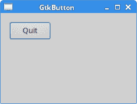
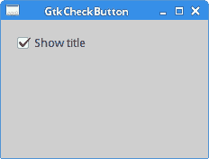
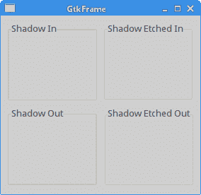
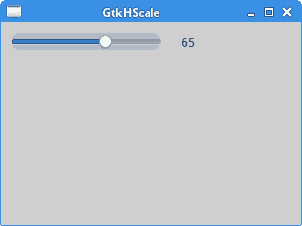
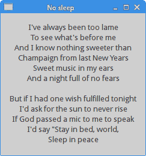
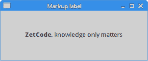

# GTK+ 小部件

> 原文： [http://zetcode.com/gui/gtk2/gtkwidgets/](http://zetcode.com/gui/gtk2/gtkwidgets/)

在 GTK+ 编程教程的这一部分中，我们将介绍一些 GTK+ 小部件。

小部件是 GUI 应用的基本构建块。 多年来，一些小部件已成为编程工具包的标准。 例如按钮，复选框或滚动条。 GTK+ 工具箱的理念是将小部件的数量保持在最低水平。 将创建更多专门的小部件作为定制 GTK+ 小部件。

## `GtkButton`

`GtkButton`是用于触发动作的简单小部件。

`button.c`

```c
#include <gtk/gtk.h>

int main(int argc, char *argv[]) {

  GtkWidget *window;
  GtkWidget *halign;
  GtkWidget *btn;

  gtk_init(&argc, &argv);

  window = gtk_window_new(GTK_WINDOW_TOPLEVEL);
  gtk_window_set_title(GTK_WINDOW(window), "GtkButton");
  gtk_window_set_default_size(GTK_WINDOW(window), 230, 150);
  gtk_container_set_border_width(GTK_CONTAINER(window), 15);
  gtk_window_set_position(GTK_WINDOW(window), GTK_WIN_POS_CENTER);

  halign = gtk_alignment_new(0, 0, 0, 0);
  gtk_container_add(GTK_CONTAINER(window), halign);

  btn = gtk_button_new_with_label("Quit");
  gtk_widget_set_size_request(btn, 70, 30);

  gtk_container_add(GTK_CONTAINER(halign), btn);

  g_signal_connect(G_OBJECT(btn), "clicked", 
      G_CALLBACK(gtk_main_quit), G_OBJECT(window));

  g_signal_connect(G_OBJECT(window), "destroy", 
      G_CALLBACK(gtk_main_quit), NULL);

  gtk_widget_show_all(window);

  gtk_main();

  return 0;
}

```

该示例显示了一个位于窗口左上角的按钮。 当我们单击按钮时，应用退出。

```c
btn = gtk_button_new_with_label("Quit");

```

`gtk_button_new_with_label()`创建一个带有标签的新`GtkButton`。

```c
g_signal_connect(G_OBJECT(btn), "clicked", 
    G_CALLBACK(gtk_main_quit), G_OBJECT(window));

```

按钮的`clicked`信号连接到`gtk_main_quit()`函数，该功能终止应用。



图：`GtkButton`

## `GtkCheckButton`

`GtkCheckButton`是具有两种状态的窗口小部件：打开和关闭。 接通状态通过复选标记显示。

`checkbutton.c`

```c
#include <gtk/gtk.h>

void toggle_title(GtkWidget *widget, gpointer window) {

  if (gtk_toggle_button_get_active(GTK_TOGGLE_BUTTON(widget))) {
    gtk_window_set_title(window, "GtkCheckButton");     
  } else {
    gtk_window_set_title(window, "");
  }
}

int main(int argc, char** argv) {

  GtkWidget *window;
  GtkWidget *halign;
  GtkWidget *cb;

  gtk_init(&argc, &argv);

  window = gtk_window_new(GTK_WINDOW_TOPLEVEL);
  gtk_window_set_position(GTK_WINDOW(window), GTK_WIN_POS_CENTER);
  gtk_container_set_border_width(GTK_CONTAINER(window), 15);
  gtk_window_set_default_size(GTK_WINDOW(window), 230, 150);
  gtk_window_set_title(GTK_WINDOW(window), "GtkCheckButton");

  halign = gtk_alignment_new(0, 0, 0, 0);
  gtk_container_add(GTK_CONTAINER(window), halign);

  cb = gtk_check_button_new_with_label("Show title");
  gtk_toggle_button_set_active(GTK_TOGGLE_BUTTON(cb), TRUE);

  GTK_WIDGET_UNSET_FLAGS(cb, GTK_CAN_FOCUS);
  gtk_container_add(GTK_CONTAINER(halign), cb);

  g_signal_connect(window, "destroy",
      G_CALLBACK(gtk_main_quit), NULL);

  g_signal_connect(cb, "clicked", 
      G_CALLBACK(toggle_title), (gpointer) window);

  gtk_widget_show_all(window);

  gtk_main();

  return 0;
}

```

该示例根据`GtkCheckButton`的状态显示窗口标题。

```c
cb = gtk_check_button_new_with_label("Show title");
gtk_toggle_button_set_active(GTK_TOGGLE_BUTTON(cb), TRUE);

```

`GtkCheckButton`已创建并默认标记。 标题最初显示。

```c
GTK_WIDGET_UNSET_FLAGS(cb, GTK_CAN_FOCUS);

```

此代码行禁用焦点。

```c
if (gtk_toggle_button_get_active(GTK_TOGGLE_BUTTON(widget))) {
  gtk_window_set_title(window, "GtkCheckButton");     
} else {
  gtk_window_set_title(window, "");
}

```

我们根据`GtkCheckButton`的状态显示窗口的标题。 要设置窗口的标题，我们使用`gtk_window_set_title()`。



图：`GtkCheckButton`

## `GtkFrame`

`GtkFrame`是一个带有装饰框和可选标签的垃圾桶。

`frames.c`

```c
#include <gtk/gtk.h>

int main(int argc, char *argv[]) {

  GtkWidget *window;
  GtkWidget *table;

  GtkWidget *frame1;
  GtkWidget *frame2;
  GtkWidget *frame3;
  GtkWidget *frame4;

  gtk_init(&argc, &argv);

  window = gtk_window_new(GTK_WINDOW_TOPLEVEL);
  gtk_window_set_position(GTK_WINDOW(window), GTK_WIN_POS_CENTER);
  gtk_window_set_default_size(GTK_WINDOW(window), 250, 250);
  gtk_window_set_title(GTK_WINDOW(window), "GtkFrame");

  gtk_container_set_border_width(GTK_CONTAINER(window), 10);

  table = gtk_table_new(2, 2, TRUE);
  gtk_table_set_row_spacings(GTK_TABLE(table), 10);
  gtk_table_set_col_spacings(GTK_TABLE(table), 10);
  gtk_container_add(GTK_CONTAINER(window), table);

  frame1 = gtk_frame_new("Shadow In");
  gtk_frame_set_shadow_type(GTK_FRAME(frame1), GTK_SHADOW_IN);
  frame2 = gtk_frame_new("Shadow Out");
  gtk_frame_set_shadow_type(GTK_FRAME(frame2), GTK_SHADOW_OUT);
  frame3 = gtk_frame_new("Shadow Etched In");
  gtk_frame_set_shadow_type(GTK_FRAME(frame3), GTK_SHADOW_ETCHED_IN);
  frame4 = gtk_frame_new("Shadow Etched Out");
  gtk_frame_set_shadow_type(GTK_FRAME(frame4), GTK_SHADOW_ETCHED_OUT);

  gtk_table_attach_defaults(GTK_TABLE(table), frame1, 0, 1, 0, 1);
  gtk_table_attach_defaults(GTK_TABLE(table), frame2, 0, 1, 1, 2);
  gtk_table_attach_defaults(GTK_TABLE(table), frame3, 1, 2, 0, 1);
  gtk_table_attach_defaults(GTK_TABLE(table), frame4, 1, 2, 1, 2);

  g_signal_connect(G_OBJECT(window), "destroy",
        G_CALLBACK(gtk_main_quit), G_OBJECT(window));

  gtk_widget_show_all(window);

  gtk_main();

  return 0;
}

```

该示例显示了四种不同的帧类型。 框架连接到表格容器中。

```c
frame1 = gtk_frame_new("Shadow In");

```

`gtk_frame_new()`函数创建带有可选标签的`GtkFrame`。

```c
gtk_frame_set_shadow_type(GTK_FRAME(frame1), GTK_SHADOW_IN);

```

`gtk_frame_set_shadow_type()`函数设置帧的阴影类型。



图：`GtkFrame`

## `GtkHScale`

`GtkHScale`是用于从一系列值中选择一个值的水平滑块控件。

`hscale.c`

```c
void value_changed(GtkRange *range, gpointer win) {

   gdouble val = gtk_range_get_value(range);
   gchar *str = g_strdup_printf("%.f", val);    
   gtk_label_set_text(GTK_LABEL(win), str);

   g_free(str);
}

int main(int argc, char *argv[]) {

  GtkWidget *window;
  GtkWidget *halign;
  GtkWidget *hbox;
  GtkWidget *hscale;
  GtkWidget *label;

  gtk_init(&argc, &argv);

  window = gtk_window_new(GTK_WINDOW_TOPLEVEL);
  gtk_window_set_position(GTK_WINDOW(window), GTK_WIN_POS_CENTER);
  gtk_window_set_default_size(GTK_WINDOW(window), 300, 250);
  gtk_container_set_border_width(GTK_CONTAINER(window), 10);
  gtk_window_set_title(GTK_WINDOW(window), "GtkHScale");

  hbox = gtk_hbox_new(FALSE, 20);

  hscale = gtk_hscale_new_with_range(0, 100, 1);
  gtk_scale_set_draw_value(GTK_SCALE(hscale), FALSE);
  gtk_widget_set_size_request(hscale, 150, -1);
  label = gtk_label_new("...");
  gtk_misc_set_alignment(GTK_MISC(label), 0.0, 1);

  gtk_box_pack_start(GTK_BOX(hbox), hscale, FALSE, FALSE, 0);
  gtk_box_pack_start(GTK_BOX(hbox), label, FALSE, FALSE, 0);

  halign = gtk_alignment_new(0, 0, 0, 0);
  gtk_container_add(GTK_CONTAINER(halign), hbox);
  gtk_container_add(GTK_CONTAINER(window), halign);

  g_signal_connect(window, "destroy",
      G_CALLBACK(gtk_main_quit), NULL);

  g_signal_connect(hscale, "value-changed",
      G_CALLBACK(value_changed), label);      

  gtk_widget_show_all(window);

  gtk_main();

  return 0;
}

```

在示例中，我们有一个水平比例小部件和一个标签小部件。 当前选择的值显示在标签中。

```c
gdouble val = gtk_range_get_value(range);

```

`gtk_range_get_value()`函数从比例小部件中检索当前选择的值。

```c
gchar *str = g_strdup_printf("%.f", val);    
gtk_label_set_text(GTK_LABEL(win), str);

```

我们使用`g_strdup_printf()`函数构建一个字符串值，并使用`gtk_label_set_text()`函数将其设置为标签。

```c
hscale = gtk_hscale_new_with_range(0, 100, 1);

```

`gtk_hscale_new_with_range()`函数创建一个具有给定范围的新水平比例小部件。 第一个参数是最小值，第二个参数是最大值，最后一个参数是步骤。

```c
gtk_scale_set_draw_value(GTK_SCALE(hscale), FALSE);

```

`gtk_scale_set_draw_value()`指定当前值是否在字符串旁边显示为字符串。 我们关闭该值。 相反，我们以编程方式将其设置为标签小部件。



图：`GtkHScale`

## GtkLabel

`GtkLabel`小部件显示文本。

`label.c`

```c
#include <gtk/gtk.h>

int main(int argc, char *argv[]) {

  GtkWidget *window;
  GtkWidget *label;

  gtk_init(&argc, &argv);

  window = gtk_window_new(GTK_WINDOW_TOPLEVEL);
  gtk_window_set_position(GTK_WINDOW(window), GTK_WIN_POS_CENTER);
  gtk_window_set_title(GTK_WINDOW(window), "No sleep");
  gtk_container_set_border_width(GTK_CONTAINER(window), 15);

  label = gtk_label_new("I've always been too lame\n\
To see what's before me\n\
And I know nothing sweeter than\n\
Champaign from last New Years\n\
Sweet music in my ears\n\
And a night full of no fears\n\
\n\
But if I had one wish fulfilled tonight\n\
I'd ask for the sun to never rise\n\
If God passed a mic to me to speak\n\
I'd say \"Stay in bed, world,\n\
Sleep in peace");

  gtk_label_set_justify(GTK_LABEL(label), GTK_JUSTIFY_CENTER);
  gtk_container_add(GTK_CONTAINER(window), label);

  g_signal_connect(window, "destroy",
      G_CALLBACK(gtk_main_quit), NULL);

  gtk_widget_show_all(window);

  gtk_main();

  return 0;
}

```

该示例显示了歌曲的两节经文。

```c
  label = gtk_label_new("I've always been too lame\n\
To see what's before me\n\
...

```

我们创建一个`GtkLabel`小部件。 我们可以使用换行符来创建多行文本标签。 注意转义符。 我们使用了相当长的字符串，并且我们不想将所有文本都放在一行中。 在这种情况下，我们可以使用转义符。

```c
gtk_label_set_justify(GTK_LABEL(label), GTK_JUSTIFY_CENTER);

```

`gtk_label_set_justify()`函数使标签中的文本对齐。 使用`GTK_JUSTIFY_CENTER`类型时，文本居中。



图：`GtkLabel`

## `GtkLabel`

`GtkLabel`也可以显示标记语言。 标记是 Pango 文本标记语言。

`markup.c`

```c
#include <gtk/gtk.h>

int main(int argc, char *argv[]) {

  GtkWidget *window;
  GtkWidget *label;

  gtk_init(&argc, &argv);

  window = gtk_window_new(GTK_WINDOW_TOPLEVEL);
  gtk_window_set_position(GTK_WINDOW(window), GTK_WIN_POS_CENTER);
  gtk_window_set_default_size(GTK_WINDOW(window), 300, 100);
  gtk_window_set_title(GTK_WINDOW(window), "Markup label");

  gchar *str = "<b>ZetCode</b>, knowledge only matters";

  label = gtk_label_new(NULL);
  gtk_label_set_markup(GTK_LABEL(label), str);

  gtk_container_add(GTK_CONTAINER(window), label);
  gtk_widget_show(label);

  g_signal_connect(window, "destroy",
      G_CALLBACK(gtk_main_quit), NULL);

  gtk_widget_show(window);

  gtk_main();

  return 0;
}

```

该示例以粗体显示了一部分文本。

```c
gchar *str = "<b>ZetCode</b>, knowledge only matters";

```

这是显示的字符串。 它包含一个简单的标记。

```c
label = gtk_label_new(NULL);

```

我们创建一个空标签。

```c
gtk_label_set_markup(GTK_LABEL(label), str);

```

`gtk_label_set_markup()`解析标记的字符串，并将其属性应用于标签。



图：标记标签

在 GTK+ 教程的这一部分中，我们介绍了 GTK+ 小部件。