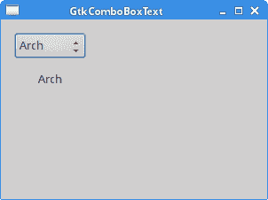
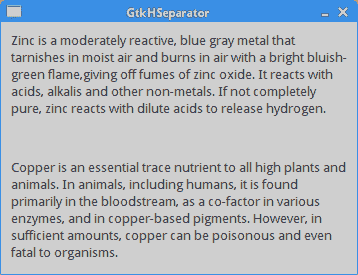
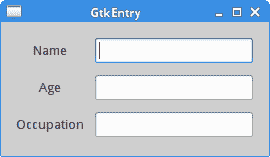
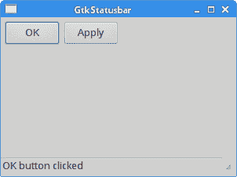
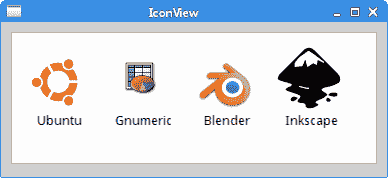

# GTK+ 小部件 II

> 原文： [http://zetcode.com/gui/gtk2/gtkwidgetsII/](http://zetcode.com/gui/gtk2/gtkwidgetsII/)

在 GTK+ 编程教程的这一部分中，我们将继续介绍各种 GTK+ 小部件。

## `GktComboBoxText`

`GktComboBoxText`是一个小部件，允许用户从选项列表中进行选择。 选项是字符串。

`combobox.c`

```c
#include <gtk/gtk.h>

void combo_selected(GtkWidget *widget, gpointer window) {

  gchar *text = gtk_combo_box_get_active_text(GTK_COMBO_BOX(widget));
  gtk_label_set_text(GTK_LABEL(window), text);
  g_free(text);
}

int main(int argc, char *argv[]) {

  GtkWidget *window;
  GtkWidget *hbox;
  GtkWidget *vbox;
  GtkWidget *combo;
  GtkWidget *label;

  gtk_init(&argc, &argv);

  window = gtk_window_new(GTK_WINDOW_TOPLEVEL);
  gtk_window_set_title(GTK_WINDOW(window), "GtkComboBox");
  gtk_window_set_position(GTK_WINDOW(window), GTK_WIN_POS_CENTER);
  gtk_container_set_border_width(GTK_CONTAINER(window), 15);
  gtk_window_set_default_size(GTK_WINDOW(window), 300, 200);

  hbox = gtk_hbox_new(FALSE, 0);
  vbox = gtk_vbox_new(FALSE, 15);

  combo = gtk_combo_box_new_text();
  gtk_combo_box_append_text(GTK_COMBO_BOX(combo), "Ubuntu");
  gtk_combo_box_append_text(GTK_COMBO_BOX(combo), "Arch");
  gtk_combo_box_append_text(GTK_COMBO_BOX(combo), "Fedora");
  gtk_combo_box_append_text(GTK_COMBO_BOX(combo), "Mint");
  gtk_combo_box_append_text(GTK_COMBO_BOX(combo), "Gentoo");
  gtk_combo_box_append_text(GTK_COMBO_BOX(combo), "Debian");

  gtk_box_pack_start(GTK_BOX(vbox), combo, FALSE, FALSE, 0);

  label = gtk_label_new("...");
  gtk_box_pack_start(GTK_BOX(vbox), label, FALSE, FALSE, 0);

  gtk_box_pack_start(GTK_BOX(hbox), vbox, FALSE, FALSE, 0);
  gtk_container_add(GTK_CONTAINER(window), hbox);

  g_signal_connect(G_OBJECT(window), "destroy",
        G_CALLBACK(gtk_main_quit), NULL);

  g_signal_connect(G_OBJECT(combo), "changed", 
        G_CALLBACK(combo_selected), (gpointer) label);

  gtk_widget_show_all(window);

  gtk_main();

  return 0;
}

```

该示例显示了一个组合框和一个标签。 组合框具有六个选项的列表。 这些是 Linux 发行版的名称。 标签窗口小部件显示了从组合框中选择的选项。

```c
combo = gtk_combo_box_text_new();

```

`gtk_combo_box_text_new()`函数创建一个简单的纯文本组合框。

```c
gtk_combo_box_append_text(GTK_COMBO_BOX(combo), "Ubuntu");

```

`gtk_combo_box_text_append_text()`函数将一个字符串追加到组合框中存储的字符串列表中。

```c
label = gtk_label_new("-");

```

创建一个新的标签小部件。

```c
gchar *text =  gtk_combo_box_get_active_text(GTK_COMBO_BOX(widget));
gtk_label_set_text(GTK_LABEL(window), text);
g_free(text);

```

我们得到选定的文本，并为其设置标签文本。 `gtk_combo_box_get_active_text()`函数在组合框中返回当前活动的字符串。 我们使用`gtk_label_set_text()`功能将字符串设置为标签。



Figure: GktComboBoxText

## `GtkHSeparator`

`GtkHSeparator`是水平分隔符。 这是一种装饰小部件。 还有一个姐妹`GtkVSeparator`小部件。

`separator.c`

```c
#include <gtk/gtk.h>

int main(int argc, char *argv[]) {

  GtkWidget *window;
  GtkWidget *label1;
  GtkWidget *label2;
  GtkWidget *hseparator;
  GtkWidget *vbox;

  gtk_init(&argc, &argv);

  window = gtk_window_new(GTK_WINDOW_TOPLEVEL);
  gtk_window_set_position(GTK_WINDOW(window), GTK_WIN_POS_CENTER);
  gtk_window_set_title(GTK_WINDOW(window), "GtkHSeparator");
  gtk_window_set_resizable(GTK_WINDOW(window), FALSE);

  gtk_container_set_border_width(GTK_CONTAINER(window), 10);

  label1 = gtk_label_new("Zinc is a moderately reactive, blue gray metal \
that tarnishes in moist air and burns in air with a bright bluish-green flame,\
giving off fumes of zinc oxide. It reacts with acids, alkalis and other non-metals.\
If not completely pure, zinc reacts with dilute acids to release hydrogen.");

  gtk_label_set_line_wrap(GTK_LABEL(label1), TRUE);

  label2 = gtk_label_new("Copper is an essential trace nutrient to all high \
plants and animals. In animals, including humans, it is found primarily in \
the bloodstream, as a co-factor in various enzymes, and in copper-based pigments. \
However, in sufficient amounts, copper can be poisonous and even fatal to organisms.");

  gtk_label_set_line_wrap(GTK_LABEL(label2), TRUE);

  vbox = gtk_vbox_new(FALSE, 10);
  gtk_container_add(GTK_CONTAINER(window), vbox);

  hseparator = gtk_hseparator_new();

  gtk_box_pack_start(GTK_BOX(vbox), label1, FALSE, TRUE, 0);
  gtk_box_pack_start(GTK_BOX(vbox), hseparator, FALSE, TRUE, 10);
  gtk_box_pack_start(GTK_BOX(vbox), label2, FALSE, TRUE, 0);

  g_signal_connect_swapped(G_OBJECT(window), "destroy",
        G_CALLBACK(gtk_main_quit), G_OBJECT(window));

  gtk_widget_show_all(window);

  gtk_main();

  return 0;
}

```

该代码示例显示了两种化学元素的定义； 它们由水平分隔符分隔。 这使示例在视觉上更具吸引力。

```c
   label1 = gtk_label_new("Zinc is a moderately reactive, blue gray metal \
that tarnishes in moist air and burns in air with a bright bluish-green flame,\
giving off fumes of zinc oxide. It reacts with acids, alkalis and other non-metals.\
If not completely pure, zinc reacts with dilute acids to release hydrogen.");

```

我们创建第一个标签，即锌元素的定义。

```c
gtk_label_set_line_wrap(GTK_LABEL(label2), TRUE);

```

如果文本超过小部件的大小，则`gtk_label_set_line_wrap()`函数将换行。

```c
hseparator = gtk_hseparator_new();

```

`gtk_hseparator_new()`创建一个新的`GtkHSeparator`。

```c
gtk_box_pack_start(GTK_BOX(vbox), label1, FALSE, TRUE, 0);
gtk_box_pack_start(GTK_BOX(vbox), hseparator, FALSE, TRUE, 10);
gtk_box_pack_start(GTK_BOX(vbox), label2, FALSE, TRUE, 0);

```

我们将分隔符放在标签之间。



图：`GtkHSeparator`

## `GtkEntry`

`GtkEntry`是单行文本输入字段。 该小部件用于输入文本数据。

`entry.c`

```c
#include <gtk/gtk.h>

int main(int argc, char *argv[]) {

  GtkWidget *window;
  GtkWidget *table;

  GtkWidget *label1;
  GtkWidget *label2;
  GtkWidget *label3;

  GtkWidget *entry1;
  GtkWidget *entry2;
  GtkWidget *entry3;

  gtk_init(&argc, &argv);

  window = gtk_window_new(GTK_WINDOW_TOPLEVEL);
  gtk_window_set_position(GTK_WINDOW(window), GTK_WIN_POS_CENTER);
  gtk_window_set_title(GTK_WINDOW(window), "GtkEntry");
  gtk_container_set_border_width(GTK_CONTAINER(window), 10);

  table = gtk_table_new(3, 2, FALSE);
  gtk_container_add(GTK_CONTAINER(window), table);

  label1 = gtk_label_new("Name");
  label2 = gtk_label_new("Age");
  label3 = gtk_label_new("Occupation");

  gtk_table_attach(GTK_TABLE(table), label1, 0, 1, 0, 1, 
      GTK_FILL | GTK_SHRINK, GTK_FILL | GTK_SHRINK, 5, 5);
  gtk_table_attach(GTK_TABLE(table), label2, 0, 1, 1, 2, 
      GTK_FILL | GTK_SHRINK, GTK_FILL | GTK_SHRINK, 5, 5);
  gtk_table_attach(GTK_TABLE(table), label3, 0, 1, 2, 3, 
      GTK_FILL | GTK_SHRINK, GTK_FILL | GTK_SHRINK, 5, 5);

  entry1 = gtk_entry_new();
  entry2 = gtk_entry_new();
  entry3 = gtk_entry_new();

  gtk_table_attach(GTK_TABLE(table), entry1, 1, 2, 0, 1, 
      GTK_FILL | GTK_SHRINK, GTK_FILL | GTK_SHRINK, 5, 5);
  gtk_table_attach(GTK_TABLE(table), entry2, 1, 2, 1, 2, 
      GTK_FILL | GTK_SHRINK, GTK_FILL | GTK_SHRINK, 5, 5);
  gtk_table_attach(GTK_TABLE(table), entry3, 1, 2, 2, 3, 
      GTK_FILL | GTK_SHRINK, GTK_FILL | GTK_SHRINK, 5, 5);

  gtk_widget_show_all(window);

  g_signal_connect(window, "destroy",
      G_CALLBACK(gtk_main_quit), NULL);

  gtk_main();

  return 0;
}

```

在我们的示例中，我们显示了三个文本条目和三个标签。

```c
table = gtk_table_new(3, 2, FALSE);
gtk_container_add(GTK_CONTAINER(window), table);

```

为了组织小部件，我们使用表容器小部件。

```c
entry1 = gtk_entry_new();

```

`gtk_entry_new()`函数创建一个新的`GtkEntry`。

```c
gtk_table_attach(GTK_TABLE(table), entry1, 1, 2, 0, 1, 
    GTK_FILL | GTK_SHRINK, GTK_FILL | GTK_SHRINK, 5, 5);
gtk_table_attach(GTK_TABLE(table), entry2, 1, 2, 1, 2, 
    GTK_FILL | GTK_SHRINK, GTK_FILL | GTK_SHRINK, 5, 5);
gtk_table_attach(GTK_TABLE(table), entry3, 1, 2, 2, 3, 
    GTK_FILL | GTK_SHRINK, GTK_FILL | GTK_SHRINK, 5, 5);

```

我们将这些小部件附加到表小部件。



图：`GtkEntry`

## `GtkImage`

`GtkImage`是用于显示图像的小部件。

`image.c`

```c
#include <gtk/gtk.h>

int main(int argc, char *argv[]) {

  GtkWidget *window;
  GtkWidget *image;

  gtk_init(&argc, &argv);

  window = gtk_window_new(GTK_WINDOW_TOPLEVEL);
  gtk_window_set_position(GTK_WINDOW(window), GTK_WIN_POS_CENTER);
  gtk_window_set_title(GTK_WINDOW(window), "Red Rock");

  image = gtk_image_new_from_file("redrock.jpg");

  gtk_container_add(GTK_CONTAINER(window), image);

  g_signal_connect(G_OBJECT(window), "destroy",
        G_CALLBACK(gtk_main_quit), NULL);

  gtk_widget_show_all(window);

  gtk_main();

  return 0;
}

```

在我们的示例中，我们显示了城堡的图像。

```c
image = gtk_image_new_from_file("redrock.png");

```

`gtk_image_new_from_file()`从指定的文件名创建一个新的`GtkImage`。 如果找不到文件或无法加载文件，则显示的`GtkImage`将显示“图像损坏”图标。

```c
gtk_container_add(GTK_CONTAINER(window), image);

```

图像被添加到窗口容器中。

## `GtkStatusbar`

`GtkStatusbar`显示状态信息。 它位于应用窗口的底部。

`statusbar.c`

```c
#include <gtk/gtk.h>

void button_pressed(GtkWidget *widget, gpointer window) {

   gchar *str;
   str = g_strdup_printf("%s button clicked", 
         gtk_button_get_label(GTK_BUTTON(widget)));

   gtk_statusbar_push(GTK_STATUSBAR(window),
         gtk_statusbar_get_context_id(GTK_STATUSBAR(window), str), str);
   g_free(str);
}

int main(int argc, char *argv[]) {

  GtkWidget *window;
  GtkWidget *hbox;
  GtkWidget *vbox;
  GtkWidget *halign;
  GtkWidget *balign;
  GtkWidget *button1;
  GtkWidget *button2;
  GtkWidget *statusbar;

  gtk_init(&argc, &argv);

  window = gtk_window_new(GTK_WINDOW_TOPLEVEL);
  gtk_window_set_position(GTK_WINDOW(window), GTK_WIN_POS_CENTER);
  gtk_window_set_default_size(GTK_WINDOW(window), 300, 200);
  gtk_window_set_title(GTK_WINDOW(window), "GtkStatusbar");

  vbox = gtk_vbox_new(FALSE, 0);

  hbox = gtk_hbox_new(FALSE, 0);
  gtk_container_add(GTK_CONTAINER(window), vbox);

  halign = gtk_alignment_new(0, 0, 0, 0);
  gtk_container_add(GTK_CONTAINER(halign), hbox);
  gtk_box_pack_start(GTK_BOX(vbox), halign, TRUE, TRUE, 5);

  button1 = gtk_button_new_with_label("OK");
  gtk_widget_set_size_request(button1, 70, 30 );
  button2 = gtk_button_new_with_label("Apply");
  gtk_widget_set_size_request(button2, 70, 30 );

  gtk_box_pack_start(GTK_BOX(hbox), button1, FALSE, FALSE, 5);
  gtk_box_pack_start(GTK_BOX(hbox), button2, FALSE, FALSE, 0);

  balign = gtk_alignment_new(0, 1, 1, 0);
  statusbar = gtk_statusbar_new();
  gtk_container_add(GTK_CONTAINER(balign), statusbar);
  gtk_box_pack_start(GTK_BOX(vbox), balign, FALSE, FALSE, 0);

  g_signal_connect(G_OBJECT(button1), "clicked", 
           G_CALLBACK(button_pressed), G_OBJECT(statusbar));

  g_signal_connect(G_OBJECT(button2), "clicked", 
           G_CALLBACK(button_pressed), G_OBJECT(statusbar));

  g_signal_connect(G_OBJECT(window), "destroy",
        G_CALLBACK(gtk_main_quit), NULL);

  gtk_widget_show_all(window);

  gtk_main();

  return 0;
}

```

在代码示例中，有两个按钮和一个状态栏。 如果单击按钮，状态栏中将显示一条消息。 它说按下了哪个按钮。

```c
gchar *str;
str = g_strdup_printf("Button %s clicked", 
      gtk_button_get_label(GTK_BUTTON(widget)));

```

该消息是使用`g_strdup_printf()`功能构建的。 我们使用`gtk_button_get_label()`功能获得按钮的标签。

```c
gtk_statusbar_push(GTK_STATUSBAR(window),
     gtk_statusbar_get_context_id(GTK_STATUSBAR(window), str), str);

```

我们在状态栏中显示该消息。 `gtk_statusbar_push()`功能将新消息推送到状态栏的堆栈上。 该函数需要一个上下文 ID，该上下文 ID 由`gtk_statusbar_get_context_id()`函数返回。

```c
statusbar = gtk_statusbar_new();

```

`gtk_statusbar_new()`函数创建一个新的`GtkStatusbar`小部件。



图：`GtkStatusbar`

## `GtkIconView`

`GtkIconView`是一个小部件，在网格中显示图标列表。 它使用`GtkListStore`存储其数据。

`iconview.c`

```c
#include <gtk/gtk.h>
#include <assert.h>

enum {

  COL_DISPLAY_NAME,
  COL_PIXBUF,
  NUM_COLS
};

GtkTreeModel *init_model(void) {

  GtkListStore *list_store;
  GdkPixbuf *p1, *p2, *p3, *p4;
  GtkTreeIter iter;
  GError *err = NULL;

  p1 = gdk_pixbuf_new_from_file("ubuntu.png", &err); 
  p2 = gdk_pixbuf_new_from_file("gnumeric.png", &err);
  p3 = gdk_pixbuf_new_from_file("blender.png", &err);
  p4 = gdk_pixbuf_new_from_file("inkscape.png", &err);

  assert(err==NULL);    

  list_store = gtk_list_store_new(NUM_COLS, 
      G_TYPE_STRING, GDK_TYPE_PIXBUF);

  gtk_list_store_append(list_store, &iter);
  gtk_list_store_set(list_store, &iter, COL_DISPLAY_NAME, 
      "Ubuntu", COL_PIXBUF, p1, -1);
  gtk_list_store_append(list_store, &iter);
  gtk_list_store_set(list_store, &iter, COL_DISPLAY_NAME, 
      "Gnumeric", COL_PIXBUF, p2, -1);
  gtk_list_store_append(list_store, &iter);
  gtk_list_store_set(list_store, &iter, COL_DISPLAY_NAME, 
      "Blender", COL_PIXBUF, p3, -1);
  gtk_list_store_append(list_store, &iter);
  gtk_list_store_set(list_store, &iter, COL_DISPLAY_NAME, 
      "Inkscape", COL_PIXBUF, p4, -1);

  g_object_unref(p1);
  g_object_unref(p2);
  g_object_unref(p3);
  g_object_unref(p4);    

  return GTK_TREE_MODEL(list_store);
}

int main(int argc, char *argv[]) {

  GtkWidget *window;
  GtkWidget *icon_view;
  GtkWidget *sw;

  gtk_init(&argc, &argv);

  window = gtk_window_new(GTK_WINDOW_TOPLEVEL);

  gtk_window_set_title(GTK_WINDOW(window), "IconView");
  gtk_window_set_position(GTK_WINDOW(window), GTK_WIN_POS_CENTER);
  gtk_container_set_border_width(GTK_CONTAINER(window), 10);
  gtk_window_set_default_size(GTK_WINDOW(window), 350, 300);

  sw = gtk_scrolled_window_new(NULL, NULL);
  gtk_container_add(GTK_CONTAINER(window), sw);
  gtk_scrolled_window_set_policy(GTK_SCROLLED_WINDOW(sw),
      GTK_POLICY_AUTOMATIC, GTK_POLICY_AUTOMATIC);
  gtk_scrolled_window_set_shadow_type(GTK_SCROLLED_WINDOW(sw),
      GTK_SHADOW_IN);

  icon_view = gtk_icon_view_new_with_model(init_model());
  gtk_container_add(GTK_CONTAINER(sw), icon_view);

  gtk_icon_view_set_text_column(GTK_ICON_VIEW(icon_view),
      COL_DISPLAY_NAME);
  gtk_icon_view_set_pixbuf_column(GTK_ICON_VIEW(icon_view), COL_PIXBUF);
  gtk_icon_view_set_selection_mode(GTK_ICON_VIEW(icon_view), 
      GTK_SELECTION_MULTIPLE);

  g_signal_connect(window, "destroy", G_CALLBACK(gtk_main_quit), NULL);

  gtk_widget_show_all(window);

  gtk_main();

  return 0;
}

```

该示例显示 4 个图标。 这些图标代表四个著名的开源项目。

```c
p1 = gdk_pixbuf_new_from_file("ubuntu.png", &err); 
p2 = gdk_pixbuf_new_from_file("gnumeric.png", &err);
p3 = gdk_pixbuf_new_from_file("blender.png", &err);
p4 = gdk_pixbuf_new_from_file("inkscape.png", &err);

```

我们使用`gdk_pixbuf_new_from_file()`功能从磁盘加载四个图像。

```c
list_store = gtk_list_store_new(NUM_COLS, 
    G_TYPE_STRING, GDK_TYPE_PIXBUF);

```

`gtk_list_store_new()`函数创建一个`GtkListStore`，它是`GtkTreeView`和`GtkIconView`小部件的列表模型。 我们存储文本和`pixbuf`数据。

```c
gtk_list_store_append(list_store, &iter);
gtk_list_store_set(list_store, &iter, COL_DISPLAY_NAME, 
    "ubuntu", COL_PIXBUF, p1, -1);

```

此代码将新行添加到模型中。

```c
icon_view = gtk_icon_view_new_with_model(init_model());

```

`gtk_icon_view_new_with_model()`使用`GtkTreeModel`创建一个新的`GtkIconView`小部件。

```c
gtk_container_add(GTK_CONTAINER(sw), icon_view);

```

`GtkIconView`是一个容器小部件。 我们将其添加到`GtkScrolledWindow`中。

```c
gtk_icon_view_set_text_column(GTK_ICON_VIEW(icon_view),
    COL_DISPLAY_NAME);

```

`gtk_icon_view_set_text_column()`函数设置哪一列是字符串列。

```c
gtk_icon_view_set_pixbuf_column(GTK_ICON_VIEW(icon_view),
    COL_PIXBUF);

```

`gtk_icon_view_set_pixbuf_column()`功能设置具有`pixbufs`的列。

```c
gtk_icon_view_set_selection_mode(GTK_ICON_VIEW(icon_view), 
    GTK_SELECTION_MULTIPLE);

```

`gtk_icon_view_set_selection_mode()`设置`GtkIconView`的选择模式。 选择`GTK_SELECTION_MULTIPLE`模式，可以选择多个图标。



图：图标 View

在 GTK+ 教程的这一部分中，我们将继续介绍 GTK+ 小部件。