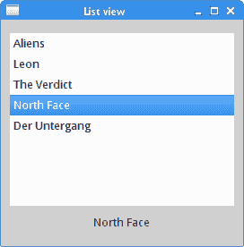
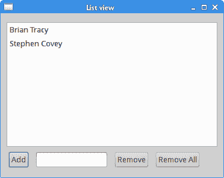
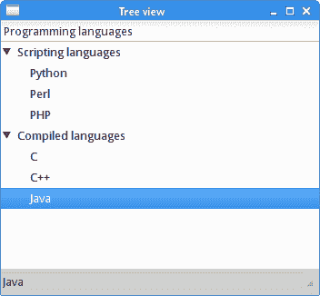

# `GtkTreeView`小部件

> 原文： [http://zetcode.com/gui/gtk2/gtktreeview/](http://zetcode.com/gui/gtk2/gtktreeview/)

在 GTK +编程教程的这一部分中，我们使用`GtkTreeView`小部件。

`GtkTreeView`小部件是一个复杂的小部件，可用于显示列表和树。 小部件可以具有一列或多列。 `GtkTreeView`小部件具有 MVC（模型视图控制器）设计架构。 这意味着数据与视图是分开的。

`GtkTreeView`小部件还可以使用其他几个对象。 `GtkCellRenderer`确定如何在`GtkTreeViewColumn`中显示数据。 `GtkListStore`和`GtkTreeStore`代表模型。 它们处理在`GtkTreeView`小部件中显示的数据。 `GtkTreeIter`是用于引用`GtkTreeView`中的行的结构。 `GtkTreeSelection`是处理选择的对象。

## 列表视图

第一个示例将显示一个简单的列表视图。 我们将显示文本数据。

`listview.c`

```c
#include <gtk/gtk.h>

enum {

  LIST_ITEM = 0,
  N_COLUMNS
};

void init_list(GtkWidget *list) {

  GtkCellRenderer *renderer;
  GtkTreeViewColumn *column;
  GtkListStore *store;

  renderer = gtk_cell_renderer_text_new ();
  column = gtk_tree_view_column_new_with_attributes("List Items",
          renderer, "text", LIST_ITEM, NULL);
  gtk_tree_view_append_column(GTK_TREE_VIEW(list), column);

  store = gtk_list_store_new(N_COLUMNS, G_TYPE_STRING);

  gtk_tree_view_set_model(GTK_TREE_VIEW(list), 
      GTK_TREE_MODEL(store));

  g_object_unref(store);
}

void add_to_list(GtkWidget *list, const gchar *str) {

  GtkListStore *store;
  GtkTreeIter iter;

  store = GTK_LIST_STORE(gtk_tree_view_get_model
      (GTK_TREE_VIEW(list)));

  gtk_list_store_append(store, &iter);
  gtk_list_store_set(store, &iter, LIST_ITEM, str, -1);
}

void on_changed(GtkWidget *widget, gpointer label) {

  GtkTreeIter iter;
  GtkTreeModel *model;
  gchar *value;

  if (gtk_tree_selection_get_selected(
      GTK_TREE_SELECTION(widget), &model, &iter)) {

    gtk_tree_model_get(model, &iter, LIST_ITEM, &value,  -1);
    gtk_label_set_text(GTK_LABEL(label), value);
    g_free(value);
  }
}

int main(int argc, char *argv[]) {

  GtkWidget *window;
  GtkWidget *list;

  GtkWidget *vbox;
  GtkWidget *label;
  GtkTreeSelection *selection; 

  gtk_init(&argc, &argv);

  window = gtk_window_new(GTK_WINDOW_TOPLEVEL);
  list = gtk_tree_view_new();

  gtk_window_set_title(GTK_WINDOW(window), "List view");
  gtk_window_set_position(GTK_WINDOW(window), GTK_WIN_POS_CENTER);
  gtk_container_set_border_width(GTK_CONTAINER(window), 10);
  gtk_window_set_default_size(GTK_WINDOW(window), 270, 250);

  gtk_tree_view_set_headers_visible(GTK_TREE_VIEW(list), FALSE);

  vbox = gtk_vbox_new(FALSE, 0);

  gtk_box_pack_start(GTK_BOX(vbox), list, TRUE, TRUE, 5);

  label = gtk_label_new("");
  gtk_box_pack_start(GTK_BOX(vbox), label, FALSE, FALSE, 5);

  gtk_container_add(GTK_CONTAINER(window), vbox);

  init_list(list);
  add_to_list(list, "Aliens");
  add_to_list(list, "Leon");
  add_to_list(list, "The Verdict");
  add_to_list(list, "North Face");
  add_to_list(list, "Der Untergang");

  selection = gtk_tree_view_get_selection(GTK_TREE_VIEW(list));

  g_signal_connect(selection, "changed", 
      G_CALLBACK(on_changed), label);

  g_signal_connect(G_OBJECT (window), "destroy",
      G_CALLBACK(gtk_main_quit), NULL);

  gtk_widget_show_all(window);

  gtk_main();

  return 0;
}

```

在我们的代码示例中，我们在`GtkTreeView`中显示了五个项目。 我们只有一列，并且该列的标题是隐藏的。 我们将`GtkVBox`放入窗口。 该框具有两个小部件：`GtkTreeView`和`GtkLabel`。

```c
list = gtk_tree_view_new();

```

`gtk_tree_view_new()`函数创建一个新的`GtkTreeView`小部件。

```c
gtk_tree_view_set_headers_visible(GTK_TREE_VIEW(list), FALSE);

```

我们使用`gtk_tree_view_set_headers_visible()`功能隐藏列标题。

```c
label = gtk_label_new("");
gtk_box_pack_start(GTK_BOX(vbox), label, FALSE, FALSE, 5);

```

创建`GtkLabel`并将其放置在`GtkTreeView`下方。

```c
init_list(list);

```

此函数初始化列表。

```c
renderer = gtk_cell_renderer_text_new();
column = gtk_tree_view_column_new_with_attributes("List Items",
        renderer, "text", LIST_ITEM, NULL);
gtk_tree_view_append_column(GTK_TREE_VIEW(list), column);

```

在该函数内部，我们创建并附加一列。

```c
store = gtk_list_store_new(N_COLUMNS, G_TYPE_STRING);

gtk_tree_view_set_model(GTK_TREE_VIEW(list), 
    GTK_TREE_MODEL(store));

```

我们创建一个`GtkListStore`（模型）并将其设置为列表。

```c
g_object_unref(store);

```

`TreeView`增加了存储对象的参考。 我们使用`g_object_unref()`功能将参考从 2 减少到 1。 然后随视图自动销毁模型。

```c
add_to_list(list, "Aliens");

```

该用户功能将一个选项添加到列表中。

```c
store = GTK_LIST_STORE(gtk_tree_view_get_model
    (GTK_TREE_VIEW(list)));

gtk_list_store_append(store, &iter);
gtk_list_store_set(store, &iter, LIST_ITEM, str, -1);

```

在`add_to_list()`函数内部，我们使用`gtk_tree_view_get_model()`函数调用获得模型。 我们追加一个新行，并为该行设置一个值，该值由`GtkTreeIter`对象引用。

```c
selection = gtk_tree_view_get_selection(GTK_TREE_VIEW(list));

```

不需要显式创建`GtkTreeSelection`； 它是使用`GtkTreeView`小部件自动创建的。 使用`gtk_tree_view_get_selection()`函数调用可获得对窗口小部件的引用。

```c
g_signal_connect(selection, "changed", 
    G_CALLBACK(on_changed), label);

```

`GtkTreeSelection`的`changed`信号连接到`on_changed()`处理程序。

```c
if (gtk_tree_selection_get_selected(
    GTK_TREE_SELECTION(widget), &model, &iter)) {

```

`gtk_tree_selection_get_selected()`功能将`iter`设置为当前选定的节点。

```c
gtk_tree_model_get(model, &iter, LIST_ITEM, &value,  -1);

```

在处理函数中，我们获取`iter`对象引用的行中单元格的值。

```c
gtk_label_set_text(GTK_LABEL(label), value);

```

检索到的值通过`gtk_label_set_text()`功能设置为标签。



Figure: List view

## 动态列表视图

第二个示例在前一个示例中添加了其他功能。 我们将能够在列表视图中添加和删除项目。

`dynamiclistview.c`

```c
#include <gtk/gtk.h>

enum {

  LIST_ITEM = 0,
  N_COLUMNS
};

GtkWidget *list;

void append_item(GtkWidget *widget, gpointer entry) {

  GtkListStore *store;
  GtkTreeIter iter;

  const gchar *str = gtk_entry_get_text(entry); 

  store = GTK_LIST_STORE(gtk_tree_view_get_model(GTK_TREE_VIEW(list)));

  gtk_list_store_append(store, &iter);
  gtk_list_store_set(store, &iter, LIST_ITEM, str, -1);

  gtk_entry_set_text(entry, "");
}

void remove_item(GtkWidget *widget, gpointer selection) {

  GtkListStore *store;
  GtkTreeModel *model;
  GtkTreeIter  iter;

  store = GTK_LIST_STORE(gtk_tree_view_get_model(GTK_TREE_VIEW(list)));
  model = gtk_tree_view_get_model(GTK_TREE_VIEW(list));

  if (gtk_tree_model_get_iter_first(model, &iter) == FALSE) {
      return;
  }

  if (gtk_tree_selection_get_selected(GTK_TREE_SELECTION(selection), 
         &model, &iter)) {
    gtk_list_store_remove(store, &iter);
  }
}

void remove_all(GtkWidget *widget, gpointer selection) {

  GtkListStore *store;
  GtkTreeModel *model;
  GtkTreeIter  iter;

  store = GTK_LIST_STORE(gtk_tree_view_get_model(GTK_TREE_VIEW(list)));
  model = gtk_tree_view_get_model(GTK_TREE_VIEW(list));

  if (gtk_tree_model_get_iter_first(model, &iter) == FALSE) {
      return;
  }

  gtk_list_store_clear(store);
}

void init_list(GtkWidget *list) {

  GtkCellRenderer    *renderer;
  GtkTreeViewColumn  *column;
  GtkListStore       *store;

  renderer = gtk_cell_renderer_text_new();
  column = gtk_tree_view_column_new_with_attributes("List Item",
          renderer, "text", LIST_ITEM, NULL);
  gtk_tree_view_append_column(GTK_TREE_VIEW(list), column);

  store = gtk_list_store_new(N_COLUMNS, G_TYPE_STRING);

  gtk_tree_view_set_model(GTK_TREE_VIEW(list), GTK_TREE_MODEL(store));

  g_object_unref(store);
}

int main(int argc, char *argv[]) {

  GtkWidget *window;
  GtkWidget *sw;

  GtkWidget *remove;
  GtkWidget *add;
  GtkWidget *removeAll;
  GtkWidget *entry;

  GtkWidget *vbox;
  GtkWidget *hbox;

  GtkTreeSelection *selection; 

  gtk_init(&argc, &argv);

  window = gtk_window_new(GTK_WINDOW_TOPLEVEL);

  gtk_window_set_title(GTK_WINDOW(window), "List view");
  gtk_window_set_position(GTK_WINDOW(window), GTK_WIN_POS_CENTER);
  gtk_container_set_border_width(GTK_CONTAINER (window), 10);
  gtk_widget_set_size_request(window, 370, 270);

  sw = gtk_scrolled_window_new(NULL, NULL);
  list = gtk_tree_view_new();  
  gtk_container_add(GTK_CONTAINER(sw), list);

  gtk_scrolled_window_set_policy(GTK_SCROLLED_WINDOW(sw),
            GTK_POLICY_AUTOMATIC, GTK_POLICY_AUTOMATIC);

  gtk_scrolled_window_set_shadow_type(GTK_SCROLLED_WINDOW(sw),
            GTK_SHADOW_ETCHED_IN);

  gtk_tree_view_set_headers_visible(GTK_TREE_VIEW(list), FALSE);

  vbox = gtk_vbox_new(FALSE, 0);

  gtk_box_pack_start(GTK_BOX(vbox), sw, TRUE, TRUE, 5);

  hbox = gtk_hbox_new(FALSE, 5);

  add = gtk_button_new_with_label("Add");
  remove = gtk_button_new_with_label("Remove");
  removeAll = gtk_button_new_with_label("Remove All");
  entry = gtk_entry_new();
  gtk_widget_set_size_request(entry, 120, -1);

  gtk_box_pack_start(GTK_BOX(hbox), add, FALSE, TRUE, 3);
  gtk_box_pack_start(GTK_BOX(hbox), entry, FALSE, TRUE, 3);
  gtk_box_pack_start(GTK_BOX(hbox), remove, FALSE, TRUE, 3);
  gtk_box_pack_start(GTK_BOX(hbox), removeAll, FALSE, TRUE, 3);

  gtk_box_pack_start(GTK_BOX(vbox), hbox, FALSE, TRUE, 3);

  gtk_container_add(GTK_CONTAINER(window), vbox);

  init_list(list);

  selection = gtk_tree_view_get_selection(GTK_TREE_VIEW(list));

  g_signal_connect(G_OBJECT(add), "clicked",
          G_CALLBACK(append_item), entry);

  g_signal_connect(G_OBJECT(remove), "clicked",
          G_CALLBACK(remove_item), selection);

  g_signal_connect(G_OBJECT(removeAll), "clicked",
          G_CALLBACK(remove_all), selection);

  g_signal_connect(G_OBJECT(window), "destroy",
          G_CALLBACK(gtk_main_quit), NULL);

  gtk_widget_show_all(window);

  gtk_main();

  return 0;
}

```

在示例中，我们有三个按钮和一个文本输入。 这些按钮添加一个新项目，删除选定的项目，然后删除所有项目。

```c
sw = gtk_scrolled_window_new(NULL, NULL);
list = gtk_tree_view_new();  
gtk_container_add(GTK_CONTAINER(sw), list);

```

`GtkTreeView`放置在滚动窗口内。

```c
if (gtk_tree_selection_get_selected(GTK_TREE_SELECTION(selection), 
    &model, &iter)) {
  gtk_list_store_remove(store, &iter);
}

```

`gtk_list_store_remove()`功能从列表中删除一个项目。

```c
gtk_list_store_clear(store);

```

`gtk_list_store_clear()`从列表中删除所有项目。

```c
if (gtk_tree_model_get_iter_first(model, &iter) == FALSE) {
    return;
}

```

此代码检查列表中是否还有剩余项目。 显然，只有列表中至少剩余一个，我们才能删除项目。



Figure: Dynamic List view

## 树视图

以下示例使用`GtkTreeView`小部件显示分层数据。 在前两个示例中，我们使用了列表视图。 现在我们将使用树形视图。

`treeview.c`

```c
#include <gtk/gtk.h>

enum {
  COLUMN = 0,
  NUM_COLS
};

void on_changed(GtkWidget *widget, gpointer statusbar) {

  GtkTreeIter iter;
  GtkTreeModel *model;
  gchar *value;

  if (gtk_tree_selection_get_selected(
      GTK_TREE_SELECTION(widget), &model, &iter)) {

    gtk_tree_model_get(model, &iter, COLUMN, &value,  -1);
    gtk_statusbar_push(GTK_STATUSBAR(statusbar),
        gtk_statusbar_get_context_id(GTK_STATUSBAR(statusbar), 
            value), value);
    g_free(value);
  }
}

GtkTreeModel *create_and_fill_model(void) {

  GtkTreeStore *treestore;
  GtkTreeIter toplevel, child;

  treestore = gtk_tree_store_new(NUM_COLS,
                  G_TYPE_STRING);

  gtk_tree_store_append(treestore, &toplevel, NULL);
  gtk_tree_store_set(treestore, &toplevel,
                     COLUMN, "Scripting languages",
                     -1);

  gtk_tree_store_append(treestore, &child, &toplevel);
  gtk_tree_store_set(treestore, &child,
                     COLUMN, "Python",
                     -1);
  gtk_tree_store_append(treestore, &child, &toplevel);
  gtk_tree_store_set(treestore, &child,
                     COLUMN, "Perl",
                     -1);
  gtk_tree_store_append(treestore, &child, &toplevel);
  gtk_tree_store_set(treestore, &child,
                     COLUMN, "PHP",
                     -1);

  gtk_tree_store_append(treestore, &toplevel, NULL);
  gtk_tree_store_set(treestore, &toplevel,
                     COLUMN, "Compiled languages",
                     -1);

  gtk_tree_store_append(treestore, &child, &toplevel);
  gtk_tree_store_set(treestore, &child,
                     COLUMN, "C",
                     -1);

  gtk_tree_store_append(treestore, &child, &toplevel);
  gtk_tree_store_set(treestore, &child,
                     COLUMN, "C++",
                     -1);

  gtk_tree_store_append(treestore, &child, &toplevel);
  gtk_tree_store_set(treestore, &child,
                     COLUMN, "Java",
                     -1);

  return GTK_TREE_MODEL(treestore);
}

GtkWidget *create_view_and_model(void) {

  GtkTreeViewColumn *col;
  GtkCellRenderer *renderer;
  GtkWidget *view;
  GtkTreeModel *model;

  view = gtk_tree_view_new();

  col = gtk_tree_view_column_new();
  gtk_tree_view_column_set_title(col, "Programming languages");
  gtk_tree_view_append_column(GTK_TREE_VIEW(view), col);

  renderer = gtk_cell_renderer_text_new();
  gtk_tree_view_column_pack_start(col, renderer, TRUE);
  gtk_tree_view_column_add_attribute(col, renderer, 
      "text", COLUMN);

  model = create_and_fill_model();
  gtk_tree_view_set_model(GTK_TREE_VIEW(view), model);
  g_object_unref(model); 

  return view;
}

int main(int argc, char *argv[]) {

  GtkWidget *window;
  GtkWidget *view;
  GtkTreeSelection *selection; 
  GtkWidget *vbox;
  GtkWidget *statusbar;

  gtk_init(&argc, &argv);

  window = gtk_window_new(GTK_WINDOW_TOPLEVEL);
  gtk_window_set_position(GTK_WINDOW(window), GTK_WIN_POS_CENTER);
  gtk_window_set_title(GTK_WINDOW(window), "Tree view");
  gtk_widget_set_size_request(window, 350, 300);

  vbox = gtk_vbox_new(FALSE, 2);
  gtk_container_add(GTK_CONTAINER(window), vbox);

  view = create_view_and_model();
  selection = gtk_tree_view_get_selection(GTK_TREE_VIEW(view));

  gtk_box_pack_start(GTK_BOX(vbox), view, TRUE, TRUE, 1);

  statusbar = gtk_statusbar_new();
  gtk_box_pack_start(GTK_BOX(vbox), statusbar, FALSE, TRUE, 1);

  g_signal_connect(selection, "changed", 
      G_CALLBACK(on_changed), statusbar);

  g_signal_connect (G_OBJECT (window), "destroy",
          G_CALLBACK(gtk_main_quit), NULL);

  gtk_widget_show_all(window);

  gtk_main();

  return 0;
}

```

在示例中，我们将编程语言分为两组：脚本语言和编译语言。 语言类别是其项目列表的顶级节点。 当前选择的项目显示在状态栏中。 创建树视图的步骤与创建列表视图非常相似。

```c
treestore = gtk_tree_store_new(NUM_COLS,
                G_TYPE_STRING);

```

`gtk_tree_store_new()`函数创建`GtkTreeStore`，它是与`GtkTreeView`一起使用的树状数据结构。

```c
gtk_tree_store_append(treestore, &toplevel, NULL);
gtk_tree_store_set(treestore, &toplevel,
                  COLUMN, "Scripting languages",
                  -1);

```

这两行创建一个顶级节点。

```c
gtk_tree_store_append(treestore, &child, &toplevel);
gtk_tree_store_set(treestore, &child,
                  COLUMN, "Python",
                  -1);

```

在这里，我们将一个子项添加到顶级节点。



Figure: Tree View

在本章中，我们介绍了`GtkTreeView`小部件。