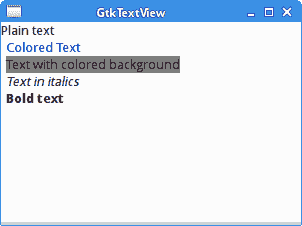
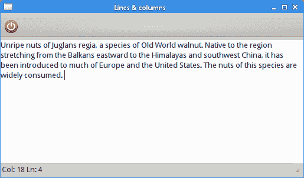
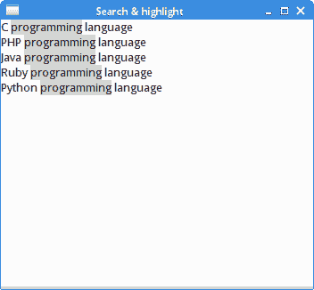

# GtkTextView 小部件

> 原文： [http://zetcode.com/gui/gtk2/gtktextview/](http://zetcode.com/gui/gtk2/gtktextview/)

在 GTK +编程教程的这一部分中，我们使用`GtkTextView`小部件。

`GtkTextView`小部件用于显示和编辑多行文本。 `GtkTextView`小部件也具有 MVC 设计。 `GtkTextView`代表视图组件，`GtkTextBuffer`代表模型组件。 `GtkTextBuffer`用于处理文本数据。 `GtkTextTag`是可以应用于文本的属性。 `GtkTextIter`表示文本中两个字符之间的位置。 所有使用文本的操作都是使用文本迭代器完成的。

## 简单的例子

在第一个示例中，我们显示一些`GtkTextView's`功能。 我们展示了如何将各种文本标签应用于文本数据。

`simpletextview.c`

```
#include <gtk/gtk.h>

int main(int argc, char *argv[]) {

  GtkWidget *window;
  GtkWidget *view;
  GtkWidget *vbox;

  GtkTextBuffer *buffer;
  GtkTextIter start, end;
  GtkTextIter iter;

  gtk_init(&argc, &argv);

  window = gtk_window_new(GTK_WINDOW_TOPLEVEL);
  gtk_window_set_position(GTK_WINDOW(window), GTK_WIN_POS_CENTER);
  gtk_window_set_default_size(GTK_WINDOW(window), 300, 200);
  gtk_window_set_title(GTK_WINDOW(window), "GtkTextView");

  vbox = gtk_vbox_new(FALSE, 0);
  view = gtk_text_view_new();
  gtk_box_pack_start(GTK_BOX(vbox), view, TRUE, TRUE, 0);

  buffer = gtk_text_view_get_buffer(GTK_TEXT_VIEW(view));

  gtk_text_buffer_create_tag(buffer, "gap",
        "pixels_above_lines", 30, NULL);

  gtk_text_buffer_create_tag(buffer, "lmarg", 
      "left_margin", 5, NULL);
  gtk_text_buffer_create_tag(buffer, "blue_fg", 
      "foreground", "blue", NULL); 
  gtk_text_buffer_create_tag(buffer, "gray_bg", 
      "background", "gray", NULL); 
  gtk_text_buffer_create_tag(buffer, "italic", 
      "style", PANGO_STYLE_ITALIC, NULL);
  gtk_text_buffer_create_tag(buffer, "bold", 
      "weight", PANGO_WEIGHT_BOLD, NULL);

  gtk_text_buffer_get_iter_at_offset(buffer, &iter, 0);

  gtk_text_buffer_insert(buffer, &iter, "Plain text\n", -1);
  gtk_text_buffer_insert_with_tags_by_name(buffer, &iter, 
        "Colored Text\n", -1, "blue_fg", "lmarg",  NULL);
  gtk_text_buffer_insert_with_tags_by_name (buffer, &iter, 
        "Text with colored background\n", -1, "lmarg", "gray_bg", NULL);

  gtk_text_buffer_insert_with_tags_by_name (buffer, &iter, 
        "Text in italics\n", -1, "italic", "lmarg",  NULL);

  gtk_text_buffer_insert_with_tags_by_name (buffer, &iter, 
        "Bold text\n", -1, "bold", "lmarg",  NULL);

  gtk_container_add(GTK_CONTAINER(window), vbox);

  g_signal_connect(G_OBJECT(window), "destroy",
        G_CALLBACK(gtk_main_quit), NULL);

  gtk_widget_show_all(window);

  gtk_main();

  return 0;
}

```

该示例显示了一些应用了不同`GtkTextTags`的文本。

```
view = gtk_text_view_new();

```

`gtk_text_view_new()`函数创建一个新的`GtkTextView`小部件。

```
gtk_text_buffer_create_tag(buffer, "blue_fg", 
    "foreground", "blue", NULL); 

```

`gtk_text_buffer_create_tag()`函数创建一个标签，并将其添加到缓冲区的标签表中。 第二个参数是标签名称。 标签将文本的颜色更改为蓝色。

```
gtk_text_buffer_insert_with_tags_by_name(buffer, &iter, 
      "Colored Text\n", -1, "blue_fg", "lmarg",  NULL);

```

`gtk_text_buffer_insert_with_tags_by_name()`功能插入带有`blue_fg`和`lmarg`文本标签的文本。 标签通过其名称识别。



Figure: GtkTextView

## 行和列

下面的示例显示文本光标的当前行和列。

`linescols.c`

```
#include <gtk/gtk.h>

update_statusbar(GtkTextBuffer *buffer,
                  GtkStatusbar  *statusbar) {
  gchar *msg;
  gint row, col;
  GtkTextIter iter;

  gtk_statusbar_pop(statusbar, 0); 

  gtk_text_buffer_get_iter_at_mark(buffer,
      &iter, gtk_text_buffer_get_insert(buffer));

  row = gtk_text_iter_get_line(&iter);
  col = gtk_text_iter_get_line_offset(&iter);

  msg = g_strdup_printf("Col: %d Ln: %d", col+1, row+1);

  gtk_statusbar_push(statusbar, 0, msg);

  g_free(msg);
}

void mark_set_callback(GtkTextBuffer *buffer, 
    const GtkTextIter *new_location, GtkTextMark *mark, gpointer data) {

  update_statusbar(buffer, GTK_STATUSBAR(data));
}

int main(int argc, char *argv[]) {

  GtkWidget *window;
  GtkWidget *vbox;

  GtkWidget *toolbar;
  GtkWidget *view;
  GtkWidget *statusbar;
  GtkToolItem *exit;
  GtkTextBuffer *buffer;

  gtk_init(&argc, &argv);

  window = gtk_window_new(GTK_WINDOW_TOPLEVEL);
  gtk_window_set_position(GTK_WINDOW(window), GTK_WIN_POS_CENTER);
  gtk_window_set_default_size(GTK_WINDOW(window), 350, 300);
  gtk_window_set_title(GTK_WINDOW(window), "Lines & columns");

  vbox = gtk_vbox_new(FALSE, 0);
  gtk_container_add(GTK_CONTAINER(window), vbox);

  toolbar = gtk_toolbar_new();
  gtk_toolbar_set_style(GTK_TOOLBAR(toolbar), GTK_TOOLBAR_ICONS);

  exit = gtk_tool_button_new_from_stock(GTK_STOCK_QUIT);
  gtk_toolbar_insert(GTK_TOOLBAR(toolbar), exit, -1);

  gtk_box_pack_start(GTK_BOX(vbox), toolbar, FALSE, FALSE, 5);

  view = gtk_text_view_new();
  gtk_text_view_set_wrap_mode(GTK_TEXT_VIEW(view), GTK_WRAP_WORD);
  gtk_box_pack_start(GTK_BOX(vbox), view, TRUE, TRUE, 0);
  gtk_widget_grab_focus(view);

  buffer = gtk_text_view_get_buffer(GTK_TEXT_VIEW(view));

  statusbar = gtk_statusbar_new();
  gtk_box_pack_start(GTK_BOX(vbox), statusbar, FALSE, FALSE, 0);

  g_signal_connect(G_OBJECT(exit), "clicked", 
        G_CALLBACK(gtk_main_quit), NULL);

  g_signal_connect(buffer, "changed",
        G_CALLBACK(update_statusbar), statusbar);

  g_signal_connect_object(buffer, "mark_set", 
        G_CALLBACK(mark_set_callback), statusbar, 0);

  g_signal_connect_swapped(G_OBJECT(window), "destroy",
        G_CALLBACK(gtk_main_quit), NULL);

  gtk_widget_show_all(window);

  update_statusbar(buffer, GTK_STATUSBAR(statusbar));

  gtk_main();

  return 0;
}

```

在此代码示例中，我们在状态栏中显示文本光标的当前位置。

```
g_signal_connect(buffer, "changed",
      G_CALLBACK(update_statusbar), statusbar);

```

更改文本时，我们将调用`update_statusbar()`处理程序。

```
g_signal_connect_object(buffer, "mark_set", 
      G_CALLBACK(mark_set_callback), statusbar, 0);

```

光标移动时会发出`mark_set`信号。

```
gtk_statusbar_pop(statusbar, 0); 

```

此代码行从状态栏中清除上下文标识为 0 的消息。

```
gtk_text_buffer_get_iter_at_mark(buffer,
    &iter, gtk_text_buffer_get_insert(buffer));

row = gtk_text_iter_get_line(&iter);
col = gtk_text_iter_get_line_offset(&iter);

```

这些行确定当前行和列。

```
msg = g_strdup_printf("Col %d Ln %d", col+1, row+1);

```

`g_strdup_printf()`用于构建要在状态栏上显示的文本。

```
gtk_statusbar_push(statusbar, 0, msg);

```

我们使用`gtk_statusbar_push()`功能在状态栏上显示文本。



Figure: Lines and columns

## 搜索&突出显示

在下一个示例中，我们在`GtkTextBuffer`中进行了一些搜索； 我们在文本缓冲区中突出显示一些文本模式。

`search.c`

```
#include <gtk/gtk.h>
#include <gdk/gdkkeysyms.h>

gboolean key_pressed(GtkWidget *window,
    GdkEventKey* event, GtkTextBuffer *buffer) {

  GtkTextIter start_sel, end_sel;
  GtkTextIter start_find, end_find;
  GtkTextIter start_match, end_match;
  gboolean selected;    
  gchar *text;            

  if ((event->type == GDK_KEY_PRESS) && 
     (event->state & GDK_CONTROL_MASK)) {

    switch (event->keyval) {

      case GDK_m :
        selected = gtk_text_buffer_get_selection_bounds(buffer, 
            &start_sel, &end_sel);
      if (selected) {
        gtk_text_buffer_get_start_iter(buffer, &start_find);
        gtk_text_buffer_get_end_iter(buffer, &end_find);

        gtk_text_buffer_remove_tag_by_name(buffer, "gray_bg", 
            &start_find, &end_find);  
        text = (gchar *) gtk_text_buffer_get_text(buffer, &start_sel,
            &end_sel, FALSE);

        while (gtk_text_iter_forward_search(&start_find, text, 
                GTK_TEXT_SEARCH_TEXT_ONLY | 
                GTK_TEXT_SEARCH_VISIBLE_ONLY, 
                &start_match, &end_match, NULL)) {

          gtk_text_buffer_apply_tag_by_name(buffer, "gray_bg", 
              &start_match, &end_match);
          gint offset = gtk_text_iter_get_offset(&end_match);
          gtk_text_buffer_get_iter_at_offset(buffer, 
              &start_find, offset);
        }

        g_free(text);
      }

      break;

      case GDK_r:
        gtk_text_buffer_get_start_iter(buffer, &start_find);
        gtk_text_buffer_get_end_iter(buffer, &end_find);

        gtk_text_buffer_remove_tag_by_name(buffer, "gray_bg", 
            &start_find, &end_find);  
      break;
    }
  }

  return FALSE;
}

int main(int argc, gchar *argv[]) {

  GtkWidget *window;
  GtkWidget *view;
  GtkWidget *vbox;

  GtkTextBuffer *buffer;
  GtkTextIter start, end;
  GtkTextIter iter;

  gtk_init(&argc, &argv);

  window = gtk_window_new(GTK_WINDOW_TOPLEVEL);
  gtk_window_set_position(GTK_WINDOW(window), GTK_WIN_POS_CENTER);
  gtk_window_set_default_size(GTK_WINDOW(window), 350, 300);
  gtk_window_set_title(GTK_WINDOW(window), "Search & highlight");
  GTK_WINDOW(window)->allow_shrink = TRUE;

  vbox = gtk_vbox_new(FALSE, 0);
  view = gtk_text_view_new();
  gtk_widget_add_events(view, GDK_BUTTON_PRESS_MASK);
  gtk_box_pack_start(GTK_BOX(vbox), view, TRUE, TRUE, 0);

  buffer = gtk_text_view_get_buffer(GTK_TEXT_VIEW(view));
  gtk_text_buffer_create_tag(buffer, "gray_bg", 
      "background", "lightgray", NULL); 
  gtk_container_add(GTK_CONTAINER(window), vbox);

  g_signal_connect(G_OBJECT(window), "destroy",
        G_CALLBACK(gtk_main_quit), NULL);

  g_signal_connect(G_OBJECT(window), "key-press-event",
        G_CALLBACK(key_pressed), buffer);

  gtk_widget_show_all(window);

  gtk_main();

  return 0;
}

```

在我们的代码示例中，我们使用键盘快捷键。 &lt;kbd&gt;Ctrl&lt;/kbd&gt; + &lt;kbd&gt;M&lt;/kbd&gt; 快捷键突出显示所有当前选中的文本。 &lt;kbd&gt;Ctrl&lt;/kbd&gt; + &lt;kbd&gt;R&lt;/kbd&gt; 从文本中删除突出显示的内容。

```
gtk_text_buffer_create_tag(buffer, "gray_bg", 
    "background", "lightgray", NULL); 

```

这是我们在示例中使用的`GtkTextTag`。 标签将文本的背景设为灰色。

```
selected = gtk_text_buffer_get_selection_bounds(buffer, 
    &start_sel, &end_sel);

```

使用`gtk_text_buffer_get_selection_bounds()`功能，我们可以获得所选文本的开始和结束位置。

```
gtk_text_buffer_get_start_iter(buffer, &start_find);
gtk_text_buffer_get_end_iter(buffer, &end_find);

```

我们获得文本缓冲区中的第一个和最后一个位置。

```
gtk_text_buffer_remove_tag_by_name(buffer, "gray_bg", 
    &start_find, &end_find);  

```

使用`gtk_text_buffer_remove_tag_by_name()`功能，我们可以删除所有以前的文本标签。

```
text = (gchar *) gtk_text_buffer_get_text(buffer, &start_sel,
    &end_sel, FALSE);

```

我们获得选定的文本。 这是我们要搜索的文本。

```
while (gtk_text_iter_forward_search(&start_find, text, 
        GTK_TEXT_SEARCH_TEXT_ONLY | 
        GTK_TEXT_SEARCH_VISIBLE_ONLY, 
        &start_match, &end_match, NULL)) {

    gtk_text_buffer_apply_tag_by_name(buffer, "gray_bg", 
        &start_match, &end_match);
    gint offset = gtk_text_iter_get_offset(&end_match);
    gtk_text_buffer_get_iter_at_offset(buffer, 
        &start_find, offset);
}

```

此代码搜索所有出现的所选文本。 如果找到任何匹配项，则应用文本标签。 匹配之后，单词的终点成为下一次搜索的起点。



Figure: Search & Highlight

在本章中，我们介绍了`GtkTextView`小部件。