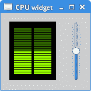

# 自定义 GTK+ 小部件

> 原文： [http://zetcode.com/gui/gtk2/customwidget/](http://zetcode.com/gui/gtk2/customwidget/)

在 GTK+ 编程教程的这一部分中，我们创建一个自定义的 GTK+ 小部件。 我们使用Cario图形库。

## CPU 小部件

在下一个示例中，我们创建一个自定义 CPU 小部件。

`mycpu.h`

```c
#ifndef __MY_CPU_H__
#define __MY_CPU_H__

#include <gtk/gtk.h>
#include <cairo.h>

G_BEGIN_DECLS

/* Standart GObject macros */
#define MY_TYPE_CPU (my_cpu_get_type())
#define MY_CPU(obj) (G_TYPE_CHECK_INSTANCE_CAST((obj), MY_TYPE_CPU, MyCpu))
#define MY_CPU_CLASS(klass) (G_TYPE_CHECK_CLASS_CAST((klass), MY_TYPE_CPU, MyCpuClass))
#define MY_IS_CPU(obj) (G_TYPE_CHECK_INSTANCE_TYPE((obj), MY_TYPE_CPU))
#define MY_IS_CPU_CLASS(klass) (G_TYPE_CHECK_CLASS_TYPE((klass), MY_TYPE_CPU))
#define MY_CPU_GET_CLASS(obj) (G_TYPE_INSTANCE_GET_CLASS((obj), MY_TYPE_CPU, MyCpuClass))

/* Type definition */
typedef struct _MyCpu        MyCpu;
typedef struct _MyCpuClass   MyCpuClass;
typedef struct _MyCpuPrivate MyCpuPrivate;

struct _MyCpu {

   GtkWidget parent;

   /*< Private >*/
   MyCpuPrivate *priv;
};

struct _MyCpuClass {

   GtkWidgetClass parent_class;
};

/* Public API */
GType      my_cpu_get_type(void) G_GNUC_CONST;
GtkWidget *my_cpu_new(void);

gdouble my_cpu_get_percent(MyCpu *cpu);
void    my_cpu_set_percent(MyCpu *cpu, gdouble sel);

G_END_DECLS

#endif /* __MY_CPU_H__ */

```

在`mycpu.h`文件中，我们定义了自定义窗口小部件的类型，宏和函数。

`mycpu.c`

```c
/* mycpu.c */

#include "mycpu.h"

/* Properties enum */
enum {

   P_0, /* Padding */
   P_PERCENT
};

/* Private data structure */
struct _MyCpuPrivate {

   gdouble percent;
   GdkWindow *window;
};

const gint WIDTH = 80;
const gint HEIGHT = 100;

/* Internal API */
static void my_cpu_set_property(GObject *object, guint prop_id, 
    const GValue *value, GParamSpec *pspec);
static void my_cpu_get_property(GObject *object, guint prop_id,
    GValue *value, GParamSpec *pspec);
static void my_cpu_size_request(GtkWidget *widget, 
    GtkRequisition *requisition);
static void my_cpu_size_allocate(GtkWidget *widget, 
    GtkAllocation *allocation);
static void my_cpu_realize(GtkWidget *widget);
static gboolean my_cpu_expose(GtkWidget *widget, 
    GdkEventExpose *event);

/* Define type */
G_DEFINE_TYPE(MyCpu, my_cpu, GTK_TYPE_WIDGET)

/* Initialization */
static void my_cpu_class_init(MyCpuClass *klass) {

   GObjectClass *g_class;
   GtkWidgetClass *w_class;
   GParamSpec *pspec;

   g_class = G_OBJECT_CLASS(klass);
   w_class = GTK_WIDGET_CLASS(klass);

   /* Override widget class methods */
   g_class->set_property  = my_cpu_set_property;
   g_class->get_property  = my_cpu_get_property;

   w_class->realize       = my_cpu_realize;
   w_class->size_request  = my_cpu_size_request;
   w_class->size_allocate = my_cpu_size_allocate;
   w_class->expose_event  = my_cpu_expose;

   /* Install property */
   pspec = g_param_spec_double("percent", "Percent", 
       "What CPU load should be displayed", 0, 1, 0, 
       G_PARAM_READWRITE | G_PARAM_STATIC_STRINGS);

   g_object_class_install_property(g_class, P_PERCENT, pspec);

   /* Add private data */
   g_type_class_add_private(g_class, sizeof(MyCpuPrivate));
}

static void my_cpu_init(MyCpu *cpu) {

   MyCpuPrivate *priv;

   priv = G_TYPE_INSTANCE_GET_PRIVATE(cpu, MY_TYPE_CPU, MyCpuPrivate);

   gtk_widget_set_has_window(GTK_WIDGET(cpu), TRUE);

   /* Set default values */
   priv->percent = 0;

   /* Create cache for faster access */
   cpu->priv = priv;
}

/* Overriden virtual methods */
static void my_cpu_set_property(GObject *object, guint prop_id,
    const GValue *value, GParamSpec *pspec) {

   MyCpu *cpu = MY_CPU(object);

   switch(prop_id) {

      case P_PERCENT:

         my_cpu_set_percent(cpu, g_value_get_double(value));
         break;

      default:

         G_OBJECT_WARN_INVALID_PROPERTY_ID(object, prop_id, pspec);
         break;
   }
}

static void my_cpu_get_property(GObject *object, guint prop_id,
                GValue *value, GParamSpec *pspec) {

   MyCpu *cpu = MY_CPU(object);

   switch(prop_id) {

      case P_PERCENT:
         g_value_set_double(value, cpu->priv->percent);
         break;

      default:
         G_OBJECT_WARN_INVALID_PROPERTY_ID(object, prop_id, pspec);
         break;
   }
}

static void my_cpu_realize(GtkWidget *widget) {

   MyCpuPrivate *priv = MY_CPU(widget)->priv;
   GtkAllocation alloc;
   GdkWindowAttr attrs;
   guint attrs_mask;

   gtk_widget_set_realized(widget, TRUE);

   gtk_widget_get_allocation(widget, &alloc);

   attrs.x           = alloc.x;
   attrs.y           = alloc.y;
   attrs.width       = alloc.width;
   attrs.height      = alloc.height;
   attrs.window_type = GDK_WINDOW_CHILD;
   attrs.wclass      = GDK_INPUT_OUTPUT;
   attrs.event_mask  = gtk_widget_get_events(widget) | GDK_EXPOSURE_MASK;

   attrs_mask = GDK_WA_X | GDK_WA_Y;

   priv->window = gdk_window_new(gtk_widget_get_parent_window(widget),
               &attrs, attrs_mask);
   gdk_window_set_user_data(priv->window, widget);
   gtk_widget_set_window(widget, priv->window);

   widget->style = gtk_style_attach(gtk_widget_get_style( widget ),
                             priv->window);
   gtk_style_set_background(widget->style, priv->window, GTK_STATE_NORMAL);
}

static void my_cpu_size_request(GtkWidget *widget, 
    GtkRequisition *requisition) {

   requisition->width  = WIDTH;
   requisition->height = HEIGHT;
}

static void my_cpu_size_allocate(GtkWidget *widget,
                 GtkAllocation *allocation) {

   MyCpuPrivate *priv;

   priv = MY_CPU(widget)->priv;

   gtk_widget_set_allocation(widget, allocation);

   if (gtk_widget_get_realized(widget)) {

      gdk_window_move_resize(priv->window, allocation->x, allocation->y,
          WIDTH, HEIGHT);
   }
}

static gboolean my_cpu_expose(GtkWidget *widget, 
    GdkEventExpose *event) {

   MyCpuPrivate *priv = MY_CPU(widget)->priv;
   cairo_t *cr;
   gint limit;
   gint i;

   cr = gdk_cairo_create(event->window);

   cairo_translate(cr, 0, 7);

   cairo_set_source_rgb(cr, 0, 0, 0);
   cairo_paint(cr);

   limit = 20 - priv->percent / 5;

   for (i = 1; i <= 20; i++) {

      if (i > limit) {
         cairo_set_source_rgb(cr, 0.6, 1.0, 0);
      } else {
         cairo_set_source_rgb(cr, 0.2, 0.4, 0);
      }

      cairo_rectangle(cr, 8,  i * 4, 30, 3);
      cairo_rectangle(cr, 42, i * 4, 30, 3);
      cairo_fill(cr);
   }

   cairo_destroy(cr);

   return TRUE;
}

/* Public API */
GtkWidget *my_cpu_new(void) {

   return(g_object_new(MY_TYPE_CPU, NULL));
}

gdouble my_cpu_get_percent(MyCpu *cpu) {

   g_return_val_if_fail(MY_IS_CPU(cpu), 0);

   return(cpu->priv->percent);
}

void my_cpu_set_percent(MyCpu *cpu, gdouble sel) {

   g_return_if_fail(MY_IS_CPU(cpu));

   cpu->priv->percent = sel;
   gtk_widget_queue_draw(GTK_WIDGET(cpu));
}

```

`mycpu.c`是 CPU 小部件的实现。 CPU 小部件是`GtkWidget`，我们可以使用 Cairo API 在其上进行绘制。 我们绘制一个黑色背景和 40 个小矩形。 矩形以两种颜色绘制：深绿色和亮绿色。 `GtkVScale`小部件控制在小部件上绘制的鲜绿色矩形的数量。

`main.c`

```c
#include "mycpu.h"

void cb_changed(GtkRange *range, GtkWidget *cpu) {

   my_cpu_set_percent(MY_CPU(cpu), gtk_range_get_value(range));
}

int main(int argc, char *argv[]) {

   GtkWidget *window;
   GtkWidget *hbox;
   GtkWidget *vbox;
   GtkWidget *cpu;
   GtkWidget *scale;

   gtk_init(&argc, &argv);

   window = gtk_window_new(GTK_WINDOW_TOPLEVEL);
   gtk_container_set_border_width(GTK_CONTAINER(window), 15);
   gtk_window_set_title(GTK_WINDOW(window), "CPU widget");

   vbox = gtk_vbox_new(FALSE, 0);
   hbox = gtk_hbox_new(FALSE, 25);

   cpu = my_cpu_new();
   gtk_box_pack_start(GTK_BOX(hbox), cpu, FALSE, FALSE, 0);

   scale = gtk_vscale_new_with_range(0, 100, 1);
   gtk_scale_set_draw_value(GTK_SCALE(scale), FALSE);
   gtk_range_set_inverted(GTK_RANGE(scale), TRUE);
   gtk_box_pack_start(GTK_BOX(hbox), scale, FALSE, FALSE, 0);

   gtk_box_pack_start(GTK_BOX(vbox), hbox, FALSE, FALSE, 0);
   gtk_container_add(GTK_CONTAINER(window), vbox);

   g_signal_connect(scale, "value-changed", G_CALLBACK(cb_changed), cpu);
   g_signal_connect(window, "destroy", G_CALLBACK(gtk_main_quit), NULL);

   gtk_widget_show_all(window);

   gtk_main();

   return 0;
}

```

这是主文件。 我们创建自定义 CPU 小部件，并使其与`GtkVScale`小部件一起使用。

```c
gcc -Wall $(pkg-config --cflags gtk+-2.0) -o mycpu.o -c mycpu.c
gcc -Wall $(pkg-config --cflags gtk+-2.0) -o main.o -c main.c
gcc -o test_cpu main.o mycpu.o $(pkg-config --libs gtk+-2.0)

```

使用这些命令，我​​们构建了示例。



Figure: CPU widget

在本章中，我们创建了一个自定义的 GTK+ 小部件。