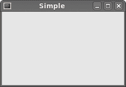
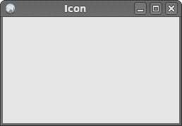
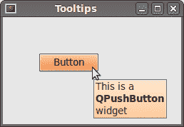
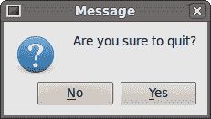

# PyQt4 中的第一个程序

> 原文： [http://zetcode.com/gui/pyqt4/firstprograms/](http://zetcode.com/gui/pyqt4/firstprograms/)

在 PyQt4 教程的这一部分中，我们将学习一些基本功能。

## 简单的例子

这是一个显示小窗口的简单示例。 然而，我们可以利用这个窗口做很多事情。 我们可以调整大小，最大化或最小化它。 这需要大量的编码。 已经有人对该功能进行了编码。 由于它在大多数应用中都会重复出现，因此无需重新编码。 PyQt4 是高级工具包。 如果我们使用较低级的工具箱进行编码，则下面的代码示例可能很容易包含数百行。

```py
#!/usr/bin/python
# -*- coding: utf-8 -*-

"""
ZetCode PyQt4 tutorial 

In this example, we create a simple
window in PyQt4.

author: Jan Bodnar
website: zetcode.com 
last edited: October 2011
"""

import sys
from PyQt4 import QtGui

def main():

    app = QtGui.QApplication(sys.argv)

    w = QtGui.QWidget()
    w.resize(250, 150)
    w.move(300, 300)
    w.setWindowTitle('Simple')
    w.show()

    sys.exit(app.exec_())

if __name__ == '__main__':
    main()

```

上面的代码在屏幕上显示了一个小窗口。

```py
import sys
from PyQt4 import QtGui

```

在这里，我们提供必要的导入。 基本的 GUI 小部件位于`QtGui`模块中。

```py
app = QtGui.QApplication(sys.argv)

```

每个 PyQt4 应用都必须创建一个应用对象。 应用对象位于`QtGui`模块中。 `sys.argv`参数是命令行中的参数列表。 可以从外壳运行 Python 脚本。 这是我们可以控制脚本启动的方式。

```py
w = QtGui.QWidget()

```

`QtGui.QWidget`小部件是 PyQt4 中所有用户界面对象的基类。 我们为`QtGui.QWidget`提供了默认的构造函数。 默认构造函数没有父代。 没有父级的窗口小部件称为窗口。

```py
w.resize(250, 150)

```

`resize()`方法调整窗口小部件的大小。 宽 250 像素，高 150 像素。

```py
w.move(300, 300)

```

`move()`方法将窗口小部件移动到屏幕上`x = 300`和`y = 300`坐标的位置。

```py
w.setWindowTitle('Simple')

```

在这里，我们为窗口设置标题。 标题显示在标题栏中。

```py
w.show()

```

`show()`方法在屏幕上显示小部件。 首先在内存中创建一个小部件，然后将其显示在屏幕上。

```py
sys.exit(app.exec_())

```

最后，我们进入应用的主循环。 事件处理从这一点开始。 主循环从窗口系统接收事件，并将其分配给应用小部件。 如果调用`exit()`方法或主窗口小部件被销毁，则主循环结束。 `sys.exit()`方法可确保干净退出。 将告知环境应用如何结束。

`exec_()`方法带有下划线。 这是因为`exec`是 Python 关键字。 因此，使用了`exec_()`。



图：简单

## 应用图标

应用图标是一个小图像，通常显示在标题栏的左上角。 在下面的示例中，我们将展示如何在 PyQt4 中做到这一点。 我们还将介绍一些新方法。

```py
#!/usr/bin/python
# -*- coding: utf-8 -*-

"""
ZetCode PyQt4 tutorial 

This example shows an icon
in the titlebar of the window.

author: Jan Bodnar
website: zetcode.com 
last edited: October 2011
"""

import sys
from PyQt4 import QtGui

class Example(QtGui.QWidget):

    def __init__(self):
        super(Example, self).__init__()

        self.initUI()

    def initUI(self):

        self.setGeometry(300, 300, 250, 150)
        self.setWindowTitle('Icon')
        self.setWindowIcon(QtGui.QIcon('web.png'))        

        self.show()

def main():

    app = QtGui.QApplication(sys.argv)
    ex = Example()
    sys.exit(app.exec_())

if __name__ == '__main__':
    main()    

```

前面的示例以过程样式编码。 Python 编程语言支持过程和面向对象的编程风格。 在 PyQt4 中进行编程意味着在 OOP 中进行编程。

```py
class Example(QtGui.QWidget):

    def __init__(self):
        super(Example, self).__init__()
        ...

```

面向对象编程中最重要的三件事是类，数据和方法。 在这里，我们创建了一个名为`Example`的新类。 `Example`类继承自`QtGui.QWidget`类。 这意味着我们调用了两个构造函数：第一个构造函数用于`Example`类，第二个构造函数用于继承的类。 `super()`方法返回`Example`类的父对象，我们将其称为构造函数。 `__init__()`方法是 Python 中的构造方法。

```py
self.initUI() 

```

GUI 的创建委托给`initUI()`方法。

```py
self.setGeometry(300, 300, 250, 150)
self.setWindowTitle('Icon')
self.setWindowIcon(QtGui.QIcon('web.png'))  

```

所有这三种方法都从`QtGui.QWidget`类继承。 `setGeometry()`做两件事。 它在屏幕上找到窗口并设置其大小。 前两个参数是窗口的 x 和 y 位置。 第三个是窗口的宽度，第四个是窗口的高度。 实际上，它将`resize()`和`move()`方法结合在一起。 最后一种方法设置应用图标。 为此，我们创建了一个`QtGui.QIcon`对象。 `QtGui.QIcon`接收到要显示的图标的路径。

```py
def main():

    app = QtGui.QApplication(sys.argv)
    ex = Example()
    sys.exit(app.exec_())

if __name__ == '__main__':
    main()   

```

启动代码已放置在`main()`方法中。 这是 Python 惯用语。



图：图标

## 显示工具提示

我们可以为我们的任何小部件提供气球帮助。

```py
#!/usr/bin/python
# -*- coding: utf-8 -*-

"""
ZetCode PyQt4 tutorial 

This example shows a tooltip on 
a window and a button

author: Jan Bodnar
website: zetcode.com 
last edited: October 2011
"""

import sys
from PyQt4 import QtGui

class Example(QtGui.QWidget):

    def __init__(self):
        super(Example, self).__init__()

        self.initUI()

    def initUI(self):

        QtGui.QToolTip.setFont(QtGui.QFont('SansSerif', 10))

        self.setToolTip('This is a <b>QWidget</b> widget')

        btn = QtGui.QPushButton('Button', self)
        btn.setToolTip('This is a <b>QPushButton</b> widget')
        btn.resize(btn.sizeHint())
        btn.move(50, 50)       

        self.setGeometry(300, 300, 250, 150)
        self.setWindowTitle('Tooltips')    
        self.show()

def main():

    app = QtGui.QApplication(sys.argv)
    ex = Example()
    sys.exit(app.exec_())

if __name__ == '__main__':
    main()

```

在此示例中，我们显示了两个 PyQt4 小部件的工具提示。

```py
QtGui.QToolTip.setFont(QtGui.QFont('SansSerif', 10))

```

此静态方法设置用于呈现工具提示的字体。 我们使用 10pt SansSerif 字体。

```py
self.setToolTip('This is a <b>QWidget</b> widget')

```

要创建工具提示，我们调用`setTooltip()`方法。 我们还可以使用 RTF 格式。

```py
btn = QtGui.QPushButton('Button', self)
btn.setToolTip('This is a <b>QPushButton</b> widget')

```

我们创建一个按钮小部件并为其设置工具提示。

```py
btn.resize(btn.sizeHint())
btn.move(50, 50)       

```

调整按钮的大小并在窗口上移动。 `sizeHint()`方法为按钮提供了建议的大小。



图：工具提示

## 关闭窗口

如何关闭窗口的明显方法是单击标题栏上的 x 标记。 在下一个示例中，我们将展示如何以编程方式关闭窗口。 我们将简要介绍信号和槽。

以下是我们将在示例中使用的`QtGui.QPushButton`的构造函数。

```py
QPushButton(string text, QWidget parent = None)

```

`text`参数是将在按钮上显示的文本。 `parent`是一个小部件，我们在其上放置了按钮。 在我们的情况下，它将是`QtGui.QWidget`。

```py
#!/usr/bin/python
# -*- coding: utf-8 -*-

"""
ZetCode PyQt4 tutorial 

This program creates a quit
button. When we press the button,
the application terminates. 

author: Jan Bodnar
website: zetcode.com 
last edited: October 2011
"""

import sys
from PyQt4 import QtGui, QtCore

class Example(QtGui.QWidget):

    def __init__(self):
        super(Example, self).__init__()

        self.initUI()

    def initUI(self):               

        qbtn = QtGui.QPushButton('Quit', self)
        qbtn.clicked.connect(QtCore.QCoreApplication.instance().quit)
        qbtn.resize(qbtn.sizeHint())
        qbtn.move(50, 50)       

        self.setGeometry(300, 300, 250, 150)
        self.setWindowTitle('Quit button')    
        self.show()

def main():

    app = QtGui.QApplication(sys.argv)
    ex = Example()
    sys.exit(app.exec_())

if __name__ == '__main__':
    main()

```

在此示例中，我们创建一个退出按钮。 单击按钮后，应用终止。

```py
from PyQt4 import QtGui, QtCore

```

需要`QtCore`模块中的对象。 因此，我们导入模块。

```py
qbtn = QtGui.QPushButton('Quit', self)

```

我们创建一个按钮。 该按钮是`QtGui.QPushButton`类的实例。 构造函数的第一个参数是按钮的标签。 第二个参数是父窗口小部件。 父窗口小部件是`Example`小部件，通过继承它是`QtGui.QWidget`。

```py
qbtn.clicked.connect(QtCore.QCoreApplication.instance().quit)

```

PyQt4 中的事件处理系统是通过信号和槽机制构建的。 如果单击按钮，将发出信号`clicked`。 该槽可以是 Qt 槽或任何可调用的 Python。 `QtCore.QCoreApplication`包含主事件循环。 它处理并调度所有事件。 `instance()`方法为我们提供了其当前实例。 注意，`QtCore.QCoreApplication`是用`QtGui.QApplication`创建的。 单击的信号连接到`quit()`方法，该方法终止应用。 通信是在两个对象之间进行的：发送者和接收者。 发送者是按钮，接收者是应用对象。


图：退出按钮

## `MessageDialog`

默认情况下，如果单击标题栏上的 x 按钮，则`QtGui.QWidget`将关闭。 有时我们想要修改此默认行为。 例如，如果我们在编辑器中打开了一个文件，对此我们做了一些更改。 我们显示一个消息框以确认操作。

```py
#!/usr/bin/python
# -*- coding: utf-8 -*-

"""
ZetCode PyQt4 tutorial 

This program shows a confirmation 
message box when we click on the close
button of the application window. 

author: Jan Bodnar
website: zetcode.com 
last edited: October 2011
"""

import sys
from PyQt4 import QtGui

class Example(QtGui.QWidget):

    def __init__(self):
        super(Example, self).__init__()

        self.initUI()

    def initUI(self):               

        self.setGeometry(300, 300, 250, 150)        
        self.setWindowTitle('Message box')    
        self.show()

    def closeEvent(self, event):

        reply = QtGui.QMessageBox.question(self, 'Message',
            "Are you sure to quit?", QtGui.QMessageBox.Yes | 
            QtGui.QMessageBox.No, QtGui.QMessageBox.No)

        if reply == QtGui.QMessageBox.Yes:
            event.accept()
        else:
            event.ignore()        

def main():

    app = QtGui.QApplication(sys.argv)
    ex = Example()
    sys.exit(app.exec_())

if __name__ == '__main__':
    main()

```

如果我们关闭`QtGui.QWidget`，则会生成`QtGui.QCloseEvent`。 要修改小部件的行为，我们需要重新实现`closeEvent()`事件处理器。

```py
reply = QtGui.QMessageBox.question(self, 'Message',
    "Are you sure to quit?", QtGui.QMessageBox.Yes | 
    QtGui.QMessageBox.No, QtGui.QMessageBox.No)

```

我们显示一个带有两个按钮的消息框：是和否。第一个字符串出现在标题栏上。 第二个字符串是对话框显示的消息文本。 第三个参数指定出现在对话框中的按钮的组合。 最后一个参数是默认按钮。 该按钮最初具有键盘焦点。 返回值存储在`reply`变量中。

```py
if reply == QtGui.QMessageBox.Yes:
    event.accept()
else:
    event.ignore()  

```

在这里，我们测试返回值。 如果单击“是”按钮，我们将接受导致小部件关闭和应用终止的事件。 否则，我们将忽略关闭事件。



图：消息框

## 屏幕上的居中窗口

以下脚本显示了如何在桌面屏幕上居中放置窗口。

```py
#!/usr/bin/python
# -*- coding: utf-8 -*-

"""
ZetCode PyQt4 tutorial 

This program centers a window 
on the screen. 

author: Jan Bodnar
website: zetcode.com 
last edited: October 2011
"""

import sys
from PyQt4 import QtGui

class Example(QtGui.QWidget):

    def __init__(self):
        super(Example, self).__init__()

        self.initUI()

    def initUI(self):               

        self.resize(250, 150)
        self.center()

        self.setWindowTitle('Center')    
        self.show()

    def center(self):

        qr = self.frameGeometry()
        cp = QtGui.QDesktopWidget().availableGeometry().center()
        qr.moveCenter(cp)
        self.move(qr.topLeft())

def main():

    app = QtGui.QApplication(sys.argv)
    ex = Example()
    sys.exit(app.exec_())

if __name__ == '__main__':
    main()     

```

`QtGui.QDesktopWidget`类提供有关用户桌面的信息，包括屏幕大小。

```py
self.center()

```

将使窗口居中的代码位于自定义`center()`方法中。

```py
qr = self.frameGeometry()

```

我们得到一个指定主窗口几何形状的矩形。 这包括任何窗框。

```py
cp = QtGui.QDesktopWidget().availableGeometry().center()

```

我们计算出显示器的屏幕分辨率。 从这个分辨率，我们得到了中心点。

```py
qr.moveCenter(cp)

```

我们的矩形已经具有宽度和高度。 现在，我们将矩形的中心设置为屏幕的中心。 矩形的大小不变。

```py
self.move(qr.topLeft())

```

我们将应用窗口的左上角移动到`qr`矩形的左上角，从而将窗口居中放置在屏幕上。

在 PyQt4 教程的这一部分中，我们介绍了一些基础知识。