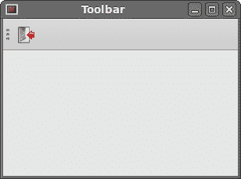
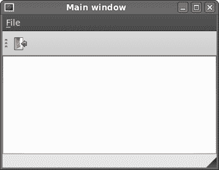

# PyQt4 中的菜单和工具栏

> 原文： [http://zetcode.com/gui/pyqt4/menusandtoolbars/](http://zetcode.com/gui/pyqt4/menusandtoolbars/)

在 PyQt4 教程的这一部分中，我们将创建菜单和工具栏。 菜单是位于菜单栏中的一组命令。 工具栏上的按钮带有应用中的一些常用命令。

## 主窗口

`QtGui.QMainWindow`类提供一个主应用窗口。 这样可以创建带有状态栏，工具栏和菜单栏的经典应用框架。

## 状态栏

状态栏是用于显示状态信息的小部件。

```py
#!/usr/bin/python
# -*- coding: utf-8 -*-

"""
ZetCode PyQt4 tutorial 

This program creates a statusbar.

author: Jan Bodnar
website: zetcode.com 
last edited: September 2011
"""

import sys
from PyQt4 import QtGui

class Example(QtGui.QMainWindow):

    def __init__(self):
        super(Example, self).__init__()

        self.initUI()

    def initUI(self):               

        self.statusBar().showMessage('Ready')

        self.setGeometry(300, 300, 250, 150)
        self.setWindowTitle('Statusbar')    
        self.show()

def main():

    app = QtGui.QApplication(sys.argv)
    ex = Example()
    sys.exit(app.exec_())

if __name__ == '__main__':
    main()

```

状态栏是在`QtGui.QMainWindow`小部件的帮助下创建的。

```py
self.statusBar().showMessage('Ready')

```

要获取状态栏，我们调用`QtGui.QMainWindow`类的`statusBar()`方法。 该方法的第一次调用将创建一个状态栏。 后续调用返回状态栏对象。 `showMessage()`在状态栏上显示一条消息。

## 菜单栏

菜单栏是 GUI 应用的常见部分。 它是位于各个菜单中的一组命令。 （Mac OS 对菜单栏的处理不同。要获得相似的结果，我们可以添加以下行：`menubar.setNativeMenuBar(False)`。）

```py
#!/usr/bin/python
# -*- coding: utf-8 -*-

"""
ZetCode PyQt4 tutorial 

This program creates a menubar. The
menubar has one menu with an exit action.

author: Jan Bodnar
website: zetcode.com 
last edited: August 2011
"""

import sys
from PyQt4 import QtGui

class Example(QtGui.QMainWindow):

    def __init__(self):
        super(Example, self).__init__()

        self.initUI()

    def initUI(self):               

        exitAction = QtGui.QAction(QtGui.QIcon('exit.png'), '&Exit', self)        
        exitAction.setShortcut('Ctrl+Q')
        exitAction.setStatusTip('Exit application')
        exitAction.triggered.connect(QtGui.qApp.quit)

        self.statusBar()

        menubar = self.menuBar()
        fileMenu = menubar.addMenu('&File')
        fileMenu.addAction(exitAction)

        self.setGeometry(300, 300, 300, 200)
        self.setWindowTitle('Menubar')    
        self.show()

def main():

    app = QtGui.QApplication(sys.argv)
    ex = Example()
    sys.exit(app.exec_())

if __name__ == '__main__':
    main()    

```

在上面的示例中，我们创建一个带有一个菜单的菜单栏。 此菜单包含一个操作，如果选择该操作，则该应用将终止。 也会创建一个状态栏。 可通过 `Ctrl + Q` 快捷方式访问该操作。

```py
exitAction = QtGui.QAction(QtGui.QIcon('exit.png'), '&Exit', self)        
exitAction.setShortcut('Ctrl+Q')
exitAction.setStatusTip('Exit application')

```

`QtGui.QAction`是使用菜单栏，工具栏或自定义键盘快捷键执行的操作的抽象。 在以上三行中，我们创建一个带有特定图标和“退出”标签的动作。 此外，为此操作定义了快捷方式。 第三行创建一个状态提示，当我们将鼠标指针悬停在菜单项上时，状态提示将显示在状态栏中。

```py
exitAction.triggered.connect(QtGui.qApp.quit)

```

当我们选择此特定动作时，将触发信号。 信号连接到`QtGui.QApplication`小部件的`quit()`方法。 这将终止应用。

```py
menubar = self.menuBar()
fileMenu = menubar.addMenu('&File')
fileMenu.addAction(exitAction)

```

`menuBar()`方法创建一个菜单栏。 我们创建一个文件菜单并将退出动作附加到该菜单。

## 工具栏

菜单将我们可以在应用中使用的所有命令分组。 使用工具栏可以快速访问最常用的命令。

```py
#!/usr/bin/python
# -*- coding: utf-8 -*-

"""
ZetCode PyQt4 tutorial 

This program creates a toolbar.
The toolbar has one action, which
terminates the application if triggered.

author: Jan Bodnar
website: zetcode.com 
last edited: September 2011
"""

import sys
from PyQt4 import QtGui

class Example(QtGui.QMainWindow):

    def __init__(self):
        super(Example, self).__init__()

        self.initUI()

    def initUI(self):               

        exitAction = QtGui.QAction(QtGui.QIcon('exit24.png'), 'Exit', self)
        exitAction.setShortcut('Ctrl+Q')
        exitAction.triggered.connect(QtGui.qApp.quit)

        self.toolbar = self.addToolBar('Exit')
        self.toolbar.addAction(exitAction)

        self.setGeometry(300, 300, 300, 200)
        self.setWindowTitle('Toolbar')    
        self.show()

def main():

    app = QtGui.QApplication(sys.argv)
    ex = Example()
    sys.exit(app.exec_())

if __name__ == '__main__':
    main()

```

在上面的示例中，我们创建了一个简单的工具栏。 工具栏有一个工具动作。 退出动作，在触发时终止应用。

```py
exitAction = QtGui.QAction(QtGui.QIcon('exit24.png'), 'Exit', self)
exitAction.setShortcut('Ctrl+Q')
exitAction.triggered.connect(QtGui.qApp.quit)

```

与上面的菜单栏示例类似，我们创建一个动作对象。 该对象具有标签，图标和快捷方式。 `QtGui.QMainWindow`的`quit()`方法连接到触发信号。

```py
self.toolbar = self.addToolBar('Exit')
self.toolbar.addAction(exitAction)

```

在这里，我们创建了一个工具栏，并在其中插入了动作对象。



图：工具栏

## 把它放在一起

在本节的最后一个示例中，我们创建一个菜单栏，一个工具栏和一个状态栏。 我们还创建了一个中央小部件。

```py
#!/usr/bin/python
# -*- coding: utf-8 -*-

"""
ZetCode PyQt4 tutorial 

This program creates a skeleton of
a classic GUI application with a menubar,
toolbar, statusbar and a central widget. 

author: Jan Bodnar
website: zetcode.com 
last edited: September 2011
"""

import sys
from PyQt4 import QtGui

class Example(QtGui.QMainWindow):

    def __init__(self):
        super(Example, self).__init__()

        self.initUI()

    def initUI(self):               

        textEdit = QtGui.QTextEdit()
        self.setCentralWidget(textEdit)

        exitAction = QtGui.QAction(QtGui.QIcon('exit24.png'), 'Exit', self)
        exitAction.setShortcut('Ctrl+Q')
        exitAction.setStatusTip('Exit application')
        exitAction.triggered.connect(self.close)

        self.statusBar()

        menubar = self.menuBar()
        fileMenu = menubar.addMenu('&File')
        fileMenu.addAction(exitAction)

        toolbar = self.addToolBar('Exit')
        toolbar.addAction(exitAction)

        self.setGeometry(300, 300, 350, 250)
        self.setWindowTitle('Main window')    
        self.show()

def main():

    app = QtGui.QApplication(sys.argv)
    ex = Example()
    sys.exit(app.exec_())

if __name__ == '__main__':
    main()    

```

此代码示例使用菜单栏，工具栏和状态栏创建经典 GUI 应用的框架。

```py
textEdit = QtGui.QTextEdit()
self.setCentralWidget(textEdit)

```

在这里，我们创建一个文本编辑小部件。 我们将其设置为`QtGui.QMainWindow`的中央小部件。 中央窗口小部件占据了所有剩余空间。



图：`MainWindow`

在 PyQt4 教程的这一部分中，我们使用了菜单，工具栏，状态栏和主应用窗口。