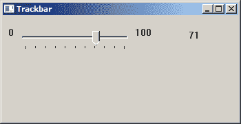
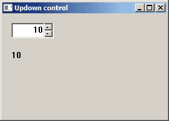
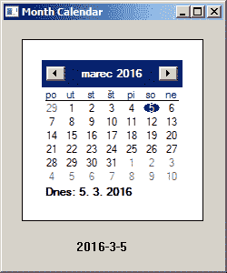

# Windows API 控件 II

> 原文： [http://zetcode.com/gui/winapi/controlsII/](http://zetcode.com/gui/winapi/controlsII/)

我们继续使用 Windows 控件。 我们将展示如何使用跟踪栏，工具提示和“月”日历控件。

## 跟踪栏

_ 跟踪栏 _ 是一个包含滑块和可选刻度线的窗口。 我们使用鼠标或键盘移动滑块。 跟踪栏用于从一系列连续值中选择离散值。 在其他平台上，此控件称为滑块。

`trackbar.c`

```
#include <windows.h>
#include <commctrl.h>

LRESULT CALLBACK WndProc(HWND, UINT, WPARAM, LPARAM);
void CreateControls(HWND hwnd);
void UpdateLabel(void);

HWND hTrack;
HWND hlbl;

int WINAPI wWinMain(HINSTANCE hInstance, HINSTANCE hPrevInstance, 
  PWSTR lpCmdLine, int nCmdShow) {

    HWND hwnd;
    MSG  msg ;

    WNDCLASSW wc = {0};
    wc.lpszClassName = L"Trackbar";
    wc.hInstance     = hInstance;
    wc.hbrBackground = GetSysColorBrush(COLOR_3DFACE);
    wc.lpfnWndProc   = WndProc;
    wc.hCursor       = LoadCursor(0,IDC_ARROW);

    RegisterClassW(&wc);
    hwnd = CreateWindowW(wc.lpszClassName, L"Trackbar", 
        WS_OVERLAPPEDWINDOW | WS_VISIBLE, 100, 100, 350, 180, 0, 0, hInstance, 0);

    while (GetMessage(&msg, NULL, 0, 0)) {

        TranslateMessage(&msg);
        DispatchMessage(&msg);
    }

    return (int) msg.wParam;
}

LRESULT CALLBACK WndProc(HWND hwnd, UINT msg, 
  WPARAM wParam, LPARAM lParam) {

  switch(msg) {

     case WM_CREATE:
       CreateControls(hwnd);
       break;

     case WM_HSCROLL:
       UpdateLabel();
       break;

     case WM_DESTROY:
       PostQuitMessage(0);
       break; 
  }

  return DefWindowProcW(hwnd, msg, wParam, lParam);
}

void CreateControls(HWND hwnd) {

    HWND hLeftLabel = CreateWindowW(L"Static", L"0", 
        WS_CHILD | WS_VISIBLE, 0, 0, 10, 30, hwnd, (HMENU)1, NULL, NULL);

    HWND hRightLabel = CreateWindowW(L"Static", L"100", 
        WS_CHILD | WS_VISIBLE, 0, 0, 30, 30, hwnd, (HMENU)2, NULL, NULL);

    hlbl = CreateWindowW(L"Static", L"0", WS_CHILD | WS_VISIBLE, 
        270, 20, 30, 30, hwnd, (HMENU)3, NULL, NULL);

    INITCOMMONCONTROLSEX icex;

    icex.dwSize = sizeof(INITCOMMONCONTROLSEX);
    icex.dwICC  = ICC_LISTVIEW_CLASSES;
    InitCommonControlsEx(&icex); 

    hTrack = CreateWindowW(TRACKBAR_CLASSW, L"Trackbar Control",
        WS_CHILD | WS_VISIBLE | TBS_AUTOTICKS,
        20, 20, 170, 30, hwnd, (HMENU) 3, NULL, NULL);

    SendMessageW(hTrack, TBM_SETRANGE,  TRUE, MAKELONG(0, 100)); 
    SendMessageW(hTrack, TBM_SETPAGESIZE, 0,  10); 
    SendMessageW(hTrack, TBM_SETTICFREQ, 10, 0); 
    SendMessageW(hTrack, TBM_SETPOS, FALSE, 0); 
    SendMessageW(hTrack, TBM_SETBUDDY, TRUE, (LPARAM) hLeftLabel); 
    SendMessageW(hTrack, TBM_SETBUDDY, FALSE, (LPARAM) hRightLabel); 
}

void UpdateLabel(void) {

    LRESULT pos = SendMessageW(hTrack, TBM_GETPOS, 0, 0);
    wchar_t buf[4];
    wsprintfW(buf, L"%ld", pos);

    SetWindowTextW(hlbl, buf);
}

```

在我们的示例中，我们显示带有三个静态文本控件的 Trackbar 控件。 其中两个连接在跟踪栏的左侧和右侧。 他们被称为伙伴。 通过拖动滑块，我们可以更改第三个静态控件的文本。

```
HWND hLeftLabel = CreateWindowW(L"Static", L"0", 
    WS_CHILD | WS_VISIBLE, 0, 0, 10, 30, hwnd, (HMENU)1, NULL, NULL);

HWND hRightLabel = CreateWindowW(L"Static", L"100", 
    WS_CHILD | WS_VISIBLE, 0, 0, 30, 30, hwnd, (HMENU)2, NULL, NULL);

hlbl = CreateWindowW(L"Static", L"0", WS_CHILD | WS_VISIBLE, 
    270, 20, 30, 30, hwnd, (HMENU)3, NULL, NULL);

```

创建了三个静态控件。 两个控件将显示跟踪栏控件的最小值和最大值。 最后一个将显示当前选定的值。

```
INITCOMMONCONTROLSEX icex;

icex.dwSize = sizeof(INITCOMMONCONTROLSEX);
icex.dwICC  = ICC_LISTVIEW_CLASSES;
InitCommonControlsEx(&icex); 

```

如果要使用公共控件之一，则需要加载公共控件 DLL（`comctl32.dll`）并从 DLL 中注册特定的公共控件类。 在创建通用控件之前，`InitCommonControlsEx()`必须调用此函数。

```
hTrack = CreateWindowW(TRACKBAR_CLASSW, L"Trackbar Control",
    WS_CHILD | WS_VISIBLE | TBS_AUTOTICKS,
    20, 20, 170, 30, hwnd, (HMENU) 3, NULL, NULL);

```

`TRACKBAR_CLASSW`用于创建轨迹栏控件。 `TBS_AUTOTICKS`样式会为其值范围内的每个增量创建一个刻度线。

```
SendMessageW(hTrack, TBM_SETRANGE,  TRUE, MAKELONG(0, 100)); 
SendMessageW(hTrack, TBM_SETPAGESIZE, 0,  10); 
SendMessageW(hTrack, TBM_SETTICFREQ, 10, 0); 
SendMessageW(hTrack, TBM_SETPOS, FALSE, 0); 

```

跟踪栏控件尚未完成。 我们向控件发送四个消息。 我们发送`TBM_SETRANGE`设置轨迹栏范围。 要设置页面大小，我们发送`TBM_SETPAGESIZE`消息。 要设置刻度频率，我们发送`TBM_SETTICFREQ`消息。 要设置当前滑块位置，我们发送`TBM_SETPOS`。

```
SendMessageW(hTrack, TBM_SETBUDDY, TRUE, (LPARAM) hLeftLabel); 
SendMessageW(hTrack, TBM_SETBUDDY, FALSE, (LPARAM) hRightLabel);  

```

我们通过发送`TBM_SETBUDDY`消息来设置轨迹栏好友。 第三个参数将决定伙伴是位于控件的左侧（TRUE）还是右侧（FALSE）。

```
case WM_HSCROLL:
  UpdateLabel();
  break;

```

当我们移动轨迹栏滑块时，窗口过程将收到`WM_HSCROLL`消息。 （如果是水平跟踪栏。）

```
void UpdateLabel(void) {

    LRESULT pos = SendMessageW(hTrack, TBM_GETPOS, 0, 0);
    wchar_t buf[4];
    wsprintfW(buf, L"%ld", pos);

    SetWindowTextW(hlbl, buf);
}

```

在`UpdateLabel()`功能中，我们通过发送`TMB_GETPOS`消息来获得当前滑块的位置。 使用`wsprintfW()`功能将接收到的值转换为文本。 最后，通过`SetWindowTextW()`功能设置静态控件的文本。



Figure: Trackbar

## 工具提示

_ 工具提示 _ 是常见的图形用户元素。 工具提示大部分时间都是隐藏的。 这是一个小框，当鼠标指针经过时会出现在 GUI 对象附近。 它显示一条简短的消息，说明该对象。 工具提示是应用程序帮助系统的一部分。

`tooltip.c`

```
#include <windows.h>
#include <commctrl.h>

LRESULT CALLBACK WndProc(HWND, UINT, WPARAM, LPARAM);
void CreateMyTooltip(HWND);

int WINAPI WinMain(HINSTANCE hInstance, HINSTANCE hPrevInstance,
            LPSTR lpCmdLine, int nCmdShow) {
    MSG  msg;    
    WNDCLASS wc = {0};
    wc.lpszClassName = "Tooltip";
    wc.hInstance     = hInstance;
    wc.hbrBackground = GetSysColorBrush(COLOR_3DFACE);
    wc.lpfnWndProc   = WndProc;
    wc.hCursor       = LoadCursor(0, IDC_ARROW);

    RegisterClass(&wc);
    CreateWindow(wc.lpszClassName, "Tooltip",
                WS_OVERLAPPEDWINDOW | WS_VISIBLE,
                100, 100, 200, 150, 0, 0, hInstance, 0);  

    while (GetMessage(&msg, NULL, 0, 0)) {

        TranslateMessage(&msg);
        DispatchMessage(&msg);
    }

    return (int) msg.wParam;
}

LRESULT CALLBACK WndProc(HWND hwnd, UINT msg, WPARAM wParam, LPARAM lParam) {

    switch(msg) {

      case WM_CREATE:
          CreateMyTooltip(hwnd);
          break;

      case WM_DESTROY:
          PostQuitMessage(0);
          break;
    }

    return DefWindowProc(hwnd, msg, wParam, lParam);
}

void CreateMyTooltip(HWND hwnd) {

    INITCOMMONCONTROLSEX iccex; 
    HWND hwndTT;                

    TOOLINFO ti;
    char tooltip[30] = "A main window";
    RECT rect;                 

    iccex.dwICC = ICC_WIN95_CLASSES;
    iccex.dwSize = sizeof(INITCOMMONCONTROLSEX);
    InitCommonControlsEx(&iccex);

    hwndTT = CreateWindowEx(WS_EX_TOPMOST, TOOLTIPS_CLASS, NULL,
        WS_POPUP | TTS_NOPREFIX | TTS_ALWAYSTIP,		
        0, 0, 0, 0, hwnd, NULL, NULL, NULL );

    SetWindowPos(hwndTT, HWND_TOPMOST, 0, 0, 0, 0,
        SWP_NOMOVE | SWP_NOSIZE | SWP_NOACTIVATE);

    GetClientRect(hwnd, &rect);

    ti.cbSize = sizeof(TOOLINFO);
    ti.uFlags = TTF_SUBCLASS;
    ti.hwnd = hwnd;
    ti.hinst = NULL;
    ti.uId = 0;
    ti.lpszText = tooltip;
    ti.rect.left = rect.left;    
    ti.rect.top = rect.top;
    ti.rect.right = rect.right;
    ti.rect.bottom = rect.bottom;

    SendMessage(hwndTT, TTM_ADDTOOL, 0, (LPARAM) (LPTOOLINFO) &ti);	
} 		

```

在我们的示例中，我们为主窗口设置了一个工具提示。

```
INITCOMMONCONTROLSEX iccex;
...
iccex.dwICC = ICC_WIN95_CLASSES;
iccex.dwSize = sizeof(INITCOMMONCONTROLSEX);
InitCommonControlsEx(&iccex);

```

工具提示是通用控件的一部分，因此，我们必须初始化通用控件。

工具提示的创建包含几个步骤。 我们必须创建一个工具提示窗口。 然后我们将其设置为最顶层的窗口，这样它就不会被另一个窗口覆盖。 我们创建一个工具提示文本和`TOOLTIPINFO`结构。 该结构必须填充重要信息。 窗口句柄，工具提示文本和矩形将覆盖我们的工具提示。 在我们的示例中，我们的工具提示将覆盖窗口的整个客户区域。

```
SendMessage(hwndTT, TTM_ADDTOOL, 0, (LPARAM) (LPTOOLINFO) &ti);

```

在发送`TTM_ADDTOOL`消息后，工具提示确实添加到了窗口中。


Figure: Tooltip control

## 上下控制

_ 上移 _ 控件（也称为旋转控件）将一对显示为箭头的按钮与一个好友编辑控件结合在一起。 单击箭头可增加或减少编辑控件中的值。 Updown 控件是使用`UPDOWN_CLASSW`窗口类创建的。

`updown.c`

```
#include <windows.h>
#include <commctrl.h>
#include <strsafe.h>

#define ID_UPDOWN 1
#define ID_EDIT 2
#define ID_STATIC 3
#define UD_MAX_POS 30
#define UD_MIN_POS 0

LRESULT CALLBACK WndProc(HWND, UINT, WPARAM, LPARAM);
void CreateControls(HWND);

HWND hUpDown, hEdit, hStatic;

int WINAPI wWinMain(HINSTANCE hInstance, HINSTANCE hPrevInstance,
    PWSTR lpCmdLine, int nCmdShow) {

    MSG  msg;
    WNDCLASSW wc = {0};

    wc.style = CS_HREDRAW | CS_VREDRAW;
    wc.lpszClassName = L"Updown control";
    wc.hInstance     = hInstance;
    wc.hbrBackground = GetSysColorBrush(COLOR_3DFACE);
    wc.lpfnWndProc   = WndProc;
    wc.hCursor       = LoadCursor(0, IDC_ARROW);

    RegisterClassW(&wc);
    CreateWindowW(wc.lpszClassName, L"Updown control",
        WS_OVERLAPPEDWINDOW | WS_VISIBLE,
        100, 100, 280, 200, NULL, NULL, hInstance, NULL);

    while (GetMessage(&msg, NULL, 0, 0)) {

        DispatchMessage(&msg);
    }

    return (int) msg.wParam;
}

LRESULT CALLBACK WndProc(HWND hwnd, UINT msg, 
    WPARAM wParam, LPARAM lParam) {

    LPNMUPDOWN lpnmud;
    UINT code;

    switch(msg) {

        case WM_CREATE:

            CreateControls(hwnd);

            break;

        case WM_NOTIFY:

            code = ((LPNMHDR) lParam)->code;

            if (code == UDN_DELTAPOS) {

                lpnmud = (NMUPDOWN *) lParam;                

                int value = lpnmud->iPos + lpnmud->iDelta;

                if (value < UD_MIN_POS) {
                    value = UD_MIN_POS;
                }

                if (value > UD_MAX_POS) {
                    value = UD_MAX_POS;
                }

                const int asize = 4;
                wchar_t buf[asize];
                size_t cbDest = asize * sizeof(wchar_t);
                StringCbPrintfW(buf, cbDest, L"%d", value);

                SetWindowTextW(hStatic, buf);                  
            }

            break;

        case WM_DESTROY:
            PostQuitMessage(0);
            break;
    }

    return DefWindowProcW(hwnd, msg, wParam, lParam);
}

void CreateControls(HWND hwnd) {

    INITCOMMONCONTROLSEX icex;

    icex.dwSize = sizeof(INITCOMMONCONTROLSEX);
    icex.dwICC  = ICC_UPDOWN_CLASS;
    InitCommonControlsEx(&icex); 

    hUpDown = CreateWindowW(UPDOWN_CLASSW, NULL, WS_CHILD | WS_VISIBLE 
        | UDS_SETBUDDYINT | UDS_ALIGNRIGHT, 
        0, 0, 0, 0, hwnd, (HMENU) ID_UPDOWN, NULL, NULL);

    hEdit = CreateWindowExW(WS_EX_CLIENTEDGE, WC_EDITW, NULL, WS_CHILD 
        | WS_VISIBLE | ES_RIGHT, 15, 15, 70, 25, hwnd, 
        (HMENU) ID_EDIT, NULL, NULL);

    hStatic = CreateWindowW(WC_STATICW, L"0", WS_CHILD | WS_VISIBLE
        | SS_LEFT, 15, 60, 300, 230, hwnd, (HMENU) ID_STATIC, NULL, NULL);

    SendMessageW(hUpDown, UDM_SETBUDDY, (WPARAM) hEdit, 0);
    SendMessageW(hUpDown, UDM_SETRANGE, 0, MAKELPARAM(UD_MAX_POS, UD_MIN_POS));
    SendMessageW(hUpDown, UDM_SETPOS32, 0, 0);
}

```

在代码示例中，我们有一个 UpDown 控件和一个静态文本控件。 当前选定的 UpDown 值显示在静态文本控件中。

```
#define UD_MAX_POS 30
#define UD_MIN_POS 0

```

这两个常数用于 UpDown 控件的最大值和最小值。

```
hUpDown = CreateWindowW(UPDOWN_CLASSW, NULL, WS_CHILD | WS_VISIBLE 
    | UDS_SETBUDDYINT | UDS_ALIGNRIGHT, 
    0, 0, 0, 0, hwnd, (HMENU) ID_UPDOWN, g_hInst, NULL);

```

为了创建 UpDown 控件，我们将`UPDOWN_CLASSW`传递给`CreateWindowW()`函数。 `UDS_SETBUDDYINT`标志使 UpDown 控件在其位置更改时向其好友发送消息（`WM_SETTEXT`）。 `UDS_ALIGNRIGHT`标志将 UpDown 控件放置在其伙伴窗口右边缘的旁边。

```
SendMessageW(hUpDown, UDM_SETBUDDY, (WPARAM) hEdit, 0);

```

`UDM_SETBUDDY`消息将 Edit 控件设置为 UpDown 控件的好友窗口。

```
SendMessageW(hUpDown, UDM_SETRANGE, 0, MAKELPARAM(UD_MAX_POS, UD_MIN_POS));

```

`UDM_SETRANGE`消息设置 UpDown 控件的最小和最大位置。

```
SendMessageW(hUpDown, UDM_SETPOS32, 0, 0);

```

通过`UDM_SETPOS32`消息，我们设置 UpDown 控件的初始位置。

```
code = ((LPNMHDR) lParam)->code;

if (code == UDN_DELTAPOS) {
...
}

```

当控件的位置即将更改时（即在控件更新其值之前），操作系统会将`UDN_DELTAPOS`通知发送到 UpDown 控件的父窗口。

```
lpnmud = (NMUPDOWN *) lParam;

int value = lpnmud->iPos + lpnmud->iDelta;

```

`NMUPDOWN`结构包含有关 UpDown 修改的信息。 `iPos`值是 UpDown 控件的当前位置。 `iDelta`是 UpDown 控件位置的建议更改。 根据这两个值，我们计算出将出现在控件中的最终值。

```
if (value < UD_MIN_POS) {
    value = UD_MIN_POS;
}

if (value > UD_MAX_POS) {
    value = UD_MAX_POS;
}

```

此代码确保静态文本不会显示超出 UpDown 范围的值。

```
int const asize = 4;
wchar_t buf[asize];
size_t cbDest = asize * sizeof(wchar_t);
StringCbPrintfW(buf, cbDest, L"%d", value);

```

使用`StringCbPrintfW()`函数，我们构建了要在静态文本控件中显示的字符串。

```
SetWindowTextW(hStatic, buf);

```

最后，使用`SetWindowTextW()`功能更新静态文本控件。



Figure: UpDown control

## 月日历控件

_ 月历 _ 是一个复杂的控件，用于选择日期。 可以通过简单直观的方式选择日期。

`monthcalendar.c`

```
#include <windows.h>
#include <commctrl.h>
#include <wchar.h>
#include <strsafe.h>

LRESULT CALLBACK WndProc(HWND, UINT, WPARAM, LPARAM);
void CreateControls(HWND);
void GetSelectedDate(HWND, HWND);

HWND hStat;
HWND hMonthCal;

int WINAPI WinMain(HINSTANCE hInstance, HINSTANCE hPrevInstance, 
  LPSTR lpCmdLine, int nCmdShow) {

    HWND hwnd;
    MSG  msg;

    WNDCLASSW wc = {0};
    wc.lpszClassName = L"Month Calendar";
    wc.hInstance     = hInstance ;
    wc.hbrBackground = GetSysColorBrush(COLOR_3DFACE);
    wc.lpfnWndProc   = WndProc ;
    wc.hCursor       = LoadCursor(0, IDC_ARROW);

    RegisterClassW(&wc);

    hwnd = CreateWindowW(wc.lpszClassName, L"Month Calendar",
        WS_OVERLAPPEDWINDOW | WS_VISIBLE,
        100, 100, 250, 300, 0, 0, hInstance, 0);  

    while (GetMessage(&msg, NULL, 0, 0)) {

        DispatchMessage(&msg);
    }

    return (int) msg.wParam;
}

LRESULT CALLBACK WndProc(HWND hwnd, UINT msg, 
    WPARAM wParam, LPARAM lParam) {

    LPNMHDR lpNmHdr;

    switch(msg) {

        case WM_CREATE:

            CreateControls(hwnd);
            break;

        case WM_NOTIFY:

            lpNmHdr = (LPNMHDR) lParam;

            if (lpNmHdr->code == MCN_SELECT) {
                GetSelectedDate(hMonthCal, hStat);
            }

            break;

        case WM_DESTROY:

            PostQuitMessage(0);
            break; 
    }

    return DefWindowProcW(hwnd, msg, wParam, lParam);
}

void CreateControls(HWND hwnd) {

    hStat = CreateWindowW(WC_STATICW, L"", 
        WS_CHILD | WS_VISIBLE, 80, 240, 80, 30,
        hwnd, (HMENU)1, NULL, NULL);

    INITCOMMONCONTROLSEX icex;

    icex.dwSize = sizeof(icex);
    icex.dwICC  = ICC_DATE_CLASSES;
    InitCommonControlsEx(&icex);

    hMonthCal = CreateWindowW(MONTHCAL_CLASSW, L"", 
        WS_BORDER | WS_CHILD | WS_VISIBLE | MCS_NOTODAYCIRCLE,  
        20, 20, 200, 200, hwnd, (HMENU)2, NULL, NULL);
}

void GetSelectedDate(HWND hMonthCal, HWND hStat) {

    SYSTEMTIME time;
    const int dsize = 20;
    wchar_t buf[dsize];

    ZeroMemory(&time, sizeof(SYSTEMTIME));
    SendMessage(hMonthCal, MCM_GETCURSEL, 0, (LPARAM) &time);

    size_t cbDest = dsize * sizeof(wchar_t);
    StringCbPrintfW(buf, cbDest, L"%d-%d-%d", 
          time.wYear, time.wMonth, time.wDay);

    SetWindowTextW(hStat, buf);
}

```

在我们的示例中，我们有两个控件：月历控件和静态文本。 从月历控件中选择的日期以静态文本显示。

```
hMonthCal = CreateWindowW(MONTHCAL_CLASSW, L"", 
    WS_BORDER | WS_CHILD | WS_VISIBLE | MCS_NOTODAYCIRCLE,  
    20, 20, 200, 200, hwnd, (HMENU)2, NULL, NULL);

```

在这里，我们创建一个月日历控件。 创建月历控件的类名称为`MONTHCAL_CLASSW`。 如果使用`MCS_NOTODAYCIRCLE`窗口样式，则不会圈出今天的日期。

```
INITCOMMONCONTROLSEX icex;

icex.dwSize = sizeof(icex);
icex.dwICC  = ICC_DATE_CLASSES;
InitCommonControlsEx(&icex);

```

要注册月历控件，我们为`INITCOMMONCONTROLSEX`结构的`dwICC`成员指定`ICC_DATE_CLASSES`标志。

```
case WM_NOTIFY:

    lpNmHdr = (LPNMHDR) lParam;

    if (lpNmHdr->code == MCN_SELECT) {
        GetSelectedDate(hMonthCal, hStat);
    }

    break;

```

如果月份日历控件中发生事件，则会发送`WM_NOTIFY`消息。 `lParam`包含指向`NMHDR`结构的指针，该结构包含通知代码和其他信息。

```
SendMessage(hMonthCal, MCM_GETCURSEL, 0, (LPARAM) &time);

```

为了用选定的日期填充结构，我们向日历控件发送了`MCM_GETCURSEL`消息。

```
size_t cbDest = dsize * sizeof(wchar_t);
StringCbPrintfW(buf, cbDest, L"%d-%d-%d", 
      time.wYear, time.wMonth, time.wDay);

SetWindowTextW(hStat, buf);

```

我们构建字符串并将日期设置为静态文本控件。



Figure: Month Calendar

在 Windows API 教程的这一部分中，我们继续介绍 Windows 控件-跟踪栏，工具提示，上下按钮和月份日历。