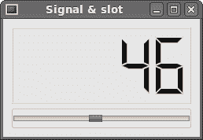
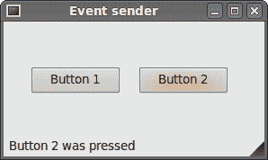

# PyQt4 中的事件和信号

> 原文： [http://zetcode.com/gui/pyqt4/eventsandsignals/](http://zetcode.com/gui/pyqt4/eventsandsignals/)

在 PyQt4 编程教程的这一部分中，我们将探讨应用中发生的事件和信号。

## 事件

所有 GUI 应用都是事件驱动的。 事件主要由应用的用户生成。 但是它们也可以通过其他方式生成：例如互联网连接，窗口管理器或计时器。 当我们调用应用的`exec_()`方法时，应用进入主循环。 主循环获取事件并将其发送到对象。

在事件模型中，有三个参与者：

*   事件来源
*   事件对象
*   事件目标

事件源是状态更改的对象。 它生成事件。 事件对象（事件）将状态更改封装在事件源中。 事件目标是要通知的对象。 事件源对象将处理事件的任务委托给事件目标。

PyQt4 具有独特的信号和槽机制来处理事件。 信号和槽用于对象之间的通信。 当发生特定事件时，会发出信号。 槽可以是任何 Python 可调用的。 当发出与其连接的信号时，将调用槽。

## 新 API

PyQt4.5 引入了一种用于处理信号和槽的新型 API。

```py
QtCore.QObject.connect(button, QtCore.SIGNAL('clicked()'), self.onClicked)

```

这是旧式的 API。

```py
button.clicked.connect(self.onClicked)

```

新样式更加符合 Python 标准。

## 信号和槽

这是一个简单的示例，展示了 PyQt4 中的信号和槽。

```py
#!/usr/bin/python
# -*- coding: utf-8 -*-

"""
ZetCode PyQt4 tutorial 

In this example, we connect a signal
of a QtGui.QSlider to a slot 
of a QtGui.QLCDNumber. 

author: Jan Bodnar
website: zetcode.com 
last edited: October 2011
"""

import sys
from PyQt4 import QtGui, QtCore

class Example(QtGui.QWidget):

    def __init__(self):
        super(Example, self).__init__()

        self.initUI()

    def initUI(self):

        lcd = QtGui.QLCDNumber(self)
        sld = QtGui.QSlider(QtCore.Qt.Horizontal, self)

        vbox = QtGui.QVBoxLayout()
        vbox.addWidget(lcd)
        vbox.addWidget(sld)

        self.setLayout(vbox)
        sld.valueChanged.connect(lcd.display)

        self.setGeometry(300, 300, 250, 150)
        self.setWindowTitle('Signal & slot')
        self.show()

def main():

    app = QtGui.QApplication(sys.argv)
    ex = Example()
    sys.exit(app.exec_())

if __name__ == '__main__':
    main()

```

在我们的示例中，我们显示`QtGui.QLCDNumber`和`QtGui.QSlider`。 我们通过拖动滑块来更改`lcd`编号。

```py
sld.valueChanged.connect(lcd.display)

```

在这里，我们将滑块的`valueChanged`信号连接到`lcd`号的`display`槽。

发送器是发送信号的对象。 接收器是接收信号的对象。 槽是对信号做出反应的方法。



图：信号和槽

## 重新实现事件处理程序

PyQt4 中的事件通常通过重新实现事件处理程序来处理。

```py
#!/usr/bin/python
# -*- coding: utf-8 -*-

"""
ZetCode PyQt4 tutorial 

In this example, we reimplement an 
event handler. 

author: Jan Bodnar
website: zetcode.com 
last edited: October 2011
"""

import sys
from PyQt4 import QtGui, QtCore

class Example(QtGui.QWidget):

    def __init__(self):
        super(Example, self).__init__()

        self.initUI()

    def initUI(self):      

        self.setGeometry(300, 300, 250, 150)
        self.setWindowTitle('Event handler')
        self.show()

    def keyPressEvent(self, e):

        if e.key() == QtCore.Qt.Key_Escape:
            self.close()

def main():

    app = QtGui.QApplication(sys.argv)
    ex = Example()
    sys.exit(app.exec_())

if __name__ == '__main__':
    main()

```

在我们的示例中，我们重新实现了`keyPressEvent()`事件处理程序。

```py
def keyPressEvent(self, e):

    if e.key() == QtCore.Qt.Key_Escape:
        self.close()

```

如果单击“退出”按钮，则应用终止。

## 事件发送者

有时很方便地知道哪个窗口小部件是信号的发送者。 为此，PyQt4 具有`sender()`方法。

```py
#!/usr/bin/python
# -*- coding: utf-8 -*-

"""
ZetCode PyQt4 tutorial 

In this example, we determine the event sender
object.

author: Jan Bodnar
website: zetcode.com 
last edited: October 2011
"""

import sys
from PyQt4 import QtGui, QtCore

class Example(QtGui.QMainWindow):

    def __init__(self):
        super(Example, self).__init__()

        self.initUI()

    def initUI(self):      

        btn1 = QtGui.QPushButton("Button 1", self)
        btn1.move(30, 50)

        btn2 = QtGui.QPushButton("Button 2", self)
        btn2.move(150, 50)

        btn1.clicked.connect(self.buttonClicked)            
        btn2.clicked.connect(self.buttonClicked)

        self.statusBar()

        self.setGeometry(300, 300, 290, 150)
        self.setWindowTitle('Event sender')
        self.show()

    def buttonClicked(self):

        sender = self.sender()
        self.statusBar().showMessage(sender.text() + ' was pressed')

def main():

    app = QtGui.QApplication(sys.argv)
    ex = Example()
    sys.exit(app.exec_())

if __name__ == '__main__':
    main()

```

我们的示例中有两个按钮。 在`buttonClicked()`方法中，我们通过调用`sender()`方法来确定单击了哪个按钮。

```py
btn1.clicked.connect(self.buttonClicked)            
btn2.clicked.connect(self.buttonClicked)

```

两个按钮都连接到同一槽。

```py
def buttonClicked(self):

    sender = self.sender()
    self.statusBar().showMessage(sender.text() + ' was pressed')

```

我们通过调用`sender()`方法来确定信号源。 在应用的状态栏中，我们显示了被按下的按钮的标签。



图：事件发送者

## 发射信号

从`QtCore.QObject`创建的对象可以发出信号。 在下面的示例中，我们将看到如何发出自定义信号。

```py
#!/usr/bin/python
# -*- coding: utf-8 -*-

"""
ZetCode PyQt4 tutorial 

In this example, we show how to emit a
signal. 

author: Jan Bodnar
website: zetcode.com 
last edited: January 2015
"""

import sys
from PyQt4 import QtGui, QtCore

class Communicate(QtCore.QObject):

    closeApp = QtCore.pyqtSignal() 

class Example(QtGui.QMainWindow):

    def __init__(self):
        super(Example, self).__init__()

        self.initUI()

    def initUI(self):      

        self.c = Communicate()
        self.c.closeApp.connect(self.close)       

        self.setGeometry(300, 300, 290, 150)
        self.setWindowTitle('Emit signal')
        self.show()

    def mousePressEvent(self, event):

        self.c.closeApp.emit()

def main():

    app = QtGui.QApplication(sys.argv)
    ex = Example()
    sys.exit(app.exec_())

if __name__ == '__main__':
    main()

```

我们创建一个名为`closeApp`的新信号。 在鼠标按下事件期间发出此信号。 信号连接到`QtGui.QMainWindow`的`close()`槽。

```py
class Communicate(QtCore.QObject):

    closeApp = QtCore.pyqtSignal()     

```

使用`QtCore.pyqtSignal()`作为外部`Communicate`类的类属性创建信号。

```py
self.c.closeApp.connect(self.close) 

```

定制的`closeApp`信号连接到`QtGui.QMainWindow`的`close()`槽。

```py
def mousePressEvent(self, event):

    self.c.closeApp.emit()

```

当我们用鼠标指针单击窗口时，会发出`closeApp`信号。 该应用终止。

在 PyQt4 教程的这一部分中，我们介绍了信号和槽。