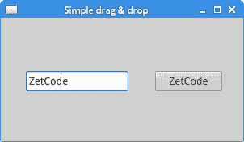

# PyQt4 中的拖放

> 原文： [http://zetcode.com/gui/pyqt4/dragdrop/](http://zetcode.com/gui/pyqt4/dragdrop/)

在 PyQt4 教程的这一部分中，我们将讨论拖放操作。

在计算机图形用户界面中，拖放是单击虚拟对象并将其拖动到其他位置或另一个虚拟对象上的动作（或支持以下动作）。 通常，它可用于调用多种动作，或在两个抽象对象之间创建各种类型的关联。

拖放是图形用户界面的一部分。 拖放操作使用户可以直观地执行复杂的操作。

通常，我们可以拖放两件事：数据或某些图形对象。 如果将图像从一个应用拖到另一个应用，则会拖放二进制数据。 如果我们在 Firefox 中拖动选项卡并将其移动到另一个位置，则将拖放图形组件。

## 简单的拖放

在第一个示例中，我们有一个`QtGui.QLineEdit`和一个`QtGui.QPushButton`。 我们将纯文本从行编辑小部件中拖放到按钮小部件上。 按钮的标签将更改。

```
#!/usr/bin/python
# -*- coding: utf-8 -*-

"""
ZetCode PyQt4 tutorial

This is a simple drag and
drop example. 

author: Jan Bodnar
website: zetcode.com
last edited: January 2015
"""

import sys
from PyQt4 import QtGui

class Button(QtGui.QPushButton):

    def __init__(self, title, parent):
        super(Button, self).__init__(title, parent)

        self.setAcceptDrops(True)

    def dragEnterEvent(self, e):

        if e.mimeData().hasFormat('text/plain'):
            e.accept()
        else:
            e.ignore() 

    def dropEvent(self, e):
        self.setText(e.mimeData().text()) 

class Example(QtGui.QWidget):

    def __init__(self):
        super(Example, self).__init__()

        self.initUI()

    def initUI(self):

        edit = QtGui.QLineEdit('', self)
        edit.setDragEnabled(True)
        edit.move(30, 65)

        button = Button("Button", self)
        button.move(190, 65)

        self.setWindowTitle('Simple drag & drop')
        self.setGeometry(300, 300, 300, 150)

def main():

    app = QtGui.QApplication(sys.argv)
    ex = Example()
    ex.show()
    app.exec_()  

if __name__ == '__main__':
    main()   

```

该示例展示了一个简单的拖动&放下操作。

```
class Button(QtGui.QPushButton):

    def __init__(self, title, parent):
        super(Button, self).__init__(title, parent)

```

为了在`QtGui.QPushButton`小部件上放置文本，我们必须重新实现一些方法。 因此，我们创建了自己的`Button`类，该类继承自`QtGui.QPushButton`类。

```
self.setAcceptDrops(True)

```

我们为小部件启用放置事件。

```
def dragEnterEvent(self, e):

    if e.mimeData().hasFormat('text/plain'):
        e.accept()

    else:
        e.ignore() 

```

首先，我们重新实现`dragEnterEvent()`方法。 我们告知我们接受的数据类型。 在我们的情况下，它是纯文本。

```
def dropEvent(self, e):

    self.setText(e.mimeData().text()) 

```

通过重新实现`dropEvent()`方法，我们定义了对放置事件的处理方式。 在这里，我们更改按钮小部件的文本。

```
edit = QtGui.QLineEdit('', self)
edit.setDragEnabled(True)

```

`QtGui.QLineEdit`小部件具有对拖动操作的内置支持。 我们需要做的就是调用`setDragEnabled()`方法来激活它。



Figure: Simple drag & drop

## 拖动和放置一个按钮小部件

在下面的示例中，我们将演示如何拖放按钮小部件。

```
#!/usr/bin/python
# -*- coding: utf-8 -*-

"""
ZetCode PyQt4 tutorial

In this program, we can press on a button 
with a left mouse click or drag and drop the 
button with  the right mouse click. 

author: Jan Bodnar
website: zetcode.com
last edited: October 2013
"""

import sys
from PyQt4 import QtCore, QtGui

class Button(QtGui.QPushButton):

    def __init__(self, title, parent):
        super(Button, self).__init__(title, parent)

    def mouseMoveEvent(self, e):

        if e.buttons() != QtCore.Qt.RightButton:
            return

        mimeData = QtCore.QMimeData()

        drag = QtGui.QDrag(self)
        drag.setMimeData(mimeData)
        drag.setHotSpot(e.pos() - self.rect().topLeft())

        dropAction = drag.start(QtCore.Qt.MoveAction)

    def mousePressEvent(self, e):

        super(Button, self).mousePressEvent(e)

        if e.button() == QtCore.Qt.LeftButton:
            print 'press'

class Example(QtGui.QWidget):

    def __init__(self):
        super(Example, self).__init__()

        self.initUI()

    def initUI(self):

        self.setAcceptDrops(True)

        self.button = Button('Button', self)
        self.button.move(100, 65)

        self.setWindowTitle('Click or Move')
        self.setGeometry(300, 300, 280, 150)
        self.show()

    def dragEnterEvent(self, e):

        e.accept()

    def dropEvent(self, e):

        position = e.pos()        
        self.button.move(position)

        e.setDropAction(QtCore.Qt.MoveAction)
        e.accept()

def main():

    app = QtGui.QApplication([])
    ex = Example()
    sys.exit(app.exec_())

if __name__ == '__main__':
    main()

```

在我们的代码示例中，窗口上有一个`QtGui.QPushButton`。 如果我们用鼠标左键单击该按钮，则会在控制台上显示“按”消息。 通过右键单击并移动按钮，我们在按钮小部件上执行拖放操作。

```
class Button(QtGui.QPushButton):

    def __init__(self, title, parent):
        super(Button, self).__init__(title, parent)

```

我们创建一个`Button`类，该类将从`QtGui.QPushButton`派生。 我们还重新实现了`QtGui.QPushButton`的两种方法：`mouseMoveEvent()`和`mousePressEvent()`。 `mouseMoveEvent()`方法是拖放操作开始的地方。

```
if event.buttons() != QtCore.Qt.RightButton:
    return

```

在这里，我们决定只能使用鼠标右键执行拖放操作。 鼠标左键保留用于单击该按钮。

```
mimeData = QtCore.QMimeData()

drag = QtGui.QDrag(self)
drag.setMimeData(mimeData)
drag.setHotSpot(event.pos() - self.rect().topLeft())

```

`QDrag`对象已创建。 该类提供对基于 MIME 的拖放数据传输的支持。

```
dropAction = drag.start(QtCore.Qt.MoveAction)

```

拖动对象的`start()`方法开始拖放操作。

```
def mousePressEvent(self, e):

    super(Button, self).mousePressEvent(e)

    if e.button() == QtCore.Qt.LeftButton:
        print 'press'

```

如果我们用鼠标左键单击按钮，我们将在控制台上打印“按”。 注意，我们也在父对象上调用了`mousePressEvent()`方法。 否则，我们将看不到按钮被按下。

```
position = e.pos()
self.button.move(position)

```

在`dropEvent()`方法中，我们编码释放鼠标键并完成放置操作后发生的情况。 我们找出当前鼠标指针的位置并相应地移动按钮。

```
e.setDropAction(QtCore.Qt.MoveAction)
e.accept()

```

我们指定放置动作的类型。 在我们的情况下，这是一个动作。

PyQt4 教程的这一部分专门用于拖放操作。