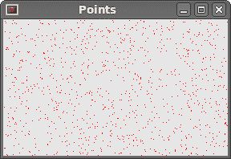
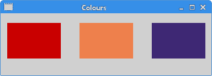
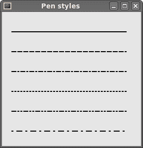

# PyQt4 中的绘图

> 原文： [http://zetcode.com/gui/pyqt4/drawing/](http://zetcode.com/gui/pyqt4/drawing/)

当我们想要更改或增强现有的小部件，或者要从头开始创建自定义小部件时，绘画应用程序中需要绘图。 要进行绘制，我们使用 PyQt4 工具包提供的绘制 API。

绘图是在`paintEvent()`方法中完成的。 绘图代码放置在`QtGui.QPainter`对象的`begin()`和`end()`方法之间。 它在小部件和其他绘画设备上执行低级绘画。

## 绘图文字

我们首先在窗口的客户区域上绘制一些 Unicode 文本。

```
#!/usr/bin/python
# -*- coding: utf-8 -*-

"""
ZetCode PyQt4 tutorial 

In this example, we draw text in Russian azbuka.

author: Jan Bodnar
website: zetcode.com 
last edited: September 2011
"""

import sys
from PyQt4 import QtGui, QtCore

class Example(QtGui.QWidget):

    def __init__(self):
        super(Example, self).__init__()

        self.initUI()

    def initUI(self):      

        self.text = u'\u041b\u0435\u0432 \u041d\u0438\u043a\u043e\u043b\u0430\
\u0435\u0432\u0438\u0447 \u0422\u043e\u043b\u0441\u0442\u043e\u0439: \n\
\u0410\u043d\u043d\u0430 \u041a\u0430\u0440\u0435\u043d\u0438\u043d\u0430'

        self.setGeometry(300, 300, 280, 170)
        self.setWindowTitle('Draw text')
        self.show()

    def paintEvent(self, event):

        qp = QtGui.QPainter()
        qp.begin(self)
        self.drawText(event, qp)
        qp.end()

    def drawText(self, event, qp):

        qp.setPen(QtGui.QColor(168, 34, 3))
        qp.setFont(QtGui.QFont('Decorative', 10))
        qp.drawText(event.rect(), QtCore.Qt.AlignCenter, self.text)        

def main():

    app = QtGui.QApplication(sys.argv)
    ex = Example()
    sys.exit(app.exec_())

if __name__ == '__main__':
    main()

```

在我们的示例中，我们以 Cylliric 绘制一些文本。 文本在垂直和水平方向上对齐。

```
def paintEvent(self, event):
...

```

绘制是在 paint 事件中完成的。

```
qp = QtGui.QPainter()
qp.begin(self)
self.drawText(event, qp)
qp.end()

```

`QtGui.QPainter`类负责所有低级绘画。 所有绘画方法都在`begin()`和`end()`方法之间。 实际绘画将委托给`drawText()`方法。

```
qp.setPen(QtGui.QColor(168, 34, 3))
qp.setFont(QtGui.QFont('Decorative', 10))

```

在这里，我们定义了用于绘制文本的笔和字体。

```
qp.drawText(event.rect(), QtCore.Qt.AlignCenter, self.text)

```

`drawText()`方法在窗口上绘制文本。 paint 事件的`rect()`方法返回需要更新的矩形。


Figure: Drawing text

## 绘制点

点是可以绘制的最简单的图形对象。 这是窗口上的一个小地方。

```
#!/usr/bin/python
# -*- coding: utf-8 -*-

"""
ZetCode PyQt4 tutorial 

In the example, we draw randomly 1000 red points 
on the window.

author: Jan Bodnar
website: zetcode.com 
last edited: September 2011
"""

import sys, random
from PyQt4 import QtGui, QtCore

class Example(QtGui.QWidget):

    def __init__(self):
        super(Example, self).__init__()

        self.initUI()

    def initUI(self):      

        self.setGeometry(300, 300, 280, 170)
        self.setWindowTitle('Points')
        self.show()

    def paintEvent(self, e):

        qp = QtGui.QPainter()
        qp.begin(self)
        self.drawPoints(qp)
        qp.end()

    def drawPoints(self, qp):

        qp.setPen(QtCore.Qt.red)
        size = self.size()

        for i in range(1000):
            x = random.randint(1, size.width()-1)
            y = random.randint(1, size.height()-1)
            qp.drawPoint(x, y)     

def main():

    app = QtGui.QApplication(sys.argv)
    ex = Example()
    sys.exit(app.exec_())

if __name__ == '__main__':
    main()

```

在我们的示例中，我们在窗口的客户区域上随机绘制了 1000 个红点。

```
qp.setPen(QtCore.Qt.red)

```

我们将笔设置为红色。 我们使用预定义的`QtCore.Qt.red`颜色常量。

```
size = self.size()

```

每次我们调整窗口大小时，都会生成一个绘制事件。 我们使用`size()`方法获得窗口的当前大小。 我们使用窗口的大小将点分布在整个窗口的客户区域中。

```
qp.drawPoint(x, y) 

```

我们用`drawPoint()`方法画点。



Figure: Points

## 色彩

颜色是代表红色，绿色和蓝色（RGB）强度值的组合的对象。 有效的 RGB 值在 0 到 255 之间。我们可以通过多种方式定义颜色。 最常见的是 RGB 十进制值或十六进制值。 我们还可以使用代表红色，绿色，蓝色和 Alpha 的 RGBA 值。 在这里，我们添加了一些有关透明度的额外信息。 Alpha 值为 255 表示完全不透明，0 表示完全透明，例如 颜色是不可见的。

```
#!/usr/bin/python
# -*- coding: utf-8 -*-

"""
ZetCode PyQt4 tutorial 

This example draws three rectangles in three
different colours. 

author: Jan Bodnar
website: zetcode.com 
last edited: September 2011
"""

import sys
from PyQt4 import QtGui, QtCore

class Example(QtGui.QWidget):

    def __init__(self):
        super(Example, self).__init__()

        self.initUI()

    def initUI(self):      

        self.setGeometry(300, 300, 350, 100)
        self.setWindowTitle('Colours')
        self.show()

    def paintEvent(self, e):

        qp = QtGui.QPainter()
        qp.begin(self)
        self.drawRectangles(qp)
        qp.end()

    def drawRectangles(self, qp):

        color = QtGui.QColor(0, 0, 0)
        color.setNamedColor('#d4d4d4')
        qp.setPen(color)

        qp.setBrush(QtGui.QColor(200, 0, 0))
        qp.drawRect(10, 15, 90, 60)

        qp.setBrush(QtGui.QColor(255, 80, 0, 160))
        qp.drawRect(130, 15, 90, 60)

        qp.setBrush(QtGui.QColor(25, 0, 90, 200))
        qp.drawRect(250, 15, 90, 60)

def main():

    app = QtGui.QApplication(sys.argv)
    ex = Example()
    sys.exit(app.exec_())

if __name__ == '__main__':
    main()

```

在我们的示例中，我们绘制了 3 个彩色矩形。

```
color = QtGui.QColor(0, 0, 0)
color.setNamedColor('#d4d4d4')

```

在这里，我们使用十六进制符号定义颜色。

```
qp.setBrush(QtGui.QColor(200, 0, 0))
qp.drawRect(10, 15, 90, 60)

```

在这里，我们定义了一个画笔并绘制了一个矩形。 笔刷是用于绘制形状背景的基本图形对象。 `drawRect()`方法接受四个参数。 前两个是轴上的 x 和 y 值。 第三个和第四个参数是矩形的宽度和高度。 该方法使用当前的笔和画笔绘制矩形。



Figure: Colours

## `QtGui.QPen`

`QtGui.QPen`是基本图形对象。 它用于绘制矩形，椭圆形，多边形或其他形状的线，曲线和轮廓。

```
#!/usr/bin/python
# -*- coding: utf-8 -*-

"""
ZetCode PyQt4 tutorial 

In this example we draw 6 lines using
different pen styles. 

author: Jan Bodnar
website: zetcode.com 
last edited: September 2011
"""

import sys
from PyQt4 import QtGui, QtCore

class Example(QtGui.QWidget):

    def __init__(self):
        super(Example, self).__init__()

        self.initUI()

    def initUI(self):      

        self.setGeometry(300, 300, 280, 270)
        self.setWindowTitle('Pen styles')
        self.show()

    def paintEvent(self, e):

        qp = QtGui.QPainter()
        qp.begin(self)
        self.drawLines(qp)
        qp.end()

    def drawLines(self, qp):

        pen = QtGui.QPen(QtCore.Qt.black, 2, QtCore.Qt.SolidLine)

        qp.setPen(pen)
        qp.drawLine(20, 40, 250, 40)

        pen.setStyle(QtCore.Qt.DashLine)
        qp.setPen(pen)
        qp.drawLine(20, 80, 250, 80)

        pen.setStyle(QtCore.Qt.DashDotLine)
        qp.setPen(pen)
        qp.drawLine(20, 120, 250, 120)

        pen.setStyle(QtCore.Qt.DotLine)
        qp.setPen(pen)
        qp.drawLine(20, 160, 250, 160)

        pen.setStyle(QtCore.Qt.DashDotDotLine)
        qp.setPen(pen)
        qp.drawLine(20, 200, 250, 200)

        pen.setStyle(QtCore.Qt.CustomDashLine)
        pen.setDashPattern([1, 4, 5, 4])
        qp.setPen(pen)
        qp.drawLine(20, 240, 250, 240)

def main():

    app = QtGui.QApplication(sys.argv)
    ex = Example()
    sys.exit(app.exec_())

if __name__ == '__main__':
    main()

```

在我们的示例中，我们绘制了六条线。 线条以六种不同的笔样式绘制。 有五种预定义的笔样式。 我们还可以创建自定义笔样式。 最后一行是使用自定义笔样式绘制的。

```
pen = QtGui.QPen(QtCore.Qt.black, 2, QtCore.Qt.SolidLine)

```

我们创建一个`QtGui.QPen`对象。 颜色是黑色。 宽度设置为 2 像素，以便我们可以看到笔样式之间的差异。 `QtCore.Qt.SolidLine`是预定义的笔样式之一。

```
pen.setStyle(QtCore.Qt.CustomDashLine)
pen.setDashPattern([1, 4, 5, 4])
qp.setPen(pen)

```

在这里，我们定义了自定义笔样式。 我们设置`QtCore.Qt.CustomDashLine`笔样式并调用`setDashPattern()`方法。 数字列表定义样式。 数字必须是偶数。 奇数定义破折号，偶数空格。 数字越大，空格或破折号越大。 我们的模式是 1px 破折号，4px 间隔，5px 破折号，4px 间隔等。



Figure: Pen styles

## `QtGui.QBrush`

`QtGui.QBrush`是基本图形对象。 它用于绘制图形形状的背景，例如矩形，椭圆形或多边形。 笔刷可以具有三种不同类型：预定义笔刷，渐变或纹理图案。

```
#!/usr/bin/python
# -*- coding: utf-8 -*-

"""
ZetCode PyQt4 tutorial 

This example draws 9 rectangles in different
brush styles.

author: Jan Bodnar
website: zetcode.com 
last edited: September 2011
"""

import sys
from PyQt4 import QtGui, QtCore

class Example(QtGui.QWidget):

    def __init__(self):
        super(Example, self).__init__()

        self.initUI()

    def initUI(self):      

        self.setGeometry(300, 300, 355, 280)
        self.setWindowTitle('Brushes')
        self.show()

    def paintEvent(self, e):

        qp = QtGui.QPainter()
        qp.begin(self)
        self.drawBrushes(qp)
        qp.end()

    def drawBrushes(self, qp):

        brush = QtGui.QBrush(QtCore.Qt.SolidPattern)
        qp.setBrush(brush)
        qp.drawRect(10, 15, 90, 60)

        brush.setStyle(QtCore.Qt.Dense1Pattern)
        qp.setBrush(brush)
        qp.drawRect(130, 15, 90, 60)

        brush.setStyle(QtCore.Qt.Dense2Pattern)
        qp.setBrush(brush)
        qp.drawRect(250, 15, 90, 60)

        brush.setStyle(QtCore.Qt.Dense3Pattern)
        qp.setBrush(brush)
        qp.drawRect(10, 105, 90, 60)

        brush.setStyle(QtCore.Qt.DiagCrossPattern)
        qp.setBrush(brush)
        qp.drawRect(10, 105, 90, 60)

        brush.setStyle(QtCore.Qt.Dense5Pattern)
        qp.setBrush(brush)
        qp.drawRect(130, 105, 90, 60)

        brush.setStyle(QtCore.Qt.Dense6Pattern)
        qp.setBrush(brush)
        qp.drawRect(250, 105, 90, 60)

        brush.setStyle(QtCore.Qt.HorPattern)
        qp.setBrush(brush)
        qp.drawRect(10, 195, 90, 60)

        brush.setStyle(QtCore.Qt.VerPattern)
        qp.setBrush(brush)
        qp.drawRect(130, 195, 90, 60)

        brush.setStyle(QtCore.Qt.BDiagPattern)
        qp.setBrush(brush)
        qp.drawRect(250, 195, 90, 60)

def main():

    app = QtGui.QApplication(sys.argv)
    ex = Example()
    sys.exit(app.exec_())

if __name__ == '__main__':
    main()

```

在我们的示例中，我们绘制了九个不同的矩形。

```
brush = QtGui.QBrush(QtCore.Qt.SolidPattern)
qp.setBrush(brush)
qp.drawRect(10, 15, 90, 60)

```

我们定义一个笔刷对象。 我们将其设置为 painter 对象，并通过调用`drawRect()`方法绘制矩形。


Figure: Brushes

在 PyQt4 教程的这一部分中，我们做了一些基本的绘画。