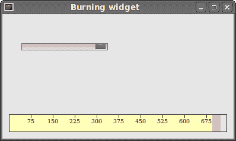

# PyQt4 中的自定义小部件

> 原文： [http://zetcode.com/gui/pyqt4/customwidgets/](http://zetcode.com/gui/pyqt4/customwidgets/)

PyQt4 具有丰富的小部件集。 但是，没有工具包可以向程序员提供在其应用中可能需要的所有小部件。 工具箱通常仅提供最常见的窗口小部件，例如按钮，文本窗口小部件或滑块。 如果需要更专业的小部件，我们必须自己创建它。

使用工具箱提供的绘图工具创建自定义窗口小部件。 有两种基本的可能性：程序员可以修改或增强现有的小部件，或者可以从头开始创建自定义小部件。

## 刻录小部件

这是一个小部件，我们可以在 Nero，K3B 或其他 CD/DVD 刻录软件中看到。

```py
#!/usr/bin/python
# -*- coding: utf-8 -*-

"""
ZetCode PyQt4 tutorial 

In this example, we create a custom widget.

author: Jan Bodnar
website: zetcode.com 
last edited: October 2011
"""

import sys
from PyQt4 import QtGui, QtCore

class Communicate(QtCore.QObject):

    updateBW = QtCore.pyqtSignal(int)

class BurningWidget(QtGui.QWidget):

    def __init__(self):      
        super(BurningWidget, self).__init__()

        self.initUI()

    def initUI(self):

        self.setMinimumSize(1, 30)
        self.value = 75
        self.num = [75, 150, 225, 300, 375, 450, 525, 600, 675]

    def setValue(self, value):

        self.value = value

    def paintEvent(self, e):

        qp = QtGui.QPainter()
        qp.begin(self)
        self.drawWidget(qp)
        qp.end()

    def drawWidget(self, qp):

        font = QtGui.QFont('Serif', 7, QtGui.QFont.Light)
        qp.setFont(font)

        size = self.size()
        w = size.width()
        h = size.height()

        step = int(round(w / 10.0))

        till = int(((w / 750.0) * self.value))
        full = int(((w / 750.0) * 700))

        if self.value >= 700:

            qp.setPen(QtGui.QColor(255, 255, 255))
            qp.setBrush(QtGui.QColor(255, 255, 184))
            qp.drawRect(0, 0, full, h)
            qp.setPen(QtGui.QColor(255, 175, 175))
            qp.setBrush(QtGui.QColor(255, 175, 175))
            qp.drawRect(full, 0, till-full, h)

        else:
            qp.setPen(QtGui.QColor(255, 255, 255))
            qp.setBrush(QtGui.QColor(255, 255, 184))
            qp.drawRect(0, 0, till, h)

        pen = QtGui.QPen(QtGui.QColor(20, 20, 20), 1, 
            QtCore.Qt.SolidLine)

        qp.setPen(pen)
        qp.setBrush(QtCore.Qt.NoBrush)
        qp.drawRect(0, 0, w-1, h-1)

        j = 0

        for i in range(step, 10*step, step):

            qp.drawLine(i, 0, i, 5)
            metrics = qp.fontMetrics()
            fw = metrics.width(str(self.num[j]))
            qp.drawText(i-fw/2, h/2, str(self.num[j]))
            j = j + 1

class Example(QtGui.QWidget):

    def __init__(self):
        super(Example, self).__init__()

        self.initUI()

    def initUI(self):      

        sld = QtGui.QSlider(QtCore.Qt.Horizontal, self)
        sld.setFocusPolicy(QtCore.Qt.NoFocus)
        sld.setRange(1, 750)
        sld.setValue(75)
        sld.setGeometry(30, 40, 150, 30)

        self.c = Communicate()        
        self.wid = BurningWidget()
        self.c.updateBW[int].connect(self.wid.setValue)

        sld.valueChanged[int].connect(self.changeValue)
        hbox = QtGui.QHBoxLayout()
        hbox.addWidget(self.wid)
        vbox = QtGui.QVBoxLayout()
        vbox.addStretch(1)
        vbox.addLayout(hbox)
        self.setLayout(vbox)

        self.setGeometry(300, 300, 390, 210)
        self.setWindowTitle('Burning widget')
        self.show()

    def changeValue(self, value):

        self.c.updateBW.emit(value)        
        self.wid.repaint()

def main():

    app = QtGui.QApplication(sys.argv)
    ex = Example()
    sys.exit(app.exec_())

if __name__ == '__main__':
    main()

```

在我们的示例中，我们有一个`QtGui.QSlider`和一个自定义小部件。 滑块控制自定义窗口小部件。 此小部件以图形方式显示了介质的总容量和可供我们使用的可用空间。 我们的自定义窗口小部件的最小值为`1`，最大值为`750`。 如果达到`700`值，我们将开始绘制红色。 这通常表示过度燃烧。

刻录小部件位于窗口的底部。 这可以通过使用一个`QtGui.QHBoxLayout`和一个`QtGui.QVBoxLayout`来实现。

```py
class BurningWidget(QtGui.QWidget):

    def __init__(self):      
        super(BurningWidget, self).__init__()

```

它基于`QtGui.QWidget`小部件的刻录小部件。

```py
self.setMinimumSize(1, 30)

```

我们更改小部件的最小大小（高度）。 默认值对我们来说有点小。

```py
font = QtGui.QFont('Serif', 7, QtGui.QFont.Light)
qp.setFont(font)

```

我们使用的字体比默认字体小。 这更适合我们的需求。

```py
size = self.size()
w = size.width()
h = size.height()

step = int(round(w / 10.0))

till = int(((w / 750.0) * self.value))
full = int(((w / 750.0) * 700))

```

我们动态绘制小部件。 窗口越大，刻录的窗口小部件越大，反之亦然。 这就是为什么我们必须计算在其上绘制自定义窗口小部件的窗口小部件的大小的原因。 `till`参数确定要绘制的总大小。 该值来自滑块小部件。 它占整个面积的一部分。 `full`参数确定我们开始用红色绘制的点。 请注意，使用浮点算法可以提高绘图精度。

实际图纸包括三个步骤。 我们绘制黄色或红色和黄色矩形。 然后，我们绘制垂直线，将小部件分为几个部分。 最后，我们画出表示介质容量的数字。

```py
metrics = qp.fontMetrics()
fw = metrics.width(str(self.num[j]))
qp.drawText(i-fw/2, h/2, str(self.num[j]))

```

我们使用字体指标来绘制文本。 我们必须知道文本的宽度，以便使其围绕垂直线居中。

```py
def changeValue(self, value):

    self.c.updateBW.emit(value)        
    self.wid.repaint()

```

当我们移动滑块时，将调用`changeValue()`方法。 在方法内部，我们发送带有参数的自定义`updateBW`信号。 该参数是滑块的当前值。 该值随后用于计算刻录小部件的容量。 然后将自定义窗口小部件重新粉刷。



图：刻录小部件

在 PyQt4 教程的这一部分中，我们创建了一个自定义小部件。