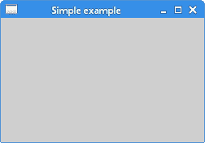

# Qt4 工具包简介

> 原文： [http://zetcode.com/gui/qt4/introduction/](http://zetcode.com/gui/qt4/introduction/)

在 Qt4 教程的这一部分中，我们将介绍 Qt4 库。 我们将安装 Qt4 库并创建我们的第一个小型 Qt4 应用。

Qt 最初是由挪威软件公司 Trolltech 开发的。 2008 年，该公司被诺基亚收购。 2012 年 8 月，一家芬兰开发公司 Digia 从诺基亚那里收购了 Qt 软件技术。 同时，创建了一个 Qt 项目，其中开源 Qt 的开发继续进行。 开源 Qt 工具包的网站可以在 [qt.io](http://www.qt.io) 中找到。 目前，由 Digia 的子公司 Qt 公司和开放源代码治理下的 Qt 项目（包括个人开发人员和公司）共同开发 Qt。

## Qt

Qt 是一个跨平台的应用开发框架。 使用 Qt 开发的一些知名应用是 KDE，Opera，Google Earth，Skype，VLC，Maya 或 Mathematica。 Qt 于 1995 年 5 月首次公开发布。它具有双重许可。 它可以用于创建开源应用以及商业应用。 Qt 工具箱是一个非常强大的工具箱。 它在开源社区中已经建立。 全世界有成千上万的开源开发人员在使用 Qt。

## 下载并解压缩

我们转到 [download.qt.io/official_releases/qt/](http://download.qt.io/official_releases/qt/) 页面。 （由于下载链接过去经常更改，因此您可能需要用 Google 搜索当前链接。）我们选择最新的 Qt 4.x 来源。 在创建本教程时，最新的资料是 Qt 4.8.7。 接下来，我们将从源代码安装 Qt。

```cpp
$ ls qt-everywhere-opensource-src-4.8.7.tar.gz 
qt-everywhere-opensource-src-4.8.7.tar.gz

```

从下载页面，我们下载 Qt4 源。 使用 tar 文件。 （我们为自己省了一些麻烦。ZIP 文件具有 Windows 行尾。）

```cpp
$ tar -xzvf qt-everywhere-opensource-src-4.8.7.tar.gz

```

该命令会将所有文件解压缩到目录`qt-everywhere-opensource-src-4.8.7`。

```cpp
$ du -hs qt-everywhere-opensource-src-4.8.7/
741M    qt-everywhere-opensource-src-4.8.7/

```

现在目录的大小为 741 MB。

```cpp
$ cd qt-everywhere-opensource-src-4.8.7/

```

我们转到创建的目录。 现在是时候仔细阅读`README`和`INSTALL`文件了。 在那里，我们将找到详细的安装说明。 安装简单明了。

## 从源安装

我们以经典方式安装库。 在 Unix 系统上，软件的安装分为三个步骤。

*   组态
*   建造
*   安装

```cpp
$ ./configure -prefix /usr/local/qt4
Which edition of Qt do you want to use ?

Type 'c' if you want to use the Commercial Edition.
Type 'o' if you want to use the Open Source Edition.

```

首先，我们运行配置脚本。 该脚本将询问我们是否需要 Qt4 库的商业版或开源版。 该脚本将为我们的机器类型配置库。 默认情况下，Qt 将安装在`/usr/local/Trolltech/Qt-4.8.7/`目录中。 这可以通过配置脚本的`-prefix`参数进行更改。 我们将库安装到`/usr/local/qt4/`目录中。 请注意，此处的安装字有两个含义。 这是整个过程，包括所有三个步骤。 这也意味着“将文件移动到特定目录”，这是最后第三步。

```cpp
This is the  Open Source Edition.

You are licensed to use this software under the terms of
the Lesser GNU General Public License (LGPL) versions 2.1.
You are also licensed to use this software under the terms of
the GNU General Public License (GPL) versions 3.

Type '3' to view the GNU General Public License version 3.
Type 'L' to view the Lesser GNU General Public License version 2.1.
Type 'yes' to accept this license offer.
Type 'no' to decline this license offer.

Do you accept the terms of either license? yes

```

确认许可协议。

```cpp
Qt is now configured for building. Just run 'make'.
Once everything is built, you must run 'make install'.
Qt will be installed into /usr/local/qt4.

To reconfigure, run 'make confclean' and 'configure'.

```

配置脚本完成后，我们会收到此消息。

```cpp
$ make

```

我们使用`make`命令开始构建过程。 Qt 工具箱的构建可能要花费几个小时。 这取决于处理器的能力。

最后一步是安装文件或将文件移动到目录中。

```cpp
$ sudo make install

```

此命令完成安装过程。 该库现在安装在`/usr/local/qt4/`目录中。

```cpp
$ du -sh /usr/local/qt4/
483M    /usr/local/qt4/

```

目录的大小为 483 MB。 如我们所见，Qt 是一个巨大的库。

我们要做的最后一件事是将 Qt4 路径添加到`PATH`系统变量。 bash 用户需要编辑`.profile`文件或`.bashrc`文件。

```cpp
$ PATH=/usr/local/qt4/bin:$PATH
$ export PATH

```

我们已经将 Qt4 库的`bin`目录的路径添加到`PATH`环境变量。 再次登录后，更改将处于活动状态。

## 从软件包安装

从软件包安装 Qt 更加容易。 Linux 软件包通常不包含最新的 Qt 版本。

```cpp
$ sudo apt-get install qt4-dev-tools

```

上面的命令在基于 Debian 的 Linux 上安装 Qt4。

## 版本

我们的第一个程序将打印 Qt4 库的版本。

`version.cpp`

```cpp
#include <QtCore>
#include <iostream>

int main() {

    std::cout << "Qt version: " << qVersion() << std::endl;
}

```

`qVersion()`函数在运行时以字符串形式返回 Qt 的版本号。

```cpp
$ g++ -o version version.cpp  -I/usr/local/qt4/include/QtCore -I/usr/local/qt4/include -L/usr/local/qt4/lib -lQtCore

```

上面的命令将编译示例。 请注意，您的 Qt4 库可能安装在其他位置。

```cpp
$ ./version 
Qt version: 4.8.6

```

本教程中使用的 Qt4 库的版本是 4.8.6。

## 测试一个小的 GUI 示例

最后，我们编写一个小应用。 该应用包含一个普通窗口。

`simple.cpp`

```cpp
#include <QApplication>
#include <QWidget>

int main(int argc, char *argv[]) {

    QApplication app(argc, argv);

    QWidget window;

    window.resize(250, 150);
    window.setWindowTitle("Simple example");
    window.show();

    return app.exec();
}

```

要构建此示例，我们使用`qmake`工具。

```cpp
$ qmake -project
$ qmake
$ make

```

如果 Qt4​​ 安装目录不是`PATH`变量的一部分，我们可以提供`qmake`工具的完整路径。

```cpp
$ /usr/local/qt4/bin/qmake -project
$ /usr/local/qt4/bin/qmake
$ make

```



图：简单 example

安装完成确定。

本章是 Qt4 库的简介。