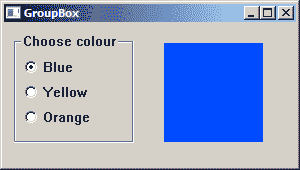
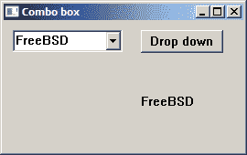
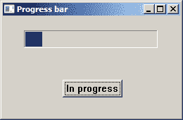

# Windows API 控件 III

> 原文： [http://zetcode.com/gui/winapi/controlsIII/](http://zetcode.com/gui/winapi/controlsIII/)

在本章中，我们将结束有关 Windows API 控件的讨论。 我们将提到单选按钮，单选框，组合框和进度条。

## 单选按钮和分组框

在这里，我们介绍两个控件。分组框是围绕一组控件的矩形。 这些通常是单选按钮。 分组框具有描述控件的标签。 此控件的目的是对某种程度上相关的控件进行分组。单选按钮是一种特殊的按钮，用户可以选择但不能清除。 它允许用户从一组选项中选择一个独占选项。

`radio_buttons.c`

```
#include <windows.h>

#define ID_BLUE 1
#define ID_YELLOW 2
#define ID_ORANGE 3

LRESULT CALLBACK WndProc(HWND, UINT, WPARAM, LPARAM);

HINSTANCE g_hinst;
COLORREF g_color;

int WINAPI wWinMain(HINSTANCE hInstance, HINSTANCE hPrevInstance,
                    PWSTR lpCmdLine, int nCmdShow) {

    HWND hwnd;
    MSG  msg ;    
    WNDCLASSW wc = {0};
    wc.lpszClassName = L"GroupBox";
    wc.hInstance     = hInstance;
    wc.hbrBackground = GetSysColorBrush(COLOR_3DFACE);
    wc.lpfnWndProc   = WndProc;
    wc.hCursor       = LoadCursor(0, IDC_ARROW);

    g_hinst = hInstance;

    RegisterClassW(&wc);
    hwnd = CreateWindowW(wc.lpszClassName, L"GroupBox",
                  WS_OVERLAPPEDWINDOW | WS_VISIBLE,
                  100, 100, 300, 170, 0, 0, hInstance, 0);  

    while (GetMessage(&msg, NULL, 0, 0)) {

        DispatchMessage(&msg);
    }

    return (int) msg.wParam;
}

LRESULT CALLBACK WndProc(HWND hwnd, UINT msg, 
    WPARAM wParam, LPARAM lParam) {

    HDC hdc;
    PAINTSTRUCT ps;
    HBRUSH hBrush, holdBrush;
    HPEN hPen, holdPen;

    switch(msg) {

        case WM_CREATE:

            CreateWindowW(L"Button", L"Choose colour", 
                  WS_CHILD | WS_VISIBLE | BS_GROUPBOX,
                  10, 10, 120, 110, hwnd, (HMENU) 0, g_hinst, NULL);
            CreateWindowW(L"Button", L"Blue",
                  WS_CHILD | WS_VISIBLE | BS_AUTORADIOBUTTON,
                  20, 30, 100, 30, hwnd, (HMENU) ID_BLUE , g_hinst, NULL);
            CreateWindowW(L"Button", L"Yellow",
                  WS_CHILD | WS_VISIBLE | BS_AUTORADIOBUTTON,
                  20, 55, 100, 30, hwnd, (HMENU) ID_YELLOW , g_hinst, NULL);
            CreateWindowW(L"Button", L"Orange",
                  WS_CHILD | WS_VISIBLE | BS_AUTORADIOBUTTON,
                  20, 80, 100, 30, hwnd, (HMENU) ID_ORANGE , g_hinst, NULL);      
            break;

        case WM_COMMAND:

            if (HIWORD(wParam) == BN_CLICKED) {

                switch (LOWORD(wParam)) {

                    case ID_BLUE:
                        g_color = RGB(0, 76, 255);
                        break;
                    case ID_YELLOW:
                        g_color = RGB(255, 255, 0);
                        break;
                    case ID_ORANGE:
                        g_color = RGB(255, 123, 0);
                        break;
                }                    
                InvalidateRect(hwnd, NULL, TRUE);
            }
            break;

        case WM_PAINT:

            hdc = BeginPaint(hwnd, &ps);
            hBrush = CreateSolidBrush(g_color);
            hPen = CreatePen(PS_NULL, 1, RGB(0, 0, 0));
            holdPen = SelectObject(hdc, hPen);
            holdBrush = (HBRUSH) SelectObject(hdc, hBrush);

            Rectangle(hdc, 160, 20, 260, 120);

            SelectObject(hdc, holdBrush);
            SelectObject(hdc, holdPen);
            DeleteObject(hPen);
            DeleteObject(hBrush);
            EndPaint(hwnd, &ps);
            break;

        case WM_DESTROY:
            PostQuitMessage(0);
            break; 
    }

    return DefWindowProcW(hwnd, msg, wParam, lParam);
}

```

在我们的示例中，我们有一个带有三个单选按钮的分组框。 通过单击单选按钮，我们为右侧的矩形选择背景色。

```
CreateWindowW(L"Button", L"Choose colour", 
        WS_CHILD | WS_VISIBLE | BS_GROUPBOX,
        10, 10, 120, 110, hwnd, (HMENU) 0, g_hinst, NULL);

```

分组框是一种特殊的按`BS_GROUPBOX`样式创建的按钮。

```
CreateWindowW(L"Button", L"Blue",
        WS_CHILD | WS_VISIBLE | BS_AUTORADIOBUTTON,
        20, 30, 100, 30, hwnd, (HMENU) ID_BLUE , g_hinst, NULL);

```

单选按钮也是`BS_AUTORADIOBUTTON`样式的特殊按钮。

```
case ID_BLUE:
    g_color = RGB(0, 76, 255);
    break;

```

如果单击单选按钮，则将使用选定的颜色填充全局变量。 此变量用于创建填充矩形的画笔。

```
InvalidateRect(hwnd, NULL, TRUE);

```

我们使矩形（在本例中为整个窗口）无效，这将导致重绘客户区。 这将启动`WM_PAINT`消息。 在`WM_PAINT`消息期间，我们绘制矩形。 在 [GDI](../gdi) 一章中更详细地说明了绘图。



Figure: Radio buttons in a GroupBox

## 组合框

组合框是编辑框或静态文本与列表的组合。 当我们需要从可用选项列表中选择一个项目时，将使用一个组合框。

`combobox.c`

```
#include <windows.h>

LRESULT CALLBACK WndProc(HWND, UINT, WPARAM, LPARAM);

HINSTANCE g_hinst;

int WINAPI wWinMain(HINSTANCE hInstance, HINSTANCE hPrevInstance,
                    PWSTR lpCmdLine, int nCmdShow) {

    HWND hwnd;
    MSG  msg ;    
    WNDCLASSW wc = {0};
    wc.lpszClassName = L"Application";
    wc.hInstance     = hInstance ;
    wc.hbrBackground = GetSysColorBrush(COLOR_3DFACE);
    wc.lpfnWndProc   = WndProc ;
    wc.hCursor       = LoadCursor(0,IDC_ARROW);

    g_hinst = hInstance;

    RegisterClassW(&wc);
    hwnd = CreateWindowW(wc.lpszClassName, L"Combo box",
                  WS_OVERLAPPEDWINDOW | WS_VISIBLE,
                  100, 100, 270, 170, 0, 0, hInstance, 0);  

    while (GetMessage(&msg, NULL, 0, 0)) {

        DispatchMessage(&msg);
    }

    return (int) msg.wParam;
}

LRESULT CALLBACK WndProc(HWND hwnd, UINT msg, 
        WPARAM wParam, LPARAM lParam) {

    static HWND hwndCombo, hwndStatic;
    const wchar_t *items[] = { L"FreeBSD", L"OpenBSD", 
        L"NetBSD", L"Solaris", L"Arch" };

    switch(msg) {

        case WM_CREATE:

              hwndCombo = CreateWindowW(L"Combobox", NULL, 
                    WS_CHILD | WS_VISIBLE | CBS_DROPDOWN,
                    10, 10, 120, 110, hwnd, NULL, g_hinst, NULL);   

              CreateWindowW(L"Button", L"Drop down", 
                    WS_CHILD | WS_VISIBLE,
                    150, 10, 90, 25, hwnd, (HMENU) 1, g_hinst, NULL); 

              hwndStatic = CreateWindowW(L"Static", L"", 
                    WS_CHILD | WS_VISIBLE,
                    150, 80, 90, 25, hwnd, NULL, g_hinst, NULL); 

              for (int i = 0; i < 4; i++ ) {

                  SendMessageW(hwndCombo, CB_ADDSTRING, 0, (LPARAM) items[i]);
              }

              break;

        case WM_COMMAND:

             if (HIWORD(wParam) == BN_CLICKED) {

                  SendMessage(hwndCombo, CB_SHOWDROPDOWN, (WPARAM) TRUE, 0);
             }

             if (HIWORD(wParam) == CBN_SELCHANGE) {      

                  LRESULT sel = SendMessage(hwndCombo, CB_GETCURSEL, 0, 0);
                  SetWindowTextW(hwndStatic, items[sel]);
             }
             break;

        case WM_DESTROY:

            PostQuitMessage(0);
            break; 
    }

    return DefWindowProcW(hwnd, msg, wParam, lParam);
}

```

在我们的示例中，我们在窗口上放置了三个控件：一个组合框，一个按钮和一个静态文本。 静态文本显示组合框中当前选择的项目。 用于演示`CBN_SELCHANGE`组合框消息。 该按钮以编程方式打开组合框。

```
hwndCombo = CreateWindowW(L"Combobox", NULL, 
    WS_CHILD | WS_VISIBLE | CBS_DROPDOWN,
    10, 10, 120, 110, hwnd, NULL, g_hinst, NULL); 

```

要创建一个组合框，我们使用`L"Combobox"`窗口类。 `CBS_DROPDOWN`标志创建一个下拉列表。

```
for (int i = 0; i < 4; i++ ) {

    SendMessageW(hwndCombo, CB_ADDSTRING, 0, (LPARAM) items[i]);
}

```

我们用项目填充组合框。 要向组合框添加字符串，我们发送`CB_ADDSTRING`消息。

```
if (HIWORD(wParam) == BN_CLICKED) {

    SendMessage(hwndCombo, CB_SHOWDROPDOWN, (WPARAM) TRUE, 0);
}

```

单击该按钮将导致发送`CB_SHOWDROPDOWN`消息，该消息将以编程方式调用下拉框。

如果从组合框中选择一个项目，则窗口过程将接收`WM_COMMAND`消息，并在`wParam`参数的高位字中带有通知消息`CBN_SELCHANGE`。

```
if (HIWORD(wParam) == CBN_SELCHANGE) {      

    LRESULT sel = SendMessage(hwndCombo, CB_GETCURSEL, 0, 0);
    SetWindowTextW(hwndStatic, items[sel]);
}

```

我们找出当前选择的项目。 我们向组合框发送`CB_GETCURSEL`消息。 该函数返回当前所选项目的索引。 我们将静态文本设置为当前选择的字符串。



Figure: Combo box

## 进度条

进度条是当我们处理冗长的任务时使用的控件。 它具有动画效果，以便用户知道我们的任务正在进行中。

`progressbar.c`

```
#include <windows.h>
#include <commctrl.h>

#define ID_BUTTON 1
#define ID_TIMER 2

LRESULT CALLBACK WndProc(HWND, UINT, WPARAM, LPARAM);
void CreateControls(HWND);

HWND hwndPrgBar;
HWND hbtn;

int WINAPI wWinMain(HINSTANCE hInstance, HINSTANCE hPrevInstance,
                    PWSTR lpCmdLine, int nCmdShow) {

    HWND hwnd;
    MSG  msg ;    
    WNDCLASSW wc = {0};
    wc.lpszClassName = L"Application";
    wc.hInstance     = hInstance;
    wc.hbrBackground = GetSysColorBrush(COLOR_3DFACE);
    wc.lpfnWndProc   = WndProc;
    wc.hCursor       = LoadCursor(0, IDC_ARROW);

    RegisterClassW(&wc);
    hwnd = CreateWindowW(wc.lpszClassName, L"Progress bar",
                WS_OVERLAPPEDWINDOW | WS_VISIBLE,
                100, 100, 260, 170, 0, 0, hInstance, 0);  

    while (GetMessage(&msg, NULL, 0, 0)) {

        DispatchMessage(&msg);
    }

    return (int) msg.wParam;
}

LRESULT CALLBACK WndProc(HWND hwnd, UINT msg, 
        WPARAM wParam, LPARAM lParam) {

    static int i = 0;

    switch(msg) {

        case WM_CREATE:

            CreateControls(hwnd);
            break;

        case WM_TIMER:

            SendMessage(hwndPrgBar, PBM_STEPIT, 0, 0);
            i++;

            if (i == 150) {

                KillTimer(hwnd, ID_TIMER);
                SendMessageW(hbtn, WM_SETTEXT, (WPARAM) NULL, (LPARAM) L"Start");
                i = 0;
            }

            break;

        case WM_COMMAND:

            if (i == 0) {  

                i = 1;
                SendMessage(hwndPrgBar, PBM_SETPOS, 0, 0);
                SetTimer(hwnd, ID_TIMER, 5, NULL);
                SendMessageW(hbtn, WM_SETTEXT, (WPARAM) NULL, (LPARAM) L"In progress");
            }

          break;

        case WM_DESTROY:

            KillTimer(hwnd, ID_TIMER);
            PostQuitMessage(0);
            break; 
    }

    return DefWindowProcW(hwnd, msg, wParam, lParam);
}

void CreateControls(HWND hwnd) {

    INITCOMMONCONTROLSEX icex;

    icex.dwSize = sizeof(INITCOMMONCONTROLSEX);
    icex.dwICC  = ICC_PROGRESS_CLASS;
    InitCommonControlsEx(&icex);

    hwndPrgBar = CreateWindowEx(0, PROGRESS_CLASS, NULL, 
          WS_CHILD | WS_VISIBLE | PBS_SMOOTH,
          30, 20, 190, 25, hwnd, NULL, NULL, NULL);   

    hbtn = CreateWindowW(L"Button", L"Start", 
          WS_CHILD | WS_VISIBLE,
          85, 90, 85, 25, hwnd, (HMENU) 1, NULL, NULL);  

    SendMessage(hwndPrgBar, PBM_SETRANGE, 0, MAKELPARAM(0, 150));
    SendMessage(hwndPrgBar, PBM_SETSTEP, 1, 0);
}

```

在我们的示例中，我们有一个进度条和一个按钮。 该按钮启动一个计时器，该计时器更新进度条。

```
hwndPrgBar = CreateWindowEx(0, PROGRESS_CLASS, NULL, 
      WS_CHILD | WS_VISIBLE | PBS_SMOOTH,
      30, 20, 190, 25, hwnd, NULL, NULL, NULL);  

```

我们使用`PROGRESS_CLASS`类名称和`PBS_SMOOTH`样式创建进度条控件。

```
SendMessage(hwndPrgBar, PBM_SETRANGE, 0, MAKELPARAM(0, 150));
SendMessage(hwndPrgBar, PBM_SETSTEP, 1, 0);

```

我们设置进度条的范围及其步骤。

```
i = 1;
SendMessage(hwndPrgBar, PBM_SETPOS, 0, 0);
SetTimer(hwnd, ID_TIMER, 5, NULL);

```

当按下开始按钮时，我们将`i`值设置为 1，设置进度条的初始位置，然后启动计时器。 计时器将定期向窗口过程发送`WM_TIMER`消息，直到被杀死。

```
SendMessageW(hbtn, WM_SETTEXT, (WPARAM) NULL, (LPARAM) L"In progress"); 

```

当计时器进行时，我们更改按钮的标签。

```
case WM_TIMER:

    SendMessage(hwndPrgBar, PBM_STEPIT, 0, 0);
    i++;

    if (i == 150) {

        KillTimer(hwnd, ID_TIMER);
        SendMessageW(hbtn, WM_SETTEXT, (WPARAM) NULL, (LPARAM) L"Start");
        i = 0;
    }

    break;

```

当我们收到`WM_TIMER`消息时，我们通过发送`PBM_STEPIT`消息的一步来更新进度条。 当`i`变量达到进度条的上限时，计时器将被终止。



Figure: Progress bar

在 Windows API 教程的这一部分中，我们已经完成了 Windows 控件的介绍。