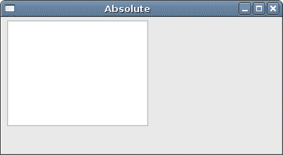
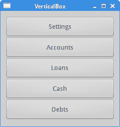
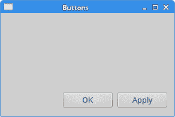
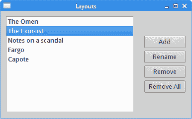
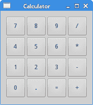

# Qt4 中的布局管理

> 原文： [http://zetcode.com/gui/qt4/layoutmanagement/](http://zetcode.com/gui/qt4/layoutmanagement/)

在 Qt4 编程教程的这一部分中，我们将讨论小部件的布局管理。

典型的应用程序由各种小部件组成。 这些小部件放置在布局内。 程序员必须管理应用程序的布局。 在 Qt4 中，我们有两个选择：

*   绝对定位
*   布局经理

## 绝对定位

程序员以像素为单位指定每个小部件的位置和大小。 当使用绝对定位时，我们必须了解几件事。

*   如果我们调整窗口大小，则小部件的大小和位置不会改变。
*   在各种平台上，应用程序看起来有所不同（通常很差）。
*   在我们的应用程序中更改字体可能会破坏布局。
*   如果决定更改布局，则必须完全重做布局，这既繁琐又耗时。

在某些情况下，我们可能会使用绝对定位。 但是大多数情况下，在实际程序中，程序员使用布局管理器。

`absolute.cpp`

```
#include <QApplication>
#include <QDesktopWidget>
#include <QTextEdit>

class Absolute : public QWidget {

 public:
     Absolute(QWidget *parent = 0);
};

Absolute::Absolute(QWidget *parent)
    : QWidget(parent) {

  QTextEdit *ledit = new QTextEdit(this);
  ledit->setGeometry(5, 5, 200, 150);
}

int main(int argc, char *argv[]) {

  QApplication app(argc, argv);  

  Absolute window;

  window.setWindowTitle("Absolute");
  window.show();

  return app.exec();
}

```

`setGeometry()`方法用于以绝对坐标将窗口小部件放置在窗口上。

```
QTextEdit *edit = new QTextEdit(this);
edit->setGeometry(5, 5, 200, 150);

```

我们创建一个`QTextEdit`小部件并手动定位。 `setGeometry()`方法有两件事：将窗口小部件定位到绝对坐标并调整窗口小部件的大小。


Figure: before resizement



Figure: after resizement

## `QVBoxLayout`

`QVBoxLayout`类垂直排列小部件。 使用`addWidget()`方法将小部件添加到布局。

`verticalbox.h`

```
#pragma once

#include <QWidget>

class VerticalBox : public QWidget {

  public:
    VerticalBox(QWidget *parent = 0);

};

```

头文件。

`verticalbox.cpp`

```
#include "verticalbox.h"
#include <QVBoxLayout>
#include <QPushButton>

VerticalBox::VerticalBox(QWidget *parent)
    : QWidget(parent) {

  QVBoxLayout *vbox = new QVBoxLayout(this);
  vbox->setSpacing(1);

  QPushButton *settings = new QPushButton("Settings", this);
  settings->setSizePolicy(QSizePolicy::Expanding, QSizePolicy::Expanding);
  QPushButton *accounts = new QPushButton("Accounts", this);
  accounts->setSizePolicy(QSizePolicy::Expanding, QSizePolicy::Expanding);
  QPushButton *loans = new QPushButton("Loans", this);
  loans->setSizePolicy(QSizePolicy::Expanding, QSizePolicy::Expanding);
  QPushButton *cash = new QPushButton("Cash", this);
  cash->setSizePolicy(QSizePolicy::Expanding, QSizePolicy::Expanding);
  QPushButton *debts = new QPushButton("Debts", this);
  debts->setSizePolicy(QSizePolicy::Expanding, QSizePolicy::Expanding);

  vbox->addWidget(settings);
  vbox->addWidget(accounts);
  vbox->addWidget(loans);
  vbox->addWidget(cash);
  vbox->addWidget(debts);

  setLayout(vbox);
}

```

在我们的示例中，我们有一个垂直布局管理器。 我们在其中放入了五个按钮。 我们使所有按钮都可以在两个方向上展开。

```
QVBoxLayout *vbox = new QVBoxLayout(this);
vbox->setSpacing(1);

```

我们创建`QVBoxLayout`并在子窗口小部件之间设置 1 px 的间距。

```
QPushButton *settings = new QPushButton("Settings", this);
settings->setSizePolicy(QSizePolicy::Expanding, QSizePolicy::Expanding);

```

我们创建一个按钮并为其设置大小策略。 子窗口小部件由布局管理器管理。 默认情况下，按钮水平扩展，垂直方向固定大小。 如果要更改它，我们将设置一个新的大小策略。 在我们的例子中，按钮可以向两个方向扩展。

```
vbox->addWidget(settings);
vbox->addWidget(accounts);
...

```

我们使用`addWidget()`方法将子窗口小部件添加到布局管理器。

```
setLayout(vbox);

```

我们为窗口设置`QVBoxLayout`管理器。

`main.cpp`

```
#include "verticalbox.h"
#include <QApplication>

int main(int argc, char *argv[]) {

  QApplication app(argc, argv);  

  VerticalBox window;

  window.resize(240, 230);
  window.setWindowTitle("VerticalBox");
  window.show();

  return app.exec();
}

```

主文件。



Figure: QVBoxLayout

## 按钮

在下面的示例中，我们在窗口的客户区域上显示两个按钮。 它们将位于窗口的右下角。

`buttons.h`

```
#pragma once

#include <QWidget>
#include <QPushButton>

class Buttons : public QWidget {

  public:
    Buttons(QWidget *parent = 0);

  private:
    QPushButton *okBtn;
    QPushButton *applyBtn;

};

```

头文件。

`buttons.cpp`

```
#include "buttons.h"
#include <QVBoxLayout>
#include <QHBoxLayout>

Buttons::Buttons(QWidget *parent)
    : QWidget(parent) {

  QVBoxLayout *vbox = new QVBoxLayout(this);
  QHBoxLayout *hbox = new QHBoxLayout();

  okBtn = new QPushButton("OK", this);
  applyBtn = new QPushButton("Apply", this);

  hbox->addWidget(okBtn, 1, Qt::AlignRight);
  hbox->addWidget(applyBtn, 0);

  vbox->addStretch(1);
  vbox->addLayout(hbox);
}

```

假设我们想在窗口的右下角有两个按钮。

```
QVBoxLayout *vbox = new QVBoxLayout(this);
QHBoxLayout *hbox = new QHBoxLayout();

```

我们创建了两个框布局管理器：一个垂直框布局管理器和一个水平框布局管理器。

```
okBtn = new QPushButton("OK", this);
applyBtn = new QPushButton("Apply", this);

```

我们创建两个按钮。

```
hbox->addWidget(okBtn, 1, Qt::AlignRight);
hbox->addWidget(applyBtn, 0);

```

这些按钮位于水平布局管理器中。 使用`addWidget()`方法。 这些按钮右对齐。 第一个参数是子窗口小部件。 第二个参数是拉伸因子，最后一个参数是对齐。 通过将“确定”按钮的拉伸因子设置为 1，我们在窗口的左侧到右侧留出一定的空间。 窗口小部件不会扩展到分配给它的所有空间。 最后，`Qt::AlignRight`常数将小部件对齐到分配空间的右侧。

```
vbox->addStretch(1);
vbox->addLayout(hbox);

```

通过调用`addStretch()`方法，我们在垂直框中放入了一个可扩展的空白区域。 然后，将水平框布局添加到垂直框布局。

`main.cpp`

```
#include <QApplication>
#include "buttons.h"

int main(int argc, char *argv[]) {

  QApplication app(argc, argv);  

  Buttons window;

  window.resize(290, 170);
  window.setWindowTitle("Buttons");
  window.show();

  return app.exec();
}

```

主文件。



Figure: Buttons

## 嵌套布局

以下示例的目的是说明可以合并布局管理器。 通过甚至简单布局的组合，我们可以创建复杂的对话框或窗口。 要嵌套布局，我们利用`addLayout()`方法。

`layouts.h`

```
#pragma once

#include <QWidget>

class Layouts : public QWidget {

  public:
    Layouts(QWidget *parent = 0);

};

```

头文件。

`layouts.cpp`

```
#include <QVBoxLayout>
#include <QPushButton>
#include <QListWidget>
#include "layouts.h"

Layouts::Layouts(QWidget *parent)
    : QWidget(parent) {

  QVBoxLayout *vbox = new QVBoxLayout();
  QHBoxLayout *hbox = new QHBoxLayout(this);

  QListWidget *lw = new QListWidget(this);
  lw->addItem("The Omen"); 
  lw->addItem("The Exorcist");
  lw->addItem("Notes on a scandal");
  lw->addItem("Fargo");
  lw->addItem("Capote");

  QPushButton *add = new QPushButton("Add", this);
  QPushButton *rename = new QPushButton("Rename", this);
  QPushButton *remove = new QPushButton("Remove", this);
  QPushButton *removeall = new QPushButton("Remove All", this);

  vbox->setSpacing(3);
  vbox->addStretch(1);
  vbox->addWidget(add);
  vbox->addWidget(rename);
  vbox->addWidget(remove);
  vbox->addWidget(removeall);
  vbox->addStretch(1);

  hbox->addWidget(lw);
  hbox->addSpacing(15);
  hbox->addLayout(vbox);

  setLayout(hbox);
}

```

在示例中，我们创建一个窗口，该窗口由四个按钮和一个列表小部件组成。 这些按钮被分组在一个垂直列中，并位于列表小部件的右侧。 如果我们调整窗口的大小，列表小部件也将被调整大小。

```
QVBoxLayout *vbox = new QVBoxLayout();

```

`QVBoxLayout`将是按钮的列。

```
QHBoxLayout *hbox = new QHBoxLayout(this);

```

`QHBoxLayout`将是小部件的基本布局。

```
QListWidget *lw = new QListWidget(this);
lw->addItem("The Omen"); 
lw->addItem("The Exorcist");
lw->addItem("Notes on a scandal");
lw->addItem("Fargo");
lw->addItem("Capote");

```

`QListWidget`已创建。

```
QPushButton *add = new QPushButton("Add", this);
QPushButton *rename = new QPushButton("Rename", this);
QPushButton *remove = new QPushButton("Remove", this);
QPushButton *removeall = new QPushButton("Remove All", this);

```

在这里，我们创建四个按钮。

```
vbox->setSpacing(3);
vbox->addStretch(1);
vbox->addWidget(add);
vbox->addWidget(rename);
vbox->addWidget(remove);
vbox->addWidget(removeall);
vbox->addStretch(1);

```

创建带有四个按钮的垂直框。 我们在按钮之间留了一些空间。 注意，我们在垂直框的顶部和底部添加了一个拉伸因子。 这样，按钮可以垂直居中。

```
hbox->addWidget(lw);
hbox->addSpacing(15);
hbox->addLayout(vbox);

```

列表小部件和按钮的垂直框放置在水平框布局中。 `addLayout()`方法用于将一个布局添加到另一个布局。

```
setLayout(hbox);

```

我们为父窗口设置基本布局。

`main.cpp`

```
#include <QApplication>
#include "layouts.h"

int main(int argc, char *argv[]) {

  QApplication app(argc, argv);  

  Layouts window;

  window.setWindowTitle("Layouts");
  window.show();

  return app.exec();
}

```

主文件。



Figure: Layouts

## `QFormLayout`

`QFormLayout`是一个简单的布局管理器，用于管理输入窗口小部件及其相关标签的形式。 它以两列的形式布置其子项。 左列包含标签，右列包含输入窗口小部件，例如`QLineEdit`或`QSpinBox`。

`form.h`

```
#pragma once

#include <QWidget>

class FormEx : public QWidget {

  public:
    FormEx(QWidget *parent = 0);

};

```

这是标题文件管理器。

`form.cpp`

```
#include "form.h"
#include <QFormLayout>
#include <QLabel>
#include <QLineEdit>

FormEx::FormEx(QWidget *parent)
    : QWidget(parent) {

  QLineEdit *nameEdit = new QLineEdit(this);
  QLineEdit *addrEdit = new QLineEdit(this);
  QLineEdit *occpEdit = new QLineEdit(this);

  QFormLayout *formLayout = new QFormLayout;
  formLayout->setLabelAlignment(Qt::AlignRight | Qt::AlignVCenter);
  formLayout->addRow("Name:", nameEdit);
  formLayout->addRow("Email:", addrEdit);
  formLayout->addRow("Age:", occpEdit);

  setLayout(formLayout);
}

```

该示例创建一个包含三个标签和三个行编辑的表单。

```
QFormLayout *formLayout = new QFormLayout;

```

创建`QFormLayout`的实例。

```
formLayout->setLabelAlignment(Qt::AlignRight | Qt::AlignVCenter);

```

使用`setLabelAlignment()`方法，我们设置标签小部件的对齐方式。

```
formLayout->addRow("Name:", nameEdit);

```

`addRow()`方法将新行添加到表单布局的底部，并带有给定的标签和输入小部件。

`main.cpp`

```
#include <QApplication>
#include "form.h"

int main(int argc, char *argv[]) {

  QApplication app(argc, argv);  

  FormEx window;

  window.setWindowTitle("Form example");
  window.show();

  return app.exec();
}

```

主文件。


Figure: Simple form

## `QGridLayout`

`QGridLayout`将其小部件放置在网格中。 它是一个功能强大的布局管理器。

`calculator.h`

```
#pragma once

#include <QWidget>

class Calculator : public QWidget {

  public:
    Calculator(QWidget *parent = 0);
};

```

这是头文件。

`calculator.cpp`

```
#include <QGridLayout>
#include <QPushButton>
#include "calculator.h"

Calculator::Calculator(QWidget *parent)
    : QWidget(parent) {

  QGridLayout *grid = new QGridLayout(this);
  grid->setSpacing(2);

  QList<QString> values({ "7", "8", "9", "/", 
    "4", "5", "6", "*",
    "1", "2", "3", "-",
    "0", ".", "=", "+"
  });

  int pos = 0;

  for (int i=0; i<4; i++) {
   for (int j=0; j<4; j++) {

     QPushButton *btn = new QPushButton(values[pos], this);
     btn->setFixedSize(40, 40);
     grid->addWidget(btn, i, j);
     pos++;
   }
  }  

  setLayout(grid);
}

```

我们创建计算器的骨架。

```
QGridLayout *grid = new QGridLayout(this);
grid->setSpacing(2);

```

我们创建网格布局，并在子小部件之间设置 2 px 的空间。

```
QList<QString> values({ "7", "8", "9", "/", 
  "4", "5", "6", "*",
  "1", "2", "3", "-",
  "0", ".", "=", "+"
});

```

这些是按钮上显示的字符。

```
for (int i=0; i<4; i++) {
  for (int j=0; j<4; j++) {

      QPushButton *btn = new QPushButton(values[pos], this);
      btn->setFixedSize(40, 40);
      grid->addWidget(btn, i, j);
      pos++;
  }
} 

```

我们将十六个小部件放置到网格布局中。 每个按钮将具有固定的大小。

`main.cpp`

```
#include <QApplication>
#include "calculator.h"

int main(int argc, char *argv[]) {

  QApplication app(argc, argv); 

  Calculator window;

  window.move(300, 300);
  window.setWindowTitle("Calculator");
  window.show();

  return app.exec();
}

```

这是主文件。



Figure: QGridLayout

## 回顾

在本章的下一个示例中，我们使用`QGridLayout`管理器创建一个更复杂的窗口。

`review.h`

```
#pragma once

#include <QWidget>

class Review : public QWidget {

  public:
    Review(QWidget *parent = 0);

};

```

头文件。

`review.cpp`

```
#include "review.h"
#include <QGridLayout>
#include <QLabel>
#include <QLineEdit>
#include <QTextEdit>

Review::Review(QWidget *parent)
    : QWidget(parent) {

  QGridLayout *grid = new QGridLayout(this);
  grid->setVerticalSpacing(15);
  grid->setHorizontalSpacing(10);

  QLabel *title = new QLabel("Title:", this);
  grid->addWidget(title, 0, 0, 1, 1);
  title->setAlignment(Qt::AlignRight | Qt::AlignVCenter);

  QLineEdit *edt1 = new QLineEdit(this);
  grid->addWidget(edt1, 0, 1, 1, 1);

  QLabel *author = new QLabel("Author:", this);
  grid->addWidget(author, 1, 0, 1, 1);
  author->setAlignment(Qt::AlignRight | Qt::AlignVCenter);

  QLineEdit *edt2 = new QLineEdit(this);
  grid->addWidget(edt2, 1, 1, 1, 1);

  QLabel *review = new QLabel("Review:", this);
  grid->addWidget(review, 2, 0, 1, 1);
  review->setAlignment(Qt::AlignRight | Qt::AlignTop);

  QTextEdit *te = new QTextEdit(this);
  grid->addWidget(te, 2, 1, 3, 1);

  setLayout(grid);
}

```

该代码创建了一个窗口，可用于输入作者，书名和书评。

```
QGridLayout *grid = new QGridLayout(this);

```

`QGridLayout`管理器已创建。

```
grid->setVerticalSpacing(15);
grid->setHorizontalSpacing(10);

```

我们使用`setVerticalSpacing()`方法添加垂直间距，并使用`setHorizontalSpacing()`方法添加水平间距。

```
QLabel *title = new QLabel("Title", this);
grid->addWidget(title, 0, 0, 1, 1);

```

这些代码行创建一个标签小部件，并将其放入网格布局中。 `addWidget()`方法具有五个参数。 第一个参数是子窗口小部件，在本例中为标签。 接下来的两个参数是放置标签的网格中的行和列。 最后，最后一个参数是 rowpan 和 colspan。 这些参数指定当前窗口小部件将跨越多少行。 在我们的情况下，标签将仅跨越一列和一行。

```
title->setAlignment(Qt::AlignRight | Qt::AlignVCenter);

```

`setAlignment()`方法将标题标签对准其单元格。 在水平方向上，它是右对齐的。 在垂直方向上，它居中。

```
QTextEdit *te = new QTextEdit(this);
grid->addWidget(te, 2, 1, 3, 1);

```

`QTextEdit`小部件位于第三行和第二列； 它跨越三行一列。

`main.cpp`

```
#include <QApplication>
#include "review.h"

int main(int argc, char *argv[]) {

  QApplication app(argc, argv);  

  Review window;

  window.setWindowTitle("Review");
  window.show();

  return app.exec();
}

```

主文件。


Figure: Review

Qt4 教程的这一部分专门用于布局管理。