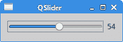

# Qt4 小部件

> 原文： [http://zetcode.com/gui/qt4/widgets/](http://zetcode.com/gui/qt4/widgets/)

在 Qt4 C++ 编程教程的这一部分中，我们将讨论一些基本的 Qt4 小部件。

小部件是 GUI 应用程序的基本构建块。 Qt4 库具有丰富的各种小部件集。

## `QLabel`

`QLabel`用于显示文本和图像。 没有用户交互。 以下示例显示文本。

`label.h`

```
#pragma once

#include <QWidget>
#include <QLabel>

class Label : public QWidget {

  public:
    Label(QWidget *parent = 0);

  private:
    QLabel *label;
};

```

这是我们的代码示例的头文件。

`label.cpp`

```
#include <QVBoxLayout>
#include <QFont>
#include "label.h"

Label::Label(QWidget *parent)
    : QWidget(parent) {

  QString lyrics = "Who doesn't long for someone to hold\n\
Who knows how to love you without being told\n\
Somebody tell me why I'm on my own\n\
If there's a soulmate for everyone\n\
\n\
Here we are again, circles never end\n\
How do I find the perfect fit\n\
There's enough for everyone\n\
But I'm still waiting in line\n\
\n\
Who doesn't long for someone to hold\n\
Who knows how to love you without being told\n\
Somebody tell me why I'm on my own\n\
If there's a soulmate for everyone";

  label = new QLabel(lyrics, this);
  label->setFont(QFont("Purisa", 10));

  QVBoxLayout *vbox = new QVBoxLayout();
  vbox->addWidget(label);
  setLayout(vbox);
}

```

我们使用`QLabel`小部件在窗口中显示歌词。

```
label = new QLabel(lyrics, this);
label->setFont(QFont("Purisa", 10));

```

我们创建一个标签小部件并为其设置特定的字体。

`main.cpp`

```
#include <QApplication>
#include <QTextStream>
#include "label.h"

int main(int argc, char *argv[]) {

  QApplication app(argc, argv);  

  Label window;

  window.setWindowTitle("QLabel");
  window.show();

  return app.exec();
}

```

这是主文件。


Figure: QLabel

## `QSlider`

`QSlider`是具有简单句柄的小部件。 该手柄可以前后拉动。 这样，我们可以为特定任务选择一个值。

`slider.h`

```
#pragma once

#include <QWidget>
#include <QSlider>
#include <QLabel>

class Slider : public QWidget {

  Q_OBJECT

  public:
    Slider(QWidget *parent = 0);

  private:
    QSlider *slider; 
    QLabel *label;
};

```

该示例的头文件。

`slider.cpp`

```
#include "slider.h"
#include <QHBoxLayout>

Slider::Slider(QWidget *parent)
    : QWidget(parent) {

  QHBoxLayout *hbox = new QHBoxLayout(this);

  slider = new QSlider(Qt::Horizontal , this);
  hbox->addWidget(slider);

  label = new QLabel("0", this);
  hbox->addWidget(label);

  connect(slider, SIGNAL(valueChanged(int)), label, SLOT(setNum(int)));
}

```

我们显示两个小部件：一个滑块和一个标签。 滑块控制标签中显示的数字。

```
slider = new QSlider(Qt::Horizontal , this);

```

将创建水平`QSlider`。

```
connect(slider, SIGNAL(valueChanged(int)), label, SLOT(setNum(int)));

```

在此代码行中，我们将`valueChanged()`信号连接到标签的内置`setNum()`槽。

`main.cpp`

```
#include <QApplication>
#include "slider.h"

int main(int argc, char *argv[]) {

  QApplication app(argc, argv);  

  Slider window;

  window.setWindowTitle("QSlider");
  window.show();

  return app.exec();
}

```

这是主文件。



Figure: QSlider

## `QSpinBox`

`QSpinbox`是一个小部件，用于处理整数和离散值集。 在我们的代码示例中，我们将有一个 Spinbox 小部件。 我们可以选择数字 0..99。 当前选择的值显示在标签窗口小部件中。

`spinbox.h`

```
#pragma once

#include <QWidget>
#include <QSpinBox>

class SpinBox : public QWidget {

  Q_OBJECT

  public:
    SpinBox(QWidget *parent = 0);

  private:
    QSpinBox *spinbox;
};

```

这是 Spinbox 示例的头文件。

`spinbox.cpp`

```
#include "spinbox.h"
#include <QHBoxLayout>
#include <QLabel>

SpinBox::SpinBox(QWidget *parent)
    : QWidget(parent) {

  QHBoxLayout *hbox = new QHBoxLayout(this);   
  hbox->setSpacing(15);

  spinbox = new QSpinBox(this);
  QLabel *lbl = new QLabel("0", this);

  hbox->addWidget(spinbox);  
  hbox->addWidget(lbl);

  connect(spinbox, SIGNAL(valueChanged(int)), lbl, SLOT(setNum(int)));
}

```

我们在窗口上放置一个旋转框，并将其`valueChanged()`信号连接到`QLabel's` `setNum()`槽。

`main.cpp`

```
#include <QApplication>
#include "spinbox.h"

int main(int argc, char *argv[]) {

  QApplication app(argc, argv);  

  SpinBox window;

  window.resize(250, 150);
  window.setWindowTitle("QSpinBox");
  window.show();

  return app.exec();
}

```

这是主文件。


Figure: QSpinBox

## `QLineEdit`

`QLineEdit`是一个小部件，允许输入和编辑单行纯文本。 `QLineEdit`小部件具有撤消/重做，剪切/粘贴和拖动的&放置功能。

在我们的示例中，我们显示了三个标签和三行编辑。

`ledit.h`

```
#pragma once

#include <QWidget>

class Ledit : public QWidget {

  public:
    Ledit(QWidget *parent = 0);
};

```

该示例的头文件。

`ledit.cpp`

```
#include <QGridLayout>
#include <QLabel>
#include <QLineEdit>
#include "ledit.h"

Ledit::Ledit(QWidget *parent)
    : QWidget(parent) {

  QLabel *name = new QLabel("Name:", this);
  name->setAlignment(Qt::AlignRight | Qt::AlignVCenter);
  QLabel *age = new QLabel("Age:", this);
  age->setAlignment(Qt::AlignRight | Qt::AlignVCenter);
  QLabel *occupation = new QLabel("Occupation:", this);
  occupation->setAlignment(Qt::AlignRight | Qt::AlignVCenter);

  QLineEdit *le1 = new QLineEdit(this);
  QLineEdit *le2 = new QLineEdit(this);
  QLineEdit *le3 = new QLineEdit(this);

  QGridLayout *grid = new QGridLayout(); 

  grid->addWidget(name, 0, 0);
  grid->addWidget(le1, 0, 1);
  grid->addWidget(age, 1, 0);
  grid->addWidget(le2, 1, 1);
  grid->addWidget(occupation, 2, 0);
  grid->addWidget(le3, 2, 1);

  setLayout(grid);
}

```

我们显示三个标签和三行编辑。 这些小部件由`QGridLayout`管理器组织。

`main.cpp`

```
#include "ledit.h"
#include <QApplication>

int main(int argc, char *argv[]) {

  QApplication app(argc, argv);  

  Ledit window;

  window.setWindowTitle("QLineEdit");
  window.show();

  return app.exec();
}

```

这是主文件。


Figure: QLineEdit

## 状态栏

状态栏是一个面板，用于显示有关应用程序的状态信息。

在我们的示例中，我们有两个按钮和一个状态栏。 如果我们单击每个按钮，则会显示一条消息。 状态栏小部件是`QMainWindow`小部件的一部分。

`statusbar.h`

```
#pragma once

#include <QMainWindow>
#include <QPushButton>

class Statusbar : public QMainWindow {

  Q_OBJECT  

  public:
    Statusbar(QWidget *parent = 0);

  private slots:
    void OnOkPressed();
    void OnApplyPressed();

  private:
    QPushButton *okBtn;
    QPushButton *aplBtn;
};

```

该示例的头文件。

`statusbar.cpp`

```
#include <QLabel>
#include <QFrame>
#include <QStatusBar>
#include "statusbar.h"

Statusbar::Statusbar(QWidget *parent)
    : QMainWindow(parent) {

  QFrame *frame = new QFrame(this);
  setCentralWidget(frame);

  QHBoxLayout *hbox = new QHBoxLayout(frame);

  okBtn = new QPushButton("OK", frame);
  hbox->addWidget(okBtn, 0, Qt::AlignLeft | Qt::AlignTop);

  aplBtn = new QPushButton("Apply", frame);
  hbox->addWidget(aplBtn, 1, Qt::AlignLeft | Qt::AlignTop);

  statusBar();

  connect(okBtn, SIGNAL(clicked()), this, SLOT(OnOkPressed()));
  connect(aplBtn, SIGNAL(clicked()), this, SLOT(OnApplyPressed()));
}

void Statusbar::OnOkPressed() {

  statusBar()->showMessage("OK button pressed", 2000);
}

void Statusbar::OnApplyPressed() {

 statusBar()->showMessage("Apply button pressed", 2000);
}

```

这是`statusbar.cpp`文件。

```
QFrame *frame = new QFrame(this);
setCentralWidget(frame);

```

`QFrame`小部件放在`QMainWindow`小部件的中心区域。 中心区域只能容纳一个小部件。

```
okBtn = new QPushButton("OK", frame);
hbox->addWidget(okBtn, 0, Qt::AlignLeft | Qt::AlignTop);

aplBtn = new QPushButton("Apply", frame);
hbox->addWidget(aplBtn, 1, Qt::AlignLeft | Qt::AlignTop);

```

我们创建两个`QPushButton`小部件，并将它们放置在水平框中。 按钮的父项是框架窗口小部件。

```
statusBar();

```

要显示状态栏小部件，我们调用`QMainWindow`小部件的`statusBar()`方法。

```
void Statusbar::OnOkPressed() {

  statusBar()->showMessage("OK button pressed", 2000);
}

```

`showMessage()`方法在状态栏上显示该消息。 最后一个参数指定消息在状态栏上显示的毫秒数。

`main.cpp`

```
#include <QApplication>
#include "statusbar.h"

int main(int argc, char *argv[]) {

  QApplication app(argc, argv);  

  Statusbar window;

  window.resize(300, 200);
  window.setWindowTitle("QStatusBar");
  window.show();

  return app.exec();
}

```

这是主文件。


Figure: Statusbar example

在 Qt4 教程的这一部分中，我们介绍了几个 Qt4 小部件。