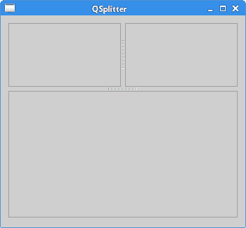
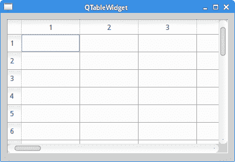

# Qt4 小部件 II

> 原文： [http://zetcode.com/gui/qt4/widgets2/](http://zetcode.com/gui/qt4/widgets2/)

在 Qt4 C++ 编程教程的这一部分中，我们将继续讨论 Qt4 小部件。

## `QCheckBox`

`QCheckBox`是具有两种状态的窗口小部件：开和关。 这是一个带有标签的盒子。 如果选中此复选框，则在方框中用勾号表示。

在我们的示例中，我们在窗口上显示一个复选框。 如果选中此复选框，则显示窗口标题。 否则它是隐藏的。

`checkbox.h`

```
#pragma once

#include <QWidget>

class CheckBox : public QWidget {

  Q_OBJECT

  public:
    CheckBox(QWidget *parent = 0);

  private slots:
    void showTitle(int);
};

```

这是我们的代码示例的头文件。

`checkbox.cpp`

```
#include "checkbox.h"
#include <QCheckBox>
#include <QHBoxLayout>

CheckBox::CheckBox(QWidget *parent)
    : QWidget(parent) {

  QHBoxLayout *hbox = new QHBoxLayout(this);

  QCheckBox *cb = new QCheckBox("Show Title", this);
  cb->setCheckState(Qt::Checked);
  hbox->addWidget(cb, 0, Qt::AlignLeft | Qt::AlignTop);

  connect(cb, SIGNAL(stateChanged(int)), this, SLOT(showTitle(int)));
}

void CheckBox::showTitle(int state) {

  if (state == Qt::Checked) {
    setWindowTitle("QCheckBox");
  } else {
    setWindowTitle(" ");
  }
}

```

我们在窗口上显示一个复选框，并将其连接到`showTitle()`槽。

```
cb->setCheckState(Qt::Checked);

```

示例开始时，该复选框已选中。

```
void CheckBox::showTitle(int state) {

  if (state == Qt::Checked) {
    setWindowTitle("QCheckBox");
  } else {
    setWindowTitle(" ");
  }
}

```

我们确定复选框的状态，并相应地调用`setWindowTitle()`。

`main.cpp`

```
#include "checkbox.h"
#include <QApplication>

int main(int argc, char *argv[]) {

  QApplication app(argc, argv);  

  CheckBox window;

  window.resize(250, 150);
  window.setWindowTitle("QCheckBox");
  window.show();

  return app.exec();
}

```

这是主文件。


Figure: QCheckBox

## `QListWidget`

`QListWidget`是一个小部件，用于显示项目列表。 在我们的示例中，我们将演示如何在列表小部件中添加，重命名和删除项目。

`listwidget.h`

```
#pragma once

#include <QWidget>
#include <QPushButton>
#include <QListWidget>

class ListWidget : public QWidget {

  Q_OBJECT

  public:
    ListWidget(QWidget *parent = 0);

  private slots:
    void addItem();
    void renameItem();
    void removeItem();
    void clearItems();

  private:
    QListWidget *lw;
    QPushButton *add;
    QPushButton *rename;
    QPushButton *remove;
    QPushButton *removeAll;

};

```

该示例的头文件。

`listwidget.cpp`

```
#include "listwidget.h"
#include <QVBoxLayout>
#include <QInputDialog>

ListWidget::ListWidget(QWidget *parent)
    : QWidget(parent) {

  QVBoxLayout *vbox = new QVBoxLayout();
  vbox->setSpacing(10);

  QHBoxLayout *hbox = new QHBoxLayout(this);

  lw = new QListWidget(this);
  lw->addItem("The Omen"); 
  lw->addItem("The Exorcist");
  lw->addItem("Notes on a scandal");
  lw->addItem("Fargo");
  lw->addItem("Capote");

  add = new QPushButton("Add", this);
  rename = new QPushButton("Rename", this);
  remove = new QPushButton("Remove", this);
  removeAll = new QPushButton("Remove All", this);

  vbox->setSpacing(3);
  vbox->addStretch(1);
  vbox->addWidget(add);
  vbox->addWidget(rename);
  vbox->addWidget(remove);
  vbox->addWidget(removeAll);
  vbox->addStretch(1);

  hbox->addWidget(lw);
  hbox->addSpacing(15);
  hbox->addLayout(vbox);

  connect(add, SIGNAL(clicked()), this, SLOT(addItem()));
  connect(rename, SIGNAL(clicked()), this, SLOT(renameItem()));
  connect(remove, SIGNAL(clicked()), this, SLOT(removeItem()));
  connect(removeAll, SIGNAL(clicked()), this, SLOT(clearItems()));

  setLayout(hbox);
}

void ListWidget::addItem() {

  QString c_text = QInputDialog::getText(this, "Item", "Enter new item");
  QString s_text = c_text.simplified();

  if (!s_text.isEmpty()) {

    lw->addItem(s_text);
    int r = lw->count() - 1;
    lw->setCurrentRow(r);
  }
}

void ListWidget::renameItem() {

  QListWidgetItem *curitem = lw->currentItem();

  int r = lw->row(curitem);
  QString c_text = curitem->text();
  QString r_text = QInputDialog::getText(this, "Item", 
      "Enter new item", QLineEdit::Normal, c_text);

  QString s_text = r_text.simplified();

  if (!s_text.isEmpty()) {

    QListWidgetItem *item = lw->takeItem(r);
    delete item;
    lw->insertItem(r, s_text);
    lw->setCurrentRow(r);
  }
}

void ListWidget::removeItem() {

  int r = lw->currentRow();

  if (r != -1) {

    QListWidgetItem *item = lw->takeItem(r);
    delete item;
  }
}

void ListWidget::clearItems(){

  if (lw->count() != 0) {
    lw->clear();
  }
}

```

我们显示一个列表小部件和四个按钮。 我们将使用这些按钮在列表小部件中添加，重命名和删除项目。

```
lw = new QListWidget(this);
lw->addItem("The Omen"); 
lw->addItem("The Exorcist");
lw->addItem("Notes on a scandal");
lw->addItem("Fargo");
lw->addItem("Capote);

```

创建`QListWidget`，并填充五个项目。

```
void ListWidget::addItem() {

  QString c_text = QInputDialog::getText(this, "Item", "Enter new item");
  QString s_text = c_text.simplified();

  if (!s_text.isEmpty()) {

    lw->addItem(s_text);
    int r = lw->count() - 1;
    lw->setCurrentRow(r);
  }
}

```

`addItem()`方法将一个新项目添加到列表小部件。 该方法会弹出一个输入对话框。 该对话框返回一个字符串值。 我们使用`simplified()`方法从字符串中删除可能的空格。 如果返回的字符串不为空，则将其添加到列表末尾的列表小部件中。 最后，我们使用`setCurrentRow()`方法突出显示当前插入的项目。

```
void ListWidget::renameItem() {

  QListWidgetItem *curitem = lw->currentItem();

  int r = lw->row(curitem);
  QString c_text = curitem->text();
  QString r_text = QInputDialog::getText(this, "Item", 
      "Enter new item", QLineEdit::Normal, c_text);

  QString s_text = r_text.simplified();

  if (!s_text.isEmpty()) {

    QListWidgetItem *item = lw->takeItem(r);
    delete item;
    lw->insertItem(r, s_text);
    lw->setCurrentRow(r);
  }
}

```

重命名项目包括几个步骤。 首先，我们使用`currentItem()`方法获取当前项目。 我们得到项目的文本和项目所在的行。 该项目的文本显示在`QInputDialog`对话框中。 从对话框返回的字符串由`simplified()`方法处理，以删除潜在的空格。 然后，我们使用`takeItem()`方法删除旧项目，然后将其替换为`insertItem()`方法。 我们删除了`takeItem()`方法删除的项目，因为删除的项目不再由 Qt 管理。 最后，`setCurrentRow()`选择新项目。

```
void ListWidget::removeItem() {

  int r = lw->currentRow();

  if (r != -1) {

    QListWidgetItem *item = lw->takeItem(r);
    delete item;
  }
}

```

`removeItem()`从列表中删除特定项目。 首先，我们使用`currentRow()`方法获得当前选中的行。 （如果没有更多的行，则返回-1。）使用`takeItem()`方法删除当前选择的项目。

```
void ListWidget::clearItems(){

  if (lw->count() != 0) {
    lw->clear();
  }
}

```

`clear()`方法从列表小部件中删除所有项目。

`main.cpp`

```
#include "listwidget.h"
#include <QApplication>

int main(int argc, char *argv[]) {

  QApplication app(argc, argv);  

  ListWidget window;

  window.setWindowTitle("QListWidget");
  window.show();

  return app.exec();
}

```

这是主文件。


Figure: QListWidget

## `QPixmap`

`QPixmap`是用于处理图像的小部件之一。 它经过优化，可在屏幕上显示图像。 在我们的代码示例中，我们将使用`QPixmap`在窗口上显示图像。

`pixmap.h`

```
#pragma once

#include <QWidget>

class Pixmap : public QWidget {

  public:
    Pixmap(QWidget *parent = 0);
};

```

该示例的头文件。

`pixmap.cpp`

```
#include <QPixmap>
#include <QLabel>
#include <QHBoxLayout>
#include "pixmap.h"

Pixmap::Pixmap(QWidget *parent)
    : QWidget(parent) {

  QHBoxLayout *hbox = new QHBoxLayout(this);

  QPixmap pixmap("bojnice.jpg");

  QLabel *label = new QLabel(this);
  label->setPixmap(pixmap);

  hbox->addWidget(label, 0, Qt::AlignTop);
}

```

我们显示了位于斯洛伐克中部的一座著名城堡的图像。

```
QPixmap pixmap("bojnice.jpg");

QLabel *label = new QLabel(this);
label->setPixmap(pixmap);

```

我们创建一个像素图并将其放在标签小部件中。

`main.cpp`

```
#include <QApplication>
#include "pixmap.h"

int main(int argc, char *argv[]) {

  QApplication app(argc, argv);  

  Pixmap window;

  window.setWindowTitle("QPixmap");
  window.show();

  return app.exec();
}

```

这是主文件。

## `QSplitter`

`QSplitter`允许用户通过拖动子控件之间的边界来控制子控件的大小。 在我们的示例中，我们显示了由两个拆分器组成的三个`QFrame`小部件。

`splitter.h`

```
#pragma once

#include <QWidget>

class Splitter : public QWidget {

  public:
    Splitter(QWidget *parent = 0);
};

```

该示例的头文件。

`splitter.cpp`

```
#include <QFrame>
#include <QSplitter>
#include <QHBoxLayout>
#include "splitter.h"

Splitter::Splitter(QWidget *parent)
    : QWidget(parent) {

  QHBoxLayout *hbox = new QHBoxLayout(this);

  QFrame *topleft = new QFrame(this);
  topleft->setFrameShape(QFrame::StyledPanel);

  QFrame *topright = new QFrame(this);
  topright->setFrameShape(QFrame::StyledPanel);

  QSplitter *splitter1 = new QSplitter(Qt::Horizontal, this);
  splitter1->addWidget(topleft);
  splitter1->addWidget(topright);

  QFrame *bottom = new QFrame(this);
  bottom->setFrameShape(QFrame::StyledPanel);

  QSplitter *splitter2 = new QSplitter(Qt::Vertical, this);
  splitter2->addWidget(splitter1);
  splitter2->addWidget(bottom);

  QList<int> sizes({50, 100});
  splitter2->setSizes(sizes);

  hbox->addWidget(splitter2);
}

```

在示例中，我们有三个框架小部件和两个拆分器小部件。

```
QSplitter *splitter1 = new QSplitter(Qt::Horizontal, this);
splitter1->addWidget(topleft);
splitter1->addWidget(topright);

```

我们创建一个拆分器小部件，并将两个框架小部件添加到拆分器中。

```
QSplitter *splitter2 = new QSplitter(Qt::Vertical, this);
splitter2->addWidget(splitter1);

```

我们还可以将拆分器添加到另一个拆分器小部件。

```
QList<int> sizes({50, 100});
splitter2->setSizes(sizes);

```

使用`setSizes()`方法，我们设置拆分器的子窗口小部件的大小。

`main.cpp`

```
#include <QDesktopWidget>
#include <QApplication>
#include "splitter.h"

int main(int argc, char *argv[]) {

  QApplication app(argc, argv);  

  Splitter window;

  window.resize(350, 300);
  window.setWindowTitle("QSplitter");
  window.show();

  return app.exec();
}

```

这是主文件。



Figure: QSplitter

在某些桌面主题中，拆分器可能无法很好地显示。

## `QTableWidget`

`QTableWidget`是电子表格应用中使用的唯一窗口小部件。 （也称为网格小部件）。 它是较复杂的小部件之一。 在这里，我们仅在窗口上显示小部件。

`table.h`

```
#pragma once

#include <QWidget>

class Table : public QWidget {

  public:
    Table(QWidget *parent = 0);
};

```

该示例的头文件。

`table.cpp`

```
#include <QHBoxLayout>
#include <QTableWidget>
#include "table.h"

Table::Table(QWidget *parent)
    : QWidget(parent) {

  QHBoxLayout *hbox = new QHBoxLayout(this);

  QTableWidget *table = new QTableWidget(25, 25, this);

  hbox->addWidget(table);
}

```

该示例在窗口上显示`QTableWidget`。

```
QTableWidget *table = new QTableWidget(25, 25, this);

```

在这里，我们创建具有 25 行 25 列的表小部件。

`main.cpp`

```
#include <QApplication>
#include "table.h"

int main(int argc, char *argv[]) {

  QApplication app(argc, argv);  

  Table window;

  window.resize(400, 250);
  window.setWindowTitle("QTableWidget");
  window.show();

  return app.exec();
}

```

这是主文件。



Figure: QTableWidget

在本章中，我们描述了其他几个 Qt4 小部件。