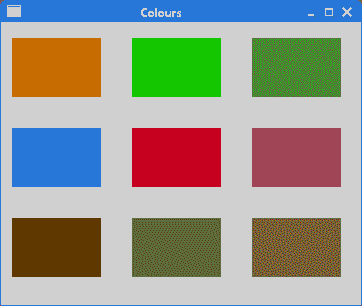
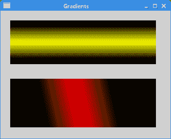

# Qt4 中的绘图

> 原文： [http://zetcode.com/gui/qt4/painting/](http://zetcode.com/gui/qt4/painting/)

在 Qt4 C++ 编程教程的这一部分中，我们将做一些绘图。

当我们在 Qt4 中进行绘图时，`QPainter`类非常有用。 对`paintEvent()`方法的反应是使用`QPainter`类完成的。

## 直线

在第一个示例中，我们将在窗口的客户区域上绘制一些线。

`lines.h`

```cpp
#pragma once

#include <QWidget>

class Lines : public QWidget {

  public:
    Lines(QWidget *parent = 0);

  protected:
    void paintEvent(QPaintEvent *event);
    void drawLines(QPainter *qp);
};

```

这是头文件。

`lines.cpp`

```cpp
#include <QPainter>
#include "lines.h"

Lines::Lines(QWidget *parent) : QWidget(parent)
{ }

void Lines::paintEvent(QPaintEvent *e) {

  Q_UNUSED(e);

  QPainter qp(this);
  drawLines(&qp);
}

void Lines::drawLines(QPainter *qp) {

  QPen pen(Qt::black, 2, Qt::SolidLine);  
  qp->setPen(pen);
  qp->drawLine(20, 40, 250, 40);

  pen.setStyle(Qt::DashLine);
  qp->setPen(pen);
  qp->drawLine(20, 80, 250, 80);

  pen.setStyle(Qt::DashDotLine);
  qp->setPen(pen);
  qp->drawLine(20, 120, 250, 120);

  pen.setStyle(Qt::DotLine);
  qp->setPen(pen);
  qp->drawLine(20, 160, 250, 160);

  pen.setStyle(Qt::DashDotDotLine);
  qp->setPen(pen);
  qp->drawLine(20, 200, 250, 200);

  QVector<qreal> dashes;
  qreal space = 4;

  dashes << 1 << space << 5 << space;

  pen.setStyle(Qt::CustomDashLine);
  pen.setDashPattern(dashes);

  qp->setPen(pen);
  qp->drawLine(20, 240, 250, 240);
}

```

我们在窗口上画了六行； 每条线都有不同的笔样式。

```cpp
void Lines::paintEvent(QPaintEvent *e) {

  Q_UNUSED(e);

  QPainter qp(this);
  drawLines(&qp);
}

```

更新小部件时将调用`paintEvent()`。 在这里我们创建`QPainter`对象并进行绘制。 由于我们不使用`QPaintEvent`对象，因此可以通过`Q_UNUSED`宏来抑制编译器警告。 实际图形委托给`drawLines()`方法。

```cpp
QPen pen(Qt::black, 2, Qt::SolidLine);
qp->setPen(pen);

```

我们创建一个`QPen`对象。 笔是实心的，2px 粗，是黑色的。 笔用于绘制线条和形状轮廓。 使用`setPen()`方法将笔设置为画家对象。

```cpp
qp->drawLine(20, 40, 250, 40);

```

`drawLine()`方法画一条线。 四个参数是窗口上两个点的坐标。

```cpp
pen.setStyle(Qt::DashLine);

```

`QPen`行的`setStyle()`方法设置笔样式-`Qt::DashLine`。

`main.cpp`

```cpp
#include <QApplication>
#include "lines.h"

int main(int argc, char *argv[]) {

  QApplication app(argc, argv);  

  Lines window;

  window.resize(280, 270);
  window.setWindowTitle("Lines");
  window.show();

  return app.exec();
}

```

这是主文件。


图：直线

## 色彩

颜色是代表红色，绿色和蓝色（RGB）强度值的组合的对象。 有效的 RGB 值在 0 到 255 之间。在下面的示例中，我们绘制了九个矩形，其中填充了九种不同的颜色。

`colours.h`

```cpp
#pragma once 

#include <QWidget>

class Colours : public QWidget {

  Q_OBJECT  

  public:
    Colours(QWidget *parent = 0);

  protected:
    void paintEvent(QPaintEvent *);
    void drawColouredRectangles(QPainter &);
};

```

这是头文件。

`colours.cpp`

```cpp
#include <QPainter>
#include "colours.h"

Colours::Colours(QWidget *parent) : QWidget(parent)
{ }

void Colours::paintEvent(QPaintEvent *e) {

  Q_UNUSED(e);  

  QPainter qp(this);

  drawColouredRectangles(qp);
}

void Colours::drawColouredRectangles(QPainter &qp) {

  qp.setPen(QColor("#d4d4d4"));

  qp.setBrush(QBrush("#c56c00"));
  qp.drawRect(10, 15, 90, 60);

  qp.setBrush(QBrush("#1ac500"));
  qp.drawRect(130, 15, 90, 60);

  qp.setBrush(QBrush("#539e47"));
  qp.drawRect(250, 15, 90, 60);

  qp.setBrush(QBrush("#004fc5"));
  qp.drawRect(10, 105, 90, 60);

  qp.setBrush(QBrush("#c50024"));
  qp.drawRect(130, 105, 90, 60);

  qp.setBrush(QBrush("#9e4757"));
  qp.drawRect(250, 105, 90, 60);

  qp.setBrush(QBrush("#5f3b00"));
  qp.drawRect(10, 195, 90, 60);

  qp.setBrush(QBrush("#4c4c4c"));
  qp.drawRect(130, 195, 90, 60);

  qp.setBrush(QBrush("#785f36"));
  qp.drawRect(250, 195, 90, 60);
}

```

我们绘制九个不同颜色填充的矩形。 矩形的轮廓是灰色的。

```cpp
qp.setBrush(QBrush("#c56c00"));
qp.drawRect(10, 15, 90, 60);

```

`QBrush`类定义`QPainter`绘制的形状的填充图案。 `drawRect()`方法绘制一个矩形。 它绘制一个矩形，其左上角位于 x，y 点，并具有给定的宽度和高度。 我们使用十六进制表示法来指定颜色值。

`main.cpp`

```cpp
#include <QApplication>
#include "colours.h"

int main(int argc, char *argv[]) {

  QApplication app(argc, argv);  

  Colours window;

  window.resize(360, 280);
  window.setWindowTitle("Colours");
  window.show();

  return app.exec();
}

```

这是主文件。



Figure: Colours

## 图案

以下编程代码示例与上一个示例相似。 这次我们用各种预定义的图案填充矩形。

`patterns.h`

```cpp
#pragma once

#include <QWidget>

class Patterns : public QWidget {

  public:
    Patterns(QWidget *parent = 0);

  protected:
    void paintEvent(QPaintEvent *);
    void drawRectangles(QPainter &);
};

```

头文件。

`patterns.cpp`

```cpp
#include <QApplication>
#include <QPainter>
#include "patterns.h"

Patterns::Patterns(QWidget *parent) : QWidget(parent)
{ }

void Patterns::paintEvent(QPaintEvent *e) {

  Q_UNUSED(e);  

  QPainter qp(this);

  drawRectangles(qp);
}

void Patterns::drawRectangles(QPainter &qp) {

  qp.setPen(Qt::NoPen);

  qp.setBrush(Qt::HorPattern);
  qp.drawRect(10, 15, 90, 60);

  qp.setBrush(Qt::VerPattern);
  qp.drawRect(130, 15, 90, 60);

  qp.setBrush(Qt::CrossPattern);
  qp.drawRect(250, 15, 90, 60);

  qp.setBrush(Qt::Dense7Pattern);
  qp.drawRect(10, 105, 90, 60);

  qp.setBrush(Qt::Dense6Pattern);
  qp.drawRect(130, 105, 90, 60);

  qp.setBrush(Qt::Dense5Pattern);
  qp.drawRect(250, 105, 90, 60);

  qp.setBrush(Qt::BDiagPattern);
  qp.drawRect(10, 195, 90, 60);

  qp.setBrush(Qt::FDiagPattern);
  qp.drawRect(130, 195, 90, 60);

  qp.setBrush(Qt::DiagCrossPattern);
  qp.drawRect(250, 195, 90, 60);
}

```

我们用各种画笔图案绘制了九个矩形。

```cpp
qp.setBrush(Qt::HorPattern);
qp.drawRect(10, 15, 90, 60);

```

我们绘制具有特定图案的矩形。 `Qt::HorPattern`是用于创建水平线条图案的常数。

`main.cpp`

```cpp
#include <QApplication>
#include "patterns.h"

int main(int argc, char *argv[]) {

  QApplication app(argc, argv);  

  Patterns window;

  window.resize(350, 280);
  window.setWindowTitle("Patterns");
  window.show();

  return app.exec();
}

```

这是主文件。


图：图案

## 甜甜圈

在下面的示例中，我们将创建一个甜甜圈形状。

`donut.h`

```cpp
#pragma once

#include <QWidget>

class Donut : public QWidget {

  Q_OBJECT  

  public:
    Donut(QWidget *parent = 0);

  protected:
    void paintEvent(QPaintEvent *);
    void drawDonut(QPainter &);
};

```

这是头文件。

`donut.cpp`

```cpp
#include <QApplication>
#include <QPainter>
#include "donut.h"

Donut::Donut(QWidget *parent) : QWidget(parent)
{ }

void Donut::paintEvent(QPaintEvent *e) {

  Q_UNUSED(e);

  QPainter qp(this);

  drawDonut(qp);
}

void Donut::drawDonut(QPainter &qp) {

  qp.setPen(QPen(QBrush("#535353"), 0.5));
  qp.setRenderHint(QPainter::Antialiasing);

  int h = height();
  int w = width();

  qp.translate(QPoint(w/2, h/2));

  for (qreal rot=0; rot < 360.0; rot+=5.0 ) {
      qp.drawEllipse(-125, -40, 250, 80);
      qp.rotate(5.0);
  }
}

```

“甜甜圈”是类似于此类食物的高级几何形状。 我们通过绘制 72 个旋转椭圆来创建它。

```cpp
qp.setRenderHint(QPainter::Antialiasing);

```

我们将以抗锯齿模式绘制。 渲染将具有更高的质量。

```cpp
int h = height();
int w = width();

qp.translate(QPoint(w/2, h/2));

```

这些行将坐标系的起点移到窗口的中间。 默认情况下，它位于 0、0 点。 换句话说，在窗口的左上角。 通过移动坐标系，绘图会容易得多。

```cpp
for (qreal rot=0; rot < 360.0; rot+=5.0 ) {
    qp.drawEllipse(-125, -40, 250, 80);
    qp.rotate(5.0);
}

```

在此循环中，我们绘制了 72 个旋转的椭圆。

`main.cpp`

```cpp
#include <QApplication>
#include "donut.h"

int main(int argc, char *argv[]) {

  QApplication app(argc, argv);  

  Donut window;

  window.resize(350, 280);  
  window.setWindowTitle("Donut");
  window.show();

  return app.exec();
}

```

这是主文件。

## 形状

Qt4 绘图 API 可以绘制各种形状。 以下编程代码示例显示了其中一些。

`shapes.h`

```cpp
#pragma once

#include <QWidget>

class Shapes : public QWidget {

  Q_OBJECT  

  public:
    Shapes(QWidget *parent = 0);

  protected:
    void paintEvent(QPaintEvent *e);
};

```

这是头文件。

`shapes.cpp`

```cpp
#include <QApplication>
#include <QPainter>
#include <QPainterPath>
#include "shapes.h"

Shapes::Shapes(QWidget *parent)
    : QWidget(parent)
{ }

void Shapes::paintEvent(QPaintEvent *e) {

  Q_UNUSED(e);

  QPainter painter(this);

  painter.setRenderHint(QPainter::Antialiasing);
  painter.setPen(QPen(QBrush("#888"), 1));
  painter.setBrush(QBrush(QColor("#888")));

  QPainterPath path1;

  path1.moveTo(5, 5);
  path1.cubicTo(40, 5,  50, 50,  99, 99);
  path1.cubicTo(5, 99,  50, 50,  5, 5);
  painter.drawPath(path1);  

  painter.drawPie(130, 20, 90, 60, 30*16, 120*16);
  painter.drawChord(240, 30, 90, 60, 0, 16*180);
  painter.drawRoundRect(20, 120, 80, 50);

  QPolygon polygon({QPoint(130, 140), QPoint(180, 170), QPoint(180, 140),
      QPoint(220, 110), QPoint(140, 100)});

  painter.drawPolygon(polygon);

  painter.drawRect(250, 110, 60, 60);

  QPointF baseline(20, 250);
  QFont font("Georgia", 55);
  QPainterPath path2;
  path2.addText(baseline, font, "Q");
  painter.drawPath(path2);

  painter.drawEllipse(140, 200, 60, 60);
  painter.drawEllipse(240, 200, 90, 60);
}

```

我们绘制了九种不同的形状。

```cpp
QPainterPath path1;

path1.moveTo(5, 5);
path1.cubicTo(40, 5,  50, 50,  99, 99);
path1.cubicTo(5, 99,  50, 50,  5, 5);
painter.drawPath(path1);

```

`QPainterPath`是用于创建复杂形状的对象。 我们用它来绘制贝塞尔曲线。

```cpp
painter.drawPie(130, 20, 90, 60, 30*16, 120*16);
painter.drawChord(240, 30, 90, 60, 0, 16*180);
painter.drawRoundRect(20, 120, 80, 50);

```

这些代码行绘制了一个饼图，一个和弦和一个圆角矩形。

```cpp
QPolygon polygon({QPoint(130, 140), QPoint(180, 170), QPoint(180, 140),
    QPoint(220, 110), QPoint(140, 100)});

painter.drawPolygon(polygon);

```

在这里，我们使用`drawPolygon()`方法绘制一个多边形。 多边形由五个点组成。

```cpp
QPointF baseline(20, 250);
QFont font("Georgia", 55);
QPainterPath path2;
path2.addText(baseline, font, "Q");
painter.drawPath(path2);

```

Qt4 允许基于字体字符创建路径。

```cpp
painter.drawEllipse(140, 200, 60, 60);
painter.drawEllipse(240, 200, 90, 60);

```

`drawEllipse()`也会绘制一个椭圆和一个圆。 圆是椭圆的特例。 参数是矩形起点的 x 和 y 坐标以及椭圆边界矩形的宽度和高度。

`main.cpp`

```cpp
#include <QApplication>
#include "shapes.h"

int main(int argc, char *argv[]) {

  QApplication app(argc, argv);  

  Shapes window;

  window.resize(350, 280);  
  window.setWindowTitle("Shapes");
  window.show();

  return app.exec();
}

```

这是示例的主文件。


图：形状

## 渐变色

在计算机图形学中，渐变是从浅到深或从一种颜色到另一种颜色的阴影的平滑混合。 在 2D 绘图程序和绘图程序中，渐变用于创建彩色背景和特殊效果以及模拟灯光和阴影。

以下代码示例显示了如何创建线性渐变。

`gradients.h`

```cpp
#pragma once

#include <QWidget>

class Gradient : public QWidget {

  public:
    Gradient(QWidget *parent = 0);

  protected:
    void paintEvent(QPaintEvent *e);
};

```

这是头文件。

`gradients.cpp`

```cpp
#include <QApplication>
#include <QPainter>
#include "gradients.h"

Gradient::Gradient(QWidget *parent)
    : QWidget(parent)
{ }

void Gradient::paintEvent(QPaintEvent *e) {

  Q_UNUSED(e);

  QPainter painter(this);

  QLinearGradient grad1(0, 20, 0, 110);

  grad1.setColorAt(0.1, Qt::black);
  grad1.setColorAt(0.5, Qt::yellow);
  grad1.setColorAt(0.9, Qt::black);

  painter.fillRect(20, 20, 300, 90, grad1);

  QLinearGradient grad2(0, 55, 250, 0);

  grad2.setColorAt(0.2, Qt::black);
  grad2.setColorAt(0.5, Qt::red);
  grad2.setColorAt(0.8, Qt::black);

  painter.fillRect(20, 140, 300, 100, grad2);
}

```

在代码示例中，我们绘制了两个矩形，并用线性渐变填充它们。

```cpp
QLinearGradient grad1(0, 20, 0, 110);

```

`QLinearGradient`构造线性梯度，并在两个点之间作为参数提供插值区域。

```cpp
grad1.setColorAt(0.1, Qt::black);
grad1.setColorAt(0.5, Qt::yellow);
grad1.setColorAt(0.9, Qt::black);

```

使用停止点定义渐变中的颜色。 `setColorAt()`在给定位置以给定颜色创建一个停止点。

```cpp
painter.fillRect(20, 20, 300, 90, grad1);

```

我们用渐变填充矩形。

`main.cpp`

```cpp
#include <QApplication>
#include "gradients.h"

int main(int argc, char *argv[]) {

  QApplication app(argc, argv);  

  Gradient window;

  window.resize(350, 260);  
  window.setWindowTitle("Gradients");
  window.show();

  return app.exec();
}

```

这是主文件。



图：渐变

## 径向渐变

径向渐变是两个圆之间颜色或阴影的混合。

`radial_gradient.h`

```cpp
#pragma once

#include <QWidget>

class RadialGradient : public QWidget {

  public:
    RadialGradient(QWidget *parent = 0);

  protected:
    void paintEvent(QPaintEvent *e);
};

```

这是头文件。

`radial_gradient.cpp`

```cpp
#include <QApplication>
#include <QPainter>
#include "radial_gradient.h"

RadialGradient::RadialGradient(QWidget *parent)
    : QWidget(parent)
{ }

void RadialGradient::paintEvent(QPaintEvent *e) {

  Q_UNUSED(e);

  QPainter painter(this);

  int h = height();
  int w = width();

  QRadialGradient grad1(w/2, h/2, 80);

  grad1.setColorAt(0, QColor("#032E91"));
  grad1.setColorAt(0.3, Qt::white);
  grad1.setColorAt(1, QColor("#032E91"));

  painter.fillRect(0, 0, w, h, grad1);
}

```

该示例创建了一个径向渐变； 渐变从窗口的中心扩散。

```cpp
QRadialGradient grad1(w/2, h/2, 80);

```

`QRadialGradient`创建一个径向渐变； 它在焦点和围绕它的圆上的端点之间插入颜色。 参数是圆心和半径的坐标。 焦点位于圆的中心。

```cpp
grad1.setColorAt(0, QColor("#032E91"));
grad1.setColorAt(0.3, Qt::white);
grad1.setColorAt(1, QColor("#032E91"));

```

`setColorAt()`方法定义彩色挡块。

```cpp
painter.fillRect(0, 0, w, h, grad1);

```

窗口的整个区域都充满了径向渐变。

`main.cpp`

```cpp
#include <QApplication>
#include "radial_gradient.h"

int main(int argc, char *argv[]) {

  QApplication app(argc, argv);  

  RadialGradient window;

  window.resize(300, 250);  
  window.setWindowTitle("Radial gradient");
  window.show();

  return app.exec();
}

```

这是主文件。


Figure: Radial gradient

## 泡泡

在本 C++  Qt4 教程章节的最后一个示例中，我们创建一个泡泡效果。 该示例显示一个不断增长的居中文本，该文本从某个点逐渐淡出。 这是一种非常常见的效果，您通常可以在网络上的 Flash 动画中看到这种效果。

`puff.h`

```cpp
#pragma once

#include <QWidget>

class Puff : public QWidget {

  Q_OBJECT  

  public:
    Puff(QWidget *parent = 0);

  protected:
    void paintEvent(QPaintEvent *event);
    void timerEvent(QTimerEvent *event);

  private:
    int x;
    qreal opacity;
    int timerId;
};

```

在头文件中，我们定义了两个事件处理程序：绘图事件处理程序和计时器处理程序。

`puff.cpp`

```cpp
#include <QPainter>
#include <QTimer>
#include <QTextStream>
#include "puff.h"

Puff::Puff(QWidget *parent)
    : QWidget(parent) {

  x = 1;
  opacity = 1.0;
  timerId = startTimer(15);
}

void Puff::paintEvent(QPaintEvent *e) {

  Q_UNUSED(e);  

  QPainter painter(this);
  QTextStream out(stdout);

  QString text = "ZetCode";

  painter.setPen(QPen(QBrush("#575555"), 1));

  QFont font("Courier", x, QFont::DemiBold);
  QFontMetrics fm(font);
  int textWidth = fm.width(text);

  painter.setFont(font);

  if (x > 10) {
    opacity -= 0.01;
    painter.setOpacity(opacity);
  }

  if (opacity <= 0) {
    killTimer(timerId);
    out << "timer stopped" << endl;
  }

  int h = height();
  int w = width();

  painter.translate(QPoint(w/2, h/2));
  painter.drawText(-textWidth/2, 0, text);
}

void Puff::timerEvent(QTimerEvent *e) {

  Q_UNUSED(e);

  x += 1;
  repaint();
}

```

这是`puff.cpp`文件。

```cpp
Puff::Puff(QWidget *parent)
    : QWidget(parent) {

  x = 1;
  opacity = 1.0;
  timerId = startTimer(15);
}

```

在构造函数中，我们启动计时器。 每 15ms 会生成一个计时器事件。

```cpp
void Puff::timerEvent(QTimerEvent *e) {

  Q_UNUSED(e);

  x += 1;
  repaint();
}

```

在`timerEvent()`内，我们增加字体大小并重新绘制小部件。

```cpp
if (x > 10) {
  opacity -= 0.01;
  painter.setOpacity(opacity);
}

```

如果字体大小大于 10 磅，我们将逐渐降低不透明度； 文字开始消失。

```cpp
if (opacity <= 0) {
  killTimer(timerId);
  out << "timer stopped" << endl;
}

```

如果文字完全消失，我们将杀死计时器。

`main.cpp`

```cpp
#include <QApplication>
#include "puff.h"

int main(int argc, char *argv[]) {

  QApplication app(argc, argv); 

  Puff window;

  window.resize(350, 280);
  window.setWindowTitle("Puff");
  window.show();

  return app.exec();
}

```

这是主文件。

本章是关于 Qt4 中的绘图的。