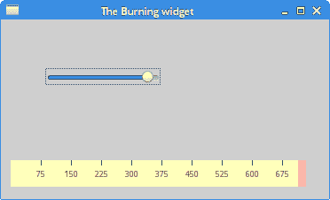

# Qt4 中的自定义小部件

> 原文： [http://zetcode.com/gui/qt4/customwidget/](http://zetcode.com/gui/qt4/customwidget/)

在 Qt4 C ++编程教程的这一部分中，我们将创建一个自定义窗口小部件。

大多数工具箱通常仅提供最常用的小部件，例如按钮，文本小部件或滑块。 没有工具包可以提供所有可能的小部件。 程序员必须自己创建此类小部件。 他们使用工具箱提供的绘图工具来完成此任务。 有两种可能：程序员可以修改或增强现有的小部件，或者可以从头开始创建自定义小部件。

## 燃烧小部件

在下一个示例中，我们创建一个自定义的 Burning 小部件。 可以在 Nero 或 K3B 之类的应用程序中看到此小部件。 该小部件将从头开始创建。

`burning.h`

```
#pragma once

#include <QWidget>
#include <QSlider>
#include <QFrame>
#include "widget.h"

class Burning : public QFrame {

  Q_OBJECT  

  public:
    Burning(QWidget *parent = 0);
    int getCurrentWidth();

  public slots:
    void valueChanged(int);

  private:
    QSlider *slider;
    Widget *widget;
    int cur_width;

    void initUI();
};

```

这是示例主窗口的头文件。

```
public:
  Burning(QWidget *parent = 0);
  int getCurrentWidth();

```

`getCurrentWidth()`方法将用于确定滑块值。

```
private:
  QSlider *slider;
  Widget *widget;
  int cur_width;

  void initUI();

```

窗口的工作区上将有两个小部件：内置滑块小部件和自定义小部件。 `cur_width`变量将保存滑块中的当前值。 绘制自定义窗口小部件时使用此值。

`burning.cpp`

```
#include <QtGui>
#include "burning.h"

Burning::Burning(QWidget *parent)
    : QFrame(parent) {

  initUI();
}

void Burning::initUI() {

  const int MAX_VALUE = 750; 
  cur_width = 0; 

  slider = new QSlider(Qt::Horizontal , this); 
  slider->setMaximum(MAX_VALUE);
  slider->setGeometry(50, 50, 130, 30);

  connect(slider, SIGNAL(valueChanged(int)), 
          this, SLOT(valueChanged(int)));

  QVBoxLayout *vbox = new QVBoxLayout(this);
  QHBoxLayout *hbox = new QHBoxLayout();

  vbox->addStretch(1);

  widget = new Widget(this);  
  hbox->addWidget(widget, 0);

  vbox->addLayout(hbox);

  setLayout(vbox);    
}

void Burning::valueChanged(int val) {

  cur_width = val;
  widget->repaint();
}

int Burning::getCurrentWidth() {

  return cur_width;
}

```

在这里，我们构建示例的主窗口。

```
connect(slider, SIGNAL(valueChanged(int)), 
        this, SLOT(valueChanged(int)));

```

当我们移动滑块时，将执行`valueChanged()`插槽。

```
void Burning::valueChanged(int val) {

  cur_width = val;
  widget->repaint();
}

```

更改滑块的值时，我们将存储新值并重新绘制自定义窗口小部件。

`widget.h`

```
#pragma once

#include <QFrame>

class Burning;

class Widget : public QFrame {

  Q_OBJECT  

  public:
    Widget(QWidget *parent = 0);

  protected:
    void paintEvent(QPaintEvent *e);
    void drawWidget(QPainter &qp);

  private:
    QWidget *m_parent;
    Burning *burn;
};

```

这是自定义刻录窗口小部件的头文件。

```
private:
  QWidget *m_parent;
  Burning *burn;

```

我们存储一个指向父窗口小部件的指针。 我们通过该指针获得`cur_width`。

`widget.cpp`

```
#include <QtGui>
#include "widget.h"
#include "burning.h"

const int PANEL_HEIGHT = 30;

Widget::Widget(QWidget *parent)
    : QFrame(parent) {

  m_parent = parent;
  setMinimumHeight(PANEL_HEIGHT);
}

void Widget::paintEvent(QPaintEvent *e) {

  QPainter qp(this);
  drawWidget(qp);

  QFrame::paintEvent(e);  
}

void Widget::drawWidget(QPainter &qp) {

  const int DISTANCE = 19;
  const int LINE_WIDTH = 5;
  const int DIVISIONS = 10;
  const float FULL_CAPACITY = 700;
  const float MAX_CAPACITY = 750;    

  QString num[] = { "75", "150", "225", "300", "375", "450", 
    "525", "600", "675" };
  int asize = sizeof(num)/sizeof(num[1]); 

  QColor redColor(255, 175, 175);
  QColor yellowColor(255, 255, 184);  

  int width = size().width();

  Burning *burn = (Burning *) m_parent;
  int cur_width = burn->getCurrentWidth();

  int step = (int) qRound(width / DIVISIONS);
  int till = (int) ((width / MAX_CAPACITY) * cur_width);
  int full = (int) ((width / MAX_CAPACITY) * FULL_CAPACITY);

  if (cur_width >= FULL_CAPACITY) {

    qp.setPen(yellowColor); 
    qp.setBrush(yellowColor);
    qp.drawRect(0, 0, full, 30);
    qp.setPen(redColor);
    qp.setBrush(redColor);
    qp.drawRect(full, 0, till-full, PANEL_HEIGHT);

  } else if (till > 0) {

    qp.setPen(yellowColor);
    qp.setBrush(yellowColor);
    qp.drawRect(0, 0, till, PANEL_HEIGHT);
  }

  QColor grayColor(90, 80, 60);
  qp.setPen(grayColor);

  for (int i=1; i <=asize; i++) {

    qp.drawLine(i*step, 0, i*step, LINE_WIDTH);
    QFont newFont = font();
    newFont.setPointSize(7);
    setFont(newFont);

    QFontMetrics metrics(font());

    int w = metrics.width(num[i-1]);
    qp.drawText(i*step-w/2, DISTANCE, num[i-1]);
  }
}

```

在这里，我们绘制自定义窗口小部件。 我们绘制矩形，垂直线和数字。

```
void Widget::paintEvent(QPaintEvent *e) {

  QPainter qp(this);
  drawWidget(qp);

  QFrame::paintEvent(e);  
}

```

自定义窗口小部件的图形委托给`drawWidget()`方法。

```
const int DISTANCE = 19;
const int LINE_WIDTH = 5;
const int DIVISIONS = 10;
const float FULL_CAPACITY = 700;
const float MAX_CAPACITY = 750;   

```

这些是重要的常数。 `DISTANCE`是比例尺上的数字与其父边界顶部之间的距离。 `LINE_WIDTH`是垂直线的宽度。 `DIVISIONS`是秤的数量。 `FULL_CAPACITY`是媒体的容量。 达到目标后，就会发生过度刻录。 这通过红色可视化。 `MAX_CAPACITY`是介质的最大容量。

```
QString num[] = { "75", "150", "225", "300", "375", "450", 
  "525", "600", "675" }; 

```

我们使用这些数字来构建 Burning 小部件的比例。

```
int width = size().width(); 

```

我们得到小部件的宽度。 自定义窗口小部件的宽度是动态的。 用户可以调整大小。

```
Burning *burn = (Burning *) m_parent;
int cur_width = burn->getCurrentWidth();

```

我们得到`cur_width`值。

```
int till = (int) ((width / MAX_CAPACITY) * cur_width);
int full = (int) ((width / MAX_CAPACITY) * FULL_CAPACITY); 

```

我们使用`width`变量在比例尺值和自定义小部件的度量之间进行转换。

```
qp.setPen(redColor);
qp.setBrush(redColor);
qp.drawRect(full, 0, till-full, PANEL_HEIGHT); 

```

这三行画出红色矩形，表示过度燃烧。

```
qp.drawLine(i*step, 0, i*step, LINE_WIDTH); 

```

在这里，我们画出小的垂直线。

```
QFontMetrics metrics(font());

int w = metrics.width(num[i-1]);
qp.drawText(i*step-w/2, DISTANCE, num[i-1]);

```

在这里，我们绘制刻度的数字。 为了精确定位数字，我们必须获得字符串的宽度。

`main.cpp`

```
#include <QApplication>
#include "burning.h"

int main(int argc, char *argv[]) {

  QApplication app(argc, argv);
  Burning window;

  window.resize(370, 200);
  window.setWindowTitle("The Burning widget");
  window.show();

  return app.exec();
}

```

这是主文件。



Figure: The Burning widget

在 Qt4 教程的这一部分中，我们创建了一个自定义的 Burning 小部件。