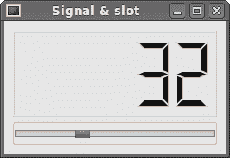

# PySide 中的事件和信号

> 原文： [http://zetcode.com/gui/pysidetutorial/eventsandsignals/](http://zetcode.com/gui/pysidetutorial/eventsandsignals/)

在 PySide 编程教程的这一部分中，我们将探讨应用程序中发生的事件和信号。

## 大事记

事件是任何 GUI 程序中的重要组成部分。 事件是由用户或系统生成的。 当我们调用应用程序的`exec_()`方法时，应用程序进入主循环。 主循环获取事件并将其发送到对象。 PySide 具有独特的信号和插槽机制。

所有 GUI 应用程序都是事件驱动的。 应用程序会对在其生命周期内生成的不同事件类型做出反应。 事件主要由应用程序的用户生成。 但是它们也可以通过其他方式生成。 例如 互联网连接，窗口管理器，计时器。 在事件模型中，有三个参与者：

*   事件来源
*   事件对象
*   事件目标

`event source`是状态改变的对象。 它生成事件。 `event object`（事件）将状态更改封装在事件源中。 `event target`是要通知的对象。 事件源对象将处理事件的任务委托给事件目标。

当我们调用应用程序的`exec_()`方法时，应用程序进入主循环。 主循环获取事件并将其发送到对象。 信号和插槽用于对象之间的通信。 发生特定事件时会发出`signal`。 `slot`可以是任何 Python 可调用的。 当发出与其连接的信号时，将调用插槽。

## 信号&插槽

这是一个简单的示例，展示了 PySide 中的信号和插槽。

```
#!/usr/bin/python
# -*- coding: utf-8 -*-

"""
ZetCode PySide tutorial 

In this example, we connect a signal
of a QtGui.QSlider to a slot 
of a QtGui.QLCDNumber. 

author: Jan Bodnar
website: zetcode.com 
last edited: August 2011
"""

import sys
from PySide import QtGui, QtCore

class Example(QtGui.QWidget):

    def __init__(self):
        super(Example, self).__init__()

        self.initUI()

    def initUI(self):

        lcd = QtGui.QLCDNumber(self)
        sld = QtGui.QSlider(QtCore.Qt.Horizontal, self)

        vbox = QtGui.QVBoxLayout()
        vbox.addWidget(lcd)
        vbox.addWidget(sld)

        self.setLayout(vbox)
        sld.valueChanged.connect(lcd.display)

        self.setGeometry(300, 300, 250, 150)
        self.setWindowTitle('Signal & slot')
        self.show()

def main():

    app = QtGui.QApplication(sys.argv)
    ex = Example()
    sys.exit(app.exec_())

if __name__ == '__main__':
    main()

```

在我们的示例中，我们显示`QtGui.QLCDNumber`和`QtGui.QSlider`。 我们通过拖动滑块来更改 LCD 编号。

```
sld.valueChanged.connect(lcd.display)

```

在这里，我们将滑块的`valueChanged`信号连接到 LCD 编号的`display`插槽。

`sender`是发送信号的对象。 `receiver`是接收信号的对象。 `slot`是对信号做出反应的方法。



Figure: Signal & slot

## 重新实现事件处理程序

PySide 中的事件通常通过重新实现事件处理程序来处理。

```
#!/usr/bin/python
# -*- coding: utf-8 -*-

"""
ZetCode PySide tutorial 

In this example, we reimplement an 
event handler. 

author: Jan Bodnar
website: zetcode.com 
last edited: August 2011
"""

import sys
from PySide import QtGui, QtCore

class Example(QtGui.QWidget):

    def __init__(self):
        super(Example, self).__init__()

        self.initUI()

    def initUI(self):      

        self.setGeometry(300, 300, 250, 150)
        self.setWindowTitle('Event handler')
        self.show()

    def keyPressEvent(self, e):

        if e.key() == QtCore.Qt.Key_Escape:
            self.close()

def main():

    app = QtGui.QApplication(sys.argv)
    ex = Example()
    sys.exit(app.exec_())

if __name__ == '__main__':
    main()

```

在我们的示例中，我们重新实现了`keyPressEvent()`事件处理程序。

```
def keyPressEvent(self, e):

    if e.key() == QtCore.Qt.Key_Escape:
        self.close()

```

如果单击退出按钮，则应用程序终止。

## 事件发送者

有时很容易知道哪个控件是信号的发送者。 为此，PySide 具有`sender()`方法。

```
#!/usr/bin/python
# -*- coding: utf-8 -*-

"""
ZetCode PySide tutorial 

In this example, we determine the event sender
object.

author: Jan Bodnar
website: zetcode.com 
last edited: August 2011
"""

import sys
from PySide import QtGui, QtCore

class Example(QtGui.QMainWindow):

    def __init__(self):
        super(Example, self).__init__()

        self.initUI()

    def initUI(self):      

        btn1 = QtGui.QPushButton("Button 1", self)
        btn1.move(30, 50)

        btn2 = QtGui.QPushButton("Button 2", self)
        btn2.move(150, 50)

        btn1.clicked.connect(self.buttonClicked)            
        btn2.clicked.connect(self.buttonClicked)

        self.statusBar()

        self.setGeometry(300, 300, 290, 150)
        self.setWindowTitle('Event sender')
        self.show()

    def buttonClicked(self):

        sender = self.sender()
        self.statusBar().showMessage(sender.text() + ' was pressed')

def main():

    app = QtGui.QApplication(sys.argv)
    ex = Example()
    sys.exit(app.exec_())

if __name__ == '__main__':
    main()

```

我们的示例中有两个按钮。 在`buttonClicked()`方法中，我们通过调用`sender()`方法来确定单击了哪个按钮。

```
btn1.clicked.connect(self.buttonClicked)            
btn2.clicked.connect(self.buttonClicked)

```

两个按钮都连接到同一插槽。

```
def buttonClicked(self):

    sender = self.sender()
    self.statusBar().showMessage(sender.text() + ' was pressed')

```

我们通过调用`sender()`方法来确定信号源。 在应用程序的状态栏中，我们显示了被按下的按钮的标签。


Figure: Event sender

## 发射信号

从`QtCore.QObject`创建的对象可以发出信号。 如果单击按钮，将生成`clicked`信号。 在下面的示例中，我们将看到如何发出自定义信号。

```
#!/usr/bin/python
# -*- coding: utf-8 -*-

"""
ZetCode PySide tutorial 

In this example, we show how to emit a
signal. 

author: Jan Bodnar
website: zetcode.com 
last edited: August 2011
"""

import sys
from PySide import QtGui, QtCore

class Communicate(QtCore.QObject):

    closeApp = QtCore.Signal()

class Example(QtGui.QMainWindow):

    def __init__(self):
        super(Example, self).__init__()

        self.initUI()

    def initUI(self):      

        self.c = Communicate()
        self.c.closeApp.connect(self.close)       

        self.setGeometry(300, 300, 290, 150)
        self.setWindowTitle('Emit signal')
        self.show()

    def mousePressEvent(self, event):

        self.c.closeApp.emit()

def main():

    app = QtGui.QApplication(sys.argv)
    ex = Example()
    sys.exit(app.exec_())

if __name__ == '__main__':
    main()

```

我们创建一个名为`closeApp`的新信号。 在鼠标按下事件期间将发出此信号。 信号连接到`QtGui.QMainWindow`的`close()`插槽。

```
class Communicate(QtCore.QObject):

    closeApp = QtCore.Signal()

```

我们基于`QtCore.QObject`创建一个类。 实例化时会创建一个 closeApp 信号。

```
self.c = Communicate()
self.c.closeApp.connect(self.close)     

```

创建 Communicate 类的实例。 我们将`QtGui.QMainWindow`的`close()`插槽连接到 closeApp 信号。

```
def mousePressEvent(self, event):

    self.c.closeApp.emit()

```

当我们用鼠标指针单击窗口时，会发出`closeApp`信号。

在 PySide 教程的这一部分中，我们介绍了信号和插槽。