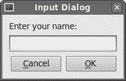
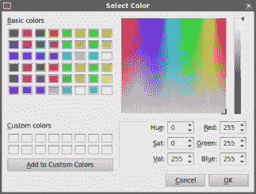

# PySide 中的对话框

> 原文： [http://zetcode.com/gui/pysidetutorial/dialogs/](http://zetcode.com/gui/pysidetutorial/dialogs/)

对话框窗口或对话框在现代 GUI 应用中很常见。 对话被定义为两个或更多人之间的对话。 在计算机应用中，对话框是一个窗口，用于与应用“对话”。 对话框用于输入数据，修改数据，更改应用设置等。对话框是用户与计算机程序之间进行通信的重要手段。

## `QtGui.QInputDialog`

`QtGui.QInputDialog`提供了一个简单的便捷对话框，可从用户那里获取单个值。 输入值可以是字符串，数字或列表中的项目。

```py
#!/usr/bin/python
# -*- coding: utf-8 -*-

"""
ZetCode PySide tutorial 

In this example, we receive data from
a QtGui.QInputDialog dialog. 

author: Jan Bodnar
website: zetcode.com 
last edited: August 2011
"""

import sys
from PySide import QtGui

class Example(QtGui.QWidget):

    def __init__(self):
        super(Example, self).__init__()

        self.initUI()

    def initUI(self):      

        self.btn = QtGui.QPushButton('Dialog', self)
        self.btn.move(20, 20)
        self.btn.clicked.connect(self.showDialog)

        self.le = QtGui.QLineEdit(self)
        self.le.move(130, 22)

        self.setGeometry(300, 300, 290, 150)
        self.setWindowTitle('Input dialog')
        self.show()

    def showDialog(self):
        text, ok = QtGui.QInputDialog.getText(self, 'Input Dialog', 
            'Enter your name:')

        if ok:
            self.le.setText(str(text))

def main():

    app = QtGui.QApplication(sys.argv)
    ex = Example()
    sys.exit(app.exec_())

if __name__ == '__main__':
    main()

```

该示例具有一个按钮和一个行编辑小部件。 该按钮显示用于获取文本值的输入对话框。 输入的文本将显示在行编辑小部件中。

```py
text, ok = QtGui.QInputDialog.getText(self, 'Input Dialog', 
    'Enter your name:')

```

这行显示输入对话框。 第一个字符串是对话框标题，第二个字符串是对话框中的消息。 对话框返回输入的文本和布尔值。 如果单击“确定”按钮，则布尔值将为`true`，否则为`false`。

```py
if ok:
    self.le.setText(str(text))

```

我们从对话框中收到的文本设置为行编辑小部件。



Figure: Input Dialog

## `QtGui.QColorDialog`

`QtGui.QColorDialog`提供了一个对话框小部件，用于选择颜色。

```py
#!/usr/bin/python
# -*- coding: utf-8 -*-

"""
ZetCode PySide tutorial 

In this example, we select a colour value
from the QtGui.QColorDialog and change the background
colour of a QtGui.QFrame widget. 

author: Jan Bodnar
website: zetcode.com 
last edited: August 2011
"""

import sys
from PySide import QtGui

class Example(QtGui.QWidget):

    def __init__(self):
        super(Example, self).__init__()

        self.initUI()

    def initUI(self):      

        col = QtGui.QColor(0, 0, 0) 

        self.btn = QtGui.QPushButton('Dialog', self)
        self.btn.move(20, 20)

        self.btn.clicked.connect(self.showDialog)

        self.frm = QtGui.QFrame(self)
        self.frm.setStyleSheet("QWidget { background-color: %s }" 
            % col.name())
        self.frm.setGeometry(130, 22, 100, 100)            

        self.setGeometry(300, 300, 250, 180)
        self.setWindowTitle('Color dialog')
        self.show()

    def showDialog(self):

        col = QtGui.QColorDialog.getColor()

        if col.isValid():
            self.frm.setStyleSheet("QWidget { background-color: %s }"
                % col.name())

def main():

    app = QtGui.QApplication(sys.argv)
    ex = Example()
    sys.exit(app.exec_())

if __name__ == '__main__':
    main()

```

该应用示例显示了一个按钮和一个`QtGui.QFrame`。 窗口小部件背景设置为黑色。 使用`QtGui.QColorDialog`，我们可以更改其背景。

```py
col = QtGui.QColor(0, 0, 0) 

```

这是`QtGui.QFrame`背景的初始颜色。

```py
col = QtGui.QColorDialog.getColor()

```

这行会弹出`QtGui.QColorDialog`。

```py
if col.isValid():
    self.frm.setStyleSheet("QWidget { background-color: %s }"
        % col.name())

```

我们检查颜色是否有效。 如果单击取消按钮，则不会返回有效颜色。 如果颜色有效，我们将使用样式表更改背景颜色。



Figure: Color dialog

## `QtGui.QFontDialog`

`QtGui.QFontDialog`是用于选择字体的对话框小部件。

```py
#!/usr/bin/python
# -*- coding: utf-8 -*-

"""
ZetCode PySide tutorial 

In this example, we select a font name
and change the font of a label. 

author: Jan Bodnar
website: zetcode.com 
last edited: August 2011
"""

import sys
from PySide import QtGui

class Example(QtGui.QWidget):

    def __init__(self):
        super(Example, self).__init__()

        self.initUI()

    def initUI(self):      

        vbox = QtGui.QVBoxLayout()

        btn = QtGui.QPushButton('Dialog', self)
        btn.setSizePolicy(QtGui.QSizePolicy.Fixed,
            QtGui.QSizePolicy.Fixed)

        btn.move(20, 20)

        vbox.addWidget(btn)

        btn.clicked.connect(self.showDialog)

        self.lbl = QtGui.QLabel('Knowledge only matters', self)
        self.lbl.move(130, 20)

        vbox.addWidget(self.lbl)
        self.setLayout(vbox)          

        self.setGeometry(300, 300, 250, 180)
        self.setWindowTitle('Font dialog')
        self.show()

    def showDialog(self):

        font, ok = QtGui.QFontDialog.getFont()
        if ok:
            self.lbl.setFont(font)

def main():

    app = QtGui.QApplication(sys.argv)
    ex = Example()
    sys.exit(app.exec_())

if __name__ == '__main__':
    main()

```

在我们的示例中，我们有一个按钮和一个标签。 使用`QtGui.QFontDialog`，我们更改标签的字体。

```py
font, ok = QtGui.QFontDialog.getFont()

```

在这里我们弹出字体对话框。 `getFont()`方法返回字体名称和`ok`参数。 如果用户单击“确定”，则等于`True`。 否则为`False`。

```py
if ok:
    self.label.setFont(font)

```

如果单击确定，则标签的字体将被更改。

## `QtGui.QFileDialog`

`QtGui.QFileDialog`是允许用户选择文件或目录的对话框。 可以选择打开和保存文件。

```py
#!/usr/bin/python
# -*- coding: utf-8 -*-

"""
ZetCode PySide tutorial 

In this example, we select a file with a
QtGui.QFileDialog and display its contents
in a QtGui.QTextEdit.

author: Jan Bodnar
website: zetcode.com 
last edited: October 2011
"""

import sys
from PySide import QtGui

class Example(QtGui.QMainWindow):

    def __init__(self):
        super(Example, self).__init__()

        self.initUI()

    def initUI(self):      

        self.textEdit = QtGui.QTextEdit()
        self.setCentralWidget(self.textEdit)
        self.statusBar()

        openFile = QtGui.QAction(QtGui.QIcon('open.png'), 'Open', self)
        openFile.setShortcut('Ctrl+O')
        openFile.setStatusTip('Open new File')
        openFile.triggered.connect(self.showDialog)

        menubar = self.menuBar()
        fileMenu = menubar.addMenu('&File')
        fileMenu.addAction(openFile)       

        self.setGeometry(300, 300, 350, 300)
        self.setWindowTitle('File dialog')
        self.show()

    def showDialog(self):

        fname, _ = QtGui.QFileDialog.getOpenFileName(self, 'Open file',
                    '/home')

        f = open(fname, 'r')

        with f:
            data = f.read()
            self.textEdit.setText(data)

def main():

    app = QtGui.QApplication(sys.argv)
    ex = Example()
    sys.exit(app.exec_())

if __name__ == '__main__':
    main()

```

该示例显示了一个菜单栏，集中设置的文本编辑小部件和一个状态栏。 菜单项显示`QtGui.QFileDialog`，用于选择文件。 文件的内容被加载到文本编辑小部件中。

```py
class Example(QtGui.QMainWindow):

    def __init__(self):
        super(Example, self).__init__()

```

该示例基于`QtGui.QMainWindow`小部件。 我们可以轻松地创建状态栏，工具栏和中央小部件。

```py
fname, _ = QtGui.QFileDialog.getOpenFileName(self, 'Open file',
            '/home')

```

我们弹出`QtGui.QFileDialog`。 `getOpenFileName()`方法中的第一个字符串是标题。 第二个字符串指定对话框的工作目录。 该方法返回选定的文件名和过滤器。 我们只对文件名感兴趣。

```py
f = open(fname, 'r')

with f:
    data = f.read()
    self.textEdit.setText(data)

```

读取所选文件名，并将文件内容设置为文本编辑小部件。

在 PySide 教程的这一部分中，我们使用了对话框。