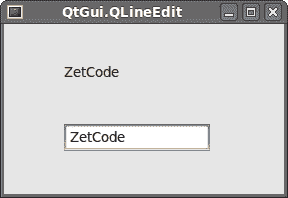
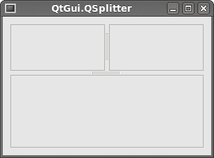

# PySide 小部件 II

> 原文： [http://zetcode.com/gui/pysidetutorial/widgets2/](http://zetcode.com/gui/pysidetutorial/widgets2/)

在这里，我们将继续介绍 PySide 小部件。 我们将介绍`QtGui.QPixmap`，`QtGui.QLineEdit`，`QtGui.QSplitter`和`QtGui.QComboBox`。

## `QtGui.QPixmap`

`QtGui.QPixmap`是用于处理图像的小部件之一。 它经过优化，可在屏幕上显示图像。 在我们的代码示例中，我们将使用`QtGui.QPixmap`在窗口上显示图像。

```py
#!/usr/bin/python
# -*- coding: utf-8 -*-

"""
ZetCode PySide tutorial 

In this example, we dispay an image
on the window. 

author: Jan Bodnar
website: zetcode.com 
last edited: August 2011
"""

import sys
from PySide import QtGui, QtCore

class Example(QtGui.QWidget):

    def __init__(self):
        super(Example, self).__init__()

        self.initUI()

    def initUI(self):      

        hbox = QtGui.QHBoxLayout(self)
        pixmap = QtGui.QPixmap("redrock.png")

        lbl = QtGui.QLabel(self)
        lbl.setPixmap(pixmap)

        hbox.addWidget(lbl)
        self.setLayout(hbox)

        self.setGeometry(300, 300, 280, 170)
        self.setWindowTitle('Red Rock')
        self.show()        

def main():

    app = QtGui.QApplication(sys.argv)
    ex = Example()
    sys.exit(app.exec_())

if __name__ == '__main__':
    main()

```

在我们的示例中，我们在窗口上显示图像。 我们使用`QtGui.QPixmap`从文件中加载图像，并使用`QtGui.QLabel`小部件在窗口上显示图像。

```py
pixmap = QtGui.QPixmap("redrock.png")

```

我们创建一个`QtGui.QPixmap`对象。 它以文件名作为参数。

```py
lbl = QtGui.QLabel(self)
lbl.setPixmap(pixmap)

```

我们将像素图放入`QtGui.QLabel`小部件。

## `QtGui.QLineEdit`

`QtGui.QLineEdit`是一个小部件，允许输入和编辑单行纯文本。 `QtGui.QLineEdit`小部件具有撤消/重做，剪切/粘贴和拖动的&放置功能。

```py
#!/usr/bin/python
# -*- coding: utf-8 -*-

"""
ZetCode PySide tutorial 

This example shows text which 
is entered in a QtGui.QLineEdit
in a QtGui.QLabel widget.

author: Jan Bodnar
website: zetcode.com 
last edited: August 2011
"""

import sys
from PySide import QtGui, QtCore

class Example(QtGui.QWidget):

    def __init__(self):
        super(Example, self).__init__()

        self.initUI()

    def initUI(self):      

        self.lbl = QtGui.QLabel(self)
        qle = QtGui.QLineEdit(self)

        qle.move(60, 100)
        self.lbl.move(60, 40)

        qle.textChanged[str].connect(self.onChanged)

        self.setGeometry(300, 300, 280, 170)
        self.setWindowTitle('QtGui.QLineEdit')
        self.show()

    def onChanged(self, text):

        self.lbl.setText(text)
        self.lbl.adjustSize()        

def main():

    app = QtGui.QApplication(sys.argv)
    ex = Example()
    sys.exit(app.exec_())

if __name__ == '__main__':
    main()

```

此示例显示了行编辑小部件和标签。 我们在行编辑中键入的文本会立即显示在标签窗口小部件中。

```py
qle = QtGui.QLineEdit(self)

```

`QtGui.QLineEdit`小部件已创建。

```py
qle.textChanged[str].connect(self.onChanged)

```

如果行编辑窗口小部件中的文本更改，我们将调用`onChanged()`方法。

```py
def onChanged(self, text):

    self.lbl.setText(text)
    self.lbl.adjustSize()  

```

在`onChanged()`方法内部，我们将键入的文本设置为标签小部件。 我们调用`adjustSize()`方法将标签的大小调整为文本的长度。



Figure: QtGui.QLineEdit

## `QtGui.QSplitter`

`QtGui.QSplitter`允许用户通过拖动子控件之间的边界来控制子控件的大小。 在我们的示例中，我们显示了由两个拆分器组成的三个`QtGui.QFrame`小部件。

```py
#!/usr/bin/python
# -*- coding: utf-8 -*-

"""
ZetCode PySide tutorial 

This example shows
how to use QtGui.QSplitter widget.

author: Jan Bodnar
website: zetcode.com 
last edited: August 2011
"""

import sys
from PySide import QtGui, QtCore

class Example(QtGui.QWidget):

    def __init__(self):
        super(Example, self).__init__()

        self.initUI()

    def initUI(self):      

        hbox = QtGui.QHBoxLayout(self)

        topleft = QtGui.QFrame(self)
        topleft.setFrameShape(QtGui.QFrame.StyledPanel)

        topright = QtGui.QFrame(self)
        topright.setFrameShape(QtGui.QFrame.StyledPanel)

        bottom = QtGui.QFrame(self)
        bottom.setFrameShape(QtGui.QFrame.StyledPanel)

        splitter1 = QtGui.QSplitter(QtCore.Qt.Horizontal)
        splitter1.addWidget(topleft)
        splitter1.addWidget(topright)

        splitter2 = QtGui.QSplitter(QtCore.Qt.Vertical)
        splitter2.addWidget(splitter1)
        splitter2.addWidget(bottom)

        hbox.addWidget(splitter2)
        self.setLayout(hbox)
        QtGui.QApplication.setStyle(QtGui.QStyleFactory.create('Cleanlooks'))

        self.setGeometry(300, 300, 300, 200)
        self.setWindowTitle('QtGui.QSplitter')
        self.show()

    def onChanged(self, text):

        self.lbl.setText(text)
        self.lbl.adjustSize()        

def main():

    app = QtGui.QApplication(sys.argv)
    ex = Example()
    sys.exit(app.exec_())

if __name__ == '__main__':
    main()

```

在我们的示例中，我们有三个框架小部件和两个拆分器。

```py
topleft = QtGui.QFrame(self)
topleft.setFrameShape(QtGui.QFrame.StyledPanel)

```

我们使用样式化的框架以查看`QtGui.QFrame`小部件之间的边界。

```py
splitter1 = QtGui.QSplitter(QtCore.Qt.Horizontal)
splitter1.addWidget(topleft)
splitter1.addWidget(topright)

```

我们创建一个`QtGui.QSplitter`小部件，并在其中添加两个框架。

```py
splitter2 = QtGui.QSplitter(QtCore.Qt.Vertical)
splitter2.addWidget(splitter1)

```

我们还可以将分割器添加到另一个分割器小部件。

```py
QtGui.QApplication.setStyle(QtGui.QStyleFactory.create('Cleanlooks'))

```

我们使用`Cleanlooks`风格。 在某些样式中，框架不可见。



Figure: QtGui.QSplitter widget

## `QtGui.QComboBox`

`QtGui.QComboBox`是一个小部件，允许用户从选项列表中进行选择。

```py
#!/usr/bin/python
# -*- coding: utf-8 -*-

"""
ZetCode PySide tutorial 

This example shows
how to use QtGui.QComboBox widget.

author: Jan Bodnar
website: zetcode.com 
last edited: August 2011
"""

import sys
from PySide import QtGui, QtCore

class Example(QtGui.QWidget):

    def __init__(self):
        super(Example, self).__init__()

        self.initUI()

    def initUI(self):      

        self.lbl = QtGui.QLabel("Ubuntu", self)

        combo = QtGui.QComboBox(self)
        combo.addItem("Ubuntu")
        combo.addItem("Mandriva")
        combo.addItem("Fedora")
        combo.addItem("Red Hat")
        combo.addItem("Gentoo")

        combo.move(50, 50)
        self.lbl.move(50, 150)

        combo.activated[str].connect(self.onActivated)        

        self.setGeometry(300, 300, 300, 200)
        self.setWindowTitle('QtGui.QComboBox')
        self.show()

    def onActivated(self, text):

        self.lbl.setText(text)
        self.lbl.adjustSize()  

def main():

    app = QtGui.QApplication(sys.argv)
    ex = Example()
    sys.exit(app.exec_())

if __name__ == '__main__':
    main()

```

该示例显示了`QtGui.QComboBox`和`QtGui.QLabel`。 组合框具有五个选项的列表。 这些是 Linux 发行版的名称。 标签窗口小部件显示了从组合框中选择的选项。

```py
combo = QtGui.QComboBox(self)
combo.addItem("Ubuntu")
combo.addItem("Mandriva")
combo.addItem("Fedora")
combo.addItem("Red Hat")
combo.addItem("Gentoo")

```

我们创建一个`QtGui.QComboBox`小部件，并在其中添加五个选项。

```py
combo.activated[str].connect(self.onActivated)  

```

选择项目后，我们调用`onActivated()`方法。

```py
def onActivated(self, text):

    self.lbl.setText(text)
    self.lbl.adjustSize() 

```

在方法内部，我们将所选项目的文本设置为标签小部件。 我们调整标签的大小。


Figure: QtGui.QComboBox

在 PySide 教程的这一部分中，我们介绍了其他四个 PySide 小部件。