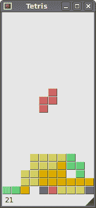

# PySide 中的俄罗斯方块游戏

> 原文： [http://zetcode.com/gui/pysidetutorial/thetetrisgame/](http://zetcode.com/gui/pysidetutorial/thetetrisgame/)

制作计算机游戏具有挑战性。 程序员迟早会希望有一天创建一个计算机游戏。 实际上，许多人对编程很感兴趣，因为他们玩游戏并想创建自己的游戏。 制作计算机游戏将有助于提高您的编程技能。

## 俄罗斯方块

俄罗斯方块游戏是有史以来最受欢迎的计算机游戏之一。 原始游戏是由俄罗斯程序员 Alexey Pajitnov 于 1985 年设计和编程的。此后，几乎所有版本的几乎所有计算机平台上都可以使用俄罗斯方块。 甚至我的手机都有俄罗斯方块游戏的修改版。

俄罗斯方块被称为下降块益智游戏。 在这个游戏中，我们有七个不同的形状，称为`tetrominoes`。 S 形，Z 形，T 形，L 形，线形，镜像 L 形和正方形。 这些形状中的每一个都形成有四个正方形。 形状从板上掉下来。 俄罗斯方块游戏的目的是移动和旋转形状，以便它们尽可能地适合。 如果我们设法形成一行，则该行将被破坏并得分。 我们玩俄罗斯方块游戏，直到达到顶峰。


图：Tetrominoes

PySide 是旨在创建应用的工具包。 还有其他一些旨在创建计算机游戏的库。 但是，可以使用 PySide 和其他应用工具包来创建游戏。

## 开发

我们的俄罗斯方块游戏没有图像，我们使用 PySide 编程工具包中提供的绘图 API 绘制四面体。 每个计算机游戏的背后都有一个数学模型。 俄罗斯方块也是如此。

游戏背后的一些想法：

*   我们使用`QtCore.QBasicTimer()`创建游戏周期。
*   绘制四聚体。
*   形状以正方形为单位移动（而不是逐个像素移动）。
*   从数学上讲，棋盘是一个简单的数字列表。

```py
#!/usr/bin/python
# -*- coding: utf-8 -*-

"""
ZetCode PySide tutorial

This is a simple Tetris clone
in PySide.

author: Jan Bodnar
website: zetcode.com
last edited: August 2011
"""

import sys, random
from PySide import QtCore, QtGui

class Communicate(QtCore.QObject):

    msgToSB = QtCore.Signal(str)

class Tetris(QtGui.QMainWindow):

    def __init__(self):
        super(Tetris, self).__init__()

        self.setGeometry(300, 300, 180, 380)
        self.setWindowTitle('Tetris')
        self.Tetrisboard = Board(self)

        self.setCentralWidget(self.Tetrisboard)

        self.statusbar = self.statusBar()
        self.Tetrisboard.c.msgToSB[str].connect(self.statusbar.showMessage)

        self.Tetrisboard.start()
        self.center()

    def center(self):

        screen = QtGui.QDesktopWidget().screenGeometry()
        size =  self.geometry()
        self.move((screen.width()-size.width())/2, 
            (screen.height()-size.height())/2)

class Board(QtGui.QFrame):

    BoardWidth = 10
    BoardHeight = 22
    Speed = 300

    def __init__(self, parent):
        super(Board, self).__init__()

        self.timer = QtCore.QBasicTimer()
        self.isWaitingAfterLine = False
        self.curPiece = Shape()
        self.nextPiece = Shape()
        self.curX = 0
        self.curY = 0
        self.numLinesRemoved = 0
        self.board = []

        self.setFocusPolicy(QtCore.Qt.StrongFocus)
        self.isStarted = False
        self.isPaused = False
        self.clearBoard()

        self.c = Communicate()

        self.nextPiece.setRandomShape()

    def shapeAt(self, x, y):
        return self.board[(y * Board.BoardWidth) + x]

    def setShapeAt(self, x, y, shape):
        self.board[(y * Board.BoardWidth) + x] = shape

    def squareWidth(self):
        return self.contentsRect().width() / Board.BoardWidth

    def squareHeight(self):
        return self.contentsRect().height() / Board.BoardHeight

    def start(self):
        if self.isPaused:
            return

        self.isStarted = True
        self.isWaitingAfterLine = False
        self.numLinesRemoved = 0
        self.clearBoard()

        self.c.msgToSB.emit(str(self.numLinesRemoved))

        self.newPiece()
        self.timer.start(Board.Speed, self)

    def pause(self):

        if not self.isStarted:
            return

        self.isPaused = not self.isPaused

        if self.isPaused:
            self.timer.stop()
            self.c.msgToSB.emit("paused")
        else:
            self.timer.start(Board.Speed, self)
            self.c.msgToSB.emit(str(self.numLinesRemoved))

        self.update()

    def paintEvent(self, event):

        painter = QtGui.QPainter(self)
        rect = self.contentsRect()

        boardTop = rect.bottom() - Board.BoardHeight * self.squareHeight()

        for i in range(Board.BoardHeight):
            for j in range(Board.BoardWidth):
                shape = self.shapeAt(j, Board.BoardHeight - i - 1)
                if shape != Tetrominoes.NoShape:
                    self.drawSquare(painter,
                        rect.left() + j * self.squareWidth(),
                        boardTop + i * self.squareHeight(), shape)

        if self.curPiece.shape() != Tetrominoes.NoShape:
            for i in range(4):
                x = self.curX + self.curPiece.x(i)
                y = self.curY - self.curPiece.y(i)
                self.drawSquare(painter, rect.left() + x * self.squareWidth(),
                    boardTop + (Board.BoardHeight - y - 1) * self.squareHeight(),
                    self.curPiece.shape())

    def keyPressEvent(self, event):

        if not self.isStarted or self.curPiece.shape() == Tetrominoes.NoShape:
            QtGui.QWidget.keyPressEvent(self, event)
            return

        key = event.key()

        if key == QtCore.Qt.Key_P:
            self.pause()
            return
        if self.isPaused:
            return
        elif key == QtCore.Qt.Key_Left:
            self.tryMove(self.curPiece, self.curX - 1, self.curY)
        elif key == QtCore.Qt.Key_Right:
            self.tryMove(self.curPiece, self.curX + 1, self.curY)
        elif key == QtCore.Qt.Key_Down:
            self.tryMove(self.curPiece.rotatedRight(), self.curX, self.curY)
        elif key == QtCore.Qt.Key_Up:
            self.tryMove(self.curPiece.rotatedLeft(), self.curX, self.curY)
        elif key == QtCore.Qt.Key_Space:
            self.dropDown()
        elif key == QtCore.Qt.Key_D:
            self.oneLineDown()
        else:
            QtGui.QWidget.keyPressEvent(self, event)

    def timerEvent(self, event):

        if event.timerId() == self.timer.timerId():
            if self.isWaitingAfterLine:
                self.isWaitingAfterLine = False
                self.newPiece()
            else:
                self.oneLineDown()
        else:
            QtGui.QFrame.timerEvent(self, event)

    def clearBoard(self):

        for i in range(Board.BoardHeight * Board.BoardWidth):
            self.board.append(Tetrominoes.NoShape)

    def dropDown(self):

        newY = self.curY
        while newY > 0:
            if not self.tryMove(self.curPiece, self.curX, newY - 1):
                break
            newY -= 1

        self.pieceDropped()

    def oneLineDown(self):

        if not self.tryMove(self.curPiece, self.curX, self.curY - 1):
            self.pieceDropped()

    def pieceDropped(self):

        for i in range(4):
            x = self.curX + self.curPiece.x(i)
            y = self.curY - self.curPiece.y(i)
            self.setShapeAt(x, y, self.curPiece.shape())

        self.removeFullLines()

        if not self.isWaitingAfterLine:
            self.newPiece()

    def removeFullLines(self):
        numFullLines = 0

        rowsToRemove = []

        for i in range(Board.BoardHeight):
            n = 0
            for j in range(Board.BoardWidth):
                if not self.shapeAt(j, i) == Tetrominoes.NoShape:
                    n = n + 1

            if n == 10:
                rowsToRemove.append(i)

        rowsToRemove.reverse()

        for m in rowsToRemove:
            for k in range(m, Board.BoardHeight):
                for l in range(Board.BoardWidth):
                        self.setShapeAt(l, k, self.shapeAt(l, k + 1))

        numFullLines = numFullLines + len(rowsToRemove)

        if numFullLines > 0:
            self.numLinesRemoved = self.numLinesRemoved + numFullLines
            print self.numLinesRemoved
            self.c.msgToSB.emit(str(self.numLinesRemoved))
            self.isWaitingAfterLine = True
            self.curPiece.setShape(Tetrominoes.NoShape)
            self.update()

    def newPiece(self):

        self.curPiece = self.nextPiece
        self.nextPiece.setRandomShape()
        self.curX = Board.BoardWidth / 2 + 1
        self.curY = Board.BoardHeight - 1 + self.curPiece.minY()

        if not self.tryMove(self.curPiece, self.curX, self.curY):
            self.curPiece.setShape(Tetrominoes.NoShape)
            self.timer.stop()
            self.isStarted = False
            self.c.msgToSB.emit("Game over")

    def tryMove(self, newPiece, newX, newY):

        for i in range(4):
            x = newX + newPiece.x(i)
            y = newY - newPiece.y(i)
            if x < 0 or x >= Board.BoardWidth or y < 0 or y >= Board.BoardHeight:
                return False
            if self.shapeAt(x, y) != Tetrominoes.NoShape:
                return False

        self.curPiece = newPiece
        self.curX = newX
        self.curY = newY
        self.update()
        return True

    def drawSquare(self, painter, x, y, shape):

        colorTable = [0x000000, 0xCC6666, 0x66CC66, 0x6666CC,
                      0xCCCC66, 0xCC66CC, 0x66CCCC, 0xDAAA00]

        color = QtGui.QColor(colorTable[shape])
        painter.fillRect(x + 1, y + 1, self.squareWidth() - 2, 
            self.squareHeight() - 2, color)

        painter.setPen(color.lighter())
        painter.drawLine(x, y + self.squareHeight() - 1, x, y)
        painter.drawLine(x, y, x + self.squareWidth() - 1, y)

        painter.setPen(color.darker())
        painter.drawLine(x + 1, y + self.squareHeight() - 1,
            x + self.squareWidth() - 1, y + self.squareHeight() - 1)
        painter.drawLine(x + self.squareWidth() - 1, 
            y + self.squareHeight() - 1, x + self.squareWidth() - 1, y + 1)

class Tetrominoes(object):

    NoShape = 0
    ZShape = 1
    SShape = 2
    LineShape = 3
    TShape = 4
    SquareShape = 5
    LShape = 6
    MirroredLShape = 7

class Shape(object):

    coordsTable = (
        ((0, 0),     (0, 0),     (0, 0),     (0, 0)),
        ((0, -1),    (0, 0),     (-1, 0),    (-1, 1)),
        ((0, -1),    (0, 0),     (1, 0),     (1, 1)),
        ((0, -1),    (0, 0),     (0, 1),     (0, 2)),
        ((-1, 0),    (0, 0),     (1, 0),     (0, 1)),
        ((0, 0),     (1, 0),     (0, 1),     (1, 1)),
        ((-1, -1),   (0, -1),    (0, 0),     (0, 1)),
        ((1, -1),    (0, -1),    (0, 0),     (0, 1))
    )

    def __init__(self):

        self.coords = [[0,0] for i in range(4)]
        self.pieceShape = Tetrominoes.NoShape

        self.setShape(Tetrominoes.NoShape)

    def shape(self):
        return self.pieceShape

    def setShape(self, shape):

        table = Shape.coordsTable[shape]
        for i in range(4):
            for j in range(2):
                self.coords[i][j] = table[i][j]

        self.pieceShape = shape

    def setRandomShape(self):
        self.setShape(random.randint(1, 7))

    def x(self, index):
        return self.coords[index][0]

    def y(self, index):
        return self.coords[index][1]

    def setX(self, index, x):
        self.coords[index][0] = x

    def setY(self, index, y):
        self.coords[index][1] = y

    def minX(self):

        m = self.coords[0][0]
        for i in range(4):
            m = min(m, self.coords[i][0])

        return m

    def maxX(self):

        m = self.coords[0][0]
        for i in range(4):
            m = max(m, self.coords[i][0])

        return m

    def minY(self):

        m = self.coords[0][1]
        for i in range(4):
            m = min(m, self.coords[i][1])

        return m

    def maxY(self):

        m = self.coords[0][1]
        for i in range(4):
            m = max(m, self.coords[i][1])

        return m

    def rotatedLeft(self):

        if self.pieceShape == Tetrominoes.SquareShape:
            return self

        result = Shape()
        result.pieceShape = self.pieceShape

        for i in range(4):
            result.setX(i, self.y(i))
            result.setY(i, -self.x(i))

        return result

    def rotatedRight(self):

        if self.pieceShape == Tetrominoes.SquareShape:
            return self

        result = Shape()
        result.pieceShape = self.pieceShape

        for i in range(4):
            result.setX(i, -self.y(i))
            result.setY(i, self.x(i))

        return result

def main():

    app = QtGui.QApplication(sys.argv)
    t = Tetris()
    t.show()
    sys.exit(app.exec_())

if __name__ == '__main__':
    main()

```

我对游戏做了一些简化，以便于理解。 游戏启动后立即开始。 我们可以通过按 `p` 键暂停游戏。 空格键将把俄罗斯方块放在底部。 游戏以恒定速度进行，没有实现加速。 分数是我们已删除的行数。

```py
self.statusbar = self.statusBar()
self.Tetrisboard.c.msgToSB[str].connect(self.statusbar.showMessage)	

```

我们创建一个状态栏，在其中显示消息。 我们将显示三种可能的消息。 已删除的行数。 暂停的消息和游戏结束消息。

```py
...
self.curX = 0
self.curY = 0
self.numLinesRemoved = 0
self.board = []
...

```

在开始游戏周期之前，我们先初始化一些重要的变量。 `self.board`变量是一个从 0 到 7 的数字的列表。它表示各种形状的位置以及板上形状的其余部分。

```py
for j in range(Board.BoardWidth):
    shape = self.shapeAt(j, Board.BoardHeight - i - 1)
    if shape != Tetrominoes.NoShape:
        self.drawSquare(painter,
            rect.left() + j * self.squareWidth(),
            boardTop + i * self.squareHeight(), shape)

```

游戏的绘图分为两个步骤。 在第一步中，我们绘制所有形状或已放置到板底部的形状的其余部分。 所有正方形都记在`self.board`列表变量中。 我们使用`shapeAt()`方法访问它。

```py
if self.curPiece.shape() != Tetrominoes.NoShape:
    for i in range(4):
        x = self.curX + self.curPiece.x(i)
        y = self.curY - self.curPiece.y(i)
        self.drawSquare(painter, rect.left() + x * self.squareWidth(),
            boardTop + (Board.BoardHeight - y - 1) * self.squareHeight(),
            self.curPiece.shape())

```

下一步是绘制掉落的实际零件。

```py
elif key == QtCore.Qt.Key_Left:
    self.tryMove(self.curPiece, self.curX - 1, self.curY)
elif key == QtCore.Qt.Key_Right:
    self.tryMove(self.curPiece, self.curX + 1, self.curY)

```

在`keyPressEvent`中，我们检查是否有按下的键。 如果按向右箭头键，我们将尝试将棋子向右移动。 我们说尝试，因为这片可能无法移动。

```py
def tryMove(self, newPiece, newX, newY):
    for i in range(4):
        x = newX + newPiece.x(i)
        y = newY - newPiece.y(i)
        if x < 0 or x >= Board.BoardWidth or y < 0 or y >= Board.BoardHeight:
            return False
        if self.shapeAt(x, y) != Tetrominoes.NoShape:
            return False

    self.curPiece = newPiece
    self.curX = newX
    self.curY = newY
    self.update()
    return True

```

在`tryMove()`方法中，我们尝试移动形状。 如果形状在板的边缘或与其他零件相邻，则返回`false`。 否则，我们将当前的下降片放到新位置。

```py
def timerEvent(self, event):
    if event.timerId() == self.timer.timerId():
        if self.isWaitingAfterLine:
            self.isWaitingAfterLine = False
            self.newPiece()
        else:
            self.oneLineDown()
    else:
        QtGui.QFrame.timerEvent(self, event)

```

在计时器事件中，我们可以在上一个下降到底部之后创建一个新的片断，或者将下降的片断向下移动一行。

```py
def removeFullLines(self):
    numFullLines = 0

    rowsToRemove = []

    for i in range(Board.BoardHeight):
        n = 0
        for j in range(Board.BoardWidth):
            if not self.shapeAt(j, i) == Tetrominoes.NoShape:
                n = n + 1

        if n == 10:
            rowsToRemove.append(i)

    rowsToRemove.reverse()

    for m in rowsToRemove:
        for k in range(m, Board.BoardHeight):
            for l in range(Board.BoardWidth):
                self.setShapeAt(l, k, self.shapeAt(l, k + 1))
...

```

如果片段触底，我们将调用`removeFullLines()`方法。 首先，我们找出所有实线。 然后我们将其删除。 通过将所有行移动到当前全行上方来将其向下移动一行来实现。 注意，我们颠倒了要删除的行的顺序。 否则，它将无法正常工作。 在我们的情况下，我们使用天真重力。 这意味着碎片可能会漂浮在空的间隙上方。

```py
def newPiece(self):

    self.curPiece = self.nextPiece
    self.nextPiece.setRandomShape()
    self.curX = Board.BoardWidth / 2 + 1
    self.curY = Board.BoardHeight - 1 + self.curPiece.minY()

    if not self.tryMove(self.curPiece, self.curX, self.curY):
        self.curPiece.setShape(Tetrominoes.NoShape)
        self.timer.stop()
        self.isStarted = False
        self.c.msgToSB.emit("Game over")

```

`newPiece()`方法随机创建一个新的俄罗斯方块。 如果棋子无法进入其初始位置，则游戏结束。

`Shape`类保存有关俄罗斯方块的信息。

```py
self.coords = [[0,0] for i in range(4)]

```

创建后，我们将创建一个空坐标列表。 该列表将保存俄罗斯方块的坐标。 例如，这些元组（0，-1），（0，0），（1，0），（1，1）表示旋转的 S 形。 下图说明了形状。


图：坐标

当绘制当前下降片时，将其绘制在`self.curX`，`self.curY position`处。 然后，我们查看坐标表并绘制所有四个正方形。



图：俄罗斯方块

这是 PySide 中的俄罗斯方块游戏。