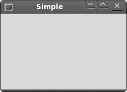
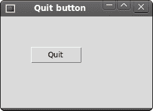

# Tcl / Tk 简介

> 原文： [http://zetcode.com/gui/tcltktutorial/introduction/](http://zetcode.com/gui/tcltktutorial/introduction/)

在 Tcl / Tk 教程的这一部分中，我们将介绍 Tk 工具包并创建我们的第一个程序。

本教程的目的是帮助您开始使用 Tcl 语言的 Tk 工具包。 可以在此处下载本教程中使用的图像。 我使用了 Gnome 项目的 Tango 图标包中的一些图标。

## k

Tk 是一个开源的，跨平台的小部件工具包，它提供了用于构建图形用户界面（GUI）的基本元素库。 Tk 于 1991 年首次公开发行。Tk 是 Tcl 语言的扩展。 这意味着 Tk 通过用于构建用户界面的其他命令扩展了 Tcl 语言。 有几种其他语言的绑定，包括 Ada，Perl，Ruby，Python 或 Common Lisp。 Tk 库通常以其主要语言称为 Tcl / Tk。

## Tcl

Tcl 是基于字符串的脚本语言。 源代码被编译成字节码，然后由 Tcl 解释器解释。 它由 John Osterhout 于 1988 年创建。其目的是创建一种易于嵌入到应用程序中的语言。 但通常在其原始区域之外使用。 该语言通常用于快速原型，脚本应用程序，GUI 或测试。 Tcl 代表工具命令语言，其中 Tcl 脚本的源代码由命令组成。

Tcl 是一种过程语言。 它具有一些功能特征。 计划在下一个正式版本中提供 OOP 支持。

Tcl 和 Tk 的官方网站是 [tcl.tk](http://tcl.tk)

## 简单的例子

在第一个示例中，我们将在屏幕上显示一个基本窗口。

```
#!/usr/bin/wish

frame .fr

wm title . Simple
wm geometry . 250x150+300+300

```

尽管这段代码很小，但是应用程序窗口可以做很多事情。 可以调整大小，最大化或最小化。 随之而来的所有复杂性对应用程序程序员都是隐藏的。

```
#!/usr/bin/wish

```

`wish`是 Tcl / Tk 解释器。 它了解 Tcl 和 Tk 命令。

```
frame .fr   

```

`frame`小部件已创建。 框架是创建框架小部件的 Tk 命令。 该命令的参数是小部件路径名。 小部件路径名以点字符开头。 此字符代表主应用程序窗口。 在 Tk 中，小部件形成一个层次结构。 `.fr`表示框架小部件位于主应用程序窗口内。 窗口小部件路径是一个以点开头的字符串，由多个以点分隔的名称组成。 这些名称是组成窗口小部件层次的窗口小部件名称。

```
wm title . Simple

```

`wm`命令用于与窗口管理器进行交互。 此代码行设置窗口标题。

```
wm geometry . 250x150+300+300

```

在这里，我们设置窗口的大小并将其放置在屏幕上。 前两个数字指定窗口的宽度和高度。 第三个和第四个参数是监视器屏幕上的 x，y 坐标。



Figure: Simple window

## 居中窗口

该脚本使屏幕上的窗口居中。

```
#!/usr/bin/wish

# ZetCode Tcl/Tk tutorial
#
# In this script, we center a window
# on the screen.
#
# author: Jan Bodnar
# last modified: March 2011
# website: www.zetcode.com

set width 250
set height 150
set x [expr { ( [winfo vrootwidth  .] - $width  ) / 2 }]
set y [expr { ( [winfo vrootheight .] - $height ) / 2 }]

wm title . "Center" 
wm geometry . ${width}x${height}+${x}+${y}

```

我们需要有窗口的大小和屏幕的大小，才能将窗口放置在监视器屏幕的中央。

```
set width 250
set height 150

```

这些是应用程序窗口的宽度和高度值。

```
set x [expr { ( [winfo vrootwidth  .] - $width  ) / 2 }]
set y [expr { ( [winfo vrootheight .] - $height ) / 2 }]

```

给定其宽度和高度，我们确定居中窗口的`x`和`y`坐标。

```
wm geometry . ${width}x${height}+${x}+${y}

```

窗口被放置在屏幕上。

## 退出按钮

在本节的最后一个示例中，我们将创建一个退出按钮。 当我们按下此按钮时，应用程序终止。

```
#!/usr/bin/wish

# ZetCode Tcl/Tk tutorial
#
# This program creates a quit
# button. When we press the button,
# the application terminates. 
#
# author: Jan Bodnar
# last modified: March 2011
# website: www.zetcode.com

button .hello -text "Quit" -command { exit }
place .hello -x 50 -y 50 

wm title . "Quit button" 
wm geometry . 250x150+300+300

```

我们在窗口上放置一个`button`。 单击该按钮将终止该应用程序。

```
button .hello -text "Quit" -command { exit }

```

`button`小部件已创建。 按钮的标签随`-text`选项一起提供。 `-command`选项指定按下按钮时要执行的过程。 在我们的情况下，应用程序使用内置的`exit`命令终止。

```
place .hello -x 50 -y 50 

```

我们使用`place`几何图形管理器将按钮定位在绝对坐标中。 从根窗口的左上角起 50x50px。



Figure: Quit button

## 参考

[wikipedia.org](http://wikipedia.org) 和 [tcl.tk](http://tcl.tk) 用于创建本教程。

本节是对 Tcl / Tk 的介绍。