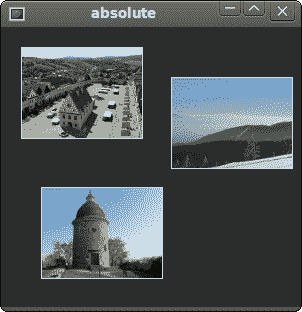
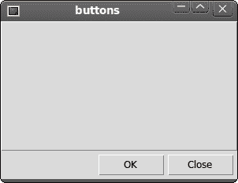
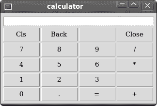
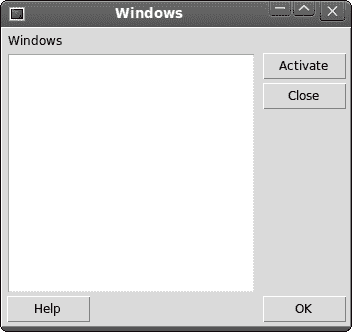

# Tcl/Tk 中的布局管理

> 原文： [http://zetcode.com/gui/tcltktutorial/layout/](http://zetcode.com/gui/tcltktutorial/layout/)

在 Tcl/Tk 编程教程的这一部分中，我们将介绍布局管理器。

在设计应用的 GUI 时，我们决定要使用哪些小部件以及如何在应用中组织这些小部件。 为了组织小部件，我们使用专门的不可见对象，称为布局管理器。

有两种小部件：容器及其子级。 容器将子项分组为合适的布局。

Tk 具有三个内置布局管理器：`pack`，`grid`和`place`管理器。 包几何形状管理器在垂直和水平框中组织小部件。 网格几何管理器将小部件放置在二维网格中。 最后，`place`几何管理器使用绝对定位将小部件放置在其容器上。

## 绝对定位

在大多数情况下，程序员应使用布局管理器。 在某些情况下，我们可以使用绝对定位。 在绝对定位中，程序员以像素为单位指定每个小部件的位置和大小。 如果我们调整窗口大小，则小部件的大小和位置不会改变。 在各种平台上，应用看起来都不同，在 Linux 上看起来不错，在 Mac OS 上看起来不太正常。 在我们的应用中更改字体可能会破坏布局。 如果我们将应用翻译成另一种语言，则必须重做您的布局。

```
#!/usr/bin/wish

# ZetCode Tcl/Tk tutorial
#
# In this script, we lay out images
# using absolute positioning.
#
# author: Jan Bodnar
# last modified: March 2011
# website: www.zetcode.com

package require Img

frame .fr -background "#333"
pack .fr -fill both -expand 1

image create photo img1 -file "bardejov.jpg"
label .fr.lbl1 -image img1
place .fr.lbl1 -x 20 -y 20

image create photo img2 -file "rotunda.jpg"
label .fr.lbl2 -image img2
place .fr.lbl2 -x 40 -y 160

image create photo img3 -file "mincol.jpg"
label .fr.lbl3 -image img3
place .fr.lbl3 -x 170 -y 50

wm title . "absolute" 
wm geometry . 300x280+300+300

```

在此示例中，我们使用绝对定位放置了三个图像。 我们将使用位置几何图形管理器。

```
package require Img

```

我们使用`Img`包来显示 JPG 图像。 在 Ubuntu Linux 上，我们必须安装`libtk-img`软件包。

```
package require Img

```

要显示 JPG 图像，我们使用`Img`包。

```
frame .fr -background "#333"

```

我们的框架将具有深灰色背景。

```
image create photo img1 -file "bardejov.jpg"

```

我们从当前工作目录中的图像创建照片图像对象。

```
label .fr.lbl1 -image img1

```

我们用图像创建一个`label`。 标签可以包含文本或图像。

```
place .fr.lbl1 -x 20 -y 20

```

标签放置在框架上的`x = 20`，`y = 20`坐标处。 绝对定位通过`place`命令完成。



Figure: Absolute positioning

## 按钮示例

在下面的示例中，我们将在窗口的右下角放置两个按钮。 我们将使用`pack`管理器。

```
#!/usr/bin/wish

# ZetCode Tcl/Tk tutorial
#
# In this script, we use pack manager
# to position two buttons in the
# bottom right corner of the window.
#
# author: Jan Bodnar
# last modified: March 2011
# website: www.zetcode.com

frame .fr
pack .fr -fill both -expand 1

frame .fr.pnl -relief raised -borderwidth 1
pack .fr.pnl -fill both -expand 1

ttk::button .fr.cb -text "Close"
pack .fr.cb -padx 5 -pady 5 -side right
ttk::button .fr.ok -text "OK"
pack .fr.ok -side right

wm title . "buttons" 
wm geometry . 300x200+300+300

```

我们将有两个框架。 有一个基础框架和一个附加框架，该框架将在两个方向上扩展并将两个按钮按到基础框架的底部。 这些按钮放置在水平框中，并位于此框的右侧。

```
frame .fr.pnl -relief raised -borderwidth 1
pack .fr.pnl -fill both -expand 1

```

我们创建另一个`frame`小部件。 该小部件占用了大部分区域。 我们更改框架的边框，以使框架可见。 默认情况下，它是平坦的。 `pack`管理器在两个方向上扩展框架。 水平和垂直。

```
ttk::button .fr.cb -text "Close"
pack .fr.cb -padx 5 -pady 5 -side right

```

创建一个关闭按钮。 将其放入水平盒中。 `-side`选项将创建一个水平框布局，其中按钮位于框的右侧。 `-padx`和`-pady`选项将在小部件之间放置一些空间。 `-padx`在按钮小部件之间以及关闭按钮和根窗口的右边框之间放置一些空间。 `-pady`在按钮小部件与框架和根窗口的边框之间放置一些空间。

```
pack .fr.ok -side right

```

`ok`按钮位于关闭按钮旁边。 它们之间有 5px 的间距。



Figure: Buttons example

## 计算器

我们将使用 Tk 网格几何管理器来创建计算器的骨架。

```
#!/usr/bin/wish

# ZetCode Tcl/Tk tutorial
#
# In this script, we use the grid manager
# to create a skeleton of a calculator.
#
# author: Jan Bodnar
# last modified: March 2011
# website: www.zetcode.com

frame .fr -padx 5 -pady 5
pack .fr -fill both -expand 1

ttk::style configure TButton -width 8 -height 8 -font "serif 10" 

entry .fr.ent 
grid .fr.ent -row 0 -columnspan 4 -sticky we

ttk::button .fr.cls -text "Cls" 
grid .fr.cls -row 1 -column 0
ttk::button .fr.bck -text "Back"
grid .fr.bck -row 1 -column 1
ttk::button .fr.lbl
grid .fr.lbl -row 1 -column 2   
ttk::button .fr.clo -text "Close"
grid .fr.clo -row 1 -column 3
ttk::button .fr.sev -text "7"
grid .fr.sev -row 2 -column 0  
ttk::button .fr.eig -text "8"
grid .fr.eig -row 2 -column 1         
ttk::button .fr.nin -text "9"
grid .fr.nin -row 2  -column 2
ttk::button .fr.div -text "/"
grid .fr.div -row 2 -column 3

ttk::button .fr.fou -text "4"
grid .fr.fou -row 3 -column 0
ttk::button .fr.fiv -text "5"
grid .fr.fiv -row 3 -column 1
ttk::button .fr.six -text "6"
grid .fr.six -row 3 -column 2 
ttk::button .fr.mul -text "*"
grid .fr.mul -row 3 -column 3    

ttk::button .fr.one -text "1"
grid .fr.one -row 4 -column 0
ttk::button .fr.two -text "2"
grid .fr.two -row 4 -column 1
ttk::button .fr.thr -text "3"
grid .fr.thr -row 4 -column 2
ttk::button .fr.mns -text "-"
grid .fr.mns -row 4 -column 3

ttk::button .fr.zer -text "0"
grid .fr.zer -row 5 -column 0
ttk::button .fr.dot -text "."
grid .fr.dot -row 5 -column 1         
ttk::button .fr.equ -text "="
grid .fr.equ -row 5 -column 2
ttk::button .fr.pls -text "+"
grid .fr.pls -row 5 -column 3

grid columnconfigure .fr 0 -pad 3
grid columnconfigure .fr 1 -pad 3
grid columnconfigure .fr 2 -pad 3
grid columnconfigure .fr 3 -pad 3

grid rowconfigure .fr 0 -pad 3        
grid rowconfigure .fr 1 -pad 3  
grid rowconfigure .fr 2 -pad 3  
grid rowconfigure .fr 3 -pad 3  
grid rowconfigure .fr 4 -pad 3  

wm title . "calculator" 
wm geometry . +300+300

```

在此示例中，我们使用`grid`管理器来组织框架容器小部件中的按钮。

```
ttk::style configure TButton -width 8 -height 8 -font "serif 10" 

```

我们将主题`button`小部件配置为具有特定字体并具有一些内部填充。

```
entry .fr.ent 
grid .fr.ent -row 0 -columnspan 4 -sticky we

```

`entry`小部件是显示数字的地方。 小部件位于第一行，它将覆盖所有四列。 小部件可能不会占用网格中单元所分配的所有空间。 `-sticky`选项将沿给定方向扩展小部件。 在我们的案例中，我们确保条目小部件从左向右展开。

```
ttk::button .fr.cls -text "Cls" 

```

`cls`按钮位于第二行和第一列。 请注意，行和列从零开始。 `ttk::button`是一个主题按钮。

```
grid columnconfigure .fr 0 -pad 3
...
grid rowconfigure .fr 0 -pad 3  

```

我们使用`columnconfigure`和`rowconfigure`命令在网格列和行中定义一些空间。 这样，我们可以实现按钮之间有一定的间隔。



Figure: Calculator

## Windows 示例

以下示例使用网格几何管理器创建 Windows 对话框。 该对话框来自 JDeveloper 应用。

```
#!/usr/bin/wish

# ZetCode Tcl/Tk tutorial
#
# In this script, we use the grid
# manager to create a more complicated
# layout.
#
# author: Jan Bodnar
# last modified: March 2011
# website: www.zetcode.com

frame .fr -padx 5 -pady 5
pack .fr -fill both -expand 1

label .fr.lbl -text Windows
grid .fr.lbl -sticky w -pady 4 -padx 5

text .fr.area
grid .fr.area -row 1 -column 0 -columnspan 2 \
    -rowspan 4 -padx 5 -sticky ewsn 

ttk::button .fr.act -text Activate
grid .fr.act -row 1 -column 3

ttk::button .fr.cls -text Close
grid .fr.cls -row 2 -column 3 -pady 4

ttk::button .fr.hlp -text Help
grid .fr.hlp -row 5 -column 0 -padx 5

ttk::button .fr.ok -text OK
grid .fr.ok -row 5 -column 3

grid columnconfigure .fr 1 -weight 1
grid columnconfigure .fr 3 -pad 7

grid rowconfigure .fr 3 -weight 1
grid rowconfigure .fr 5 -pad 7

wm title . "Windows" 
wm geometry . 350x300+300+300

```

在此示例中，我们将使用`label`小部件，`text`小部件和四个按钮。

```
label .fr.lbl -text Windows
grid .fr.lbl -sticky w -pady 4 -padx 5

```

标签窗口小部件已创建并放入网格中。 如果未指定列和行，则假定为第一列或行。 该标签向西粘贴，并且其文本周围有一些填充。

```
text .fr.area
grid .fr.area -row 1 -column 0 -columnspan 2 \
    -rowspan 4 -padx 5 -sticky ewsn 

```

`text`小部件已创建，并从第二行第一列开始。 它跨越`2`列和`4`行。 小部件和根窗口的左边界之间有 4px 空间。 最后，它坚持所有四个方面。 因此，调整窗口大小时，`text`小部件会向各个方向扩展。

```
grid columnconfigure .fr 1 -weight 1
grid columnconfigure .fr 3 -pad 7

grid rowconfigure .fr 3 -weight 1
grid rowconfigure .fr 5 -pad 7

```

我们在网格中的小部件之间定义一些空间。 在`text`小部件和按钮之间放置最大的空间。



Figure: Windows example

在 Tcl/Tk 教程的这一部分中，我们提到了小部件的布局管理。