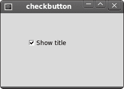
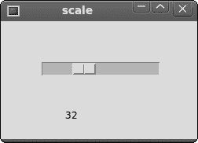
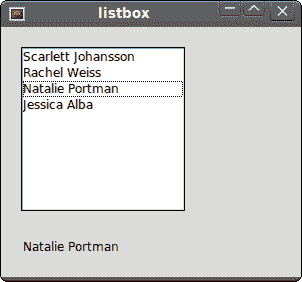

# Tcl/Tk 小部件

> 原文： [http://zetcode.com/gui/tcltktutorial/widgets/](http://zetcode.com/gui/tcltktutorial/widgets/)

在 Tcl/Tk 教程的这一部分中，我们将介绍一些基本的 Tk 小部件。 我们将为`checkbutton`，`label`，`scale`和`listbox`小部件提供示例。

小部件是 GUI 应用的基本构建块。 多年来，几个小部件已成为所有 OS 平台上所有工具包中的标准。 例如，按钮，复选框或滚动条。 其中一些名称可能不同。 例如，一个复选框在 Tk 中称为复选框。 Tk 具有一小组可满足基本编程需求的小部件。 可以将更多专门的窗口小部件创建为自定义窗口小部件。

## `checkbutton`

`checkbutton`是具有两种状态的窗口小部件：开和关。 接通状态通过复选标记显示。 它用来表示一些布尔属性。 `checkbutton`小部件提供一个带有文本标签的复选框。

```
#!/usr/bin/wish

# ZetCode Tcl/Tk tutorial
#
# This program toggles the title of the
# window with the checkbutton widget.
#
# author: Jan Bodnar
# last modified: March 2011
# website: www.zetcode.com

frame .fr
pack .fr -fill both -expand 1
checkbutton .fr.cb -text "Show title" -command onClick  \
    -onvalue true -offvalue false -variable selected
.fr.cb select 
place .fr.cb -x 50 -y 50 

proc onClick {} {

    global selected

    if {$selected==true} {

        wm title . checkbutton
    } else {
        wm title . ""
    }
}

wm title . checkbutton
wm geometry . 250x150+300+300

```

在我们的示例中，我们在窗口上放置了一个检查按钮。 选中按钮显示/隐藏窗口的标题。

```
checkbutton .fr.cb -text "Show title" -command onClick  \
    -onvalue true -offvalue false -variable selected

```

`checkbutton`命令创建一个检查按钮小部件。 `-text`选项指定由小部件显示的文本。 当我们单击小部件时，将执行`onClick`过程。 选中`checkbutton`时，所选变量的值为真。 否则，它具有错误的值。

```
.fr.cb select 

```

最初，标题显示在标题栏中。 因此，一开始，我们使用`select`命令检查了小部件。

```
place .fr.cb -x 50 -y 50 

```

我们将检查按钮小部件放置在框架上的`x = 50`和`y = 50`坐标处。

```
if {$selected==true} {

    wm title . checkbutton
} else {
    wm title . ""
}

```

在`onClick`过程中，我们根据所选变量显示或隐藏标题。



Figure: checkbutton

## `label`

`label`小部件用于显示文本或图像。 没有用户交互。

```
sudo apt-get install libtk-img

```

为了运行此示例，我们必须安装`libtk-img`软件包。

```
#!/usr/bin/wish

# ZetCode Tcl/Tk tutorial
#
# In this script, we use a label
# widget to show an image.
#
# author: Jan Bodnar
# last modified: March 2011
# website: www.zetcode.com

package require Img

frame .fr
pack .fr
image create photo img -file "tatras.jpg"
label .fr.lbl -image img
pack .fr.lbl

wm title . label
wm geometry . +300+300

```

我们的示例在窗口上显示图像。

```
package require Img

```

默认情况下，`label`小部件只能显示一组有限的图像类型。 要显示 JPG 图像，我们必须使用`Img`包。

```
image create photo img -file "tatras.jpg"

```

我们根据文件系统上的图像创建照片图像。

```
label .fr.lbl -image img

```

将照片图像提供给标签窗口小部件的`image`参数。

```
pack .fr.lbl

```

图像包装在框架中。

```
wm geometry . +300+300

```

我们指定 x 和 y 坐标。 这些用于在屏幕上放置窗口。 我们忽略了窗口的大小。 打包管理器会将窗口大小设置为图像大小。

## `HScale`

`scale`是一个小部件，可让用户通过在有限间隔内滑动旋钮以图形方式选择一个值。 我们的示例将在标签小部件中显示一个选定的数字。

```
#!/usr/bin/wish

# ZetCode Tcl/Tk tutorial
#
# In this script, we show how to
# use the scale widget.
#
# author: Jan Bodnar
# last modified: March 2011
# website: www.zetcode.com

frame .fr
pack .fr -fill both -expand 1

scale .fr.scl -orient horizontal -from 0 -to 100 \
    -length 150  -variable val -showvalue 0
place .fr.scl -x 50 -y 50 

label .fr.lbl -textvariable val
place .fr.lbl -x 80 -y 110

wm title . scale
wm geometry . 250x150+300+300

```

上面的脚本中有两个小部件。 标尺和标签。 标签控件中显示了比例控件的值。

```
scale .fr.scl -orient horizontal -from 0 -to 100 \
    -length 150  -variable val -showvalue 0

```

`scale`小部件已创建。 `-orient`选项使窗口小部件水平。 我们提供`-from`和`-to`选项的上限和下限。 当前选择的数字存储在 val 变量中。 默认情况下，比例小部件还显示选定的数字。 使用`-showvalue`选项，我们将其隐藏。

```
label .fr.lbl -textvariable val  

```

`label`小部件已创建。 它将显示上述`val`变量。



Figure: scale widget

## `listbox`

`listbox`是显示对象列表的窗口小部件。 它允许用户选择一项或多项。

```
#!/usr/bin/wish

# ZetCode Tcl/Tk tutorial
#
# In this script, we show how to
# use the listbox widget.
#
# author: Jan Bodnar
# last modified: March 2011
# website: www.zetcode.com

frame .fr
pack .fr -fill both -expand 1

listbox .fr.lb 
.fr.lb insert end "Scarlett Johansson" "Rachel Weiss" "Natalie Portman" \
    "Jessica Alba" 

bind .fr.lb <<ListboxSelect>> { setLabel [%W curselection]}

place .fr.lb -x 20 -y 20 

label .fr.lbl 
place .fr.lbl -x 20 -y 210

wm title . listbox
wm geometry . 300x250+300+300

proc setLabel { idx } {

    set val [.fr.lb get $idx]
    .fr.lbl configure -text $val

}

```

在我们的示例中，我们显示了`listbox`中的女演员列表。 当前选择的女演员显示在标签小部件中。

```
listbox .fr.lb 

```

使用`listbox`命令创建列表框小部件。

```
.fr.lb insert end "Scarlett Johansson" "Rachel Weiss" "Natalie Portman" \
    "Jessica Alba" 

```

在这里，我们将四个女演员插入小部件。

```
bind .fr.lb <<ListboxSelect>> { setLabel [%W curselection]} 

```

当我们在列表框中选择一个项目时，将生成`<&lt;ListboxSelect&gt;>`事件。 我们将`setLabel`过程绑定到此事件。 我们还向过程发送参数。 当前所选值的索引。 `%W curselection`返回索引。 `%W`是有关小部件的处理程序，`curselection`是在此小部件上执行的命令。

```
proc setLabel { idx } {

    set val [.fr.lb get $idx]
    .fr.lbl configure -text $val

}

```

在`setLabel`过程中，我们根据获得的索引找出值。 此值稍后显示在标签窗口小部件中。



Figure: listbox widget

在 Tcl/Tk 教程的这一部分中，我们介绍了几个 Tk 小部件。